# Rust安全编程：第3讲：错误处理 🛡️

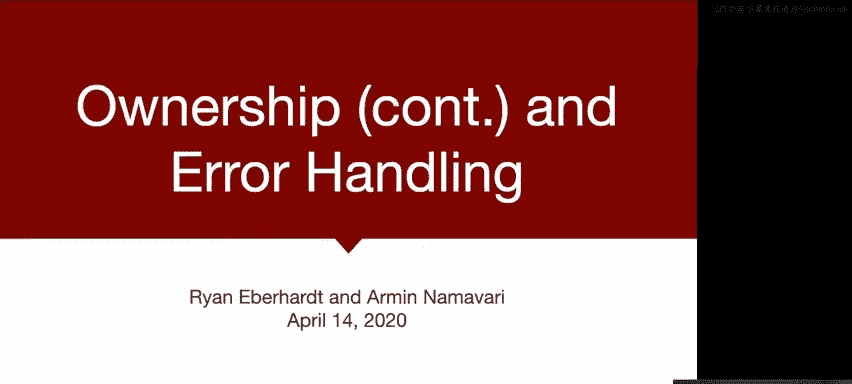


在本节课中，我们将学习Rust中的错误处理机制，特别是如何通过`Option`和`Result`类型安全地处理可能失败的操作，避免C语言中常见的空指针解引用等问题。

## 概述

首先，恭喜大家完成了第一周的学习。第一周的作业可能对一些人来说有些棘手，需要适应Zoom和各种家庭事务。我们查看了调查结果，发现可能高估了作业的难度，大约有不到一半的人花费了超过三小时。我们将在第二周的练习中尝试缩减范围，使其更易于管理。希望第一周的内容对你有帮助，让你对Rust感到更熟悉。当然，这只是第一周，如果事情仍然感觉有些混乱，请不要担心。事实上，我绘制了反思的词云，最大的词是“令人沮丧的Rust作业”，我觉得这很有趣。

本课程的目标是向你展示C/C++中的问题，而Rust正是对这些问题的回应。Rust是第一个真正获得关注、成为可行的C/C++替代品的语言。通过本课程，你将亲身体验Rust如何应对这些问题，以及这种应对方式本身存在哪些挑战。我们并不期望你在这门课上成为Rust专家。

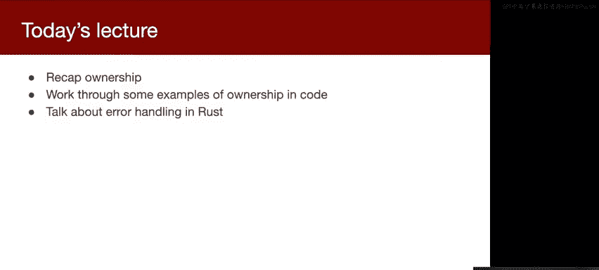


今天的路线图是：首先回顾Ar在周四介绍的一些所有权概念，然后展示一些具体的代码示例，让你看到所有权是如何工作的（或者更常见的是如何不工作的），最后介绍Rust中的错误处理。Arman将在周四通过一个实际代码演示来展示所有这些内容是如何结合在一起的。

## 所有权在C语言中的体现

在深入Rust之前，我们先暂停一下，看看如何理解我们已经讨论过的一些概念。所有权概念在C语言中同样存在，只是表现形式不同。

以下是一个来自OpenVSitch项目的C代码注释：
```c
// 获取状态...返回零...并将错误字符串存储在*ap中，返回正数ano值。
// 调用者负责使用free释放*ap。
```
关键点在于“调用者负责释放*ap”。这个函数为错误字符串分配了一些内存，并返回一个指针，它表示调用者现在负责释放该指针。实际上，这里发生的是：这个函数将某些内存的所有权转移给了调用者。我们在注释中指定了所有权，因为C语言本身没有所有权的编译器概念，但这本质上就是所有权。

另一个例子是借用：
```c
// 任何现有的字典都会被丢弃，并替换为此常量AVDictionary*。
// 调用者仍然拥有此void*指针，并负责释放它。
```
这类似于Rust中的不可变借用。我们在这里借用了一个引用，临时使用这个指针，但我们没有取得它的所有权，只是借用它。调用者仍然保留所有权，并负责释放它。谁拥有所有权，谁就负责释放这块内存。

有时情况会更复杂。例如，一个注释可能说明：“注意，boot CFS库将在所有对目标K对象的引用都被释放后，释放为调用传入的数据。”这意味着该函数取得了所有权，但会立即将其传递给boot CFS库，该库将负责在适当的时候释放数据。这类似于Linux内核中处理打开文件表或V节点表条目时的引用计数机制。

在C语言中，所有权管理变得非常复杂，因为有时库会实现自己的`free`函数。它们可能返回一个指向内存的指针，但你不能使用标准的`free`函数来释放它，必须使用它们自己的释放函数。这可能是因为需要额外的清理工作。有时库甚至会实现自己的内存分配器。

幸运的是，在Rust中，这变得更容易，因为我们有明确的所有权概念：调用者保留所有权，当所有者超出作用域且不再需要时，Rust会自动处理内存释放。Rust会找出哪些析构函数（`drop`函数）应该与哪些数据关联，并为我们处理这些。

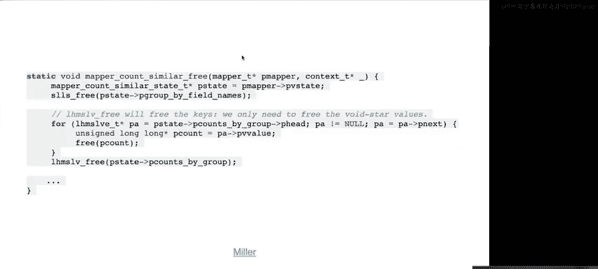

所有权问题在涉及结构体时尤其具有挑战性，无论是C还是Rust。当一个结构体拥有或指向其他内存块时，所有权管理就变得非常复杂。在C中，你可能认为你正在释放一个数据结构，但实际上只释放了它的一部分，你需要调用另一个函数来清理数据结构的其他部分。Rust不允许你犯这些错误，但这也令人沮丧，因为它迫使你提前解决所有所有权问题。

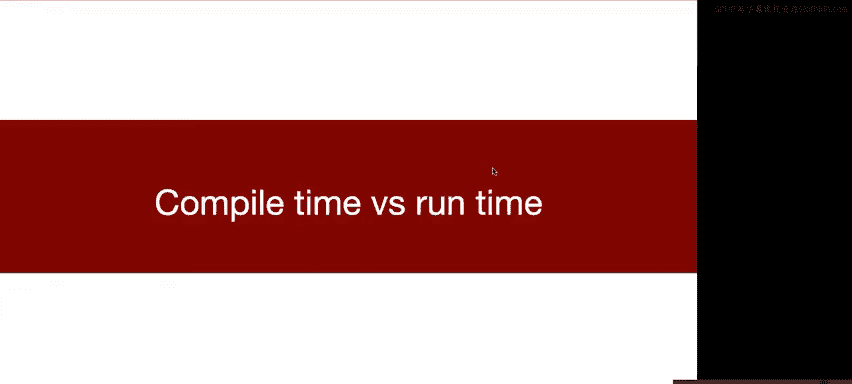

## 所有权的挑战与Rust的应对

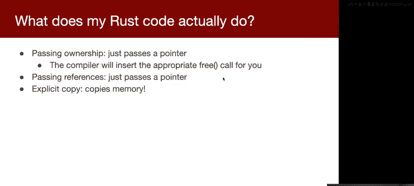

所有权非常复杂，这几乎出现在所有的调查反馈中。每个人都表示所有权令人困惑，难以理解。但这并不是因为Rust中的所有权具有挑战性，而是因为所有权作为一个概念本身就具有挑战性。在C语言中，所有权管理非常困难，这就是为什么我们经常出错并产生许多与内存相关的漏洞。


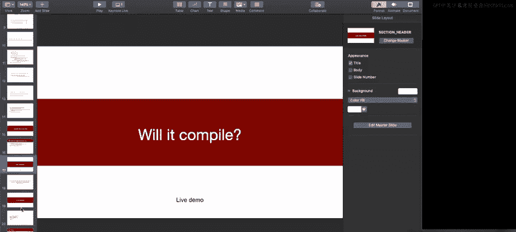

Rust编译器迫使你在编译时解决所有问题，这样未来就不会有任何出错的可能性。这就像带着一些包袱进入一段关系，而Rust编译器就像那个让你现在就必须解决所有问题的朋友，虽然短期内让你生活困难，但从长远来看对你有益。

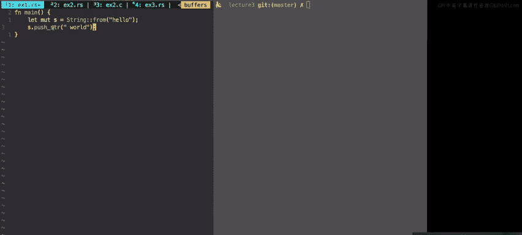

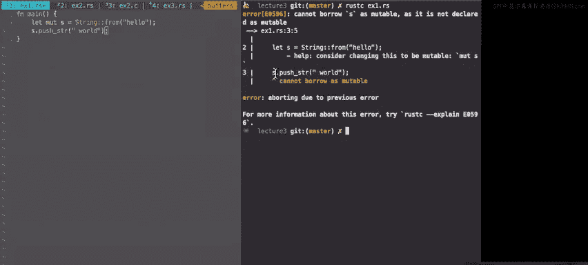

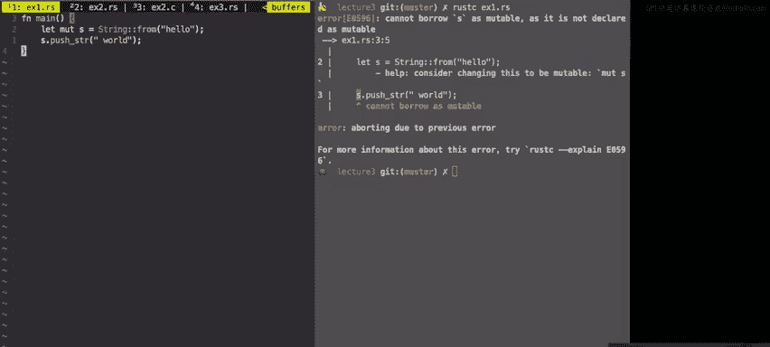

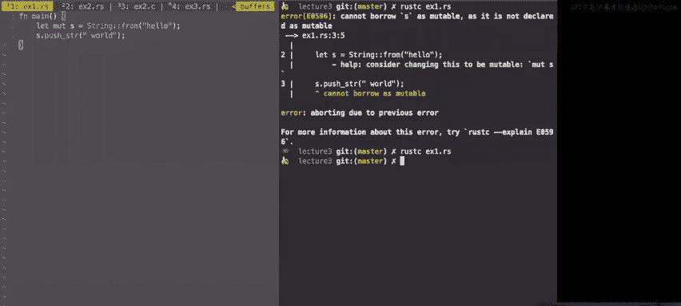

关于性能影响，需要区分编译时和运行时发生的情况。在编译时，Rust与C非常不同，因为它有这个所有权模型，并迫使你解决所有权问题。但在运行时，它实际上与C几乎相同。如果你传递所有权，实际上只是传递一个指针，就像在C中传递指针一样，只是编译器会为你插入适当的`free`调用。如果你传递引用，那也只是传递一个指针。因此，在传递所有权和借用引用之间没有性能损失或真正的性能差异，它们在编译后实际上是相同的。当然，如果你显式地复制一些内存，编译器会为你复制内存。

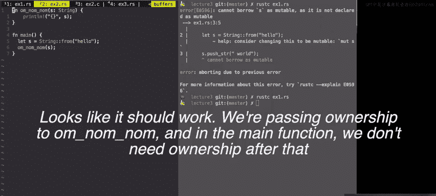

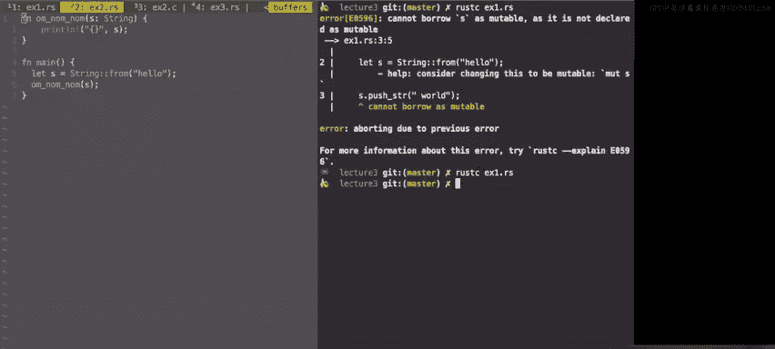

## Rust代码示例分析

现在，我们通过一些Rust代码示例来分析所有权和借用。对于每个例子，请思考：这段代码能编译吗？如果不能，如何修复？如果等价的C/C++代码可以编译，为什么Rust不允许？在C中编写这类代码会出现什么问题？

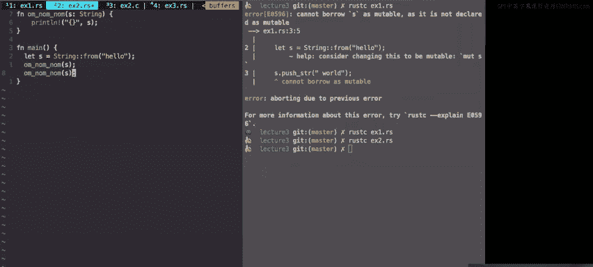

### 示例1：不可变变量的修改
```rust
let s = String::from("hello");
s.push_str(", world!");
```
这段代码无法编译。我们有一个不可变变量`s`，它没有用`mut`关键字声明。当我们执行`s.push_str`时，我们试图修改这个字符串，但`s`被声明为不可变的，因此不允许。Rust编译器会报错：`cannot borrow as mutable because it was declared immutable`。

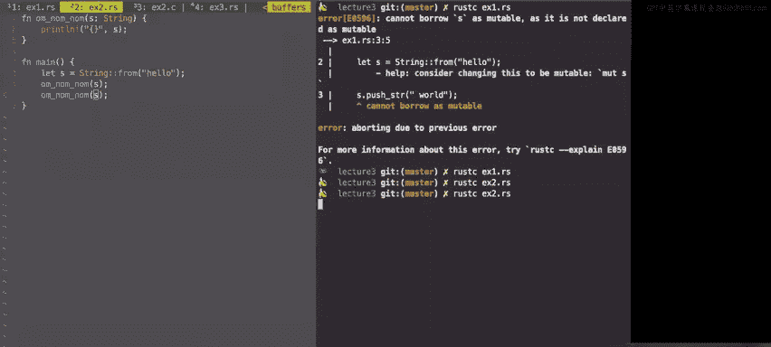

如果加上`mut`关键字：
```rust
let mut s = String::from("hello");
s.push_str(", world!");
```
这样就能编译了。Rust允许我们修改这个可变字符串。

### 示例2：所有权转移
```rust
fn main() {
    let s = String::from("hello");
    amnomnom(s);
    amnomnom(s);
}

fn amnomnom(s: String) {
    println!("{}", s);
}
```
这段代码无法编译。第一次调用`amnomnom(s)`时，我们将`s`的所有权转移给了函数。函数执行完毕后，由于它拥有所有权，Rust会在函数结束时释放字符串。然后我们尝试第二次调用`amnomnom(s)`，但此时`s`的所有权已经转移，内存也已被释放，因此无法再次使用。

在C语言中，你可能以多种方式编写此代码，但只有一种方式是正确的（在适当的位置释放内存）。Rust迫使你明确意图，不允许你含糊不清或犯错误，比如使用已释放的内存或双重释放。

为了保留所有权并在主函数中释放，我们可以传递引用：
```rust
fn main() {
    let s = String::from("hello");
    amnomnom(&s);
    amnomnom(&s);
}

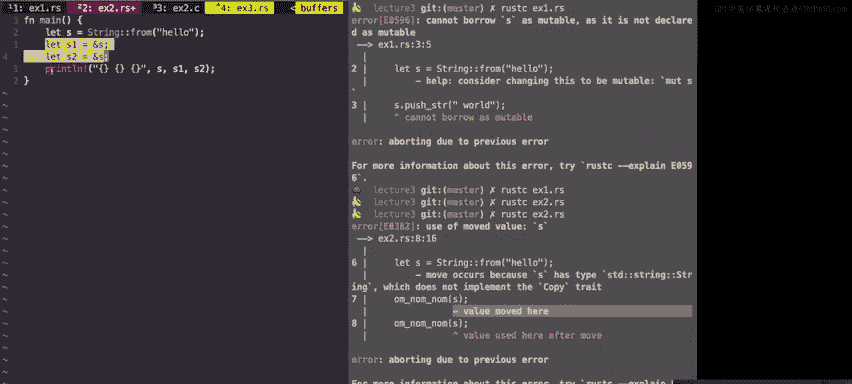

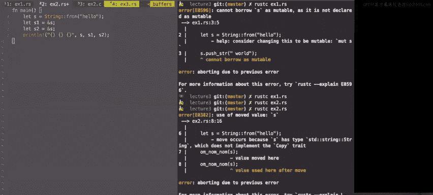

fn amnomnom(s: &String) {
    println!("{}", s);
}
```
这样，我们只是借用了`s`的引用，所有权仍保留在`main`函数中，字符串将在`main`函数结束时被释放。

### 示例3：多个不可变引用
```rust
let s = String::from("hello");
let s1 = &s;
let s2 = &s;
println!("{} {} {}", s, s1, s2);
```
这段代码可以编译。`s`是不可变的，`s1`和`s2`是对`s`的不可变引用。因为所有内容都是不可变的，所以同时存在多个引用是完全可以的，不会产生问题。

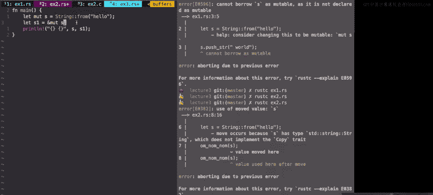

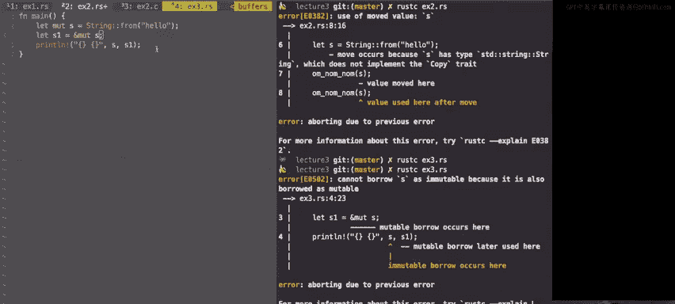

### 示例4：可变引用
```rust
let mut s = String::from("hello");
let s1 = &mut s;
s1.push_str(", world!");
```
这段代码可以编译。我们有一个对可变字符串`s`的可变引用`s1`。Rust的规则是：你可以有多个不可变引用，但最多只能有一个可变引用。

### 示例5：混合可变与不可变
```rust
let s = String::from("hello");
let s1 = &mut s;
s1.push_str(", world!");
```
这段代码无法编译。`s`被声明为不可变（默认），但我们试图获取它的可变引用`s1`。如果允许，你将能够通过`s1`修改字符串，即使它被声明为不可变，这显然是不好的。

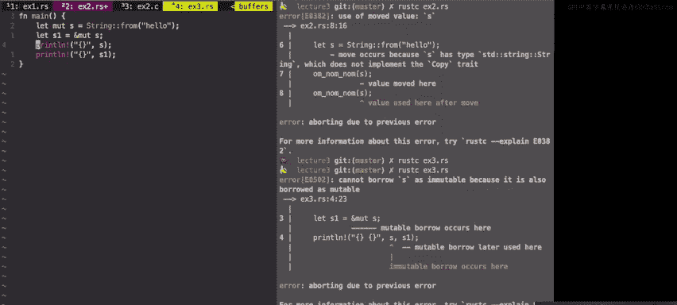

### 示例6：多个可变引用？
```rust
let mut s = String::from("hello");
let s1 = &mut s;
let s2 = &mut s;
println!("{} {}", s1, s2);
```
这段代码无法编译。你试图创建两个指向同一数据的可变引用`s1`和`s2`。Rust不允许这样做，因为同时存在多个可变引用会导致数据竞争。

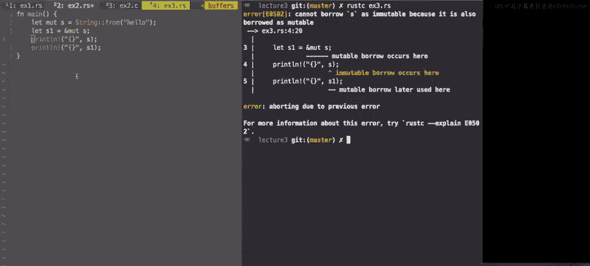

### 示例7：非重叠的可变引用
```rust
let mut s = String::from("hello");
let s1 = &mut s;
println!("{}", s1);
println!("{}", s);
```
这段代码可以编译。Rust编译器非常智能，它会检查引用的生命周期。在这里，`s1`的可变引用在第一个`println!`后最后一次被使用，之后我们才使用`s`。因为`s`在`s1`的生命周期内没有被使用，所以Rust认为这是安全的。本质上，你在借用后归还了引用。

## Rust中的错误处理

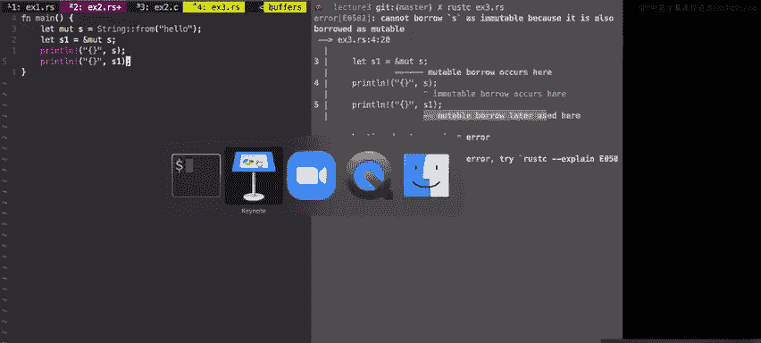


现在，让我们转向错误处理。Rust处理错误的方式与C/C++非常不同。

考虑以下C代码：
```c
char* buf = malloc(len);
memcpy(buf, packet, len);
// ... 处理数据 ...
free(buf);
```
这段代码存在安全漏洞。如果`malloc`失败（例如，请求的内存过大），它会返回一个空指针。但代码没有进行错误检查，会继续使用`buf`，导致空指针解引用和段错误。这是一种拒绝服务攻击。

这里有两个问题：
1.  使用`NULL`作为真实值的替代品，使得可能将`buf`误认为是有效指针。
2.  没有良好的机制来指示出了什么问题。

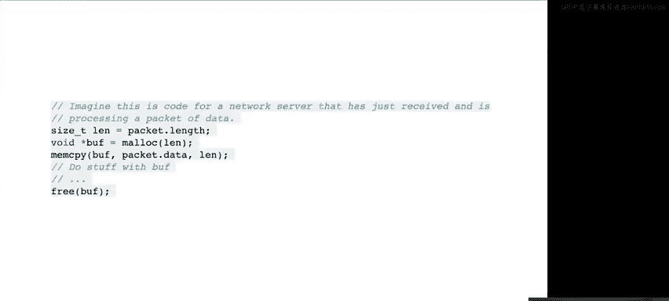


空指针已经导致了大量问题。空指针的发明者称其为“十亿美元的错误”，因为它看似微不足道，却给软件带来了巨大的痛苦。

空指针之所以危险，是因为它们给程序员带来了巨大的负担，需要跟踪什么可以为空、什么不能为空。在C语言中，`NULL`被广泛用作参数和返回值，程序员必须时刻保持警惕，进行适当的错误检查。但历史证明，我们无法始终成功地做到这一点。

Rust通过引入`Option`类型来解决这个问题。`Option`可以是`Some(value)`或`None`。`None`相当于Rust中的空值，但关键区别在于，`Option`类型明确区分了有效值和空值，而不是将它们混在一起。

例如，一个返回`Option<String>`的函数：
```rust
fn feeling_lucky() -> Option<String> {
    // ... 可能返回 Some("I'm feeling lucky".to_string()) 或 None
}
```
要处理返回值，你可以检查它是否是`Some`或`None`：
```rust
let message = feeling_lucky().unwrap_or("not lucky".to_string());
```
或者，更地道的方式是使用`match`语句：
```rust
let message = match feeling_lucky() {
    Some(msg) => msg,
    None => "no message returned".to_string(),
};
println!("{}", message);
```
这样，Rust迫使你思考如何处理潜在的空值。编译器不会让你忽略它。

对于错误处理，Rust使用`Result`类型，它与`Option`非常相似，但用于表示操作的成功或失败，并可以携带错误信息。

## 总结

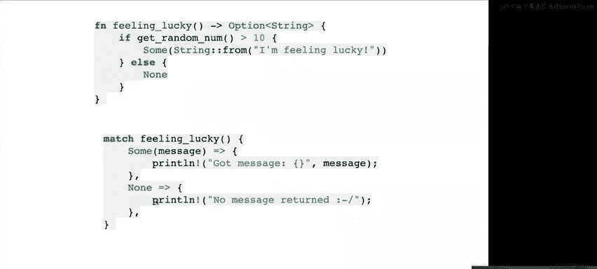


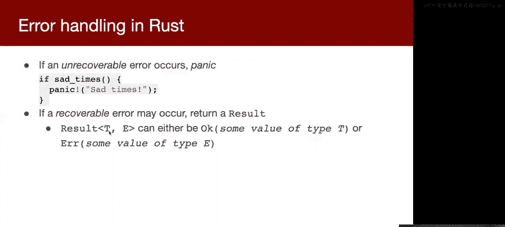

本节课我们一起学习了Rust中的所有权和错误处理核心概念。我们看到了所有权在C语言中同样存在且复杂，而Rust通过编译器强制在编译时解决所有权问题，避免了内存错误。在错误处理方面，Rust用`Option`和`Result`类型明确区分了有效值和错误状态，取代了容易出错的空指针，迫使程序员安全地处理所有可能的失败情况。虽然这些概念初学可能令人沮丧，但它们能帮助你编写更安全、更健壮的系统程序。