# 斯坦福大学《Rust安全编程｜CS 110L Safety in Systems Programming 2020》中英字幕（豆包翻译 - P5：-05-Lecture 5_ Traits and Generics - GPT中英字幕课程资源 - BV1D142147he

Okay， wonderful So as people are trickling in I think I'm just gonna to get started because the first slide is more of an introductory slide So I'm gonna lay out the plan for today is's actually a lot of material。

 One of my favorite topics， traits and rust traits are super cool or super exciting but they're really weird when you see them at first so please please ask questions we'll also be talking about generics。

 I think these two topics go hand in hand because there's a lot of interesting ideas about generics and rust So by generics I mean like you know you've already seen this before when you have like a Vc of U32 or a V of string It's like how do I take this one type。

 How do I make it a generic container that can hold anything and you might have seen this in other languages as well you probably even saw it in CSs106 maybe even in 106 if you saw the Java version when you had like a rate lists and stuff like that。

 And if time permits I would love to show you an example in a real- world system and an embedded operating system called talk where you can actually see really cool examples of traits at play in very low level。

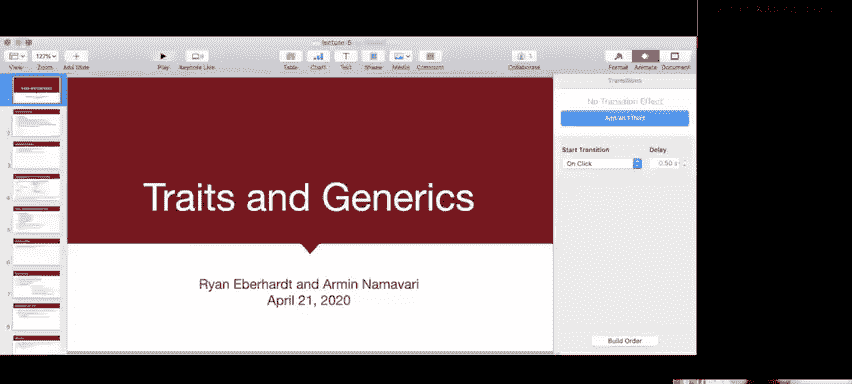

OS kernel code and the next time this Thursday we're going to be wrapping up traits and generics and we will be discussing smart pointers ideally so I'm just trying to make it kind of like adaptive based on how far we get today so I'm going keep an eye on the time and then next week Ryan's gonna to be talking about multiprocess pitfalls and some interesting components of multiprocess and rest like for instance like you know what sorts of like constructs those rest have to support like communication and stuff like that especially in like signal handling so that's that's gonna be super interesting and then I'm going I'm gonna to be switching a bunch between slides and code doing this because I'm gonna be like sort of like live coding a little bit as well hopefully that doesn't encourage too much overhead but we will see please ask questions making a point of this because this is like tricky material I think especially with the traits otherwise I'll just happily like march forward in the slides and then maybe like people will be confused for a while and when you're asking questions please unmute yourself。

can't necessarily see what's going on in the chat and if you have a question other people probably have the same question and I'll just try to go like adaptive based on that I can also look for hands when I pause for questions I guess I guess you can indicate I see something in the chat already let's see。

That was me。 I just said happy to answer asynchronous questions。 Okay， great， Oh， whoops， now， okay。

 so the Zoom does this thing。 I thinkca like when I'm in full screen mode here。

 I'm gonna stop my share and I'm gonna start it again because Zoom is strange。

 when you're in full screen mode， it's hard to click on things。 And when I'm presenting。

 I'm in full screen mode。 So that doesn't work well。😊。

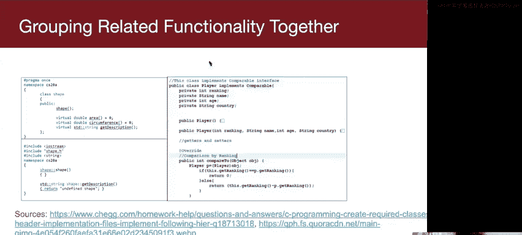

Oh sorry dad， I'mlecturing right now， no， no worries is， it's all good。た。Yeah。

 it's just a very typical spring Court a 2020 thing right now。

Great， okay， thank you all for being with me。 Al right， so y'all can see that again right Okay。

 lovely so we're gonna present it again。 we're gonna go back here。 Yes， actually on that last bullet。

 please just unmute yourself if you have a question I think it will be much easier for me。

 especially if I'm in full screen mode as we just saw great so now we're just gonna be going into the actual material。

 So let's talk about grouping related functionality together So you've probably seen this already in C plus plus and in Java right so on the lefthand side we have some c plus plus code and we have you know you've got this abstract class shape and you saying I have this thing that's a shape and what are certain qualities of a shape well it has an area it has a circumference and we can like get a description of it and you'll notice those are defined as like virtual methods like the virtual equals zero method that just basically means that you can instantiate a shape itself。

 it's an abstract class but this is kind of describing an interface like what is what defines shapiiness okay。

😊。

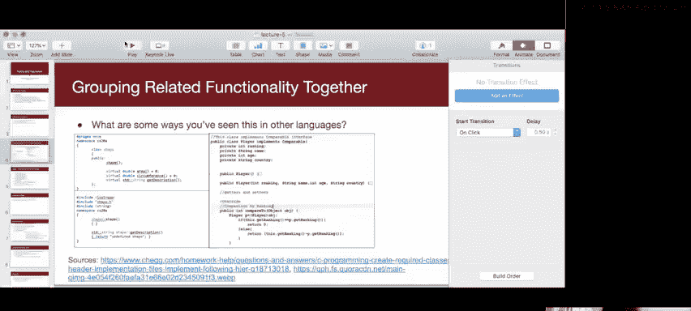

iness means having an area， having a circumference。

 or I guess maybe this is particular to a circle or something right。

 but then I will instantiate something like I'll instantiate something that inherits from that abstract class like maybe a circle and I'll implement the actual area in circumference examples functions Does that make sense to everybody so far。

And on the right hand side， you have an example of something。

 we have an implementation of an interface in Java so I don't know if you all have seen interfaces in Java before completely fine if you haven't I know like recently1 to6A hasn't been in Java and maybe even when it was in Java they might not have even gone over interfaces but just in case you've seen this before an interface defines you know what functions does a class implementing this interface have right so for instance we have this player class and it's implementing comparable and that means I can define a compare two function on this and the nice thing here is that if I define say an array list let's just the Java speak for vector an array list of players I can sort them because they implement this compare to function and sorting as comparison based Are there any questions so far。

So this is sort of just like setting the stage for like the kind of functionality we want in rust and the way we get this in rust is we use this construct called the trait So they sort of define you know what can this type do so this was at the very end of the lecture notes last time if there was enough time I would have caught into it but there wasn't which was fine but you see that like one of the examples that we'll see in the next slide is you know there's this display trait right so this is saying if a type implements the display trait it knows how to show itself in a certain sense so that means if I do like print in of like the empty curly braces which is just like a formatter of this type then then it will print itself in some nice way so if I define a point and I have like and I implement display for it then I can like describe like the XY coordinates of it or something like that I can also define how do I copy this type like is this a type that I can close。

Can I make and also like if I implement copy that changes the semantics of that equal sign operator so we actually saw this the very first lecture we started talking about ownership right so the integers were kind of funny because they kind of broke the rules of ownership in a sense but they're not really breaking the rules it's just the assignment operator means something different instead of transferring ownership it means copying it over so that's what it means to implement the copy traits sometimes these traits as we'll see can overload operator in a sense so in this case this is like overloading the assignment operator instead of the assignment operator transferring ownership it will make a copy Does that make sense to people。

I see like maybe some nods like the couple of people who pop up in my little like zoomidified window。

 Yeah， it's one of the additional struggles。 Also iters iterators are great trait。

 you'll see this in the exercises So clone copy So you'll definitely see clone in this week's exercises and converting so we define this wonderful linked list last lecture how can I make that linked list play well with rest iterator syntax or something like that how do I do like a for loop over it and how does rest know what that means So we do that using traits as well and also a So this goes back to how do we define comparisons between things how do we overload the equals equals operator and the not equals operator So yeah so sometimes we want to override functionality we'll see this in like overriding the drop trait in our lecture example we'll see D later like what So this is kind of funny like we' sort of like overriding what it means to like dereference something。

 I'm not gonna talk about that too much today when we talk about。

Smart pointers hopefully this Thursday will talk about that much more and it also allows us to define default implementations so like with two string we'll see how something implements display we can automatically implement two string for it because display works with like a buffer and what I can do is I can create some sort of like string buffery type thing I can write to it and I can just return that string so these are very powerful flexible is this is all very abstract by the way。

 I haven't shown you any code yet， I'm going show you code really soon also the last point overload operators so if I wanted to addition like if I had like an Xy like Euclidean plane point type and I wanted to define what does it mean to add two points or if I had like a vector of numbers。

 what does it mean to add two vectors I can overload these operators to and that's also super cool and exciting Any highlevel questions right now or any like confusion that people have already。

Okay， so moving forward so let's look at the linked list traits again。

 so I'm going to open this link， I think okay I'm actually so you can't even see that screen so I'm going to stop the sharing I'm going to start it again clearly this context which doesn't take too much great。

 do people see that。

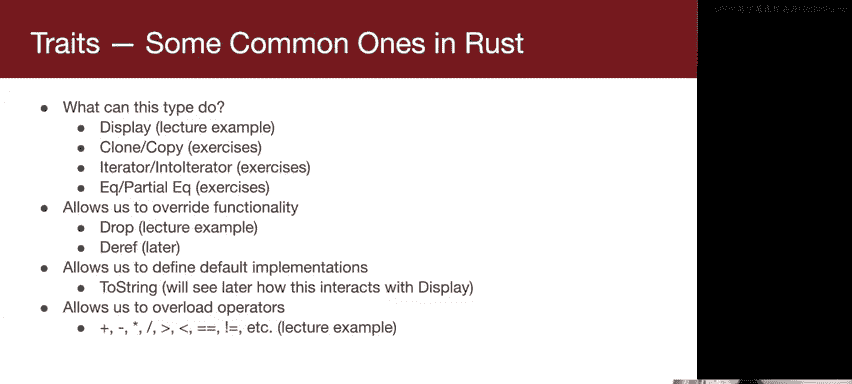

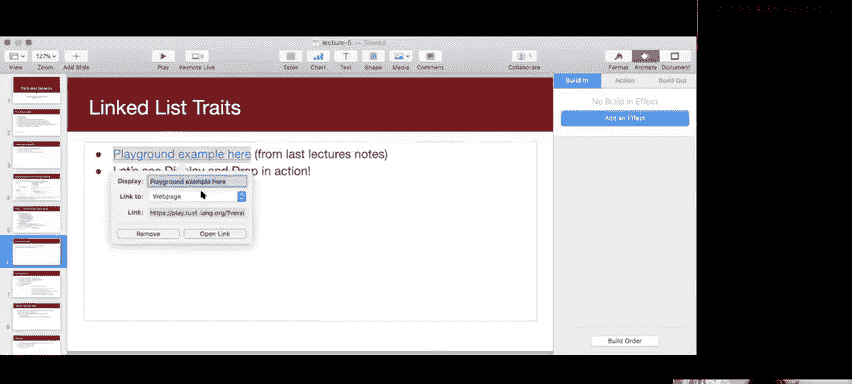

Okay， lovely so this so you know， if you have the slides you can even follow along if you'd like and you can see this is exactly the same example we had last week except I took out the display function。

 we had this display function that we used for debugging and what I did is I'm using this syntax right here。

 I'm implementing format display for the linked list so just like take take a quick look at that digest that for a moment。

 the thing I have highlighted there。So just to parse this a little bit for you， first of all。

 I'd like you to ignore some of the funky syntax here。

 So it's returning something like a format results。

 Like don't worry too much about what that type means。 Also， there's this like funky syntax here。

 don't worry about what that is either the reason I'm showing you display as opposed to two string is that most like the rest documentation suggest not overr two string or not defining it yourself。

 You should define display and two string you'll get for free from display So don't worry about like what this format or is just think about this f is like a buffer this could be like a file buffer or like some sort of like file the scriptory type thing this could be like you know some sort of like input some sort of like socket you're writing to like we don't even like really know' some sort of like format or object right that will format things and pass them to something that can handle that text data right And what we're doing here is we sort of just。

Right， so。We're just going。We're just going through each of the nodes and we're updating a result。

 We have a result that starts out as an empty string。 So before， yeah。

 so this is exactly what we're doing before。 we started this result out as an empty string。

 We're going through the nodes。 we're using this match statement syntax to look at the current node we're saying like it's either some kind it's either a node or it's like this nuvalue。

 which is like our null pointer。 I'm going to update the results。

Using this format B macro so this is sort of you might have seen this in Hangman。

 This is essentially it's sort of like print LN， except instead of printing to your console it returns a string。

And then I'm just gonna march on to the next note。 So we don't have to think too hard about。

 I think like the linked list logic here。 but like the important thing to take away is that we have this result that starts out as an empty string。

 we're adding to it and we're writing the empty string to this buffer and now the magical thing is I if I if you look down here。

 I no longer have to call a display on the list take a look at this this is so exciting right I can print LN you know the empty braces here this highlighted line。

 I can just print the list out like that。 It just knows how to show itself to print LN。

 So if I run the code you'll see。😊，Okay， that' is taken a while。

 but you can see that it shows the list just fine， right， so it's able to。

 so we pushed everything to the front of the list and then we're able to show。

 So that print line corresponds to this line here。 So that's that's the magic of display Display kind of like redefinees the meaning of like what does it mean to print this data type Does that make sense to people。

 Are there any questions。😊，Can you scroll up to where the thing is defined。

So for anyone confused Iple format colon colon and display means implement the format display trait for the struct that we defined exactlyactly and this is and in the later on。

 we'll see how we define the traits， but the definition of display is saying that like you have to define a function with this prototype。

 Thank you for making that point， I kind of just blasted through that Does that make sense to people。

So it's saying like this format function is a required function。

And that's something that you just kind of have to do And then for this for this linked list。

 I'm gonna give you this particular linkedless specific implementation of it。

 The next thing I want to talk about is drop so this is actually so drop we've we see an implementation of it right here This is very slick syntax so actually took this from there's this interesting like series of examples it's like learning rust with entirely too many linked list or something like that but they wrote drop in this really slick way using this for loop syntax where this is kind of like another example of like fancy syntactic sugar for air handling you can do this thing where in the conditional of your for loop you can say like I'm going to try to match the current node to some if it matches to some then great I'll kind of capture it within this node if it doesn't match then the while loop is kind of gonna break。

In a way。So yeah， I mean， if there are any questions about that syntax。

 please let me know after lecture because I don't want to focus too much on the syntax。

 but it's it's sort of just like another， like if you're reading rust code。

 this is something that you might be able to see in terms of air handed。

A conceptual question I want to put out there is why might I want to implement droprop for linked lists right。

 we were just talking to you about how great rest is in terms of automatically managing memory for you you know。

 and it's fine if I didn't if I just comment to this out。

 it would be completely fine and it would totally decate itself but can someone maybe like propose a reason for why we might want to override it。

I'll give you a hint， it sort of had to do with last week's assignment。

 was something with print diff， how it was defined。

 and how we told you that what we said a better way of defining it would be。

It's kind of a tricky question。It's kind of a weird。Ty。

Any like random thoughts like what was what was yes？Yeah， so it's exactly about efficiency right。

 so that's a great sorry you're kind of like breaking up there a little bit。

 buts that's exactly right it's about efficiency， why is it more efficient to do it this way。

 like what would the default implementation do？I guess， yeah。Yeah。

 it's kind of unfair of me to ask you' all because I'm trying to yeah because we never explicitly talked about it。

 but what happens is D kind of gets called recursively for each of like thestructs So like what would happen here is if we didn't override our own like we would recursively call these drops and if we had a giant linked list we could just totally destroy our stack some of you might have seen this in the last week's assignment if you just decided to do print di recursively because this is not like nice and tail recursive。

 the compiler can't optimize it away。 So that's why we might want to override the default functionality like this Does that make sense to everybody are there any questions about that。

Right， so that's a great question。 So what does dot take do dot take will yeah。

 so we sort of talked about this last week， it will convert that mutable reference into because like what this unpacking here does is it gets like a mutable reference to the node。

 So it'll take the mutable reference and it'll convert it to an owned type So this is an owned type that now contains this box and in order to get that box to delocate。

 So remember the box is a point to it。 So sorry let me just go up to this definition here right it takes an ampersand mute node and it gives us one of thesestructs。

 thisstruct contains a box right a box is a pointer a heat memory in order to get that heat memory freed up。

 we just we need to like essentially。Like take ownership of it right we take ownership of it here with current and then notice how current goes out of scope by the end of this curly brace right so once current goes out of scope。

 the box will deallocate its heat memory it'll call free。

 We'll talk about like those like smart pointy type things on Thursday， by the way。

Another way of thinking about it is it moves something from the struct to your variable。

 So if you do self。 head do take， it's moving the box out of self do head out of that struct and into your current variable and then you do some stuff with it but then on the next iteration of your while loop current gets replaced with somebody else with something else。

 and the rest compiler is like oh current like the previous value is no longer being reference it's not accessible anymore and so it'll free that memory Yeah actually I think yeah what I should have said was this is technically where it goes out of scope where we overwrite it here not because like currently it was still holding onto it here but then like once we overwrite the value here then it no longer has access to the old value then it goes out of scope then it gets free Yeah it's a great point but yeah notice we have the same impple drop for linked list so the syntax is always impple trait name for type name。

I like the syntax。 So I think yeah， what I wanted to get through this first example is just like the general syntax。

 the idea of a trait， does that make sense to people so far。

 Are there any ideas about just traits like what they are。

Like like first order okay so then we're gonna go back to the presentation and the next thing we're gonna talk about is deriving traits so what deriving traits does is actually sorry I have to share my screen again lots of context switch what deriving traits does is it provides us with reasonable default implementations right so it's common to do this with things for equality So like EQ versus partial EQ copy clone debug you might be wondering what's the difference between equality and partial equality is a very technical point so I don't know if you remember from CS103 if you've taken CS103 yet but an equivalence relation satisfies three properties it's reflexive which means a is equal to a it's transitive and it's symmetric So if a is equal to B then b is equal to a so a partial equivalentvalence relation is something where you take away the reflexivity of it so you no。

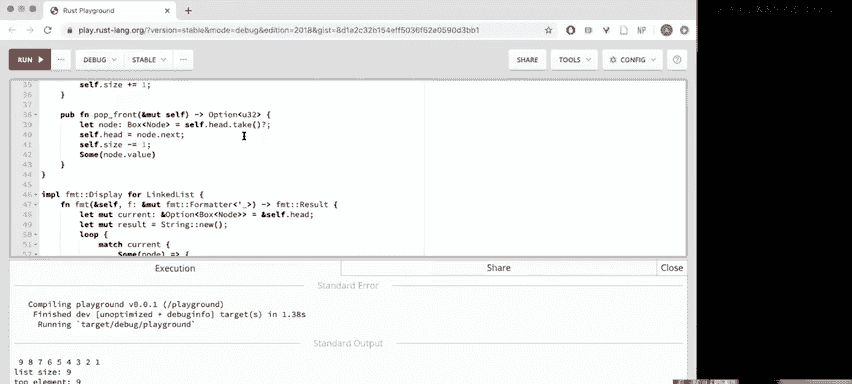

Have to have that everything is equal to itself And for F 64， which is the float type。

 this is essentially the same thing as double。 you have that not a number is not equal to not a number。

 This is kind of a funny like philosophical point， I think。 but like this is just like some like。

some technicality that we'll need for when we're defining our point type。

 so we'll see the point type pretty soon and we'll need to derive partial equivalentence for it because the F64 which is inside of the point doesn't give us full equivalentvalence but the cool thing with traits is sometimes you don't even have to go through the trouble of like defining it yourself。

 sometimes the rest compiler can say hey， this is a pretty simplestruct I think I know what to do here and you can sort of just trust it so we're going to see that really soon so that's called deriving traits over here I've provided a list of all the things you can derive like a handy dandy list right there。

 this is taken from the rest book but let's look at another concrete example because I think it's much easier to understand these things with concrete examples so we're going to switch over again to another code example so can you all see this。

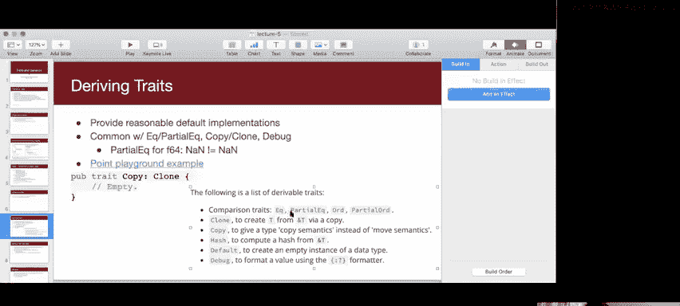

Great， so notice here how I don't have any imp traits。 I don't have any imprate something for point。

 I just have this line up here。 So I just want you to digest that line。

 This syntax basically means I want you to derive I want you to derive debug partial EQ clone and copy for my point Okay so let's go through each of them debug means I know how to show the point in a debugging context。

 It's very similar to display except you have to provide a special formatting string to show the debugging version of it and the formatting string is I've highlighted it here it's like this funny like curly braces with the colon question mark in it in order to show the debugging version of it。

 So this will let us CR points when we're trying to debug our code theres a partial equivalentvalence to find on it。

 So the way this works is it'll say two points are equal to one another if and only if their struck members are equal to one another。

 and the reason this works is because these struck members they implement they are F 60。😊。

And F64s have a notion of partial equivalentvalence already。

 so it knows exactly what to do to compare two points together and then in terms of clone and copy。

 it sort of does like the logical thing as well in order to because these F64s implement clone and copy or because they implement clone。

 you only have to implement clone in order to implement copy。Because the F64s implement clone。

 we know how to implement clone for the point and we also and because we can clone the point because we can make you know like duplicate versions of this point。

 we can implement copy for it which will override the assignment semantics Sorry that was a lot of information Are there any questions I'm going to pause for questions。

Yes， Warren。Precisely， that's exactly how it works。 It goes directly above astruct。

 It's a great question。 Any other questions。That's a great question。 So the distinction is for clone。

 I have to be explicit。 So like vector， for instance， or like string string is a great example。

 It implements clone， I can say like if you have a string like know ABc I can do like know S dot clone and that'll give me a fresh string that has the same contents is what I just cloned but copy is overriding the single equal sign copies overriding what it means to do assignment。

 So previously we would transfer ownership。 like with strings by default。

 we're always transferring ownership with that assignment operator。

 but remember with integers or like things are like smaller especially we will be actually creating a copy So we'll actually see that in the example right here。

 So that's a great segue So if I see so if you see in this example so also an implemented point here using our favorite syntax。

 So this this is like implementing the object we're not implementing a trait for it this is how we define a new。

😊，おい？And then as you see here， if I set let the origin So actually you know so this is fine。

 So let the origin this is equal to a new point， if 5 p is equal to the origin right this copies over this other point So these are copy semantics here So copy semantics D you see I highlighted there that equal sign copy semantics redefine what that single equal sign means。

 That's the way to think about it and then here I can show you you know notice I also derived partial equality for them right So I show you like here's the point and the origin are they equal this like makes sense right and then I can add 10 to p do X and we can compare it and they're going to no longer be equal。

 So if we just run this example。You can see that exactly there so this is these are how the points start out I can show them like this because I derived the debug trait Let me actually show you what if I what if I like took away a couple of these things like if I took away debug what's going to happen。

Right。Point does not implement debug sad right let's see。 but okay。

 this is one of my favorite things about the rest compiler。

 It tells us how we can like you know right our wrongs， how we can you know repent for our sins。

 It says you can add pound define sorry you can add pound derive debug or manually implement debug so I'll say look I'm sorry compiler。

 I'll put debug back in and it's happy again and it will run again and compile again for same thing for equality right if I forgot to put in this equality if I forgot to derive equality the compiler is gonna yell at me again because I try to compare these points and then it says you know implementation missing。

😊，I guess it doesn't specifically tell me to derive it。

 but I know that I can derive it and I can just say partial EQ。

There are cases in which you might not want to derive equality like this so an example of this was like in CS110 assignment1 you had like Kevin Bacon or something like that right and then you have to like compare these movies but you're not just comparing it like element wise based on thestruct like attribute wise on thestruct you kind of have to do something a little bit more complicated then youd actually manually define your own equality function but what partially Q does is it does the obvious thing it'll just go element by element and I'll see if they're equal to each other。

Does that make sense to people？Double equal， sorry， what was the last one， double equal in which one？

So I don't believe I'vet seen a triple triple equals that seems to be specific to JavaScript。

 There's there's no triple equals in rust。 the the difference here is that partial equal part So if I had strict equality。

 that would mean that everything， it's just sort of like marking kind of like a logical fact about。

A type it's I guess it's not really， I don't know if the compiler actually like it's very it's a little different。

 So in most other languages， if you do double equals， that is checking for identity。

 It's checking if the identity of two objects are equal。

 So say you were to like create a list of numbers， and then you created another list of the same numbers。

 but it's a separate list。 if you were to use double equals， say in Java。

 that would give you back false， because the identity of those two lists is different。

 they are separate list， even though they have the same contents， So in Java， for example。

 you would have to do list one dot equals lists to to check if the values are equal。

 and that is what this is doing here。 If you implement that partial Eq or EQ trait。

 it's checking are the values here equal to each other。

 And then going to use this double equal sign you're checking is the value of this first variable equal to the value of the second variable。

So I'll give an example， so like for instance， like integers， I believe。

 if I recall correctly in rust， so the only difference。

 the only only difference between partial equality and strict equality。

 like partial EQ and EQ and rust is that if something implements the trait EQ。

 that means that everything is equal to itself。Does that make sense？ Everything is equal to itself。

 Floats do not implement that because not a number is not equal to not a number。

 like the semantics of it are different。 This is the only difference between the two。

Does that make sense？Yeah， it's a weird technical thing but the reason we had to do it here is because we wanted our points step floats because in our next example。

 which we're going to transition to right now， we're going to talk about defining our own traits so do another screen share another context switch quick question about that example。

 can you auto define a display trait？

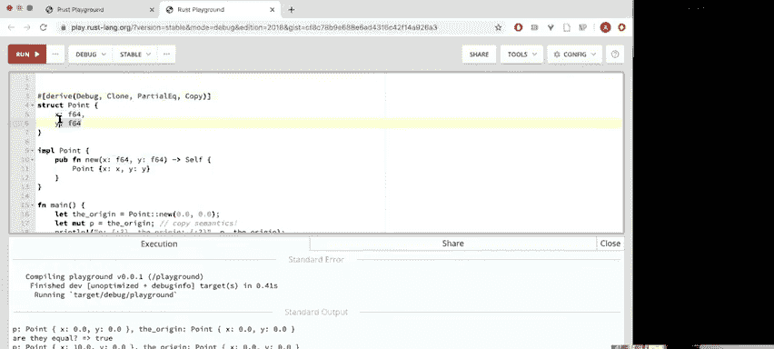

Aut you can't。 No， I tried to derive display and it was mad at me and it said I couldn't do it。

 So I think you could do something if you wanted to like do something simple。

 you could maybe like you know you could derive debug and then you could like do like format bang the debug in your definition of display。

 but I think the philosophy there is that you know if you're showing something to a user。

 you should not just like derive it like you should be a little bit more thoughtful about how you're displaying。

 it is more of a philosophical point of the language I think that's a great question。 Yeah。

 So when we're defining our own traits like we have this point and you know like we want to describe things that have L2 norm。

 So in case you forget L2 norm is like you know if I have a vector。

 it's the length of the vector like if I have a point。

 it's the distance from the points to the origin。 that's the definition of the L2 norm。

 or if I have like a F64， maybe this is in a higher dimensional space。

 and maybe this is in three dimensional space or10dial space or something maybe we're using rust。

To write some crazy physics simulation right So we're going look at an example of how to define our own traits right here。

 So I'm going to stop share and I'm going to start share again like again。

 please like stop me at any points if you any if you have any questions。

 but now we've got our same point。 Okay， we've derived the same traits on it。

 And now there's this syntax for defining a trait。 So just try to digest the syntax for a little bit。

 you say， you know， traits。

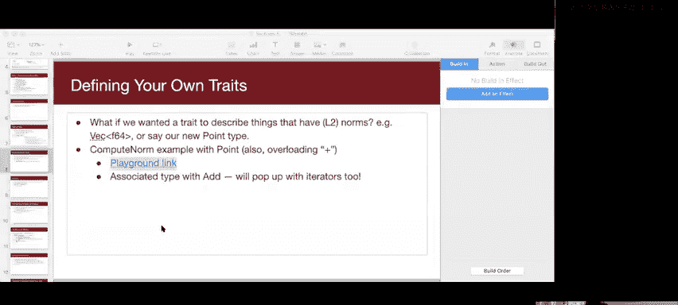

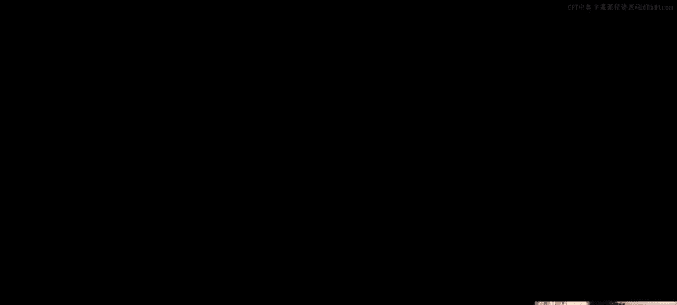

First of all trait here I just made this a pub trait in case we want to use this in other files or something right So this is trait compute norm right Comp norm is the name of the trait normally in rust it's customary to name your traits as verbs know very active very like vigorous I guess so because we're gonna compute the norm right and then we'll define the function So anything that implements compute norm has to define this function So the funny thing here is that traits when you define a trait。

 you can also give a default implementation and this is kind of like my dumb default implementation I'm gonna say like you just return zero So here if I want to like define a norm for like an option of a U 32 actually so there might be like a reasonable way to define this maybe I just return the U 32 or something like that and then like cast it as a float。

 but I'm just gonna say you know like what's the norm of none， it's zero， it's like the default。

 what's the norm of some something right it's zero So this will just inherit kind of like this default implementation。

And then so if we look down here right if I print so I hear I have some option。

 so like the norm of some option， I can I can call compute norm on it and that will compile just fine。

 we'll just look at the output right here so the norm of some option is zero because it's using the default implementation do people have questions about that about like do people have questions about this this highlighted portion of code here？

But pause okay so then let's look at implementing kind of more reasonable things So if I want to do it for point。

 what I would do is I would do self dot x times self dot x plus self dot y times self do y and I call this square root function on it dot square root This is how you compute square roots and rest You might be wondering is there like an infi way to do this like can I have like a square root function and define it around it。

I think。Let me just like see if you can do， I think you might be able to do like something float like like like F 64 colon colon square root。

 but it's just I've seen this syntax more often I think there are also like macros people have defined to be able to do like in fixed computations and stuff like that。

 but we're not gonna worry about that too much right now。

 just think about this is the way that you compute square roots。

 So this is a square root of x squared plus y squared like the Pythagan theorem tells us。

 And then if I have you know so I should have actually displayed these before。

 but I had this thing called little Vc or actually sorry yeah。 So we had this point。That had。

 I kind of like conflated a bunch of examples here， actually looking back on it。

 But let me actually just comment out a bunch of these。 Okay， let me just make it much simpler。

 Let's say let P equal to。Points new 3。0 comma 4。0 I have to put this 。

0 here to indicate that it's a float if I say print L B the norm10 norm。

 the norm of this point which I'm going to have the debugging format string is this right。

 I'll say P is actually sorry I' I' going to call it P2 so we don't have a name of conflict。

 and then I'm going to do P2 dot compute norm。So what do you think this law put， any guesses。

 can someone just shout something out？What's the norm of， you know， three，4。

 our favorite Pythagan triple？It's so catchy。What should this print five， Did somebody say five。

 great， lovely， Okay， so if we print this out。It's gonna complain about some unused variables。

 but it prints out5 right so it prints out because we derive debug it'll print out the point like that and it says5。

 which is great right So thats that's how that works。

 I'm going comment this back in because we'll see some more stuff soon and then I can also compute I can also implement compute norm for vector of F64s。

 So this I'm just doing this like showcase some of rust's fancy functional syntax。

 If you're interested， we could like devote lecture time like talk about like functional rest more but I just sort of wanted to give you taste of it here you'll see definitely more with closures when we start talking about threads。

 but what we do is like I'll define this it I'm going to map a function on it。

 I'm gonna map this square function on it and then I'm gonna to call this function called sum。😊。

So I'm going to do sum of F and this is the F64 version of sum I have to call it that way because it can't infer the type unfortunately。

 so then I'll call sum on it and then I'll compute square root on the sum so this is like a very slick way to like define the L2 norm and you'll see that that also works because I define here little V。

 a little V of just 3。0 and 4。0 and it says the norm of the little V is5。Right there。

Any questions so far？I realize I'm going really fast。 Okay， then okay。

 here's another really cool thing。 you can use traits to overro to overrode override operators。

 which is super exciting。 So if I imp ad for points what I can do。 So yeah。

 so let's just focus on digest this for a little bit， I can imp add for point。

 and I can say I'm going to define edition on myself with somebody else。

 and it's going to output something it's going to output。

 So I don't think I talked about this capital self。

 This keyword capital S self is like it's just to stand in for point self just means like this type。

 Does that make sense to everybody。😊，It's like the type of myself。

Right because the compiler is able to figure that out right and then we just we do it in the most logical straightforward way。

 I'm going to define it as in the output of the addition is going to be a new point where it's going to be self my x plus the other points x and my y plus the other points y。

Does that make sense to everybody and like I said， like you have links to the code in the slide so you can feel free to like play around with it。

 define you know I think a great exercise would be define subtraction of points。

 what is like define a dot product for points maybe or something right？

And then okay another weird thing you might have noticed is this type output is equal to self。

 This is called an associated type。 So this is kind of a little bit more of an advanced point。

 but what this means is that this addition operation the trait definition has to know what kind of type are you going to be returning because it's not obvious that the output of an addition is going to be the same output as the two things that came into it。

 I'll give you an example for I think it's easier to think about this for multiplication right So say I wanted to override the star。

 the asterisk for points to be the dot product right the output of the dot product between two things is not the same type as the input to the dot product the input to a dot product is going to be like two points。

 two vectors right the output is going to be a scalar。

Right in case you're not familiar with dot products that's totally okay too but you know it's in general。

 like we want to be we don't want to restrict ourselves to outputting something that's the same type as the inputs So that's why we have to define output And here I said define type output is equal to self I could have just as easily of written define type output is equal to point and that will also happily compile So if I do that because like the rest compiler we'll just sort of like figure that out right happily compiles it knows what I mean right and then if you want to see an example of that in action。

 we can see in this last one I can just do the origin plus point nu 34 and then compute the norm of that and that should also return5。

As you can see， that happens right there。Yeah。Are there any questions about that？

So are there any I'm going to highlight this code again。

 Are there any questions about this highlighted portion of code To okay。

 if there are questions about the type output equals point， I think that's weird。

 the way I like to think about this is like this output is kind of like a type variable right and I'm setting it to something。

In order to have the trait make sense。Any questions I'm kind of I'm kind of worried about how silent it is。

 So I can't tell if people don't know what questions to ask or or or like if you want me to like rewind back to like a couple of sidess before。

 that's also completely fine。So defining functions with I see what you mean Okay yeah。

 so what's the benefit of so that it sort of lets you group these types together in a way。

 And as we'll see soon you can kind of like automatically define the trait for like a bunch of different types at once right So like say I wanted to like define a very general version of compute norm that could work on like a bunch of different numerical types or something right So like。

Yeah， so like I guess your question is like like correct me if I'm wrong。

 but is it sort of like why would I define my own trait when instead I could just do something like I'm gonna have an implementation instead of doing this。

 I'll just implement compute norm independently for point and and independently for vector。

 I that right， Is that your question whoo。That's a great question， yeah。You know。

 it's useful to categorize our types in these ways because it lets us sort of define。

 So I can define， we'll see this with generics， which hopefully we have time to discuss in like the last 10 minutes here。

 if not will definitely start there on Thursday。 but like if I wanted to define a very generic function that says like print the norm or something like that。

 then I can like take in something of like a generic type that I can specify that the type that I take in has to implement compute norm right and that's useful right because now I don't have to do like print normm for point and print norm for Vck I can just sort of write one function for a generic type and I can specify that this type implements that trait So I think sorry in order to properly answer your question。

 I think we'll have to see generics and then maybe itll start to make more sense there if it doesn't please ask it again and then it might make more sense in that context do you want to mention something wrongyme。

Yeah， I think the simple answer to your question is， yes。

 like the point of using traits is to reduce the amount of code that you have to write so you can implement a function on a lot of different types。

 and it may be useful to compare and contrast this with object oriented programming like the way that you reduce the amount of code that you write and avoid copying pasting and object oriented programming is you define a parent class。

 and then you have a lot of child classes inherit from that parent class。

 The problem with objectoriented programming is sometimes you end up with like inheritance hierarchies that aren't a simple tree。

 like you don't have one parent class and then the child classes inherent inherit cleanly from that parent class maybe in like half the classes you need to override a method in one way。

 but in half the other classes you need to override it in a different way。 So then you're like。

 okay well， let's create two child classes and then have things inherit from those child classes。

But then sometimes you need to like slice things a different way and it can become very complicated。

 I'll find a concrete example for you of when object oriented programming kind of falls apart and this tries to take a similar approach where you're kind of sort of inheriting functionality in some cases but it's a lot more flexible you're not saying that there is like a single parent class with 10 functions that you inherit you're saying we're gonna to slice that into a bunch of different traits。

 a bunch of different conceptual groups and and it's a lot more flexible and a lot more general Yeah I think most people agree that like this way of like this is much more powerful than traditional object oriented programming and and like inheritance and how that works but I think in order to fully appreciate it itll make sense to look at generics so let's see if we can introduce that in the last couple minutes here so share my screen again Yes okay generics。

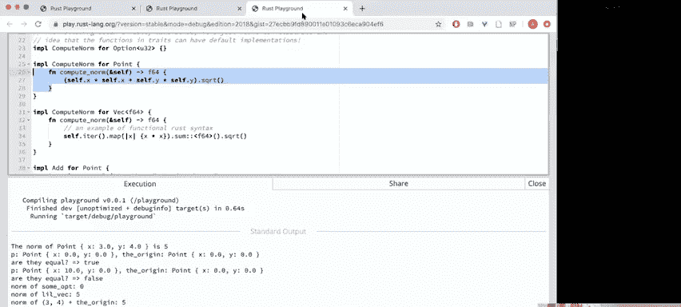

Genes here。Great， can people see that？Okay so you've seen them before actually you've been a client of generics before today we're gonna to learn how to actually implement them right so you've seen like vectors can have different types。

 boxes can have different types options and results can work over different types and soon in your weekly exercises you're going be implementing you're going to be upgrading the link list from last week's lecture into a generic link list and you'll be implementing sort a bunch of like really fun traits on it but now we're going to look at this link this playground link some of this switch over again right here。

😊。

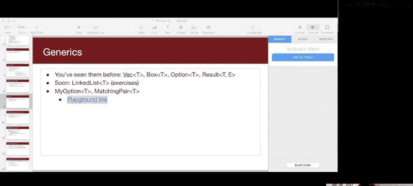

Great where we can define kind of like a struct using generics。

 So over here I've defined this matching pair。 So it's basically just a struct that as two fields that have the same type。

 that's what the syntax here is saying So the new things we notice here are these angled brackets and there's this like T inside of it So saying a matching pair of type T is a struct that contains first and second and first and second both have type T I also define sort of just like our own version of an option here。

 This is an enum in rust and what that means is that it's essentially this type or it's essentially going to look like something of type T or it's gonna to look just like nothing right And then we can implement display for these particular let's implement display just for like U32 right So don't want to delve too much into the matching statement syntax because we are in the last couple of minutes and I want to like focus more on the conceptual points with。

😊。

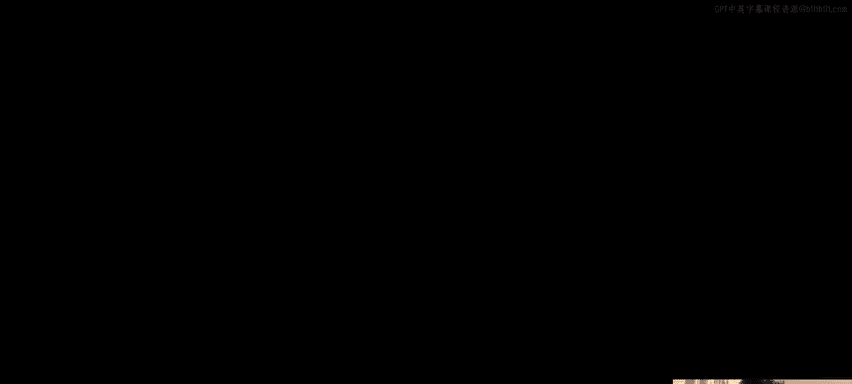

With generics so maybe we can like revisit that on Thursday if we want like devemore to match statement syntax。

 but here you can just see that we were implementing how do we create a new matching pair while I create a new matching pair by it's just going so I have this angle bracket T again right and it's saying I my new function is going to take in something of type T and another thing of type T and because it's just going to spit out thatstruct right and then I can also implement display for a matching pair of type char in this way as well。

Which is so this is an example so we can implement we can implement traits just like we saw with Beck F64 for a particular variance of matching pair so here's an example I can say like P's in a pod matching pair cha is equal to matching pair and new of P&P and then we can print them out because we implemented display for them and then in order to define my enum I have to do like my option colon and colon this is the name of my enum and this is like one variation of it so if I print this all out it will look like so two p's in a pod and this is my sum of five and this is nothing。

嗯。Do people， so let's actually focus like not on the enum， but just on this syntax。

 does this syntax make sense to people？The idea that we can have a struct be generic like this that I can sort of populate it with T the whole point of that second enum there was just to show you that like option is something you could have defined yourself it's actually a very kind of like simple definition once you understand enums there but maybe we should talk about those on Thursday are there any questions about this highlighted portion of code and like what it means？

So yeah， so this is how you define the genericstruct， this is how you implement it。

 notice how when you're implementing it， you still need that angle carrot T。

 So this like when you're doing the assignment， please come back to these examples。

 use them as a reference hopefully that will be helpful so and then kind of like a final word I think will be good if we like ended on this note today so we can actually have something called trait bound。

 So this kind of goes back to Julio's question I think。😊。

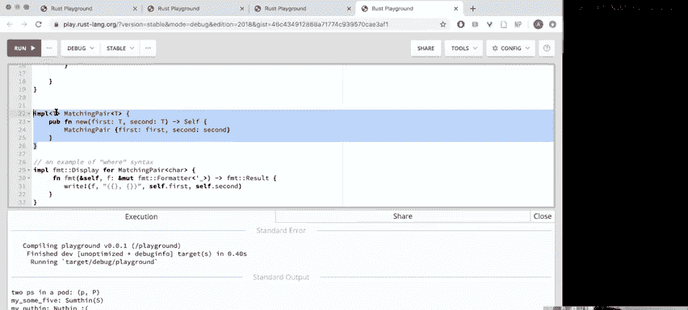

And we can do- so let's see， so I'm going to share this again。So if you'll notice。

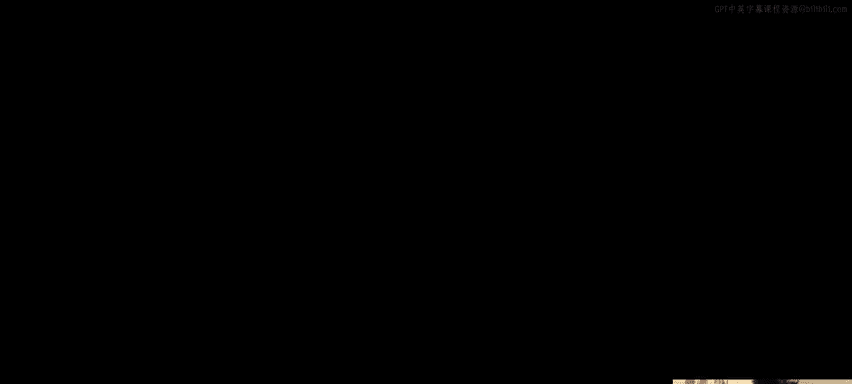

Yes， great， so you see that。So in our previous example， in our previous example。

 notice how we could we implemented display for matching pairs。

 So you see this highlighted portion of code。 We implemented display for matching pair only for char right So like you know what if I wanted to do something like a matching pair of like U 32 Well I could copy it right and I could paste it and I replace the char with like U 32 then it works what if I also wanted to work for strings well you tell me what to do copy it。

 I'll paste it and put string inside there this should feel very wrong you should be cringing like what I'm doing this is the exact opposite of reusability is a horrible thing to do but the magic of rust traits is I can do something like this I can do something like this here I can let's not at my option because we don't want to talk about Es I can say something like T So I can implement like kind of this generic display for matching pair。

😊，Of type T， where T is is itself something that can display itself， right。

 And now this magically covers all of the cases， right。

 so I don't need to implement it individually for char or for string or for numbers， right。

 But I can have like， so matching pair char。 I get two pieces in a pod。

 I can also do let like twos in in a pod。 I don't even know if that like， okay。

 I guess it's happy with it。 The lecture is happy with it。 I can say matching。

 this will be a matching pair of type。 you know， U 32 is equal to matching pair new。

 it's gonna be two and2， right， And then I can say， here I'm just gonna copy and paste this。

 I can print them out like this。😊，I can say。呃。To choose in a pod。Is it gonna be twos in a pod， right？

 And it just kind of knows what to do， right， so I can oh invalids， okay。

 it's it's mad with how I named my variable， obviously， as it should be。 It's a horrible name。

 Never name your variable that So if I do twos in a pod， then that will work。Yes。

 exactly do you see that so this is magical right because rust you know I don't have to individually go through each type that can display itself and implement display for matching pair。

 I can just say implement it for all types that already have this display feature of them。😊。

Does that make sense， does that answer your question Juo as to like why we would want to define our own traits maybe？

G that's a great question。 if it doesn't have the display trait。 So so that's basically saying。

 remember I have a matching pair that contains two things that are of type T。

 if these two things don't know how to display themselves。

 then you know then there might not be a logical way to display itself but maybe I want to like still define sort of like a default representation So what I could do there is maybe I could have like a more general thing where I can say implement here。

 So I'm just gonna copy and paste this。 So like just like。You know， if it doesn't implement display。

 then I can do well now I have to think of something that doesn't implement display。

 but then I can where I used there like vector I think doesn't doesn't I think vector might。

 I'm not sure。 I think it implements the debug， but not display。be let me。

 let me actually copy and paste the point that we had before because point doesn't。

Some great live coding to see if this will work。 so we have points。

 so I can have a matching pair of points。 So if I have like this generic one where it shouldn't。

 so it might not be able to display itself， but it'll just say like maybe it'll just like print out question marks right。

 so I can just be like。Like I don't know how to display myself right。

 but if it does implement display， this will get overwritten。

 So let's just make sure that compiles by itself and that it's happy okay， so it's。Let's see。

 actually， it's actually。Angry because there might be conflicting implementations of trade display。

First implementation here。 Okay， I think I might actually have to like， look into。

How you would like do like a default and override it with a trade bound， I don't know if you can。

If you can override with trade bounds in this way， but but like in general， you know。

 maybe there's a way you can like say trade bound like that doesn't implement display。

 So maybe I think the question marks syntax。嗯。If I do like something like this。

So it doesn't have to implement display or sorry， maybe it needs。Forment。Okay。Actually。

 wait a second。We can we can come back to we'll come back to this offline I think， but yeah。

 but like in general you wouldn't if if the inside types can' implement display。

 then probably the whole thing doesn't have like a logical way of implementing display' it's reasonable to think like how would we do like a default implementation for like less specific tradebound versions but here are the compilers saying like oh you have these two different definitions of display how do I know which one to you use so we'll get back to that question on Thursday but that's a great question。

Are there any other questions at the end of lecture？

That's essentially what I'm trying to figure out maybe if we can say like。Where T。

 I guess this is technically after lecture。 so we can just sort of like try it out where T。

 I think if you do like question mark。that display。

 I've seen this question mark syntax before where it's like kind of optional。

It says the default bound relax for a type parameter。

 but does nothing because the given bound is not a default only。Question mark sized is supported。

 so it could also just be that the rest compiler might not be powerful enough to I guess。

Det to like give us this pattern right， that's something that I'll have to like do some more digging I don't know if you can like say not like you can like add traits together。

 but I don't know if you can like subtract them so to speak that's a good question。Yeah。

 any other questions？I guess Warren， you sta have your hand up。Is that left over， okay？But guess。

 yeah。Any other questions in general？Feel free to also like stick around afterwards and ask questions about any of the other parts。

 but yeah we have a couple of other things so like on the beginning of Thursday I'll wrap up kind of this conversation here and we can see an example in real systems code and then we can talk a little bit about smart pointers。

I can totally go over the match。Yes， okay， so for the previous example。You're saying like write。

See where we' even doing right here you mean？Yeah， okay。 so this， so the match statement。

 you might have seen it in the context of error handling before。

 And what this means is I'm going I have a immutable reference to myself。

 I'm going to match myself to there are two possibilities right。

 So if we look at the definition of this enum。 Have you heard of union types before， Brian。

It's completely fine if you havet like like C and C+ plus is this thing called a union。

 but it essentially means that this I'm defining a type called my option and it has two variants。

 It has one variant that's something and it contains a T and it has another variant that's just nothing right and this is exactly like the option that you see in regular rest and what this syntax means is I'm going to try to this is sort of like you're giving me this my so self is going to be this option type。

 and I'm going to try to match myself to this pattern if I'm match with something if I'm of this something variety。

 then I'm going to print this out to the console。 if I'm of the other variety。

 then I'm just going to write this。And like okay yeah so I guess delving into the syntax。

 you notice that we start out with these curly braces for the match statement and then we have the match statement consists of comma separated lines or you can also make the right hand side of this like a set of curly braces too if you had a really complicated match statement。

 but on each of these lines right's each of these items on the left hand side you have a pattern right So one possible pattern is like this is something containing numb。

And on the right hand side， we have。The result， right。

 so you can think of match as sort of like a big， it's kind of like a big if El if El if statement where we're trying to find the pattern that matches whatever is here。

 and then the return value So this match statement is actually。

 it's really cool because it has a return value， just like an if statement invested as a return value Oh the return value。

😊，Is going to be。Basically， the output of whatever is on the right hand side of this arrow。

 So right bang will return this format result， and it's very convenient that we define our match statement in this way because the the return value of this match statement is essentially just going to be。

Whatever the output of the successful branches right。

 so if it's it's going to be the output of writing this or it's going to be the output of that。

 Does that answer your question， Do you have any other questions about the syntax。Exactly， so that's。

 yeah。 so you have an example of that here。 You you see this highlighted piece of。

So you you actually can't say something。 you have to say my option colon colon something to to specify which because we can have two different enums that both have something in number of something right。

 So yeah， you could say let my sum5 it's my option U 32， it's gonna be my option something5。

 This is how you use the syntax there in your code。

 And this is much more powerful than enums in like C or C plus plus or Java because those are just integers under the hood。

 But this， this is typea right you have like you know if you're like writing like OSs code or kernel code and you wanted to define like you know return codes or something like that。

 maybe it would make sense to to have that be an enum And then instead of just like some like random integer where like you might be able to screw up the semantics of how that works。

 So like semantically enums force you to think about your code differently。 And that's good。

I think the difference between like C Java C++ enums and rest enums is that rest enums are a bit more like objects and that you can store things in them like you could have an enum and C that is something or none but if it was something you wouldn't be able to store an associated value with it。

 it would just be something you couldn't like have something of five and you also wouldn't be able to declare methods on it。

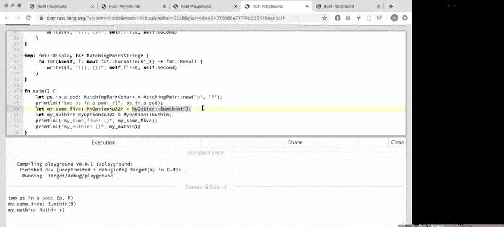

No problem。