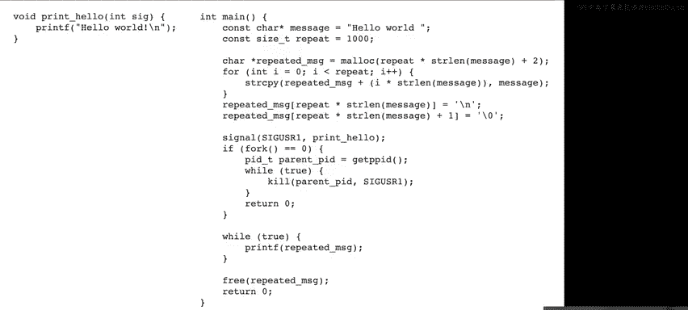
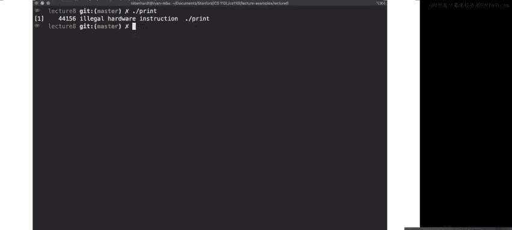
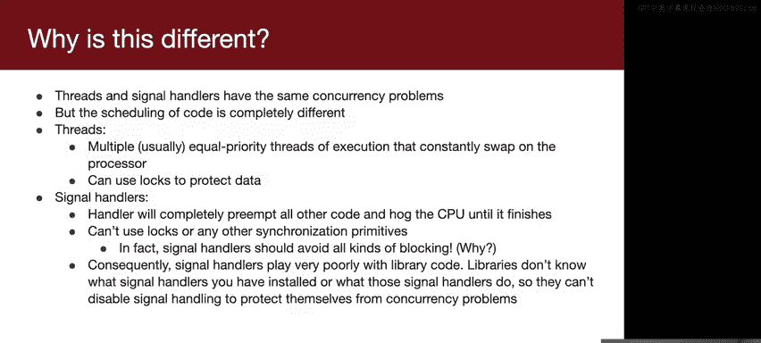
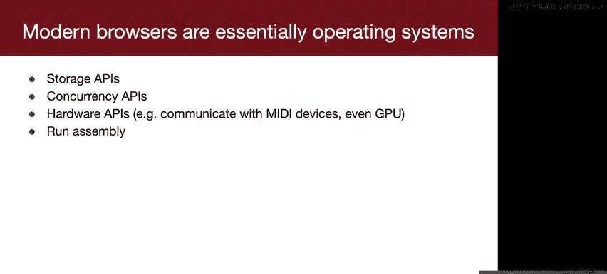
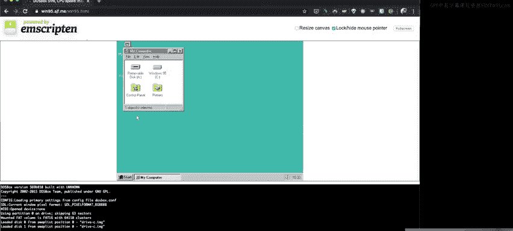
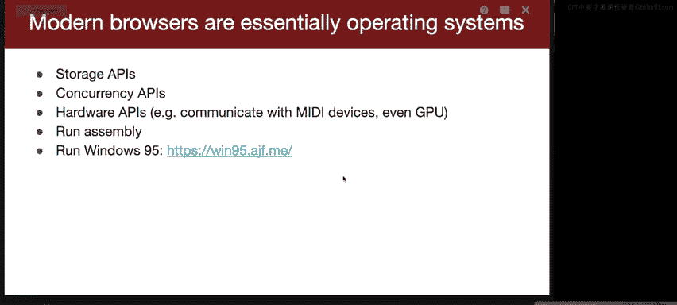
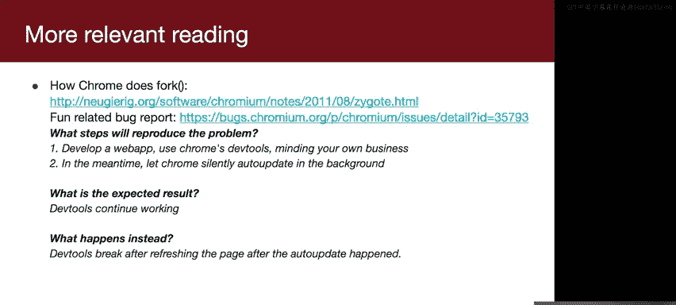

# Rust安全编程：第8讲：信号处理的陷阱与Google Chrome案例研究


在本节课中，我们将学习信号处理中的常见陷阱，并通过Google Chrome浏览器的案例研究，探讨多进程架构如何解决复杂系统中的安全与稳定性问题。

---

## 课程概述


欢迎来到第四周的周四，我们即将完成本季度一半的课程。首先是一些关于项目的快速说明。我们将在明天发布迷你GDPB项目。在这个项目中，你将实现一个非常简单的GDP版本，它实际上包含了GDP的大部分核心功能，例如设置断点和单步执行代码。这将是一个非常有趣的项目。同时，我们也提醒你，你可以提出自己的项目想法，并研究任何你感兴趣的内容。


一些潜在的想法包括：几周前有人询问是否有工具可以帮助理解Rust编译器在做什么，特别是是否有工具可以看到编译器何时丢弃一个值。答案是，目前没有这样的工具。但如果你想实现类似的功能，我们可以为你提供一些指导。如果你对特定领域感兴趣，可以自由地在Rust中实现与该领域更相关的内容。例如，如果你上过CS148并对计算机图形学感兴趣，也许你可以实现一个光线追踪器。在本季度后期，当我们开始讨论多线程时，你可以让你的光线追踪器变得非常快。你也可以选择一个像`grep`这样的命令行工具，并尝试超越其性能。有一个基于Rust的程序叫`ripgrep`，它比`grep`快得多，这可能是一个有趣的挑战。如果你对数据库感兴趣，可以尝试实现一个简单的数据库。任何你能想到的想法，都可以给我们发消息询问，例如“这个想法合理吗？”或者“你认为我能在两周多的时间里完成这个吗？”，我们很乐意给你一些反馈或指引正确的方向。

在继续之前，关于项目有任何问题吗？很好。

那么，快速概述一下今天的内容。我们将从上周结束的地方开始，继续讨论信号处理。然后，我们将做一个简短的案例研究，探讨Google Chrome如何使用进程。我认为这将非常令人兴奋。这是一个非常有趣的项目，有许多不同的约束和目标。我们将讨论他们如何使用多进程来支持这些目标。


---

## 信号处理的陷阱

首先，我们上次讲到“不要调用`signal`”，这听起来可能有些争议，因为我们在CS110课程中花了很长时间，并且你们即将在项目中花费大量时间处理信号处理和并发问题。为什么我要告诉你们不要调用`signal`呢？如果你查看`man`手册页，它会告诉你不要使用`signal`。手册页指出，其行为在不同的Unix版本和Linux版本之间各不相同，不要使用`signal`，并建议查看下面的“可移植性”部分。如果你查看这个可移植性部分，它会说`signal`唯一可移植的用途是忽略信号或恢复默认处理程序。因此，`signal`用于这些目的是可以的，但如果你想设置一个信号处理程序，就不要调用`signal`。有一个不同的函数叫`sigaction`。


你应该调用`sigaction`。手册页中提到了语义的混乱，以及对语义的显式控制。什么是语义？在这个上下文中，语义指的是信号处理的细节。例如，假设你收到了一个`SIGCHLD`信号，这启动了你的`SIGCHLD`处理程序。然后，当你在处理程序中间时，又收到了另一个`SIGCHLD`信号。你是重新启动处理程序，还是立即再次调用处理程序？或者，你是否会阻塞`SIGCHLD`直到处理程序运行完毕，然后再运行它？这就是信号处理语义的一个例子，而`signal`实际上并未指定这一点。但`sigaction`有一系列选项，允许你指定类似的行为。我们在讲座中不讨论`sigaction`的原因是，如果你查看它的接口，由于需要指定所有这些选项，在白板上画出来会非常难看。但我们在作业的起始代码中使用了`sigaction`，你会看到一个名为`install_signal_handler`的函数，它调用了`sigaction`。如果你在自己的C/C++项目中使用信号，你应该意识到不应该调用`signal`。

这个`man`手册页实际上非常有趣，它详细讨论了导致这种可移植性混乱的历史遗留问题。如果你想了解更多，这是一篇相当有趣的阅读材料。

好了，上次我给出了四个代码示例，它们要么是安全的，要么是不安全的。让我们快速过一遍，我想听听你们的想法。你们认为这个示例是安全还是不安全？

```c
while (1) {
    // 无限循环
}
// 当收到Ctrl+C (SIGINT)时，直接退出
```

是的，这个看起来很简单，对吧？这里没有太多事情发生，它无限循环，然后每当收到Ctrl+C时，它就退出。所以，是的，我认为这个是安全的。

那么这一个呢？这个示例计算接收到的`SIGCHLD`信号的数量。上节课结束时有人提到，如果你希望处理程序调用`waitpid`来等待所有子进程，你可能应该在处理程序内部使用一个`while`循环，以便在`waitpid`返回大于零时继续调用。这样你就能获取所有子进程，因为正如我提到的，两个`SIGCHLD`信号可能同时发送，如果父进程同时接收到它们，它只会调用一次处理程序。所以，如果你在处理程序中调用`waitpid`，你可能需要多次调用它，以便获取所有同时生成信号的子进程。但这不是本示例的目的。

这个示例只是为了计算传入的`SIGCHLD`信号的数量。最后，你可以将其与进程数量进行比较，几乎总是会发现打印的第二个数字小于第一个数字。接收到的`SIGCHLD`信号数量少于退出的进程数量。这里没有正确性问题。我想知道这里是否存在安全问题，这段代码安全吗？通常是什么导致竞态条件？

没错，数据竞争通常是由于某个共享资源在多个地方同时使用而引起的。所以，这是我们的共享资源，它是唯一的全局变量。`sigchild_count`在哪里被使用？它在`printf`中被使用，还在另一个地方被使用。也就是处理程序中。所以，有两个地方在使用这个变量。这两个地方有可能同时使用这个变量吗？

是的，由于这里的`waitpid`，这种情况不可能同时发生。这个`waitpid`将等待所有子进程退出。而你在子进程退出时会收到`SIGCHLD`信号。所以，在这个`while`循环之后，直到这一点，你都可以收到`SIGCHLD`信号。在这个点之后，你已经对所有子进程调用了`waitpid`，所有子进程都已终止，所有`SIGCHLD`信号都已到达，之后就不会再有信号了。所以，当你到达这个`printf`时，这个处理程序将不再运行。因此，虽然有两个地方使用这个变量，但它们在时间上是分开的，不会同时使用。所以，只要我们在使用`sigaction`来指定处理程序不能同时运行多次（即处理程序不能被自身中断），这个示例实际上是没问题的。在CS110中讨论信号语义时，我们通常使用这些语义。

那么，这个示例呢？在这个示例中，我们试图计算正在运行的进程数量。所以，在这个循环中，我们`fork`了一堆进程并递增一个计数器，然后在`SIGCHLD`处理程序中递减该计数器，最后打印正在运行的进程数量。安全还是不安全？有人想猜一下吗？



好的。我们在两个不同的地方进行递增和递减操作，你说这感觉很奇怪，为什么？是的。这里的`sleep(1)`调用有点打乱了节奏，但理论上，问题不在于你在不同地方有递增和递减操作，而在于理论上它们可能同时发生。所以，你可能在这里递减的同时，在这里递增。假设因为我们这里有`sleep(1)`调用，我们有一个合理的操作系统调度器，它不会在一秒后才调度这一行，比如这个`for`循环的运行不会有一秒的延迟。那么，假设这个递增和这个递减不可能同时发生。这能解决我们的安全问题吗？



好的。我们可能会有一个潜在的死锁场景：如果我们检查`running_processes`大于零，但紧接着在这个`while`循环之后，就在这两行代码之间，在我们检查它大于零之后但在`pause`之前，一个`SIGCHLD`信号到来，这会将`running_processes`递减到零。那么，我们就不应该暂停，因为所有子进程都已退出，但我们已经决定运行`while`循环内部的代码，所以接下来我们做的就是`pause`，然后我们就无限期地死锁了。这绝对是一个安全问题。

这是唯一的安全问题吗？这里还有一些非常简单的问题。在同一个地方。是的，请讲。这可能不明显，因为这只是一个简单的整数。但从形式上讲，在可能被修改的同时读取这个值并不被认为是安全的。这是有可能的，所以读取这个值并将其与零比较发生在多个汇编指令中，有可能在这个过程中，这个处理程序被调用（抱歉，是这个处理程序被调用）并且值被更改。在这里，这没什么大不了的，因为它只是一个简单的整数，在x86架构上，这没问题。但从形式上讲，这种行为是未定义的。如果我们在不同的架构上运行，我们真的不确定会发生什么。如果这不仅仅是一个简单的`int`，而是一个正在运行的进程列表，例如，然后在我们试图查看该列表时，该列表被修改，列表可能在我们试图查看时被重新分配，现在我们可能正在查看无效的内存。所以，你绝对不希望在一个值可能被更改的同时读取它。

因此，在这个`main`函数中使用`running_processes`的所有地方，我们都需要确保处理程序不会运行，方法是使用`sigprocmask`来阻塞`SIGCHLD`。然后在这里，当我们使用这个`pause`时，我们必须使用`sigsuspend`来代替，正如在110课程中讨论的那样，以避免死锁，即信号在你检查条件之后但在你进入睡眠之前到来的潜在死锁。这对大家都清楚吗，大拇指向上还是向下？

我想确保我有时间讲完剩下的幻灯片，所以我将在Slack上回答那个问题，但本质上`sigsuspend`... 是的，我将在Slack上回答，因为这是一个非常好的问题，而且很重要。关于这里发生的事情还有其他主要问题吗？

好的，这是整个季度我最喜欢的例子，这个安全还是不安全？我通过如此关注它已经给出了答案。所以，如果你从CS110的角度来看这个，你应该说这是安全的，就像Ryan说的，这是你展示的四个例子中第二简单的。你所做的只是，当按下Ctrl+C时，它打印“he he not exiting”而不是实际退出。这看起来没有任何问题。你只是在打印，对吧？这太简单了。能出什么问题呢？我说这实际上不安全。你会想，这怎么可能不安全呢？我认为这里任何事情都可能发生。我们不知道，它可能崩溃，可能死锁。为了向你演示，我写了一个这个例子的扩展版本。所以，不仅仅是打印一个小字符串，而是打印一个非常长的字符串。我把“hello world”重复了一千次。但在这个`while true`循环中，我只是反复打印“hello world”一千次。这就是这里发生的一切。然后同时，我产生一个子进程，这个子进程在一个`while true`循环中，反复向父进程发送`SIGUSR1`信号。`SIGUSR1`处理程序做什么？我安装了这个信号处理程序，它只是调用`printf("hello world")`。这就是这里发生的一切。真的，真的，非常简单，和我们在这里做的完全一样。


如果你运行这个程序，欢迎你运行它。它会死锁。你会想，什么？或者如果你运行它，有时你会得到一个`SIGABRT`，然后它崩溃了。你会想，什么？然后更奇怪的是，偶尔，这只发生在我身上几次，你运行它，甚至在它有机会打印任何东西之前，你就得到了“非法硬件指令”。这正是我刚才在幻灯片上展示的代码，你会想，哇，Ryan，等一下，这里发生了什么？


事实证明，你不能从信号处理程序中调用`printf`，这绝对不是一件安全的事情。要理解为什么，首先，`printf`是一个非常糟糕的函数。这是我一生中读过的最糟糕的代码之一，这个东西差不多有2000行。但在那2000行的中间，有一个对名为`flock`的系统调用。`flock`的作用是锁定一个打开的文件，它在打开文件表条目中设置一个位，表示“嘿，现在请不要写入这个文件”。原因是，如果系统上有多个进程同时打印，你不想让它们的输出混在一起。所以我们使用这种锁定技术，当你想打印时，你锁定标准输出，然后写入，当你写入时，没有其他进程能够打印到标准输出，没有其他进程能够写入标准输出，这样输出就不会混在一起。然后当它完成打印到标准输出时，它解锁文件描述符，其他进程就可以写了。

显然这里还有其他事情发生，它调用了`malloc`。`malloc`做了类似的事情，但由于这种全局状态的使用和这种锁定的使用，这最终导致了很多问题。一般来说，你不应该调用使用全局状态的函数。这里有一个安全函数列表，它很长，但也不是那么长。C语言中有很多你常用的函数不包含在这里，而C++中的大多数函数依赖于动态内存分配，例如，如果你使用`string`或`vector`，你绝对不能从信号处理程序中调用它们。

为了解释这里发生了什么，为什么这种锁定如此成问题，假设你正在`main`函数中打印一些非常长的内容，所以你经过了第1311行，并且你已经获得了这个文件的锁，你设置了表示该文件已锁定的位。然后就在那之后，信号到达，你进入信号处理程序，现在你开始在信号处理程序中运行`printf`。那么这个`printf`做什么？它运行完全相同的代码，所以它到达第1311行并尝试调用`flock`，但位已经设置，锁已经被获取，所以`printf`会说，哦，其他进程（实际上是同一个进程，但它认为是其他进程）正在打印标准输出，我需要等待那个进程退出。但当然，不是其他进程在写入`printf`，而是我们的进程，只是我们恰好在写入`printf`的过程中中断了它。所以你最终无限期地等待这个其他进程完成打印，导致死锁。

这清楚了吗？那么我们应该怎么做呢？`printf`看起来是如此基本的东西，如果我们甚至不能打印，那么我们该如何处理信号呢？如果在信号处理程序中我们能做的事情不多，那真的限制了我们的能力。那么，有人对我们应该怎么做，如何处理信号有什么想法吗？有什么创造性的想法吗？猜一下。我们仍然希望能够响应信号进行打印。只是我们不能在信号处理程序内部打印。修改进程中的某些东西。嗯哼。好的，非常好的想法。所以，与其在处理程序中做工作，我们不如在处理程序中拦截信号，然后在主进程中做实际的工作。我们如何进行这种通信呢？我们如何从在处理程序中捕获信号过渡到在主进程中做工作？我们如何向主进程指示它现在应该打印“Hihi not exiting”？是的，你可以有一个像`signal_received`这样的全局变量，然后在你的处理程序中，你可以设置这个变量，然后在你的主进程中，你可以检查这个变量是否被设置。如果它被设置了，那么我们就知道我们收到了`SIGINT`，你可以处理它。

如果你要做任何复杂的事情，或者你想处理多个信号，它会变得非常混乱，你需要设置多个变量，你必须处理取消设置变量，所以如果有人按了两次Ctrl+C会发生什么，你必须确保你的代码能够拦截这两个独立的Ctrl+C，比如一旦你在主代码中响应了Ctrl+C做了某事，你必须将该变量重置为零，并确保它可以再次被设置，等等。

有一个更聪明的技巧，有人在90年代初发明了，叫做“自管道技巧”。这是一个非常荒谬的黑客，但它有效，现在几乎到处都在使用。你要做的是创建一个管道。通常管道用于进程间通信，但在我们的情况下，我们将只使用它在我们自己的进程内进行通信。所以我们创建一个管道，然后当我们等待信号时，在你的主函数主代码中，你只是不断地从管道读取。所以这个读取调用，如果是在管道上调用，它会暂停，它会休眠直到有东西写入管道。所以它本质上会等待有东西写入管道。然后，在信号处理程序中，当你收到信号时，向管道写入一个字节。这样就会唤醒你的主代码，然后你的主代码会说，哦，我从管道里得到了东西，我一定收到了一个信号。如果你愿意，你可以为不同的信号写入不同的字节，以指示发生了不同的事情。但通过这样做，它比设置单个变量更简单，因为接收多个信号的语义也得到了处理。如果你写入两个字节，那么你可以从管道中读取两个字节，然后你可以看到，哦，我得到了两个字节，这意味着收到了两个信号。

这是一个丑陋的黑客。如果你觉得这很荒谬，我同意。但这实际上是信号通常的处理方式。并且有一个新的Linux库，它不新，但它是在POSIX之后引入的，增加了对这个黑客的支持。所以你可以做的是，首先阻塞你想要接收的信号，这样它们就不会被默认的信号处理程序处理。然后你创建这个`signalfd`东西，`signalfd`基本上就是一个管道，所以它返回给你一个文件描述符。然后在一个无限循环中，你只是从那个文件描述符读取，你读入这个缓冲区，但这个缓冲区是一个特殊的缓冲区，它是`struct signalfd_siginfo`，它从管道中读取特殊格式的数据，告诉你你收到了哪个信号。所以，不仅仅是检查你得到的字节是否是一个特定的数字，你可以检查这个结构体的字段是否匹配一个特定的信号，并相应地处理它。你可以说，哦，我收到了`SIGINT`，我收到了`SIGQUIT`，等等。它只是形式化了这个自管道技巧。我们不会要求你使用这个，所以不要觉得你需要完全理解它，但我希望你们记住，如果将来你们要做任何复杂的信号处理，这是你们技巧袋中的一个技巧。

我稍后会谈谈这与Rust的关系。这应该会让你觉得奇怪，因为以前在你的主函数中，你可以有一个循环在做一些有用的事情，比如你可以计算一些值，你可以提示用户输入。但通常在你的主代码体中，你希望有灵活性，能够做一些有用的事情，同时如果需要，能够异步处理信号。所以，在你的主代码体中，你可以做一些有成效的事情，如果`SIGINT`或`SIGCHLD`到来，你可以暂停你正在做的事情，去处理信号并做出响应，然后回来恢复你的有成效的工作。但似乎使用自管道技巧或设置标志之类的方法，似乎消除了并发的可能性。在你的主代码内部，你要么在做工作，这意味着你不会从管道读取；要么你可以从管道读取以等待信号。但你不能同时做这两件事，因为这两件事都涉及使用CPU做某事，你不能同时做两件事。这对大家清楚吗，大拇指向上还是向下？所以这应该令人沮丧。因为信号处理给了我们一个工具，而这感觉像是把这个工具拿走了。

那么我们如何解决这个问题呢？通常有两种方法来解决这个问题。第一种方法是使用线程。请注意，线程仍然可能有并发问题，但当你使用线程时，我们有更多的工具来推理和控制这些并发问题，我稍后会给你一个具体的例子。所以，当你编写多线程代码时，你有可用的工具，比如锁、信号量、条件变量。如果你现在正在上110，我们还没有讨论所有这些工具，但你会在接下来的一周内看到它们。而如果你使用信号处理程序，你真的没有太多可用的工具。当你进行信号处理时，你唯一的工具是阻塞信号，你试图阻止这个其他异步代码体运行，但你没有工具来优雅地控制两件事同时运行。

解决这个问题的另一个选择是使用一个叫做非阻塞I/O的工具，这也非常常见，是你应该了解的东西，我们将在第八周讨论这个。

我承诺过我会解释这与Rust的关系以及Rust中是如何进行信号处理的。信号处理并没有内置到Rust核心语言中。我认为Rust设计者意识到信号处理是一件混乱的事情，很容易出错。Rust有很多问题要解决，主要是内存安全，他们说让我们推迟这个问题，我们暂时不解决它。如果人们需要信号处理，我们将委托给外部crate，但我们不会将其作为核心语言的一部分提供。所以，如果你想使用信号处理，你必须使用Rust库，其中有几个。

Rust有一个叫做`ctrlc`的crate，它是一个库，允许你在收到Ctrl+C时运行一个函数，每当收到`SIGINT`时，这似乎是相当合理的功能。这实际上是如何工作的呢？首先，它创建一个自管道。然后它安装一个信号处理程序，当收到`SIGINT`时写入管道。然后它产生一个线程。那个线程非常简单，它所做的就是在一个无限循环中，尝试从管道读取一个字节，记住如果没有东西在管道里，它会阻塞等待。然后当它从管道中得到东西时，它只是调用你注册的信号处理函数，也就是你希望它被调用的函数。

所以，这实际上非常简单，这个crate非常容易使用，并且它的好处是Rust已经有非常好的控制机制。我们下周会详细讨论这个，但Rust已经有非常好的控制机制来确保你在使用线程时不会出现竞态条件。所以Rust就像是，好吧，你甚至不需要理解线程就能理解这个，因为你已经理解了借用检查规则。借用检查规则强制执行了什么？没有两个地方的代码可以在至少一个地方修改变量的同时使用它。而这正是导致竞态条件的原因：有人在修改数据，而其他人试图使用它。Rust借用检查器已经防止了这种情况。所以，在这种设置下，你不会遇到并发问题，你的代码中不会有数据竞争。

你可能会问，好吧，但这仍然是并发，对吧？我们有线程与信号处理程序。使用线程与使用信号处理程序有什么不同？看起来你仍然在两个地方同时调用`printf`，难道你仍然会有问题吗？为了让这一点更具体，让我们解释一下从信号处理程序调用`printf`有什么问题。你从主代码体调用`printf`，它锁定了标准输出的文件描述符。然后信号处理程序被调用，这是在`printf`运行的过程中，来自信号处理程序的`printf`试图锁定那个文件描述符。但它看到那个位已经被设置为1，表示一个进程正在打印中。所以它等待，信号处理程序无法继续，直到主代码说，好了，我打印完了。但主代码无法完成打印，因为信号处理程序正在运行。所以我们在这里得到了一个典型的死锁。

这与从线程打印不同，因为线程的调度方式不同。所以`printf`从主线程调用，然后信号处理函数被调用，所以它写入自管道，这导致另一个线程唤醒，那个线程现在调用`printf`。当这个线程，即信号处理线程，看到已经有进程在打印时，它不能打印。所以它被阻塞。因为它被阻塞了，这意味着操作系统调度器可以自由地调度一个不同的线程。所以它调度主线程，调度主线程的`printf`，现在主线程去完成打印，然后信号处理线程就可以自由地进行它的打印了。这清楚了吗？为了让这一点更清楚，哦，如果你处理像内存分配这样的事情，我提到这也是一个危险，这里的情况是一样的，它们在那里也有内置的保护措施。我可以快速插一句，我昨晚实际上遇到了同样的问题，我试图在中断被禁用时`malloc`一些东西，结果发生了不好的事情，我意识到我不应该那样做。

是的，所以不要在信号处理程序内部调用`malloc`。为了让这一点更清楚，在线程和信号处理程序中，你仍然有并发问题，认识到这一点非常重要。但由于调度方式完全不同，结果往往非常不同。所以，对于线程，你有多个优先级相等的执行线程，在处理器上不断切换。你可以使用锁来保护数据，我们在CS110中还没有讨论锁，但我们会在一周内讨论。对于信号处理程序，处理程序完全抢占所有其他代码。所以，如果你有任何东西在运行，不管是什么，放下你正在做的事情，跳转到信号处理程序，并且信号处理程序将一直运行直到完成。正因为如此，你不能使用锁，不能使用任何其他同步原语。你唯一能做的就是禁用信号处理。事实上，你不应该在信号处理程序中做任何导致阻塞的事情。你不应该在信号处理程序中调用`read`，不应该在信号处理程序中调用`waitpid`（不带`WNOHANG`），不应该在信号处理程序中调用`sleep`。为什么这很重要？为什么你应该避免在信号处理程序中阻塞？有人知道吗？

这与被多次调用关系不大。我认为在CS110中可能有一个例子，他们在信号处理程序中调用了`waitpid`（不带`WNOHANG`），结果发生了什么？是的，有点，因为信号处理程序在完成之前会占用CPU。这意味着你不能运行任何其他代码，比如如果你在`main`函数中有更多代码应该继续做事情。信号处理程序应该是一个快速的中断，你正在做某事，某事发生，你快速跳过去，响应它，然后跳回你之前做的事情。但如果你在信号处理程序中阻塞，那不会发生，你会跳转到信号处理程序，并且你会一直待在信号处理程序中直到那个函数退出。这是有问题的，因为如果你需要回到你正在做的事情，你不会回去，因为你被阻塞了，你卡在信号处理程序里了。这就是为什么你不能使用锁，因为它会导致死锁，就像我们在`printf`中看到的那样，你做了获取锁的事情，跳转到信号处理程序，尝试获取锁，然后你就死锁了。

正因为如此，这是整个幻灯片上最重要的一点：信号处理程序与库代码配合得非常差。如果你自己编写所有代码，你可以成功地编写使用信号处理的代码。但如果你尝试将库与你的代码一起使用，一切都会崩溃。我认为`printf`是一个库，它是GlibC的一部分。库不知道你安装了哪些信号处理程序，也不知道你的信号处理程序做什么。所以在你的代码中，你有一个全局变量，你会说，好吧，我在这里接触这个全局变量，我在信号处理程序中接触它。当我在下面接触它时，我会禁用信号处理，这样我就不会出现它在两个地方同时被访问的竞态条件。库也使用全局变量，但它们不知道你的信号处理程序。所以它们不知道它们应该禁用你的信号处理程序以避免竞态条件。即使它们知道，如果库开始随意禁用你的信号处理程序，那也会很糟糕，因为你会有非常难以调试的任意行为。

所以库不能禁用信号处理来保护自己免受并发问题的影响。如果你将库与信号处理程序一起使用，你最终会遇到这样的问题。在你的信号处理程序中，你应该只接触你可以控制的代码，或者调用那些被明确标记为可以从信号处理程序中安全调用的库函数。因为库不知道你的信号处理程序，它们不知道如果你的信号处理程序在库代码中间被调用会发生什么坏事。这对大家都清楚吗？



---

## 总结与最佳实践

好了，长话短说。尽量避免信号处理。如果你做的事情非常简单，在信号处理程序内部做是可以的。但任何复杂的事情都应该移到信号处理程序之外，你可以使用自管道技巧来处理，或者只是使用库，这就是你在Rust中要做的。

我在信号处理上花了太多时间，但在剩下的10分钟里，我将讨论Google Chrome。如果你对这个感兴趣，想看到我们没有讲到的更多材料，你应该能够自己查看这些幻灯片。


---


## Google Chrome案例研究：多进程架构

进程是相当隔离的。我先谈谈进程与线程。进程非常隔离。你唯一能通信的方式是通过管道相互发送数据，或者通过向对方发送信号。而信号并没有携带太多数据，我有时把这比作向另一个进程扔水果。你向另一个进程扔一个草莓，另一个进程说，哦，我得到了一个草莓。我不知道它从哪里来，不知道为什么，不知道有什么数据与之关联。信号不携带任何关联数据。就像，哦，我得到了那种水果，也许它们知道如何处理特定种类的水果，但除了信号本身之外，没有传递任何消息。

线程则不同。线程也是多个独立的执行线程，类似于进程。但它们共享内存，共享文件描述符表，还共享一些其他资源。所以它们存在于进程内部，它们有自己的栈来支持自己的执行线程，有自己的寄存器来支持自己的执行线程，但除此之外它们共享内存。实际上，在底层发生的是，你仍然有类似于进程的结构体，但有引用表明，如果你想在这个线程中使用内存，你应该看这里，你应该使用这个进程的虚拟地址空间。

考虑到这一点，在设计浏览器时，哪些事情会是重要的？我本来想让我们讨论这个，但为了节省时间，这些是我想到的。你希望浏览器速度快。你希望它不要使用太多内存，如果使用太多内存，你的电脑可能会变慢，在低端机器上无法很好地工作，等等。你希望它的CPU使用效率高，如果使用大量CPU，尤其是在笔记本电脑上，这将非常糟糕，因为它会耗尽你的电池。你需要能够实际构建它，如果你有一个浏览器的好主意但无法实现，那也没人在乎。最后，它需要安全。如果你希望用户能够浏览一些可疑的网站，比如MP3种子网站，一些仿冒的Spotify，同时也能够访问他们的银行账户，并且不让来自一个网站的恶意代码危害另一个网站的重要信息。

那么线程与多进程在这方面如何体现呢？我们来谈谈速度。多线程还是多进程？有人对速度有倾向吗？为什么？没错。是的，所以，哎呀，走错方向了。当你在进程之间切换时，你必须更改正在使用的虚拟地址空间。这实际上有点昂贵，你必须清除处理器的缓存，然后安装一些新的虚拟地址映射，这样做并不便宜。相比之下，线程使用相同的虚拟地址空间，所以在同一进程的不同线程之间切换比在不同进程之间切换更容易。所以对于速度，我可能会说它们可能非常相似，但多线程略有优势。那么内存使用呢？为什么？完全正确。它们共享内存。而如果你创建多个进程，每个进程都必须有自己的内存。这比那更微妙一些，但这是基本思想。确实，如果你`fork`一堆进程而不是产生一堆线程，你会为进程使用更多内存。那么CPU使用呢？是的，和前两个原因相同，当你创建进程时，你不必复制那么多数据，而且当你在进程之间切换时，上下文切换的开销更小。所以优势在多线程。那么开发便利性呢？比如能够实际构建浏览器。

多线程有巨大优势。对于任何开始做作业3的人来说，你知道这一点，如果你在进程之间传递数字都有这么多困难，想象一下构建一个必须在进程之间传递许多不同类型信息的浏览器有多困难。绝对是多线程的优势。那么安全性和稳定性呢？完全正确。这是这里唯一一个优势绝对属于多进程的要点，特别是因为它们不共享内存。如果你在这些执行线程中有一个错误，并且你使用多线程，那个错误最终破坏了某处的内存，那么你现在就破坏了所有线程的内存。但是，如果你在多进程场景中有一个错误，并且你在一个进程中破坏了内存，你只破坏了那个进程的内存，操作系统会阻止你破坏不同进程的内存。正因为如此，这意味着，当然，你可能有一个导致一个进程崩溃的错误，但至少你所有其他进程仍在运行。你没有把所有鸡蛋放在一个篮子里。

我认为，这是Chrome最终决定构建其多进程架构的唯一原因。对吧，2006年之前的所有浏览器都是单进程多线程应用程序，因为这四个原因。这些原因给出了相当明显的优势，特别是开发便利性，有利于构建多线程浏览器。但Chrome说，你知道吗，我们认为，我直接给你们看引述。哦，天哪，这很有趣。我本来想说明浏览器是如此复杂，它们给你存储API，你可以有并发API，你可以与硬件通信。你可以将MIDI键盘插入计算机并通过Google Chrome访问它，你可以运行汇编代码，你甚至可以运行Windows 95。这太好了，不能不展示。所以这是在用C编写并编译为WebAssembly的模拟器中运行的Windows 95，你实际上可以，这行得通。这是原始的Windows 95代码，这不是某人创建的模拟或假版本，这实际上是原始的磁盘映像，你能做到这一点真是太荒谬了，这些东西极其复杂。




正因为这种复杂性，使得正确实现变得非常困难。Chrome的设计师说，如果我能让它转到下一张幻灯片，但我不能。



为什么它让我这么做？


他们说，几乎不可能构建一个永不崩溃、永不挂起的完美浏览器。我们总是会有漏洞，而只需要一个浏览器插件，比如一个标签页，就能拖垮整个浏览器和当前运行的所有标签页。现代操作系统之所以健壮，是因为它们具有隔离性，因为它们划分资源并相互隔离进程。所以，如果你有一个应用程序崩溃，它不会拖垮整个计算机，我们也需要浏览器有这样的东西。

在另一页上，他们给出了很多理由，应该会让你想起我们在这门课第一讲中讨论的内容。他们说，坚定的攻击者总是能够找到方法来入侵一个进程，突破一个进程。过去有很多可被利用的漏洞，尽管我们尽了最大努力，我们花了多年的投资试图教人们如何编写更好的代码。模糊测试是一种方法，你只是反复向应用程序抛出畸形数据，直到找到使其崩溃的东西。漏洞奖励计划是我们的漏洞赏金计划，我们付钱让人们尝试入侵我们的浏览器，尝试找出问题。尽管如此，我们仍然发现这么多问题，我们甚至不确定我们是否找到了所有问题。比如这些数字只是我们知道的漏洞，但我们也知道黑市上有很多漏洞在出售。

而且漏洞经常是可被利用的。我们在第一讲中讨论过，你如何有一个单字节的缓冲区溢出，然后它变成了一个漏洞利用。我们在这门课中还没有讨论过这个，但有技术可以防止缓冲区溢出造成的损害，但它们并不总是有效。所以他们基本上说，你知道吗，我们已经把我们知道的的一切都投入到了这个问题上，但我们仍然有问题。我们真的需要一个更好的隔离模型，这样如果我们一个进程中有漏洞，它不会影响浏览器中运行的其他标签页或浏览器本身。

顺便说一下，有人知道Rust是从哪里来的吗？Rust来自Mozilla，它开发Firefox。Firefox的方法一直有点不同。他们说，你知道吗，与其试图用进程来隔离这些问题，我们能不能尝试修复这些问题？Chrome基本上说我们无法修复这些问题。我们非常努力地尝试过，但我们无法修复所有问题。Mozilla说，让我们尝试创建一种方法，让我们产生更少的问题。他们为Firefox构建了Rust。这就是Rust存在的原因，因为这是他们试图创建一种语言的尝试，在这种语言中，我们无法引入这些问题。顺便说一下，这两种方法都还没有成功。Chrome仍然有漏洞。Firefox也有漏洞，Rust也有，你在那里也可能遇到问题。它还比较新。

我有点超时了，但非常快速地，这基本上是Chrome如何使用进程的。所以有一个主要的浏览器进程，它渲染所谓的浏览器“Chrome”，即出现在顶部的部分，如标签控件等，它内部有多个线程来管理UI、发出网络请求等等。然后每个标签页都有一个渲染器进程，用于渲染该标签页内的页面。所以，如果你访问某个不受信任的网站，它在一个进程中运行；你在不同的标签页中访问你的银行，它在另一个不同的进程中运行。这里有一篇非常好的文章链接，里面有这些精彩的插图，但实际上也有相当不错的技术概述。其核心是它使用这些叫做管道的东西来进行隔离，然后使用管道来管理进程之间的通信。

所以它通过这些管道发送消息，Chrome不使用信号来处理事件，因为信号携带的数据不够。假设有人在键盘上按下一个键，你想通知这个渲染进程，嘿，有人在键盘上按了一个键，但如果你发送一个信号，你将无法发送任何关联数据，比如哦，是键盘上的字母A被按下了。而且我们讨论了信号处理有这么多问题，所以他们根本不使用信号处理，他们通过这些管道发送消息，说哦嘿，键盘上的字母A被按下了，哦嘿，有人按了Command+W，等等。这基本上就是它的工作原理。

我这里还有几张幻灯片，讨论了Chrome在过去五年中所做的一些工作。比如，这是他们从2006年开始的模型，但自那以后发生了很多事情。特别是，有一个叫做“站点隔离项目”的倡议，花了四年时间，他们在其中使用了更多的多进程。他们说，你知道吗，我们已经使用了多进程，但这还不够好，我们需要更多的隔离。这是一个非常重要的巨大倡议。所以，如果你想了解，可以查看幻灯片。事实证明，在这种设置下，漏洞仍然是可能的，它们仍然发生，但它们通常涉及串联许多漏洞，因为首先你必须突破这个进程，然后你必须进入这个进程，然后你必须进入其他一些进程，攻击者必须找到方法来摆脱这种隔离设置。所以，如果你想了解，这里有一些有趣的链接。然后这只是一点不重要的花絮，但我们上次讨论了如何不调用`fork`，而我们的方法实际上给Chrome带来了一些问题。所以，如果你感兴趣，可以查看这个链接，看看他们如何处理`fork`。

抱歉超时了，但这就是我今天的所有内容。如果你对其中任何内容有任何疑问，我认为这真的很有趣，我很乐意在Slack上讨论。是的，谢谢大家，我们周二见。



---

## 本节课总结


在本节课中，我们一起学习了信号处理中的常见陷阱，包括为什么应避免使用`signal`函数、信号处理程序中的安全问题（如数据竞争和死锁），以及处理复杂信号逻辑的最佳实践（如使用自管道技巧或专用库）。我们还通过Google Chrome的案例，深入探讨了多进程架构如何权衡速度、内存、开发便利性与安全性，以实现浏览器的稳定与安全。理解这些概念对于构建健壮的系统软件至关重要。