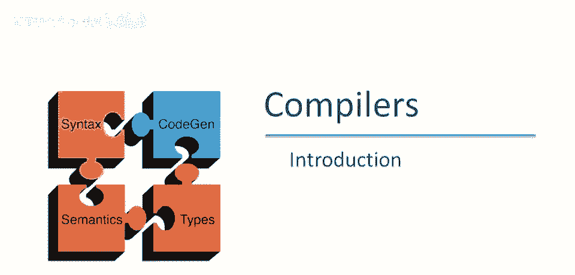
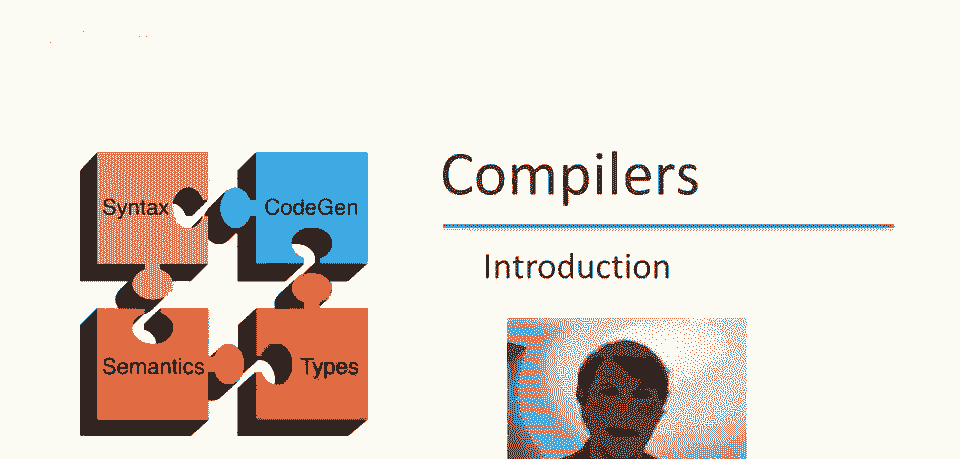
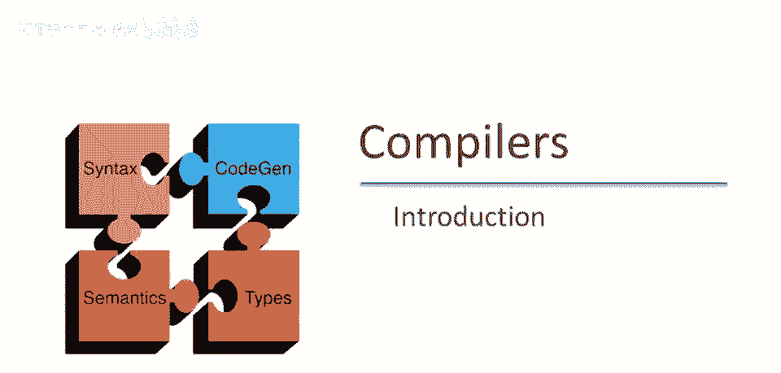
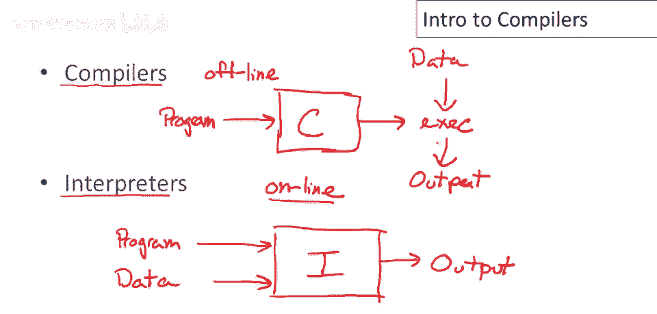
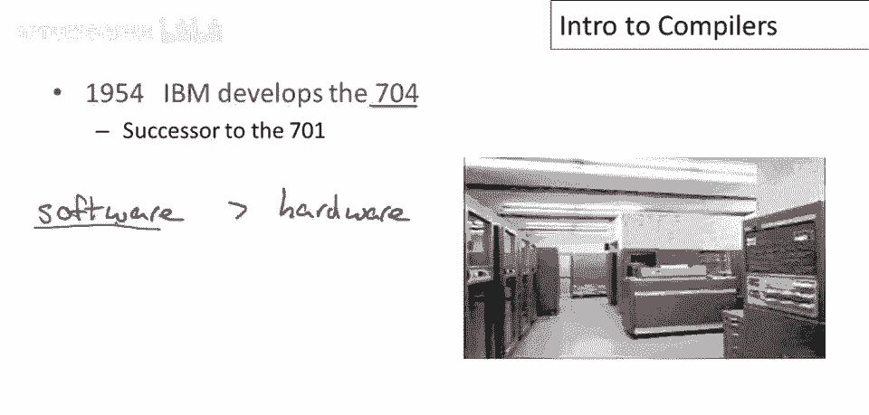
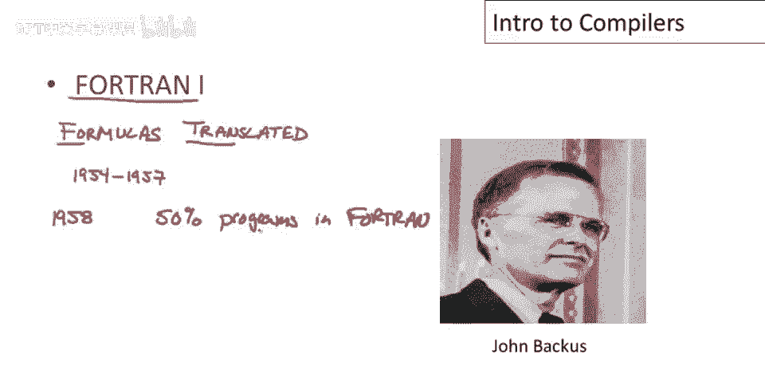
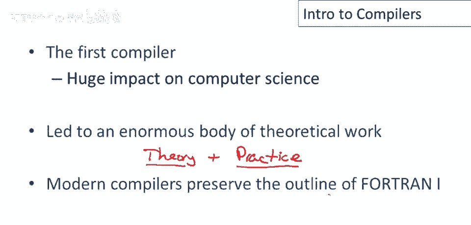
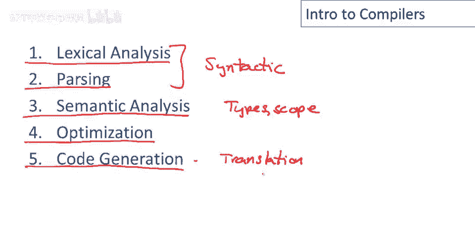

# 编译器课程 P1：编译器与解释器概述 🧠

在本节课中，我们将要学习编程语言实现的两种主要方法：编译器和解释器。我们将了解它们的基本概念、历史背景以及现代编译器的主要结构。

---

## 编译器与解释器

实现编程语言有两种主要方法：编译器和解释器。这门课程主要讲解编译器，但在第一节课中，我们需要先了解解释器。

解释器擅长直接执行程序。以下是解释器的工作流程：

1.  **输入**：解释器接收两个输入，一是你编写的**程序**，二是程序运行所需的**数据**。
2.  **处理**：解释器直接读取程序代码并处理输入数据。
3.  **输出**：解释器直接产生程序的运行结果。

这意味着解释器在执行前**不**对程序进行预处理。程序编写完成后，可以立即通过解释器处理数据并开始运行。因此，解释器可以被视为**实时**的，其核心工作是运行程序。

编译器则采用不同的结构。以下是编译器的工作流程：

1.  **输入**：编译器仅以**程序**作为输入。
2.  **处理**：编译器对程序进行预处理（编译），生成一个**可执行文件**。这个文件可能是汇编语言、字节码或其他形式的机器可执行代码。
3.  **输出**：生成的可执行文件可以独立运行。当需要计算结果时，只需将**数据**输入给这个可执行文件，它就会产生输出。

在这种结构中，编译器是**离线**工作的。它是一个预处理步骤，生成的可执行文件可以在不同的输入数据上反复运行，而无需重新编译程序。

---

## 历史背景：从解释器到编译器

了解编译器和解释器的早期发展有助于理解它们的设计初衷。故事始于20世纪50年代的IBM 704计算机。

IBM 704是当时首台取得商业成功的机器。客户开始使用后发现，**软件成本**远远超过了硬件成本。这在当时是一个重大问题，因为硬件本身已经极其昂贵。软件成为了充分利用计算机的主要成本，这促使人们思考如何提高编程生产力。

最早的尝试之一是1953年由约翰·巴库斯开发的“快速编码”（Speedcoding），它可以被视为早期解释器的例子。

和所有解释器一样，它有优缺点：
*   **优点**：程序开发速度快，程序员效率高。
*   **缺点**：解释执行的程序比手写或编译的程序慢10到20倍。此外，解释器本身占用了300字节内存，这在当时是IBM 704整个内存的30%，空间占用成为一大关注点。

“快速编码”并未流行，但约翰·巴库斯认为其理念有前途。当时最重要的应用是科学计算，程序员需要以机器可执行的形式书写公式。巴库斯认为，如果先将公式翻译成机器可直接执行的形式，代码运行会更快，同时仍允许程序员进行高级编程。

于是，“公式翻译”项目，即**FORTRAN**项目诞生了。该项目从1954年持续到1957年。到1958年，它取得了巨大成功，超过50%的程序都是用FORTRAN编写的。FORTRAN提高了编程的抽象级别和程序员的生产力，让人们能更好地利用计算机。

---

## FORTRAN的影响与现代编译器结构

FORTRAN I是第一个成功的高级编程语言，对计算机科学产生了深远影响。它促进了大量理论工作，并展示了在编程语言领域，扎实的理论与工程技能相结合的重要性。

FORTRAN的影响不仅限于理论研究，更推动了实用编译器的开发。其影响延续至今，现代编译器通常仍保留着由FORTRAN确立的四个核心阶段（在原始描述中为五个，常合并为四个）。

上一节我们介绍了FORTRAN的历史地位，本节中我们来看看它的具体结构。FORTRAN I编译器主要由五个阶段组成：

1.  **词法分析**：将源代码字符流转换为有意义的词法单元序列。
2.  **语法分析**：根据语法规则，将词法单元序列构建成语法树。
3.  **语义分析**：检查程序的语义正确性，如类型匹配、作用域规则等。
4.  **优化**：对程序进行一系列转换，以提高运行速度或减少内存使用。
5.  **代码生成**：将优化后的中间表示翻译成目标语言。根据目标不同，可能是机器码、虚拟机字节码，甚至是另一种高级编程语言。

这五个阶段共同构成了经典编译器的流水线。

---

## 总结

本节课中我们一起学习了编程语言实现的两种核心方法。我们了解到解释器是**实时**执行程序的工具，而编译器则是**离线**将程序翻译成可执行文件的工具。我们从历史角度回顾了从“快速编码”解释器到FORTRAN编译器的演进，理解了提高编程生产力的需求如何驱动了技术的发展。最后，我们学习了由FORTRAN确立的、至今仍被现代编译器广泛采用的经典多阶段结构，包括词法分析、语法分析、语义分析、优化和代码生成。