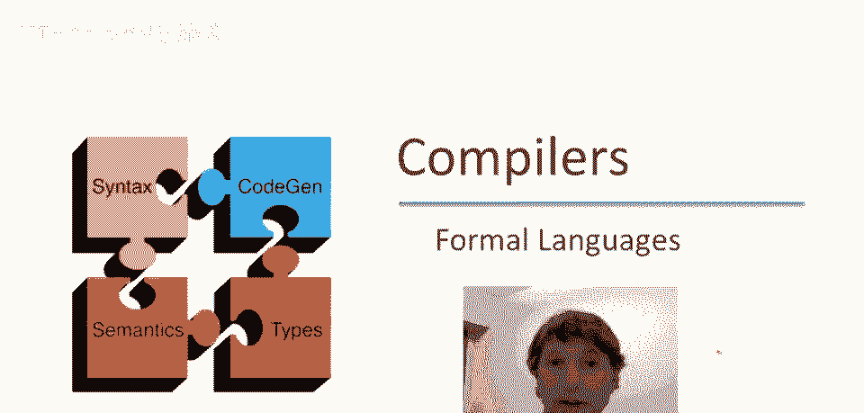
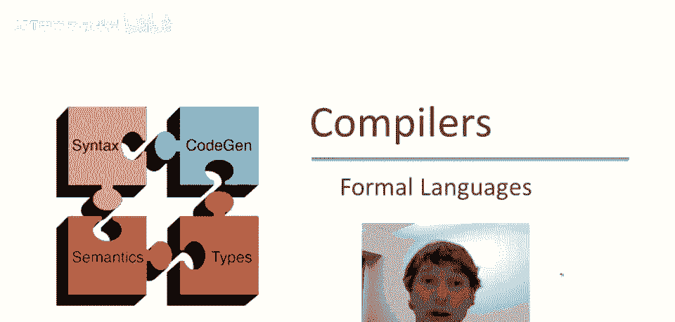
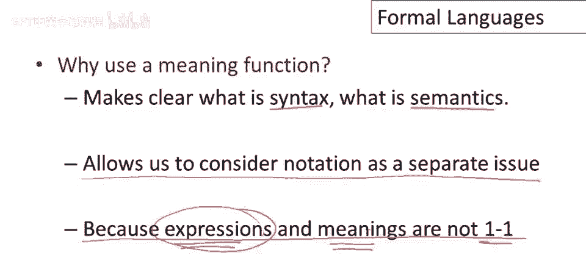

# P10：p10 03-04-_Formal_Languages - 加加zero - BV1Mb42177J7

欢迎回到本视频，我们将稍作偏离，讨论形式语言，形式语言在理论计算机科学中扮演重要角色，但在编译器中也同样重要，因为在编译器内部，我们通常操纵几种不同的形式语言。

我们的正则表达式是一个形式语言的示例，但实际上有帮助，我认为，在理解正则语言以及稍后看到的所有形式语言时。

让我们从定义开始，正式语言有一个字母表，所以一些字母集sigma，然后，该字母表上的语言只是从字母表中抽取字符的字符串集，在正规语言的情况下，我们有某些构建字符字符串集的方法。

但其他类型的语言会有不同的字符串集，一般来说，正式语言就是某个字母表上的任何字符串集。

你熟悉的语言的一个例子，是来自英语字符字母表的表格，这些是英语句子集合，这不是一个正式语言，因为我们可能对哪些，英语字符序列是，实际上有效的英语句子有分歧，但我们可以想象定义一些规则。

说某些字符串是英语句子，其他的不是，如果我们能达成一致，这将是一个完全正式的语言，更严格的正式语言如下，我们可以选择ASCII字符集作为字母表，语言为所有有效C程序的集合，这绝对是一个非常明确的语言。

这正是C编译器将接受的输入集，我想在这里强调的对比是，字母表实际上很有趣，不同的正式语言，字母表非常不同，我们无法真正谈论正式语言，或我们感兴趣的字符串集，首先定义字母表。

形式语言的重要概念，通常我们有一个语言中的字符串，我们称之为表达式e，表达式e本身只是语法的一部分，它是一个，某种意义上是程序，或代表我们感兴趣的其他东西，因此我们有一个函数l。

它将语言中的字符串映射到它们的含义，因此，例如，关于正则表达式的情况，嗯，这将是正则表达式，并且将被映射到一个字符串集，该正则表达式表示的正规语言，我们上次看到了我们为正则表达式写出的意义函数的例子。

所以让我们以正则表达式为例，我将首先写下正则表达式的意义，我上次视频中写下的方式，所以如果你记得我们有正则表达式epsilon，它表示包含仅一个字符串的集合，即空字符串，然后对于字母表中的每个字符c。

我们有一个正则表达式c，它也表示包含仅一个字符串的集合，即单个字符c，然后我们有一堆复合表达式，例如，嗯，A加b，等于集合a和b的并集，然后我们有连接，所以我可以并列a和b。

等于从每个集合中选择一个字符串的笛卡尔积，并将它们连接在一起，最后有迭代，所以我可以写a星，等于对i大于零的所有集合a的i次方的并集，正确，嗯，并且有趣的是这个定义，你可以看到我们正在映射。

在这里我们有表达式，让我在这里换个颜色，在这里我们有表达式，而在这里我们有集合，但这里有些奇怪并且不太正确，因为你可以看到在这里显然我们有一个表达式，我们有一个语法片段a加b，然后不知何故在另一边。

这些a和这个a和这个b神奇地变成了集合，我们正在取并集，同样在这里我们从这个集合中选择一个元素，但这个集合也是一个表达式，那意味着什么，我们以某种方式混淆了集合和表达式，这就是意义函数旨在修复的。

这就是它们旨在澄清的，所以实际上我们想说的是存在某种映射，所以l映射从表达式到字符串集epsilon，所以l将表达式映射到字符串集，因此，我们真正想要说的是l(epsilon)是这个集合，好的。

这是一个映射函数，如果你以前没见过这种表示法，这是描述函数的标准表示法，它只是说l是一个从域内元素到域外元素的函数，好的，同样，这个表达式的语言是这组，这变得非常有用对于复合表达式，因为我们听说我们说。

这个表达式的语言等于a和b语言的并集，现在你可以看到递归了，我们使用l解释a和b，然后取结果并集，好的，所以现在清楚什么是集合，什么是表达式了，类似地，这里a与b连接的语言。

我们将从这两个表达式的语言中选择元素，然后从这两个集合中形成另一个集合，最后对于迭代，a星号的语言等于对a的一堆表达式的意义的并集，a的i次方是一个表达式，这是一段语法。

我们必须将其转换为集合才能取并集，所以现在这是正规表达式意义的正确定义，其中我们明确说明了意义函数l，并且我们确切地展示了如何递归地，应用l，将复合表达式分解为简单的表达式，我们计算其意义。

然后计算集合，呃，从那些，嗯，呃，从那些单独的，呃，较小的集合。

所以使用意义函数有几个原因，呃，我们刚刚看到其中一个，那就是明确，在我们的定义中什么是语法，什么是语义，定义中的一些部分是表达式，而一些部分是，意义或集合，使用l使清楚l的参数是程序或表达式。

结果就是集合，输出是集合，但还有其他几个原因将语法和语义分开，一个是它允许我们将表示法作为一个单独的问题来考虑，也就是说，如果我们有语法和语义是不同的，我们可以改变语法，同时保持语义不变。

我们可能会发现某些语法比其他语法更好，对于我们所感兴趣的问题，或对于我们所感兴趣的语言，另一个分离两者的原因是，因为表达式和含义，因为语法和语义不是一一对应的。

实际上我在之前的视频中用正则表达式说明了这一点，但我想在这里重申，通常有更多表达式，嗯，而不是含义，这意味着可能有多种方式，嗯，写一个表达式。

意味着同样的事情，我想花点时间说明，为什么分离语法和语义对表示法有益，所以每个人都熟悉我们的数字系统，所以我可以写数字，如0、1、42和107，有很好的算法来描述如何添加，和减法和乘法这样的数字。

但也有一些旧式的数字表示法，比如罗马数字，所以我可以有这个数字1，我可以有这个数字4，数字10，比如说数字40，我想是这样写的，和这个数字系统的问题，首先，让我强调一下，这两个有相同的含义。

所以这些语言中的表达式的含义是，是整数，在这个语言中也是完全一样的，所以，这个想法，这些两个系统的含义仅仅是数字，但表示法非常不同，用罗马数字写的数字看起来完全不同，用阿拉伯数字写的数字，事实上。

罗马数字真的很痛苦，来做加法、减法和乘法，事实上，在古代，当这是一个常见系统时，并不十分清楚如何去做，而且很少有人真正擅长用，嗯，用这个系统做算术，因为算法有点复杂，当我们后来转向阿拉伯系统时。

这是一个很大的改进，因为人们，更容易学习如何用这些数字做基本算术，唯一改变的是一种表示系统，因此，表示法非常重要，因为它决定了你如何思考，它决定了你能说的内容，以及你将使用的程序。

所以不要低估符号的重要性，这是分离语法和语义的一个原因，因为我们可以留下我们想要做的想法，数字本身，并尝试不同的表示方式，我们可能会发现某些方式比其他方式更好，我给出的分离语法和语义的第三个原因是。

在许多有趣的语言中，多个表达式，多个语法片段将具有相同的语义，现在回到正则表达式，让我们考虑正则表达式零星，这是所有零字符串的语言，所以任何长度的零字符串，例如，我也可以这样写。

另一种写法是epsilon加零零星，你可以看到，这个表达式是所有零字符串，长度至少为一，我们从epsilon得到空字符串，所以这等于零星，它们只是，你知道，任何这些组合也将构成等效的语言，例如那个等等。

实际上有无数种方式，我可以写这个语言，但所有这些都完全一样，如果你考虑一下，这意味着通常，如果我以不同的方式绘制这两个域，我在这里考虑不同的表达式和不同的明确含义，映射它们之间的函数l。

函数l是多对一的，所以你知道，这个空间中有一些点，许多不同的表达式或语法片段映射到相同的含义，这是有趣形式语言的一般特征，这在编译器中实际上非常重要，因为这就是优化的基础。

有许多不同的程序实际上功能等效，这就是我们可以用运行速度更快的程序替换另一个程序的原因，这就是我们可以用另一个程序替换一个程序的原因，如果它运行得更快并且做完全相同的事情，所以我们不能做优化，你知道。

我们能够进行优化的原因正是意义函数是多对一的，意义是多对一的，记住这里的重要一点是它永远不会是一对多，我们不想要相反的情况，若情况相反，若我能将一点映射到两个不同含义，嗯，首先，这不再是一个函数。

并且意味着某些表达的含义，比如我们编程语言中的，并不明确，当你编写程序时，实际上含义模糊，它意味着这个或那个，这不是我们喜欢的状况，因此我们期望意义函数对于非平凡语言是多对一的，我们不想它们成为一对多。

今天视频结束，下次我们将继续讨论词法分析。

