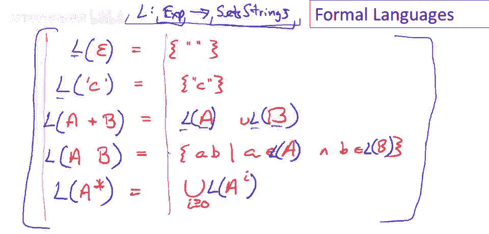

# 课程 P10：形式语言基础 📚

在本节课中，我们将学习形式语言的基本概念。形式语言在理论计算机科学和编译器设计中都扮演着重要角色。我们将了解其定义、核心组成部分，并学习如何通过“意义函数”将语法与语义分离。

---

## 定义与基本概念 🔤

上一节我们介绍了课程主题，本节中我们来看看形式语言的具体定义。

形式语言包含一个**字母表**，即一个字符集合，记作 **Σ**。该字母表上的**语言**，就是由这些字符构成的字符串的集合。对于正则语言，我们有特定的规则来构建这些字符串集合。但总的来说，形式语言就是某个字母表上的任意字符串集合。

---

## 形式语言的例子 📝

以下是几个形式语言的例子，帮助我们理解这个概念：

*   **英语句子**：以英文字母为字母表，所有有效英语句子的集合。这不是一个严格的形式语言，因为对“有效句子”的定义可能存在分歧。
*   **C程序**：以ASCII字符集为字母表，所有有效C程序的集合。这是一个非常明确的形式语言，也是C编译器接受的输入集合。

这里需要强调的是，在讨论形式语言或我们感兴趣的字符串集合之前，必须首先明确定义其字母表。

---

## 语法与语义：意义函数 🧠

形式语言中的一个重要概念是“意义函数”。我们通常将语言中的一个字符串称为**表达式 e**，它代表一段程序或我们感兴趣的其他事物。意义函数 **l** 的作用，就是将语言中的字符串（表达式）映射到它们的**含义**。

以正则表达式为例，其意义函数 **l** 将一个正则表达式映射到它所表示的正则语言（一个字符串集合）。以下是其递归定义：

*   **l(ε) = {“”}**：空表达式 ε 表示仅包含空字符串的集合。
*   **l(c) = {“c”}**：对于字母表中的每个字符 c，表达式 c 表示仅包含该单个字符的集合。
*   **并集**：**l(a + b) = l(a) ∪ l(b)**。表达式 `a + b` 的含义是 `a` 的含义与 `b` 的含义的并集。
*   **连接**：**l(ab) = { xy | x ∈ l(a), y ∈ l(b) }**。表达式 `ab` 的含义是从 `a` 的含义和 `b` 的含义中各取一个字符串连接后构成的新集合。
*   **迭代**：**l(a*) = ∪_{i≥0} l(a^i)**。表达式 `a*` 的含义是 `a` 的含义进行零次或多次连接后所有结果的并集。

这个定义清晰地展示了如何递归地应用意义函数 **l**，将复合表达式分解为简单表达式，计算其含义，最终得到字符串集合。

---

## 分离语法与语义的好处 ✨

使用意义函数将语法（表达式）和语义（含义）分开，有几个重要原因：

1.  **明确性**：它清晰地划分了定义中的语法部分和语义部分，避免混淆。
2.  **表示法的灵活性**：语法和语义分离后，我们可以在不改变语义的前提下，改变语法（表示法）。不同的表示法可能更适合解决特定问题。
3.  **多对一映射**：在有趣的语言中，通常存在多个不同的表达式具有完全相同的语义（即 **l** 是多对一的函数）。这是编译器进行优化的理论基础——我们可以用一个功能等效但效率更高的程序替换另一个程序。

需要强调的是，我们绝不希望意义函数是“一对多”的，那将导致表达式含义模糊，这不是我们期望的状况。

---

## 表示法的重要性：一个例子 🔢

让我们通过一个例子来说明分离语法和语义对表示法的益处。

考虑两种数字系统：阿拉伯数字（如 0, 1, 42）和罗马数字（如 I, IV, XL）。这两种系统的**语义**（即它们表示的数字，如整数）是完全相同的。然而，它们的**语法**（表示法）却截然不同。

使用阿拉伯数字进行加、减、乘、除运算的算法相对简单直观。而使用罗马数字进行同类运算则复杂得多。这个例子表明，表示法（语法）的选择至关重要，它影响着我们思考问题的方式和执行操作的程序。分离语法和语义允许我们专注于核心思想（语义），并尝试寻找更优的表示方式。

---

## 总结 📖

本节课中我们一起学习了形式语言的基础知识。我们首先了解了形式语言由字母表和字符串集合定义。然后，我们引入了**意义函数 l** 的核心概念，它明确地将语法（表达式）映射到语义（含义），并以正则表达式为例展示了其递归定义。最后，我们探讨了将语法与语义分离的三个主要好处：**明确性**、**表示法的灵活性**，以及为实现**编译器优化**奠定基础的**多对一映射**特性。理解这些概念是深入学习编译器和形式语言理论的重要一步。