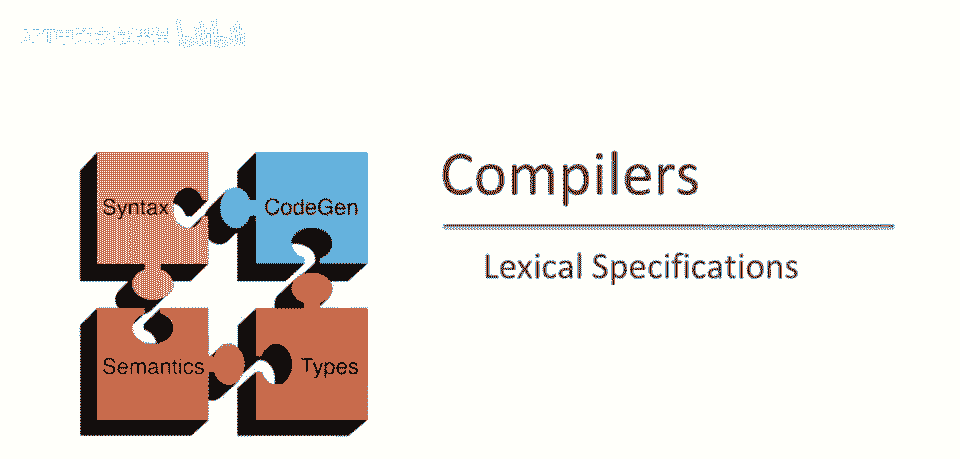
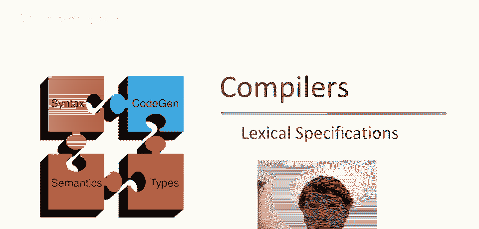
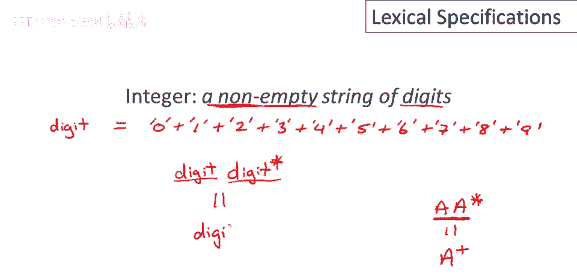
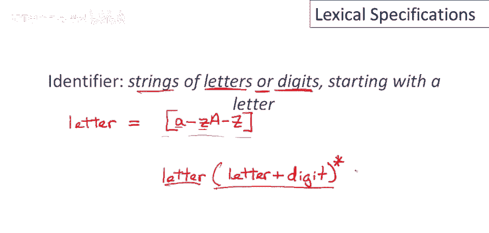
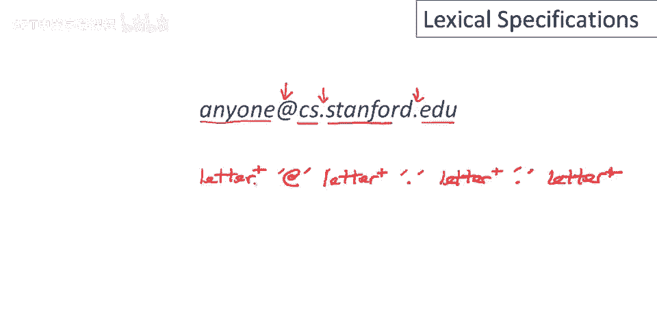
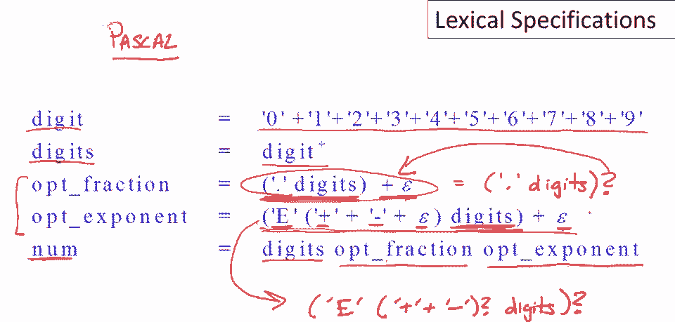
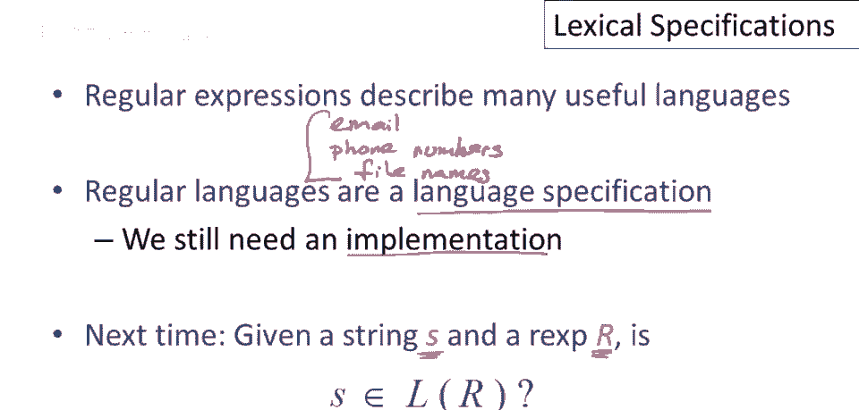

# 课程 P11：词法规范与正则表达式 🧩

在本节课中，我们将学习如何使用正则表达式来精确地描述编程语言中的各种词法元素，例如关键字、整数和标识符。我们将通过具体的例子，一步步构建这些规范，并了解一些简化书写的常用技巧。

## 1. 指定关键字 🔑

上一节我们介绍了正则表达式的基本概念，本节中我们来看看如何用它来描述编程语言中的关键字。这是一个相对简单的案例，我们将仅对三个关键字（`if`、`else`、`then`）进行操作。为更多关键字编写正则表达式的方法与此类似。

以下是定义这三个关键字正则表达式的步骤：
*   为 `if` 编写正则表达式，即字符 `i` 的正则表达式后跟字符 `f` 的正则表达式，这是这两个正则表达式的连接。
*   将上述结果与 `else` 的正则表达式进行联合（Union）。`else` 由4个单独字符组成，因此需要写出这4个字符的连接。
*   最后，再与 `then` 的正则表达式联合。

直接书写单个字符的连接会显得冗长。实际上，有一种常用的简写：若要编写一个字符序列的正则表达式，只需在序列的最外层字符周围放置引号。例如，`"if"` 完全等同于 `i` 和 `f` 的连接。类似地，可以写出 `"else"` 和 `"then"`。因此，这三个关键字的完整正则表达式可以简洁地写为：`"if" | "else" | "then"`。

## 2. 定义整数 🔢

现在我们已经学会了如何描述固定的关键字，本节中我们来看看如何描述可变的模式，例如整数。我们希望整数是数字的非空字符串。

首先，我们需要定义“数字”是什么。数字是0到9中的任何一个单个字符。我们可以通过这10个单个字符正则表达式的并集来定义它：`0 | 1 | 2 | 3 | 4 | 5 | 6 | 7 | 8 | 9`。

这是一个非常常见的需求，因此大多数工具都支持为这个正则表达式命名，例如将其命名为 **`digit`**。

接下来，我们需要描述“多个数字”。我们知道可以使用克林星号（`*`）来表示“零个或多个”，即 `digit*`。但这包含了空字符串，而整数不能为空。一个简单的解决方法是要求整个序列必须以一个数字开始，然后后面跟着零个或多个附加数字，即 `digit digit*`。

这种“至少出现一次”的模式非常常见，因此有一个专门的简写：加号（`+`）。`a+` 是 `a a*` 的简写。因此，整数的正则表达式可以简化为：**`digit+`**。

## 3. 定义标识符 🏷️

定义了整数之后，让我们思考一个更复杂的例子：如何定义标识符。标识符通常是以字母开头的，由字母或数字组成的字符串。

我们已经知道如何定义数字（`digit`）。现在我们需要定义“字母”。直接写出所有大小写字母的并集（`a | b | c | ... | z | A | B | ... | Z`）非常繁琐。

工具通常支持一种称为“字符范围”的简写。在方括号内，可以用横线连接起始字符和结束字符，表示从第一个字符到第二个字符（包含）的所有单字符的并集。例如：
*   `[a-z]` 表示所有小写字母。
*   `[A-Z]` 表示所有大写字母。
*   可以将它们合并为 `[a-zA-Z]` 来表示所有字母。我们可以将其命名为 **`letter`**。

现在我们可以写出标识符的定义：它必须以一个字母开头，之后可以是零个或多个字母或数字。因此，标识符的正则表达式为：**`letter (letter | digit)*`**。

## 4. 处理空白字符 ␣

在完整的词法规范中，我们还需要处理那些我们不感兴趣的部分，例如空格、换行符和制表符，以便识别并丢弃它们。

空格字符（`‘ ‘`）可以直接写出。但换行符和制表符没有很好的打印表示。工具通常通过“转义序列”来命名这些不可打印的字符，即以反斜杠（`\`）开头后跟特定字符。常见的有：
*   `\n` 表示换行符（Newline）。
*   `\t` 表示制表符（Tab）。

因此，空白字符（whitespace）可以定义为空格、换行符或制表符中的任意一个。我们需要一个非空的空白序列，所以使用加号（`+`）。完整的正则表达式为：**`(‘ ‘ | \n | \t)+`**。

## 5. 正则表达式的其他应用示例：电子邮件地址 📧

让我们暂停讨论编程语言，看看正则表达式在另一个领域的应用：电子邮件地址。实际上，电子邮件地址的格式可以用正则表达式来描述。

为了简化，我们假设用户名和域名各部分仅由字母组成。那么一个电子邮件地址可以看作是由 `@` 和 `.` 分隔的四个非空字母序列。
*   用户名：`letter+`
*   `@` 符号
*   域名第一部分：`letter+`
*   第一个点：`.`
*   域名第二部分：`letter+`
*   第二个点：`.`
*   域名第三部分：`letter+`

因此，一个简化的电子邮件地址正则表达式可以是：**`letter+ ‘@’ letter+ ‘.’ letter+ ‘.’ letter+`**。实际的电子邮件地址规则更复杂，但可以用更复杂的正则表达式写出。

## 6. 真实语言规范片段：Pascal 中的数字 ✨

最后，我们来看一个真实编程语言（Pascal）的词法规范片段，它定义了数字（包括整数和浮点数）。这个定义展示了如何处理可选部分。

数字的整体定义是：一串数字，后面可能跟着一个可选的小数部分，再后面可能跟着一个可选的指数部分。

让我们自下而上地分析：
*   **`digit`**：单个数字，定义为 `0 | 1 | ... | 9`。
*   **`digits`**：非空数字序列，即 `digit+`。
*   **可选小数部分**：它要么是一个小数点后跟一串数字（`‘.’ digits`），要么完全不存在（用 `ε` 表示空字符串）。因此是 `(‘.’ digits) | ε`。这种“可选”结构非常常见，许多工具提供问号（`?`）作为简写，所以可以写为 **`(‘.’ digits)?`**。
*   **可选指数部分**：它要么是以 `e` 开头，后跟一个可选的符号（`+` 或 `-`），再跟一串数字；要么完全不存在。可选的符号可以写为 `(‘+’ | ‘-’)?`。因此，整个可选指数部分可以写为 **`(‘e’ (‘+’ | ‘-’)? digits)?`**。

将以上组合起来，Pascal 中数字的正则表达式大致为：**`digits (‘.’ digits)? (‘e’ (‘+’ | ‘-’)? digits)?`**。

## 总结 📝

本节课中我们一起学习了如何使用正则表达式来描述编程语言及其他领域中的词法元素。
*   我们学会了为关键字、整数、标识符和空白字符编写正则表达式。
*   我们掌握了实用的简写技巧，如引号表示字符串、`digit` 和 `letter` 的命名、字符范围 `[a-z]`、`+`（至少一次）、`?`（零次或一次）。
*   我们还看到了正则表达式在描述电子邮件地址和真实编程语言（如Pascal数字）规范中的应用。

正则表达式是描述简单字符串集合（正则语言）的强大工具。目前，我们仅将其用作**规范**（Specification），即定义我们感兴趣的字符串集合。在后续课程中，我们将探讨如何**实现**词法分析，即给定一个字符串 `s` 和一个正则表达式 `r`，如何判断 `s` 是否属于 `r` 所定义的语言。