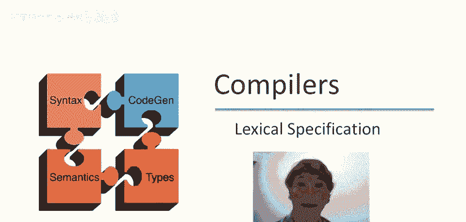
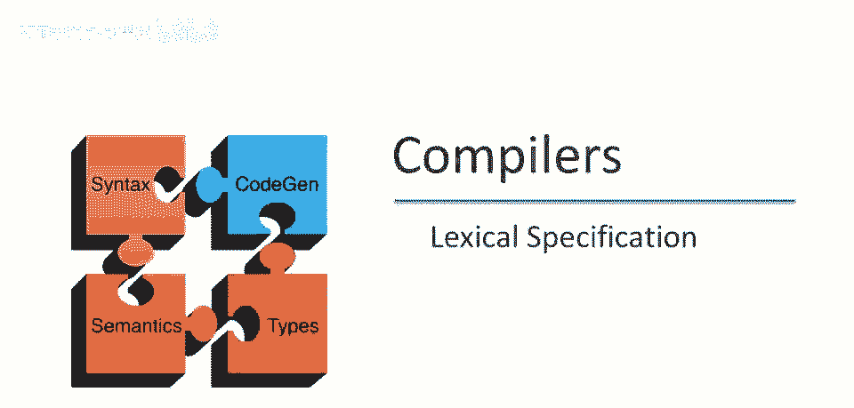
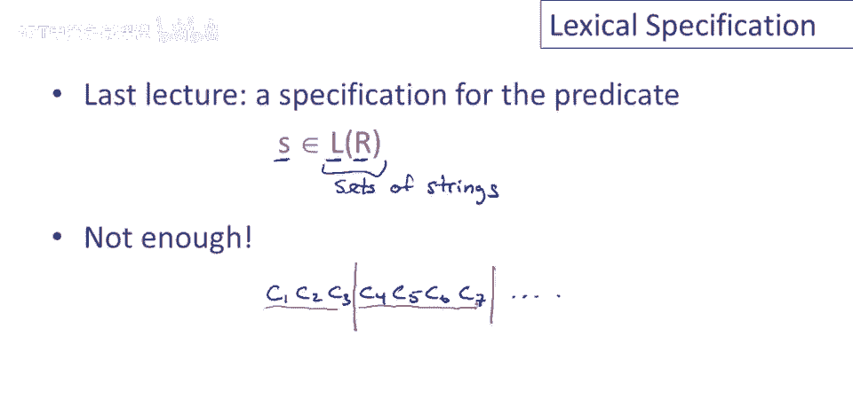
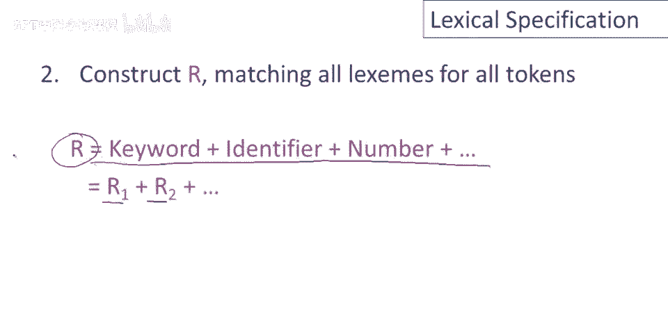
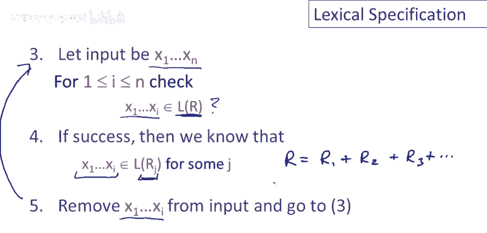
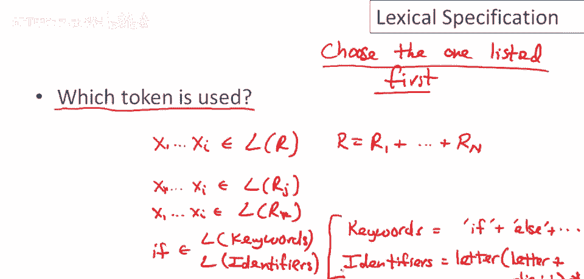
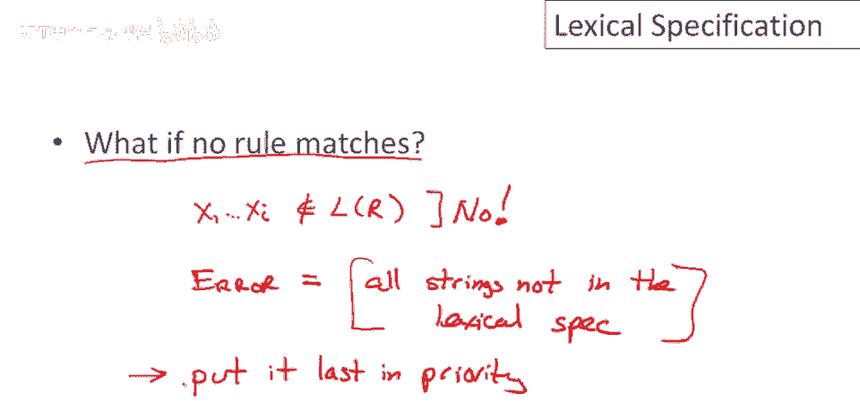
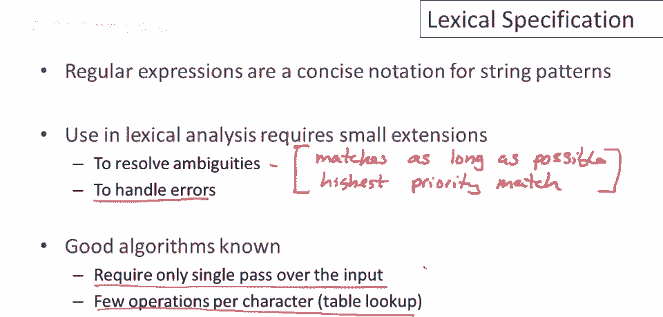

# 课程 P12：使用正则表达式构建词法规范 🧩

在本节课中，我们将学习如何利用正则表达式来构建编程语言的完整词法规范。我们将从回顾正则表达式的基本符号开始，然后探讨如何将这些表达式组合起来，以定义语言的词法规则，并解决词法分析过程中可能遇到的歧义问题。

## 正则表达式符号回顾 📝

上一节我们介绍了正则表达式的基本概念，本节中我们来看看一些常用的简写符号。

以下是正则表达式中常见的简写符号及其含义：

*   `a+`：表示至少一个 `a` 的序列，等价于 `aa*`。
*   `a|b`：表示 `a` 或 `b` 的并集。
*   `a?`：表示可选的 `a`，是 `a+ε` 的缩写。
*   `[a-z]`：表示字符范围，即从 `a` 到 `z` 的所有字符的并集。
*   `[^a-z]`：表示字符范围的补集，即除了 `a` 到 `z` 之外的任何字符。

## 从模式匹配到词法分析 🔍

之前我们讨论的是判断一个字符串 `S` 是否属于某个正则表达式 `R` 定义的语言 `L(R)`。然而，词法分析的目标不仅仅是判断，而是要将一个长的输入字符串（即源代码）分割成一个个有意义的“单词”（即词素）。

因此，我们需要将正则表达式适配到词法分析这个新问题上。

## 构建词法规范的步骤 🏗️

上一节我们介绍了正则表达式的基本符号，本节中我们来看看如何用它们构建词法规范。

构建词法规范主要分为两个步骤。

### 第一步：为每个标记类定义正则表达式

首先，我们需要为语言中的每个词法类别（标记类）编写一个正则表达式。

以下是几个常见标记类的正则表达式示例：

*   **数字**：`digit+`
*   **关键字**：`if`、`else`、`while` 等具体字符串的列表。
*   **标识符**：以字母开头，后跟零个或多个字母或数字的序列，可表示为 `letter (letter|digit)*`。
*   **标点符号**：如左括号 `(`、右括号 `)` 等。

### 第二步：合并为总词法规范

接下来，我们将所有标记类的正则表达式取并集，形成一个巨大的正则表达式 `R`，它代表了整个语言的词法规范。

假设我们有 `k` 个标记类，其正则表达式分别为 `R1, R2, ..., Rk`，那么总词法规范 `R` 可以表示为：
`R = R1 | R2 | ... | Rk`

## 词法分析的核心算法 ⚙️

上一节我们构建了总词法规范，本节中我们来看看如何使用它来分析输入字符串。

核心算法是一个循环过程，输入是一个字符序列 `x1 x2 ... xn`。

以下是算法的基本步骤：

1.  检查输入字符串的当前前缀（从第一个字符开始）是否属于总正则表达式 `R` 的语言。
2.  如果该前缀属于 `L(R)`，则它必定属于某个特定标记类 `Rj` 的语言。这意味着我们识别出了一个有效的词素。
3.  将这个匹配的前缀从输入字符串中移除（“消耗”掉），并输出对应的标记（`token`）。
4.  回到步骤 1，对剩余的输入字符串重复此过程，直到整个输入字符串被处理完毕。

## 处理词法分析中的歧义 🤔

上一节介绍了核心算法，本节中我们来看看算法中存在的几个关键歧义及其解决方案。

### 歧义一：匹配最长前缀（最大贪婪匹配）

问题：当输入的前缀有多个长度不同的有效匹配时，应该选择哪一个？

**规则**：总是选择**最长**的匹配前缀。

**原因**：这符合人类阅读代码的习惯。例如，当我们看到 `==` 时，会将其视为一个“双等号”比较运算符，而不是两个独立的“等号”赋值运算符。

### 歧义二：多个标记类匹配（优先级）

问题：当同一个前缀同时属于多个不同标记类（例如，既是关键字又是标识符）的语言时，应该选择哪个标记类？

**规则**：为标记类定义**优先级**。当发生冲突时，选择优先级最高的标记类。

**实现**：通常通过在词法规范文件中**排列标记类正则表达式的顺序**来实现。列表中靠前的规则具有更高的优先级。因此，通常将关键字规则放在标识符规则之前。

### 歧义三：无规则匹配（错误处理）

问题：如果输入的前缀不属于任何已定义的标记类语言，该如何处理？

**解决方案**：定义一个特殊的“错误”标记类，其正则表达式匹配所有无效的输入字符串（例如，包含非法字符的序列）。将这个错误规则放在词法规范列表的**最后**，并赋予其**最低的优先级**。

这样，只有当没有任何有效规则匹配时，才会匹配到这个错误规则，从而可以报告词法错误并提供有用的错误信息（如错误位置）。

## 总结与展望 📚

本节课中我们一起学习了如何使用正则表达式构建编程语言的词法规范。我们回顾了正则表达式的符号，定义了为每个标记类编写正则表达式的方法，并将它们合并为总词法规范。我们详细探讨了词法分析的核心算法，并解决了其中三个关键的歧义问题：通过**最长匹配**原则确定词素边界，通过**优先级**规则解决标记类冲突，以及通过定义**错误规则**来优雅地处理无效输入。

最后需要提醒的是，在具体实现词法分析器时，规则的定义顺序和编写方式需要仔细考量，以确保获得预期的行为。此外，虽然我们讨论了算法逻辑，但存在高效的一次扫描算法（如基于有限自动机的方法）来实现这一切，这将是未来课程的主题。