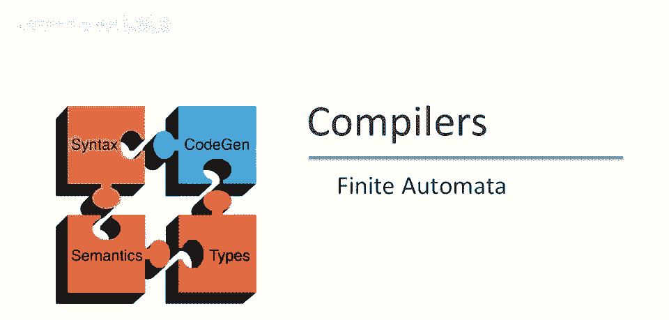
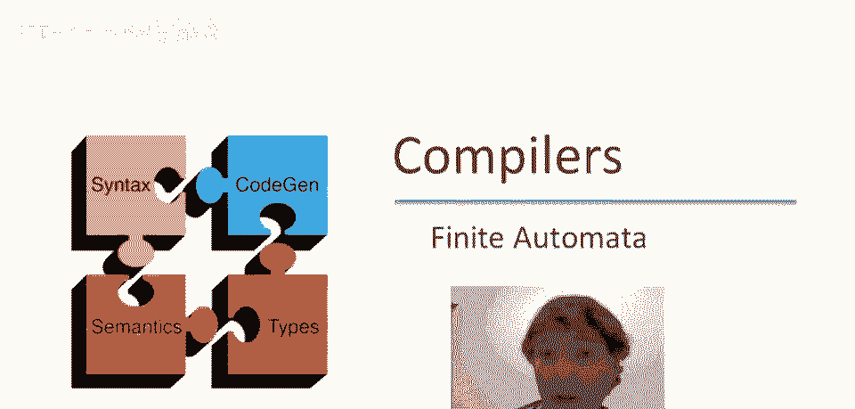
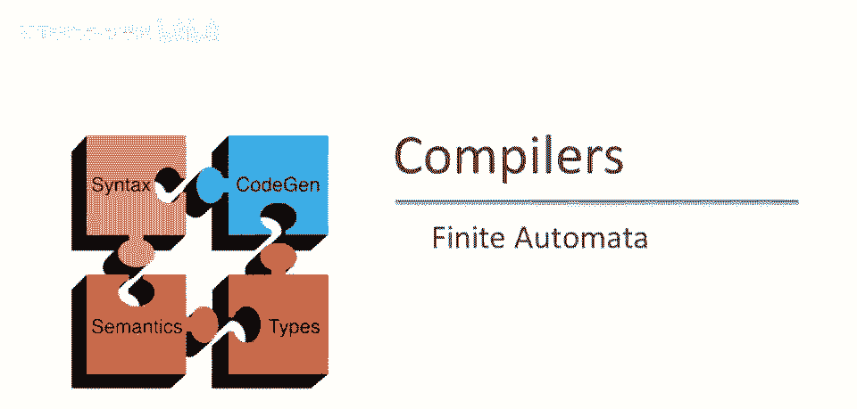
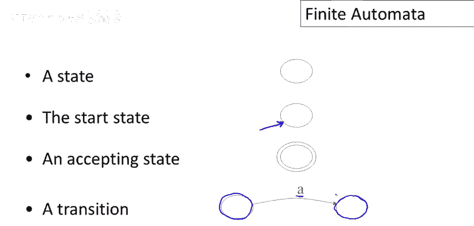
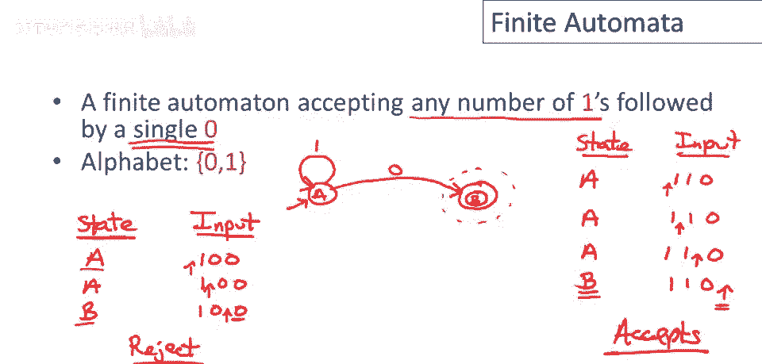
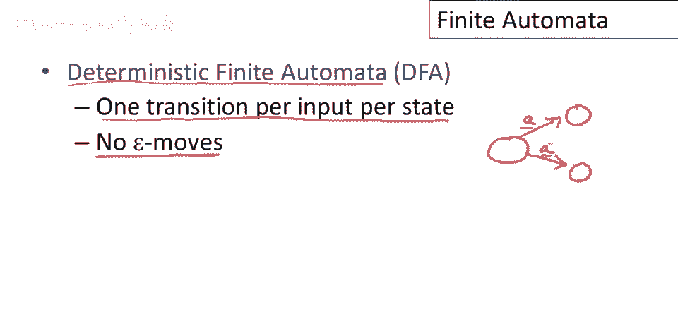
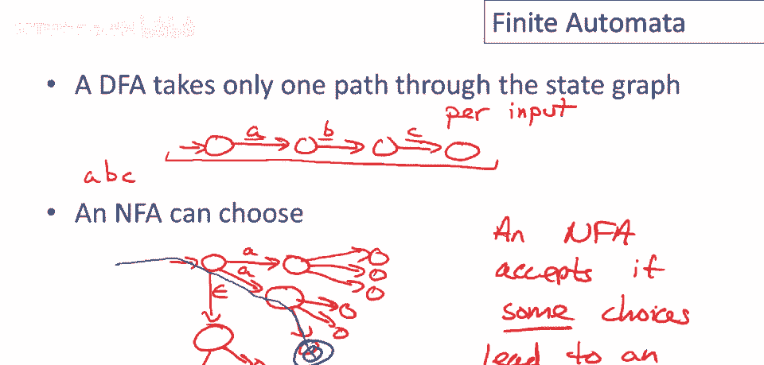

# 课程 P13：有限自动机 🧠

在本节课中，我们将学习有限自动机。它是一种用于实现正则表达式的计算模型，也是词法分析器的核心组成部分。我们将从基本概念开始，逐步理解其工作原理、不同类型以及它们与正则表达式的关系。

---

## 概述 📋

上一节我们介绍了正则表达式，它是一种用于描述词法单元模式的规范语言。本节中，我们将探讨有限自动机，它是将正则表达式转化为可执行程序的理想实现模型。有限自动机与正则表达式在表达能力上是等价的，它们描述的语言集合被称为正则语言。

---

## 什么是有限自动机？ 🤖

有限自动机是一种抽象的计算模型，用于识别字符串是否属于某种特定模式（即语言）。它由以下几个核心部分组成：

*   **输入字母表 (Σ)**：一个有限的字符集合，是自动机可以读取的所有可能输入。
*   **有限状态集 (Q)**：自动机在运行过程中可能处于的所有状态的集合。状态的有限性是“有限”自动机的关键。
*   **起始状态 (q₀ ∈ Q)**：自动机开始运行时所处的状态。
*   **接受状态/最终状态集 (F ⊆ Q)**：如果自动机在读取完整个输入后处于这些状态之一，则它“接受”该输入字符串。
*   **状态转换函数 (δ)**：定义了自动机如何根据当前状态和当前输入字符改变状态。形式化地，它是一个映射：`δ: Q × Σ → Q`（对于确定性自动机）。

### 工作原理

自动机从**起始状态**开始，逐个读取输入字符串中的字符。每读一个字符，它就根据**转换函数**从当前状态转移到下一个状态。当所有输入字符都被消耗后：
*   如果自动机停在**接受状态**，则它**接受**这个字符串。
*   如果自动机停在**非接受状态**，或者在中途因没有对应的转换而“卡住”，则它**拒绝**这个字符串。

有限自动机**接受的所有字符串的集合**，称为该自动机的**语言**。

---

## 图形化表示 🎨

有限自动机通常用状态图来表示，这比纯数学定义更直观。

以下是图形化表示的规则：
*   **状态**：用圆圈表示。
*   **起始状态**：用一个不来自任何其他节点的箭头指向该状态。
*   **接受状态**：用双圆圈表示。
*   **转换**：用带标签的有向边表示。例如，从状态 `A` 到状态 `B` 且标签为 `‘a’` 的边表示：`如果在状态A读到字符‘a’，则转移到状态B`。

---

## 示例解析 🔍

### 示例1：识别单个数字 ‘1’

让我们构建一个只接受字符串 `“1”` 的自动机。

**状态设计**：
*   状态 `A`：起始状态。
*   状态 `B`：接受状态。

**转换规则**：
*   在状态 `A`，读取 `‘1’`，转移到状态 `B`。

**执行过程**：
*   输入 `“1”`：`A -(1)→ B`。输入结束，处于接受状态 `B`，**接受**。
*   输入 `“0”`：在状态 `A` 没有关于 `‘0’` 的转换，机器**卡住**，**拒绝**。
*   输入 `“10”`：`A -(1)→ B`。在状态 `B` 读取 `‘0’`，没有对应转换，**拒绝**。

这个自动机的语言是：`{ “1” }`。

### 示例2：识别任意个 ‘1’ 后跟单个 ‘0’

现在构建一个接受零个或多个 `‘1’` 后跟一个 `‘0’` 的自动机（即正则表达式 `1*0`）。

**状态设计**：
*   状态 `A`：起始状态。
*   状态 `B`：接受状态。

**转换规则**：
*   在状态 `A`，读取 `‘1’`，**自循环**回到状态 `A`（用于消耗任意数量的 `‘1’`）。
*   在状态 `A`，读取 `‘0’`，转移到接受状态 `B`。

**执行过程**：
*   输入 `“110”`：`A -(1)→ A -(1)→ A -(0)→ B`。接受。
*   输入 `“100”`：`A -(1)→ A -(0)→ B`。在状态 `B` 读取第二个 `‘0’`，没有转换，拒绝。

这个自动机的语言是：`{ “0”, “10”, “110”, “1110”, … }`。

---

## 确定性与非确定性自动机 ⚖️

上一节我们看到的自动机都是确定性的。本节中我们来看看更灵活的非确定性自动机。

### 确定性有限自动机 (DFA)

DFA 有两个严格限制：
1.  **没有 ε 移动**：每次转换必须消耗一个输入字符。
2.  **转换是确定的**：对于任意状态和输入字符，**有且只有一条**出边。即函数 `δ(q, a)` 的结果是唯一的。

在 DFA 中，对于给定的输入字符串，通过状态图的路径是**唯一确定**的。

### 非确定性有限自动机 (NFA)

NFA 放松了 DFA 的限制：
1.  **允许 ε 移动**：可以不消耗任何输入字符就改变状态。这是一种“免费”的跳转。
2.  **允许非确定性转换**：在同一个状态下，对于同一个输入字符，可以有多条出边指向不同的状态。

NFA 在运行时可以“选择”走哪条路径。关于 NFA 的**接受规则**是：只要**存在至少一条**选择路径，使得在消耗完所有输入后，自动机处于某个**接受状态**，那么整个输入就被接受。

**ε 移动的威力**：实际上，任何“在同一输入下有多条出边”的非确定性，都可以通过引入额外的状态和 ε 移动来模拟。因此，NFA 和带有 ε 移动的 NFA (ε-NFA) 在能力上是等价的。

---

## NFA 的执行与状态集 📊

由于 NFA 在运行时可能处于多个潜在状态，我们通常用**状态集合**来跟踪它的所有可能性。

**执行步骤**：
1.  起始时，当前可能状态集为 `{起始状态}`，并考虑所有从起始状态出发的 **ε 移动**所能到达的状态（即 ε-闭包）。
2.  每读取一个输入字符 `a`，对于当前可能状态集中的**每一个状态** `q`，找出所有从 `q` 出发、标签为 `a` 的转换所能到达的状态，并将这些新状态加入下一个状态集。然后，再次计算这个新集合的 ε-闭包。
3.  重复步骤2，直到输入结束。
4.  检查最终的可能状态集中是否**包含至少一个接受状态**。如果是，则 NFA 接受该输入；否则拒绝。

**示例**：考虑一个简单的 NFA，从起始状态 `A` 读 `‘0’` 可以到 `A` 或 `B`。
*   输入 `“0”`：最终状态集可能是 `{A, B}`。如果 `B` 是接受状态，则接受。
*   输入 `“00”`：从 `{A, B}` 出发，读第二个 `‘0’`，可能到达的状态更多。只要最终集合中包含接受状态，即接受。

---

## DFA 与 NFA 的等价性与权衡 ⚡

一个重要的理论结果是：**DFA、NFA 和 ε-NFA 在表达能力上是完全等价的**，它们识别的都是正则语言。也就是说，任何用 NFA 描述的语言，都存在一个 DFA 可以描述同样的语言，反之亦然。

然而，它们在实践中有不同的权衡：

*   **DFA 的优点**：**执行速度快**。对于任何输入，只需沿着唯一确定的路径走，无需跟踪多个选择。
*   **NFA 的优点**：**描述更简洁**。描述同一个语言，NFA 所需的状态数可能比 DFA **少得多**（指数级差距）。NFA 更易于直接从正则表达式构造。

因此，在编译器中，常见的做法是：先用 NFA（或直接由正则表达式构造）来表示词法规则，因为其构造简单、体积小；然后再通过算法（如子集构造法）将 NFA 转换为等价的 DFA，用于最终高效的词法分析扫描。

---

## 总结 🎯

本节课中我们一起学习了有限自动机。我们从基本定义和图形化表示入手，理解了 DFA 如何确定性地识别字符串。接着，我们引入了更强大的 NFA，它通过允许 ε 移动和非确定性选择，能够更简洁地描述语言。最后，我们认识到尽管 DFA 和 NFA 形式不同，但能力等价，在实际编译器构造中，我们往往结合两者的优点：用 NFA 设计，用 DFA 执行。

掌握有限自动机是理解词法分析器如何工作的关键一步。在接下来的课程中，我们将看到如何将正则表达式自动转换为 NFA，以及如何将 NFA 转换为可高效执行的 DFA。