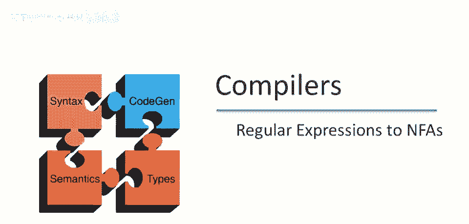
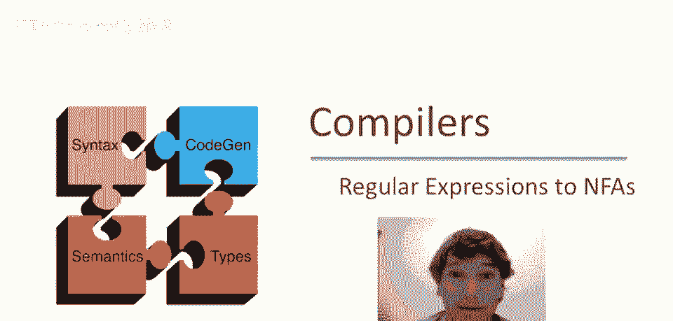
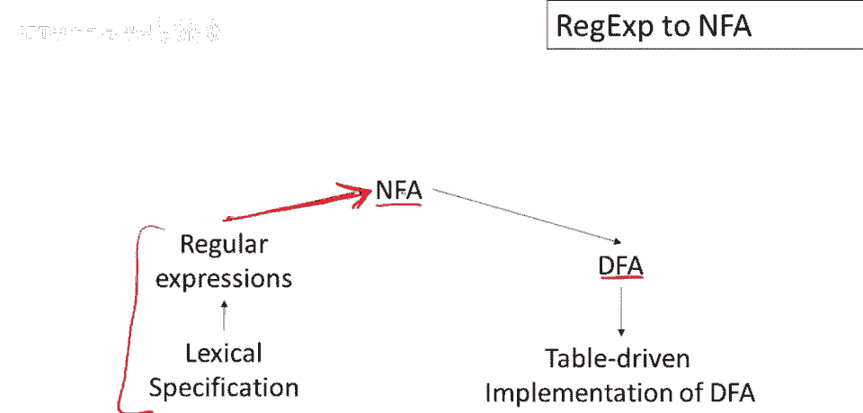
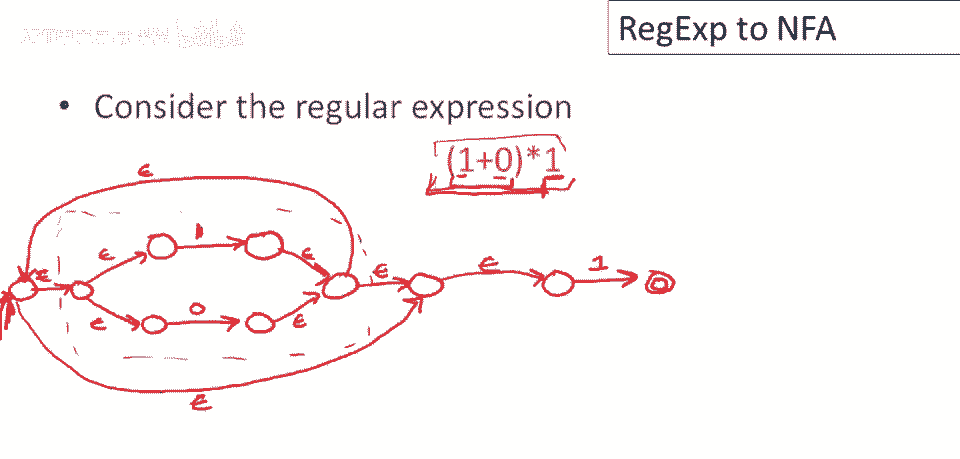

# 课程 P14：正则表达式到非确定性有限自动机 (NFA) 的转换 🧩

在本节课中，我们将学习如何将一个正则表达式转换为一个等价的非确定性有限自动机。这是实现词法分析器的关键步骤之一。



## 概述

要实现一个词法规范，第一步是将其写为一组正则表达式。但这仅仅是规范，我们需要将其转换为一个可以实际执行词法分析的程序。这个过程通常分为三步：
1.  将正则表达式转换为识别相同语言的**非确定性有限自动机**。
2.  将这些 NFA 转换为**确定性有限自动机**。
3.  将 DFA 实现为查找表和遍历代码。

本节课我们将聚焦于第一步：**将正则表达式转换为 NFA**。我们将为每一种正则表达式结构定义其对应的 NFA 构造方法。

## 基础正则表达式的 NFA 构造



首先，我们来看两种最简单的基础正则表达式：空串和单个字符。我们将使用以下符号：箭头 `→` 表示起始状态，双圆圈 `◎` 表示最终状态。在构造中，我们通常只关注机器的起始和最终状态。

### 空正则表达式 (ε)

对于空正则表达式 `ε`，其对应的 NFA 非常简单。它只接受空字符串。

**构造**：创建一个起始状态和一个最终状态，并在它们之间添加一条 **ε 转换**（不消耗任何输入字符的跳转）。

```
起始状态 → (ε) → 最终状态 ◎
```

### 单个字符 (a)

对于单个字符 `a`，其 NFA 只接受该特定字符。

**构造**：创建一个起始状态和一个最终状态，并在它们之间添加一条在字符 `a` 上的转换。

```
起始状态 → (a) → 最终状态 ◎
```

## 复合正则表达式的 NFA 构造

上一节我们介绍了基础正则表达式的构造，本节中我们来看看如何组合这些简单的 NFA 来构建识别更复杂语言的 NFA。我们将处理三种复合操作：连接、并集和迭代。

### 连接 (AB)

假设我们已经有了识别语言 A 的 NFA (M_A) 和识别语言 B 的 NFA (M_B)。要构造识别连接 `AB` 的 NFA，我们需要按顺序运行 M_A 和 M_B。

**构造**：
1.  复合 NFA 的**起始状态**是 M_A 的起始状态。
2.  移除 M_A 最终状态的“最终”标记。
3.  从 M_A 的（原）最终状态添加一条 **ε 转换**到 M_B 的起始状态。
4.  复合 NFA 的**最终状态**是 M_B 的最终状态。

这个构造允许机器先识别属于 A 的部分输入，然后通过 ε 跳转无缝地开始识别属于 B 的剩余部分。

### 并集 (A|B)

要构造识别并集 `A|B`（即属于 A 或属于 B）的 NFA，我们需要让机器能“选择”走哪条路径。

**构造**：
1.  创建一个**新的起始状态**。
2.  从这个新起始状态分别添加 **ε 转换**到 M_A 和 M_B 的起始状态。
3.  从 M_A 和 M_B 的最终状态分别添加 **ε 转换**到一个**新的最终状态**。
4.  M_A 和 M_B 自身的最终状态标记被移除。

机器在开始时通过 ε 转换非确定性地选择进入 M_A 或 M_B 的路径。只要有一条路径能成功到达新的最终状态，输入就被接受。

### 迭代 (A*)

迭代 `A*` 表示 A 中的字符串重复零次或多次。其 NFA 需要支持循环。

**构造**：
1.  创建一个**新的起始状态**和一个**新的最终状态**。
2.  从新起始状态添加一条 **ε 转换**到新最终状态（用于接受空串，即零次重复）。
3.  从新起始状态添加一条 **ε 转换**到 M_A 的起始状态。
4.  从 M_A 的最终状态添加一条 **ε 转换**回到 M_A 的起始状态（实现循环）。
5.  从 M_A 的最终状态添加另一条 **ε 转换**到新的最终状态（用于在完成最后一次重复后退出）。

这样，机器可以选择直接接受空串，或者进入 M_A，执行完成后可以选择循环回去再次执行 M_A，也可以选择跳转到最终状态结束。

## 构造示例

现在，让我们通过一个具体的例子 `(1|0)*1` 来实践上述构造规则。我们将按照正则表达式的结构，自底向上地构建其 NFA。

首先，我们构建最基本的单元：
*   **构造识别 `1` 的 NFA**： `→ (1) → ◎`
*   **构造识别 `0` 的 NFA**： `→ (0) → ◎`

接下来，我们构建复合部分 `(1|0)`：
*   应用**并集构造**。创建一个新起始状态，通过 ε 转换分别指向两个字符 NFA 的起始状态，再将它们的最终状态通过 ε 转换指向一个新的最终状态。

然后，我们构建迭代部分 `(1|0)*`：
*   应用**迭代构造**。为 `(1|0)` 的 NFA 添加一个新的起始状态和新的最终状态。
*   从新起始状态添加 ε 转换到新最终状态（接受空串）。
*   从新起始状态添加 ε 转换到 `(1|0)` NFA 的起始状态。
*   从 `(1|0)` NFA 的最终状态添加 ε 转换回到其自身的起始状态（循环）。
*   从 `(1|0)` NFA 的最终状态添加 ε 转换到新的最终状态。

最后，我们构建整个表达式 `(1|0)*1`：
*   应用**连接构造**。将 `(1|0)*` 的 NFA 与另一个识别 `1` 的 NFA 连接。
*   `(1|0)*` NFA 的最终状态（即上一步的新最终状态）移除最终标记，并添加 ε 转换到识别 `1` 的 NFA 的起始状态。
*   整个复合 NFA 的最终状态就是识别 `1` 的 NFA 的最终状态。

通过以上步骤，我们就得到了识别语言 `(1|0)*1` 的完整 NFA。

## 总结



本节课中我们一起学习了将正则表达式转换为非确定性有限自动机的系统方法。我们首先为**空串**和**单字符**这两个原子单元定义了简单的 NFA。然后，我们学习了三种核心复合操作的构造规则：**连接**、**并集**和**迭代**。最后，我们通过一个例子 `(1|0)*1` 演示了如何综合运用这些规则，自底向上地构建出识别复杂正则表达式的 NFA。这是实现词法分析器的第一步，为后续转换为确定性自动机（DFA）并最终实现为可执行代码奠定了基础。