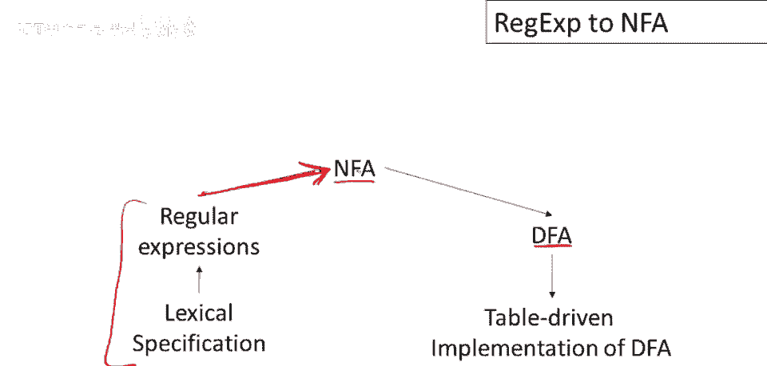

# P14：p14 04-03-_Regular_Expressi - 加加zero - BV1Mb42177J7

欢迎回到本视频，将正则表达式转换为非确定性有限自动机。

开始前，先概述计划，接下来的几段视频，有一个词法规范要实现，第一步是有人将其写为正则表达式集，当然这本身不是实现，只是规范，必须将其翻译为可进行词法分析的程序，实际上分几步，第一步是。

将正则表达式转换为识别相同的非确定性有限自动机，完全相同，然后将这些非确定性自动机转换为确定性自动机，最后将这些确定性自动机实现为查找表，和一些遍历这些表的代码，之前视频中已讨论过，并已定义这些部分。

现在准备整合，本视频将聚焦于此组件，这里，将正则表达式转换为非确定性有限自动机。

计划是对于每种正则表达式，嗯，定义一个等效的，非确定性自动机，该自动机接受与正则表达式语言完全相同的语言，将使用以下符号，为正则表达式定义自动机，通常需要修改，它们的起始状态和最终状态。

箭头表示起始状态，双圆圈表示最终状态，无需太关注机器的整体结构，只要把握起始状态和最终状态，应该说在构建的机器中，嗯，将只有一个最终状态，好的，那么对于空正则表达式，机器是什么，嗯，接受它的呢？

这是一个非常简单的机器，只有起始状态、最终状态和它们之间的空转换，该机器仅接受空字符串，类似地，对于单个字符a，我们可以定义一个单转换状态机来接受该字符，接受该字符的一转换状态机，从起始状态可到终态。

仅当我们读特定字符，好的，所以这是我们的两个，呃，简单，呃正则表达式，现在我们必须，呃，做复合正则表达式，这些稍微复杂些，所以先谈，呃，连接，因为我们将从小正则表达式构建大机器。

可假设已将a和b分别转换成机器，我有a的机器，我有b的机器，现在只需说如何粘贴，这两个机器形成机器，复合机器识别与ab连接相同的语言，这是构造，复合机器的起始状态是a的起始状态，保持a的起始状态不变。

然后修改a的终态，我们使a的终态，不再是终态，这里通过移除a终态的双圆圈完成，并向b的起始状态添加epsilon过渡，那确实做对了，这意味着首先识别输入的一部分属于a的语言，当我们到达，本应是a的终态。

我们可以跳转到b的起始状态而不消耗输入，然后尝试读取剩余的字符串，呃，作为语言的一部分，作为b语言中的字符串，对于并，呃，我们有类似的方法粘贴机器，尽管结构有些不同。

所以这里为复合机器添加一个新起始状态，a加b意味着输入属于a的语言，或属于b的语言，epsilon过渡非常适合捕获这个，因为我们直接从起始状态做出决定，这个字符串属于a的语言，还是属于b的语言。

所以我们做出非确定性选择，然后使用我们选择的自动机读取字符串，如果我们到达最终状态，这两个机器中的任何一个，我们可以进行epsilon转换到复合机的最终状态，现在记得非确定性自动机的接受概念。

你知道他们做出这些猜测，但如果有任何猜测有效，那么我们说它在机器的语言中，所以如果，实际上，字符串是a或b的并集，那么选择a或选择b都会有效，因此机器将接受该字符串，最后是最复杂的情况，嗯。

对于迭代a星，我们有以下构造，这是a的机器，嵌入在这里，我们添加了一个新的开始状态和一个新的最终状态，现在让我们谈谈它是如何工作的，所以有一种可能性是记住epsilon始终是a星语言的一部分。

所以我们有这个转换，我们可以直接从开始状态到最终状态并接受空字符串，所以嗯，这仅仅确保空字符串在语言中，否则我们做什么，否则我们可以进行epsilon转换，到a的开始状态，然后我们可以从a的最终状态。

如果我们到达它，我们可以回到整个机器的开始状态，我们可以这样做任意多次，好的，所以a的迭代围绕这个循环在这里和右边，当我们到达a的最终状态时，我们也可以决定直接进行转换到机器的最终状态。

我们得出结论那是最后一次，因此这台机器识别a语言中的零个或多个字符串，所以现在让我们做一个例子，这是一个正则表达式，我们想要构建一个等效的非确定性机器，以识别相同的语言，我们将遵循我们的构造，嗯。

它通过归纳法在正则表达式的结构上工作，从简单的正则表达式开始，构建到复合的，所以这里我们有什么，所以我们有一个接受1的机器，好的，所以我们需要一个机器，如果它被称为had，接受两个状态，嗯，就这样。

你知道，在数字1上完成了过渡，嗯，同样，一个接受零的机器，好的，现在我们需要将它们组合成一个接受1或0的机器，我们这样做的方法是，嗯，从。中选择，从复合机的起始状态，我们可以移动到接受1的机器。

或接受0的机器，然后在结尾，还有回到复合机终态的epsilon移动，好的，现在我们需要迭代这个，因此需要能够接受0个或多个1或0，我们将整个块粘贴到，我们为迭代设置的图案中，我们如何做到呢，嗯。

我们有新起始和新终点，好的，从起始到新终点有epsilon移动，确保接受空串，然后可迭代内机任意多次，可做epsilon移动到起始，可执行，机器一次，若想再做，可再次进行，好的，能做到，好的。

再循环一次，若已看够，可从最终状态决定，直接进入复合机的最终状态，此机接受语言1+0*，还有更多工作要做，必须接受，嗯，我们需要另一台只接受一个的机器，所以我们又造了一台接受，数字1的机器。

现在我们需要一个来组合这两个东西以连接它们，这非常简单，我们只需要一个epsilon移动，从第一个机器的最终状态到第二个机器的起始状态，然后这些都是最终机器的状态，嗯，我们实际使用的最终状态。

最终是整个机器的最终状态，即这个状态和起始状态，这是非确定，自动机的整个构造，或非确定自动机，识别该语言。

