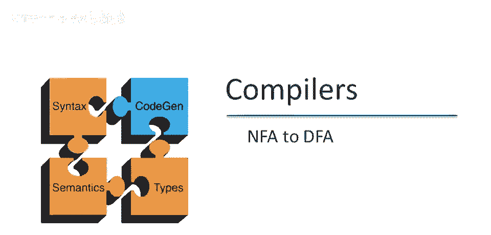
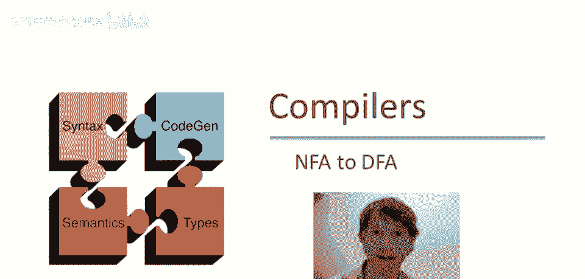
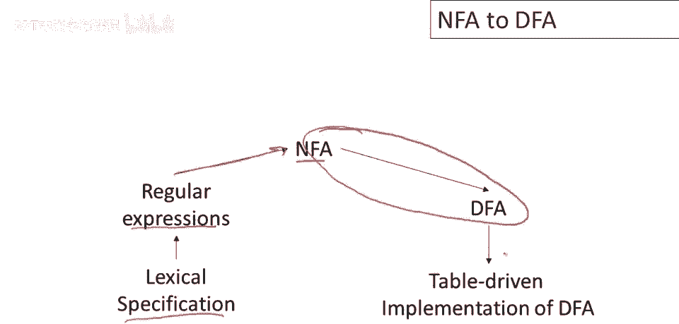
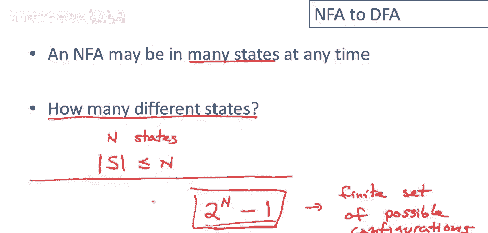
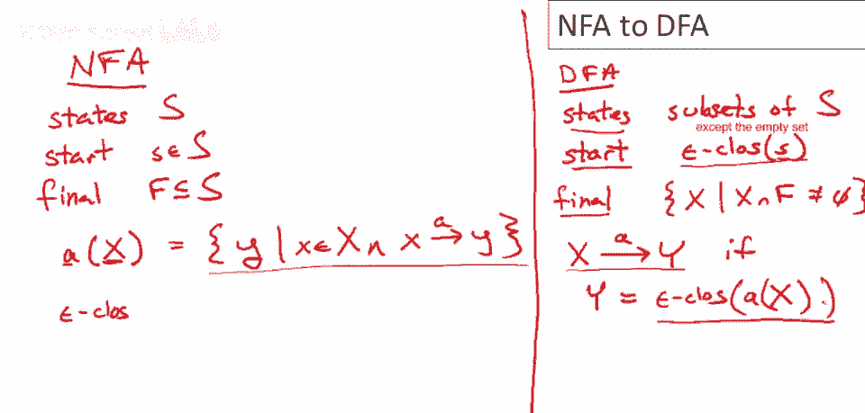
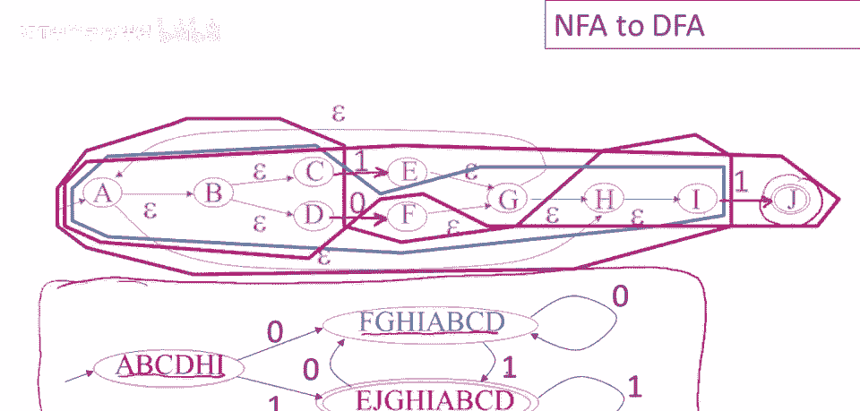

# P15：p15 04-04-_NFA_to_DFA - 加加zero - BV1Mb42177J7

欢迎回到本视频，我们将讨论将非确定，有限自动机转换为确定有限自动机。

这里再次是我们的词法分析器，构建流程图，因此，从词法规范开始，我们编写正则表达式，上次我们讨论了这一步，将正则表达式转换为非确定有限自动机，这次我们将讨论这一步，你可能猜到了，在本系列视频的最后一集中。

我们将讨论最后一步，即DFA的实现。

这是上次我们完成的非确定有限自动机，今天我们要讨论的第一个重要概念，称为状态ε闭包，基本思想是，我选择一个状态，它可以是一组状态，但我们只对一个状态进行操作，然后我看我能通过。

仅跟随ε移动到达的所有状态，所以b是我们要开始的状态，所以b将包含在集合中，然后有一个到c的ε移动，所以c将包含在集合中，还有一个到d的ε移动，所以d将包含在集合中，因此，我们称b的ε闭包等于集合。

b c d，让我们再做一例，嗯，作为示例，让我们取g的ε闭包，当我们换颜色时，我将做这个，我将擦掉这个，用粉红色或紫色做这一个，所以g的ε闭包，嗯，我们必须跟随g的所有ε转换。

所以h将包含在g的ε闭包中，但不仅仅是一个ε移动，这是递归的，我可以采取的任何数量的ε移动，所有这些状态都包含在g的ε闭包中，实际上我也会被包括在内，A将被包含在内，b和c和d也将被包含在内，现在。

如果我查看所有这些用淡紫色着色的状态，我可以看到，仅使用ε移动，我无法从这些状态到达任何新状态，因此，g的ε闭包将等于，现在让我们在这里全部写出来，是 a b c d g h i 好吧。

所以这是状态epsilon闭包。

回忆一下上个视频，nfa在任何给定时间点可能处于多个状态，这是因为对于给定的输入，它可以做出的选择，nfa可能到达多个不同的状态，现在我们要解决的问题是有多少不同的状态它可以处于。

如果一个非确定性自动机有n个状态，并且最终处于这些状态的一些子集中，那么子集可以有多大呢，显然，该集合的基数必须小于或等于n，因此，nfa最多可以进入n个不同的状态，如果我想知道不同子集的数量，嗯。

n个东西有多少不同的子集呢，这意味着有2的n减1次方个可能的n状态子集，这个数字非常有趣，首先，它是一个非常大的数字，因此，nfa可以进入许多不同的配置，特别是那些具有许多不同状态的一个，但重要的是。

这是一个有限的可能配置集，并且，这将成为将nfa转换为dfa或确定性自动机的想法的种子，因为所有我们需要做的就是能够转换一个非，确定性自动机到一个确定性自动机，是让确定性自动机。

模拟非确定性自动机的行为，并且非确定性自动机只能进入有限数量的配置，即使该配置集非常大，这正是我们将利用的，嗯，在构造中。

现在我们已经准备好给出构造，展示如何将任意非确定性有限自动机，映射到等效的确定性有限自动机，所以让我们从说明nfa中有什么开始，所以我们将有一个状态集，我们称之为s，这些是非确定性机器的状态。

有一个起始状态，嗯，小s，是状态之一，还有一个终结状态集，大写F，然后我们还必须给出转换函数，我想要写出状态转换函数，我想使用状态转换函数来定义一个操作符，我们将发现对于定义我们的dfa非常方便。

所以让我们说a应用于一个状态集，所以x这里是一个状态集，a是一个输入语言中的字符，所以a(x)等于那些状态y，使得存在一些x，使得a(x)=y，其中小x是状态集中的一个状态，a是输入语言中的一个字符。

所以a(x)等于那些状态y，使得存在一些x，使得a(x)=y，集合中的一个状态，使得从x到y有输入a的转换，这仅是表示在集合级别给出转换函数的一种方式，对于给定的状态集。

X显示所有可以通过输入a到达的状态，然后我们需要的是我们定义的epsilon闭包操作，嗯，几页幻灯片之前，我将简写为epsilon-cs，epsilon闭包，现在我们可以定义DFA，DFA会是什么样呢？

它必须包含所有这些，它必须有一个集合，它必须说明状态是什么，起始状态是什么，终结状态是什么，以及转换函数是什么，让我们从状态集开始，嗯，各州将是，子集，因此，DFA的状态将是，NFA状态的子集，因此。

对于每个可能的，NFA状态的子集，当然，这可能是很大的数字，但仍然是有限的，因此，我们可以使用这些，状态子集作为确定性机器的状态空间，现在DFA的起始状态是？嗯。

将是非确定机起始状态的epsilon闭包，确定性机器，如果你考虑一下，这很有意义，我们想做的是，我们想跟踪非确定性机器可能处于的状态集，DFA的每个状态对应非确定性机器的不同子集，因此。

DFA的每个单独状态，它告诉我们NFA可能处于的特定状态集，我们可能处于哪些州？显然，NFA从其起始状态开始，但在读取任何输入之前，它可以进行epsilon移动，因此在读取，第一个输入符号之前。

它可能处于的状态正是起始状态的epsilon闭包，现在，终态集合是什么？嗯，终态集合将包括那些状态x，记住，记住，DFA的状态是NFA状态的集合，所以x是一个集合，它将包含所有x。

使得x与NFA的最终状态集相交不为空，因此，DFA的任何状态，只要包含NFA的一个状态，一个最终状态，抱歉，NFA中的，它足以作为DFA的最终状态，因为记得NFA的目标只是它有一些计算，接受输入。

这意味着有一些方法可以到达最终状态，因此，如果任何状态，它是最终状态，我们很高兴，我们可以在这里捕获它，通过仅考虑包含NFA至少一个最终状态的所有状态，作为DFA的最终状态，最后，我们需要定义转换函数。

我们如何做到这一点？我们需要说，对于给定的状态x和另一个状态y，当它们之间存在转换时，在某输入a上，那么这种转换在什么条件下存在？让我们写出来，所以记得我们处于状态x，我们需要知道什么？

我们需要知道在输入a上可以到达的状态集，我们刚刚定义了，那是a(x)，然后，一旦我们到达这些状态之一，一旦我们看到从状态集x在输入a上可以到达的位置，还有可能在之后进行epsilon移动，因此。

我们还需要取，呃，这些状态的epsilon闭包，好吧，嗯，我们将说存在一个转换，呃，从x到y，如果y等于这些状态集，并且请注意，对于任何x，只有这样的状态集一个，这确保了这是一个确定性机器。

每个状态在每个输入上只有一次可能的移动，因此，我们现在可以检查清单，看看我们是否有确定性机器，我们有一个有限的状态集，我们有一个起始状态，我们有一个最终状态集，我们有一个转换函数，每个输入只有一个移动。

没有epsilon移动，因此，这实际上是一个确定性机器，它保持的性质是，计算的每一步，DFA的状态记录，NFA可能在该输入上达到的状态集。

所以让我们通过一个例子来构建一个确定性机器，从一个非，确定性机器，这是上次视频中构建的NFA，再说一次，这是视频开头定义epsilon闭包时使用的，我们将做示例，与上一页的构造略有不同。

如果实际写出所有这些状态的子集，将花费我们非常非常长的时间，事实证明，并非所有子集都被DFA使用，我们只需枚举实际需要的状态，我们将从DFA的起始状态开始，然后找出需要哪些附加状态，我们如何做到这一点。

我们从NFA的起始状态开始，即这个状态a，然后回忆DFA的起始状态是该状态的epsilon闭包，因此对应于这个紫色集合，因此DFA的第一个状态，起始状态是状态a、b、c、d、h、i的子集。

现在我们必须找出，嗯，从这个特定状态，从起始状态，对于每个可能的输入值会发生什么，这台机器的字母表是1和0，因此从这个状态必须有两个转换，一个输入为1的转换，一个输入为0的转换，我们先做输入0。

我们可以看到，紫色集合中只有一个可能的转换，那就是从状态d到状态f，因此状态f肯定包含在NFA可到达的状态集中，但一旦我们到达状态f，我们可以进行很多epsilon移动。

因此事实上DFA的第二个状态对应于一个更大的集合，它是所有，它是状态f的epsilon闭包，即这个状态集f、g、h、i、a、b、c和d，好的，这是NFA在读取单个零后可能处于的状态集。

接下来让我们考虑从起始状态在输入1上会发生什么，NFA可能到达哪些状态，如果查看转换函数，我们可以看到NFA可能有两种可能的移动，它可能在状态c，在这种情况下它将移动到状态e，或者它可能在状态i。

这也是紫色集合的一部分，在这种情况下它将移动到状态j，因此，由于读取1，NFA可能进入的两个可能状态，然后在那之后可以进行一系列的epsilon移动，实际上，阅读一个一后，机器可能处于任何状态。

除了状态f，这是这些状态集合，你会发现这个特定状态集合，红色集合包括NFA的最终状态，所以这也是一个最终状态，表明阅读一个一后，NFA可能处于接受状态，因此这将是DFA的接受状态，嗯。

我们仍然需要填写我们添加的两种状态，机器右侧的两个状态，它们在输入零时做什么，它们在输入一时做什么，让我们弄清楚，所以从红色状态开始输入零，会发生什么？看，红色状态包括状态d，它可以移动到状态f。

但我们已经计算过，epsilon会发生什么，epsilon闭包f是什么，那就是绿色状态，所以如果我处于红色状态并读取一个零，我移动到绿色状态，如果我处于红色状态并读取一个一，你会看到两个状态。

NFA状态c和i在红色集合中，所以它只是把我们带回红色集合，类似地对于绿色状态，如果我读取一个一，我移动到红色状态，如果我读取一个零，我留在绿色状态，所以这然后是我们下面的确定性机器，这是确定性机器。

它模拟NFA，所以确定性机器的每一步，它记录了NFA可能处于的状态集合，它将接受一个字符串。

