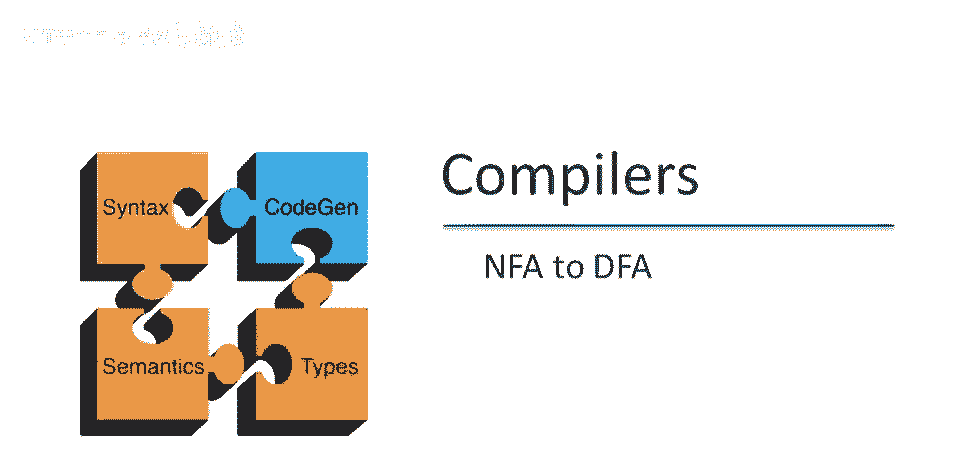
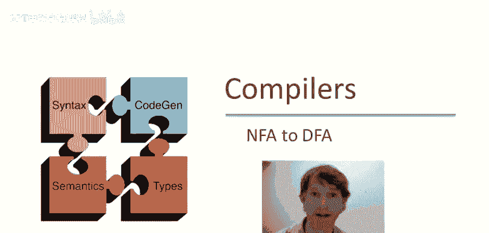
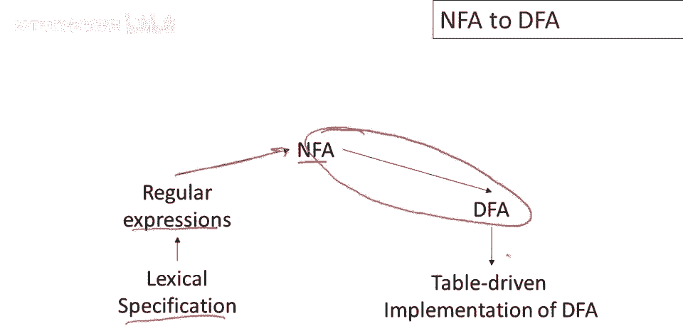
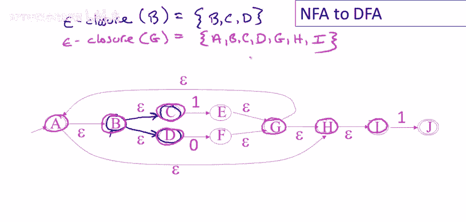
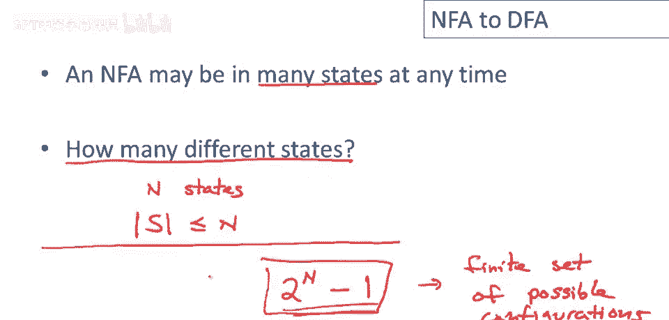
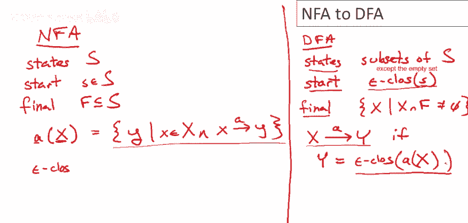
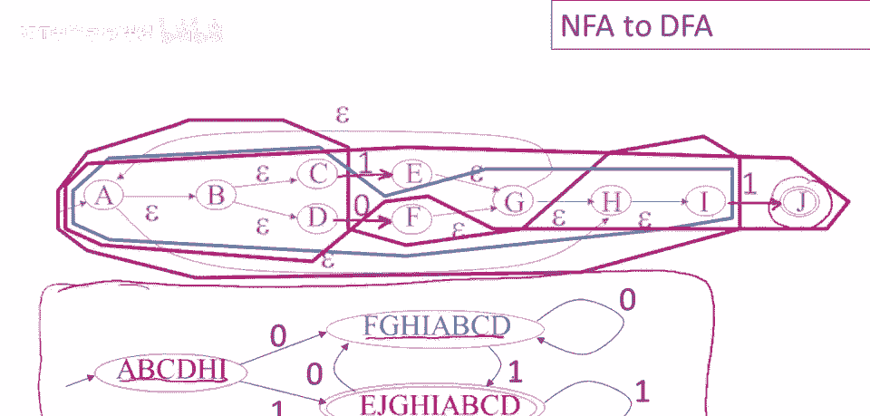

# 课程 P15：从NFA到DFA的转换 🧩

在本节课中，我们将学习如何将一个**非确定有限自动机**转换为一个**确定有限自动机**。我们将从核心概念“ε闭包”开始，理解NFA与DFA在状态上的根本区别，最后通过一个完整的构造算法和实例，一步步演示转换过程。



## ε闭包：理解NFA的“隐形”移动 🔍

上一节我们回顾了从正则表达式构建NFA的过程。本节中，我们来看看NFA中一个关键概念：**ε闭包**。它帮助我们理解NFA在不消耗任何输入字符（即通过ε移动）时，可能处于的所有状态集合。

**ε闭包**的定义是：从一个给定的状态（或状态集合）出发，仅通过跟随**ε移动**所能到达的所有状态的集合。这个过程是递归的，意味着可以经过任意数量的ε移动。

以下是计算ε闭包的步骤：
1.  将起始状态加入集合。
2.  查看集合中每个状态，找出所有从该状态出发的ε移动所能到达的新状态。
3.  将这些新状态加入集合。
4.  重复步骤2和3，直到没有新状态可以加入。



**公式表示**： 给定状态 `q`，其ε闭包记为 `ε-closure(q)`，是通过递归地添加从 `q` 经零次或多次ε转换可达的所有状态得到的集合。

## 从不确定性到确定性：核心思想 💡

理解了ε闭包后，我们来看看NFA与DFA的根本区别。NFA在运行时，由于存在选择（包括ε移动），在读取相同输入后可能处于**多个不同的状态**。



一个关键问题是：一个拥有 `n` 个状态的NFA，最多可能处于多少种不同的“状态组合”（即子集）中呢？答案是 `2^n` 种（包括空集）。虽然这个数字可能很大，但它是**有限的**。

这引出了转换的核心思想：我们可以构造一个DFA，让它的**每一个状态**都对应NFA可能处于的**一个特定的状态子集**。这样，DFA就能通过跟踪NFA所有可能的“并行”路径，来模拟NFA的行为。

## 构造算法：将NFA正式转换为DFA ⚙️

上一节我们介绍了利用状态子集模拟NFA的思想，本节中我们来看看如何形式化地定义这个转换算法。

假设我们有一个NFA，定义为 `(Q, Σ, δ, q0, F)`，其中：
*   `Q` 是状态集合。
*   `Σ` 是输入字母表。
*   `δ` 是状态转移函数（可能产生多个结果或ε移动）。
*   `q0` 是起始状态。
*   `F` 是接受状态集合。

我们需要构造一个等价的DFA，定义为 `(Q’, Σ, δ’, q0’, F’)`。

**算法步骤如下**：

1.  **DFA的状态集 (Q’)**：Q’ 的每个状态是 NFA 状态集 `Q` 的一个子集。即 `Q’ ⊆ 2^Q`。
2.  **DFA的起始状态 (q0’)**：`q0’ = ε-closure({q0})`。这是NFA在开始读取输入前，通过ε移动可能处于的所有状态。
3.  **DFA的接受状态集 (F’)**：`F’ = { S ∈ Q’ | S ∩ F ≠ ∅ }`。只要一个DFA状态（即一个NFA状态子集）中包含**至少一个**NFA的接受状态，那么该DFA状态就是接受状态。
4.  **DFA的转移函数 (δ’)**：对于DFA中的每个状态 `S`（即NFA的状态子集）和每个输入符号 `a ∈ Σ`，其转移定义为：
    `δ'(S, a) = ε-closure( ∪_{s ∈ S} δ(s, a) )`
    **代码描述**：
    ```python
    def dfa_transition(S, a):
        # 第一步：计算从集合S中任何状态s出发，通过输入a能直接到达的所有状态
        next_states = set()
        for s in S:
            next_states.update(nfa_delta(s, a)) # nfa_delta 返回状态集合
        # 第二步：计算这些新状态的ε闭包
        return epsilon_closure(next_states)
    ```

这个算法确保了构造出的DFA是确定性的（每个状态-输入对只有唯一的下一个状态），并且与原始NFA接受完全相同的语言。

## 实例演示：一步步构建DFA 🛠️

让我们通过一个具体的NFA例子，应用上述算法，手动构建出对应的DFA。

假设我们有如下NFA（其状态转移包含ε移动）：
（此处根据原视频描述，NFA图包含状态a, b, c, d, e, f, g, h, i, j，以及基于0和1的转移和ε转移）



**构建过程**：

1.  **确定起始状态**：NFA起始状态为 `a`。DFA起始状态 `q0’ = ε-closure({a})`。通过追踪ε移动，我们得到 `{a, b, c, d, h, i}`。我们称这个DFA状态为 `S0`。

2.  **为 `S0` 计算转移**：
    *   对于输入 `0`：在 `S0` 中，只有状态 `d` 有关于 `0` 的转移，到达 `f`。然后计算 `ε-closure({f})`，得到 `{a, b, c, d, f, g, h, i}`。这是一个新的DFA状态，记为 `S1`。
        `δ'(S0, 0) = S1`
    *   对于输入 `1`：在 `S0` 中，状态 `c` 和 `i` 有关于 `1` 的转移，分别到达 `e` 和 `j`。计算 `ε-closure({e, j})`。状态 `e` 有ε移动到 `j`，`j` 是接受状态且无ε移出。因此得到 `{e, j}`。这是一个新的DFA状态，记为 `S2`。由于 `S2` 包含NFA的接受状态 `j`，因此 `S2` 也是DFA的接受状态。
        `δ'(S0, 1) = S2`

3.  **为 `S1` 计算转移**：
    *   对于输入 `0`：在 `S1` 中，状态 `d` 有关于 `0` 的转移至 `f`。`ε-closure({f})` 就是 `S1` 本身。
        `δ'(S1, 0) = S1`
    *   对于输入 `1`：在 `S1` 中，状态 `c` 和 `i` 有关于 `1` 的转移，分别到达 `e` 和 `j`。这与 `S0` 遇到输入 `1` 的情况相同，因此到达 `S2`。
        `δ'(S1, 1) = S2`

4.  **为 `S2` 计算转移**：
    *   对于输入 `0`：在 `S2` 中，状态 `e` 和 `j` 都没有关于 `0` 的转移。因此，`δ'(S2, 0)` 指向一个空集状态。通常我们显式定义一个“死状态” `S_empty` 来接收所有无效转移。
        `δ'(S2, 0) = S_empty`
    *   对于输入 `1`：同样，`S2` 中的状态没有关于 `1` 的转移。
        `δ'(S2, 1) = S_empty`

5.  **处理死状态 `S_empty`**：对于任何输入，死状态都转移到自身。
    `δ'(S_empty, 0) = δ'(S_empty, 1) = S_empty`

最终，我们得到了一个拥有状态 `S0`, `S1`, `S2`, `S_empty` 的DFA，其中 `S2` 是接受状态。其状态转移表可以清晰地描述机器的行为。

## 总结 📝

本节课中我们一起学习了从非确定有限自动机到确定有限自动机的转换。
*   我们首先学习了 **ε闭包** 的概念，它是理解NFA隐性移动的基础。
*   接着，我们分析了NFA的**不确定性**本质，并认识到其可能的状态子集数量是有限的，这为模拟提供了可能。
*   然后，我们详细介绍了**子集构造法**，这是一个将NFA正式转换为等价DFA的通用算法，明确了DFA的每个组成部分（状态集、起始状态、接受状态集、转移函数）是如何从NFA定义中推导出来的。
*   最后，我们通过一个**完整的实例**，一步步演示了如何应用该算法，从具体的NFA构造出对应的DFA，巩固了对整个转换过程的理解。



掌握NFA到DFA的转换，是理解编译器词法分析阶段如何高效处理正则表达式的关键一步。