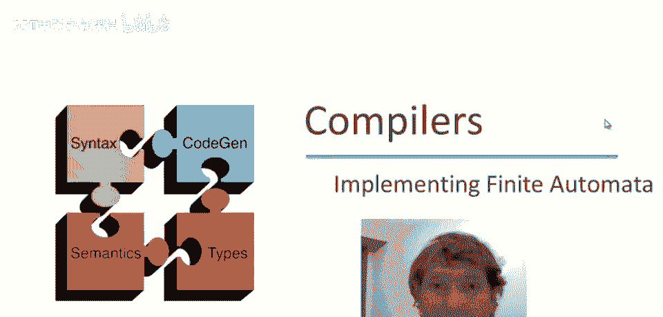
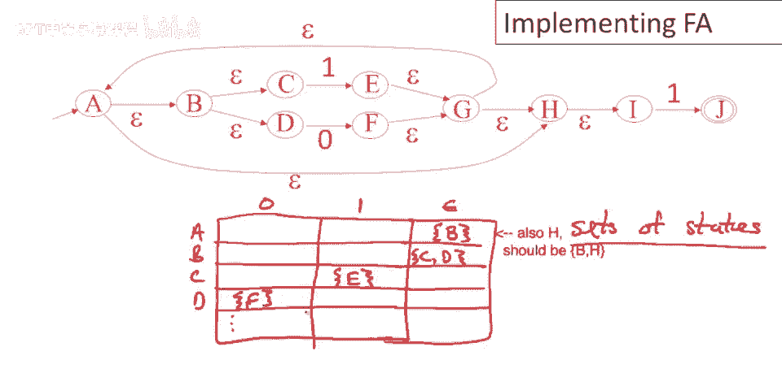

# P16：p16 04-05-_Implementing_Fin - 加加zero - BV1Mb42177J7

欢迎回到本视频。

我们将结束关于词法分析的演讲，通过使用各种不同技术实现有限自动机进行讨论。

简单回顾，这是词法分析器构建的小流程图，今天我们将重点关注这最后一步，DFA的实现，实际上我应该说这张图表并不完全准确，因为有时我们不会走到DFA，我们停在NFA并直接实现它们，我们也会稍微谈谈这一点。

如果我们不想构建DFA，而是想直接基于NFA构建词法分析器。

现在从DFA开始，嗯，实现确定性有限自动机非常简单，只需使用数组，这个二维数组，其中一个维度是状态，所以我可能会有这些状态，另一个维度是输入符号，所以我可能会有状态i和输入a，我简单地查找那个位置。

那里将是我们将要移动到的下一个状态k，因此，表格在特定输入符号和状态下存储，机器将移动到的下一个状态。

所以，让我们举一个将确定性自动机转换为表格的例子，驱动实现，这是我们上次构建的自动机，回忆一下几段视频前我们从正则表达式开始，它被转换为一个非确定性有限自动机，然后我们使它，我们将其转换为确定性自动机。

就在上一个视频中，它又在这里，现在让我们谈谈如何将其实现为表格，所以我们画一个二维表格，有三个状态，所以我们需要三行，我将简单地标记这些行s t和u，然后有两个输入，零和一，现在让我们填写表格中的条目。

所以在状态s输入零，我们去哪里，我们转到状态t，所以s零，条目将是t，类似地，嗯，从状态s输入，一将最终到达状态u，因此，第一个条目将是您好，然后类似地，对于其他i，表格的其他行，让我们接下来做t行。

一我们转到u，在零我们留在t，所以这行也是tu，最后对于u会发生什么，嗯，在零我们转到t，在一我们留在u，所以这行也是tu，这就是描述自动机转换关系的表格，现在如果我们考虑如何在程序中使用这个转换关系。

你可以很容易地想象我们会开始，比如说，我们的输入索引，嗯，指向输入的开头，让我们称之为零，我们还需要有一个当前状态，我们从起始状态开始，让我们简单地说，那是第零行，在这种情况下，那将是行s。

然后当我们想要做的，我们想走过输入并检查是否i，嗯，并检查那个，你知道，并做出转换，嗯，对于输入的每个元素一次，我们想要停止时输入为空，所以只要还有输入，假设我们有一个字符数组，那是我们的。

那是我们的输入，只要数组中的条目不为空，嗯，让我们做以下操作，我们将更新状态，嗯，在每个步骤，我们要更新它到什么，嗯，让我们给这个数组起个名字，让我们称之为数组a，所以我们要在我们的转换关系中查找a。

我们要查找什么？我们要查找当前状态，我们要查找输入，在那个条目中，你知道，使用当前的状态和当前的输入，我们将转换到一个新状态，我们还想增加输入指针，所以我们会同时做这件事，这就是处理输入的循环。

根据转换表a，正如您可以看到的，这是一个非常紧凑的，非常高效的过程，只是一点点索引运算，和一两个表查找，一个输入和一个状态，每个输入字符的转换表，很难想象，嗯，有一个比这更快的过程，或更紧凑。

现在是一种实现确定有限自动机的策略，和，你可能已经注意到那个特定方法的缺点是，表中有很多重复的行，实际上，表中的所有行都完全一样，我们可以通过稍微不同的表示来节省一些空间，所以，我们不需要一个二维表。

我们可以只用一个一维表，这个表同样，嗯，是一个，每个状态的条目，所以 s t 和 u，这个表将包含一个指向特定状态移动向量的指针，所以这里有一个指针，它将指向另一个一维表。

该表将说明我们在零和一上应该做什么，所以在 s 的案例中，我们想移动到状态 t，如果是零，和状态 u，如果是一，现在当我们去 ah，填写 t 的条目时，我们看到不需要复制这行，实际上可以共享这行。

类似地对于 u，所以这个表示实际上更加紧凑，我们共享自动机中重复的行，在我们为词法分析考虑的自动机中，非常常见的是有重复的行，这实际上可以导致表的显著压缩，特别是当你考虑到可能的状态数时，记住。

对于一个具有 n 个状态的 NFA，DFA 可能有 2 的 n 减一次方个状态，嗯，具有 n 个状态，虽然膨胀通常不是最坏情况，它可以非常显著，我们之前幻灯片上的二维表实际上可能非常大。

有时可通过小技巧，如，这种特定表示的缺点是，这些指针实际上需要时间，因此，我们的内循环将稍慢，我们不仅要进行表查找，解引用，指针进行另一个表查找。

然后我们可以移动，最后，也可能根本不想，将特定规范转换为dfa，因为表格可能变得真正巨大，我们可能最好直接使用nfa，因此，可以想象nfa的实现，嗯，我们还可以实现，嗯，通过表格，嗯，在这种情况下，嗯。

我们需要为nfa中的，每个状态有一行，在nfa中，我们不会全部完成，但可以为nfa的每个状态，有行，你知道我们将要去哪里，如果输入是零，或如果输入是一，所以在这种情况下，我几乎忘了，我们还需要一个转换。

在最简单或最直接的，fa实现中，我们将去哪里，如果在epsilon上，现在我记得，因为这些是nas一般，这将是状态集，因为我们可能有不止一个epsilon转换，或不止一个零和一上的转换，在这种情况下。

epsilon a可以转到b，所以这将是一组状态，B和b可以转到c或d和c，嗯，只能转到e在一上，嗯，在一上d可以转到f，嗯，输入为零，等等，我们填写其余的表格，此表格保证相对较小。

因为状态数受nfa中状态数的限制，和输入字母表的大小，再一次，我们可以共享行等技巧压缩表，如果我们喜欢，但现在模拟自动机的内循环将更昂贵，因为我们要处理状态集而非单个状态，所以每个时间点。

我们将跟踪一组状态，当我们进行移动时，我们得为集合中的每个状态查找潜在去向，包括epsilon移动和执行所有可能的epsilon移动，因此我们总能准确评估NFA可能到达的状态集，虽然这节省了表空间。

就表的大小而言，它可能比确定性自动机执行得更慢。

总结词法规范实现的关键思想，是将非确定性有限自动机转换为确定性有限自动机，这是将一般，呃，高层规范使用正则表达式，转换为完全确定性的东西，现在实践中，工具提供速度和空间之间的权衡，所以DFA更快，呃。

不那么紧凑，所以表可能非常大，有时这是实际问题，NFA实现起来更慢，呃，但更简洁，工具给你，呃，通常，一系列选项，并且通常以配置文件或命令行形式，开关允许你选择，是否想要更接近完整的DFA，更快。

也许更大，或纯NFA，更慢。

