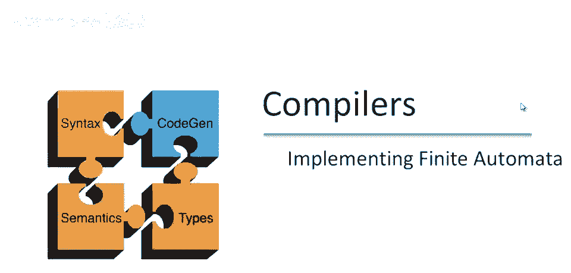
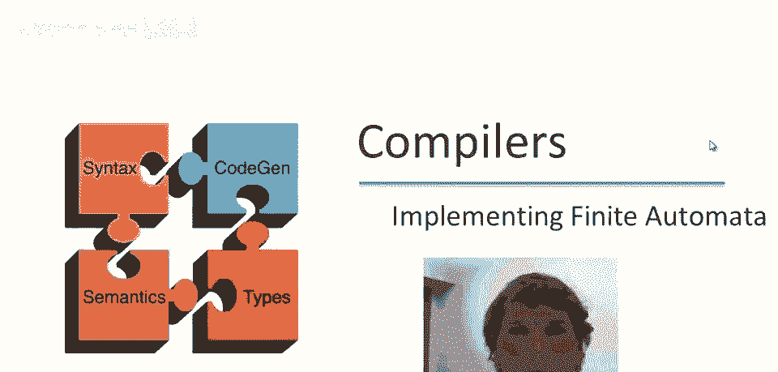
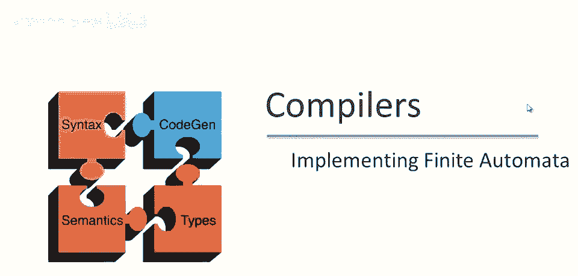
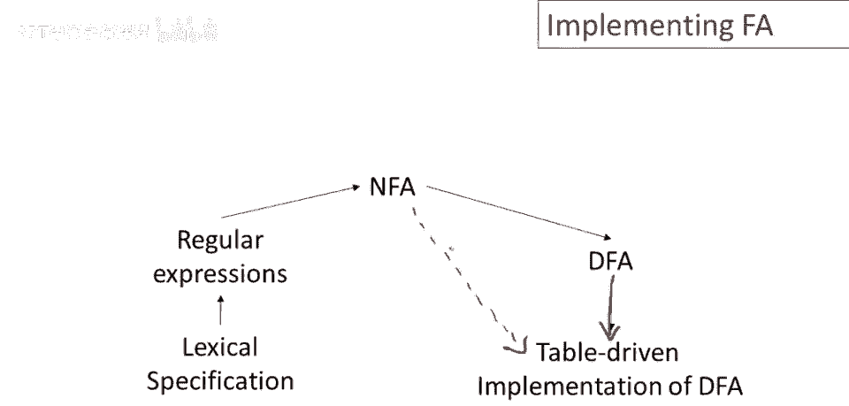
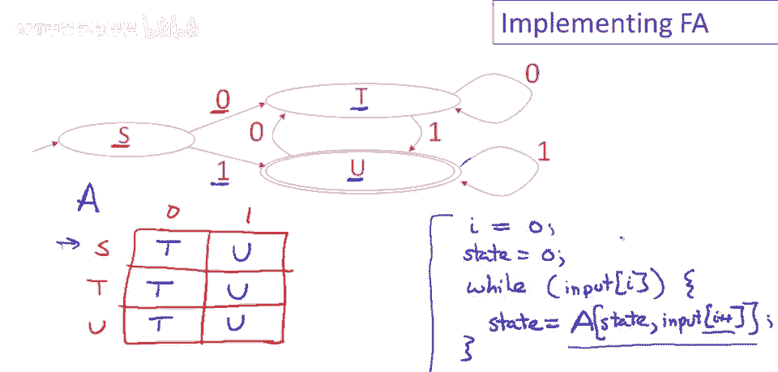
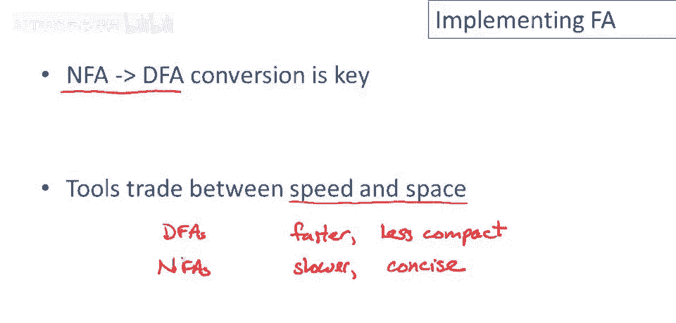

# 课程 P16：词法分析器实现 - 有限自动机的实现 🛠️



在本节课中，我们将学习如何实现有限自动机，以完成词法分析器的构建。我们将重点讨论确定性有限自动机（DFA）和非确定性有限自动机（NFA）的不同实现策略，并比较它们在速度与空间上的权衡。


---



## 概述 📋

词法分析器的构建流程通常包括将正则表达式转换为NFA，再将NFA转换为DFA，最后实现DFA。然而，有时我们也可以直接基于NFA实现词法分析器。本节我们将重点关注这最后一步——有限自动机的实现。

上一节我们介绍了从正则表达式到NFA再到DFA的转换过程。本节中，我们来看看如何将这些自动机模型转化为可执行的代码。



---

## DFA的实现：表格驱动法 📊


实现确定性有限自动机（DFA）最直接的方法是使用一个二维数组（表格）。其中一个维度代表状态，另一个维度代表输入符号。表格的每个单元格存储了在特定状态和输入符号下，机器应转移到的下一个状态。

以下是实现DFA的步骤：

1.  **构建转换表**：根据DFA的状态和输入字母表，创建一个二维数组 `transition_table[state][input_symbol]`。
2.  **初始化**：设置当前状态为起始状态，并准备一个指向输入字符串的指针。
3.  **循环处理**：遍历输入字符串中的每个字符，根据当前状态和当前输入字符，在转换表中查找下一个状态，并更新当前状态。
4.  **结束条件**：当输入字符串处理完毕时，检查当前状态是否为接受状态，以决定是否识别出有效的词素。

让我们通过一个具体的DFA例子来演示如何构建转换表。

### DFA转换表示例

假设我们有以下DFA（状态为 `s`， `t`， `u`，输入符号为 `0` 和 `1`）：

*   在状态 `s`，输入 `0` 转移到 `t`，输入 `1` 转移到 `u`。
*   在状态 `t`，输入 `0` 保持在 `t`，输入 `1` 转移到 `u`。
*   在状态 `u`，输入 `0` 转移到 `t`，输入 `1` 保持在 `u`。

其转换表如下：

| 当前状态 | 输入 `0` | 输入 `1` |
| :------- | :------- | :------- |
| s        | t        | u        |
| t        | t        | u        |
| u        | t        | u        |

在程序中，我们可以用以下伪代码来模拟这个DFA：

```python
# 假设 transition_table 已按上述表格定义
current_state = ‘s‘
input_string = "0101"
i = 0

while i < len(input_string):
    current_char = input_string[i]
    # 根据当前状态和输入字符查找下一个状态
    current_state = transition_table[current_state][current_char]
    i += 1

# 循环结束后，检查 current_state 是否为接受状态...
```



这种方法非常高效，每个输入字符只需一次数组查找和索引运算。

---

## DFA的优化：压缩转换表 🗜️

你可能已经注意到，在上面的转换表中，所有行都是相同的。我们可以通过一种不同的表示方法来节省空间。

我们可以使用一个一维数组，其中每个状态对应一个条目，该条目是一个指针，指向另一个一维数组（即该状态对应的转换向量）。这样，具有相同转换向量的状态可以共享同一行数据。

优化后的表示结构如下：

*   一个主表 `state_vectors`，索引是状态（如 `s`， `t`， `u`），每个元素是一个指向转换向量的指针。
*   转换向量是一个小数组，按输入符号索引，存储下一个状态。

对于我们的示例DFA：
*   状态 `s`， `t`， `u` 的指针都指向同一个转换向量 `[t， u]`。

这种方法的优点是显著压缩了表格大小，特别是当DFA状态很多且转换模式重复时。缺点是内循环稍慢，因为需要多一次指针解引用操作。


---

## 直接实现NFA ⚙️

有时，将NFA转换为DFA会导致状态数量爆炸（理论上最多可达 2^n 个状态），使得转换表异常庞大。在这种情况下，直接实现NFA可能更节省空间。

NFA的实现也需要一个表格，但表格的每个单元格存储的是一个**状态集合**，因为对于同一个输入，NFA可能转移到多个状态，并且还需要处理 ε（空）转移。

以下是NFA表格的示例结构：

| 当前状态 | 输入 `0` 的转移集 | 输入 `1` 的转移集 | ε 转移集     |
| :------- | :---------------- | :---------------- | :----------- |
| A        | {B}               | {}                | {B}          |
| B        | {}                | {C， D}           | {}           |
| C        | {}                | {E}               | {}           |
| D        | {F}               | {}                | {}           |

模拟NFA的内循环会更复杂且更慢：
1.  我们需要维护一个**当前可能的状态集合**。
2.  对于每个输入字符，需要计算这个集合中每个状态在输入字符和 ε 转移下能到达的所有新状态的并集。
3.  这个过程涉及到集合的查找、合并与闭包计算。

因此，NFA实现以更慢的执行速度为代价，换取了更紧凑的存储空间。

---


## 总结与权衡 ⚖️

本节课中，我们一起学习了实现有限自动机的几种方法：

1.  **DFA表格驱动法**：使用二维数组直接实现，**执行速度最快**，但转换表可能**非常庞大**。
2.  **DFA压缩表法**：通过共享相同的转换行来压缩表格，在**空间效率**和速度之间取得更好平衡。
3.  **NFA直接实现法**：直接模拟非确定性自动机，**表格非常紧凑**，但**模拟过程更慢**，因为需要处理状态集合。

在实践中，词法分析器生成工具（如Flex）会根据用户配置在速度与空间之间进行权衡。它们通常提供选项，允许开发者选择是生成更接近完整DFA的（更快但可能更大）实现，还是基于NFA的（更慢但更简洁）实现。



理解这些底层实现策略，有助于我们在需要手动优化或调试词法分析器时，做出更明智的选择。