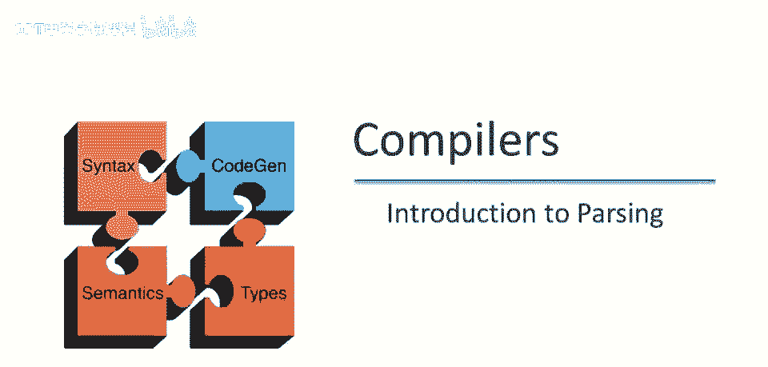
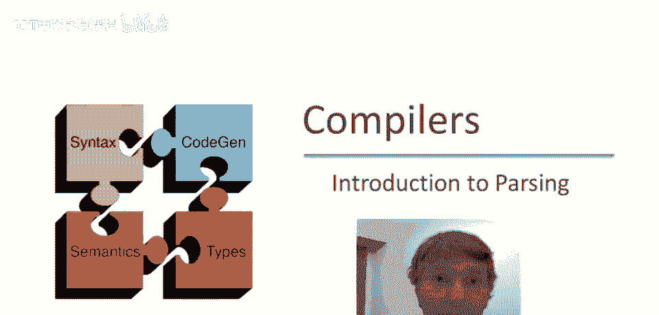
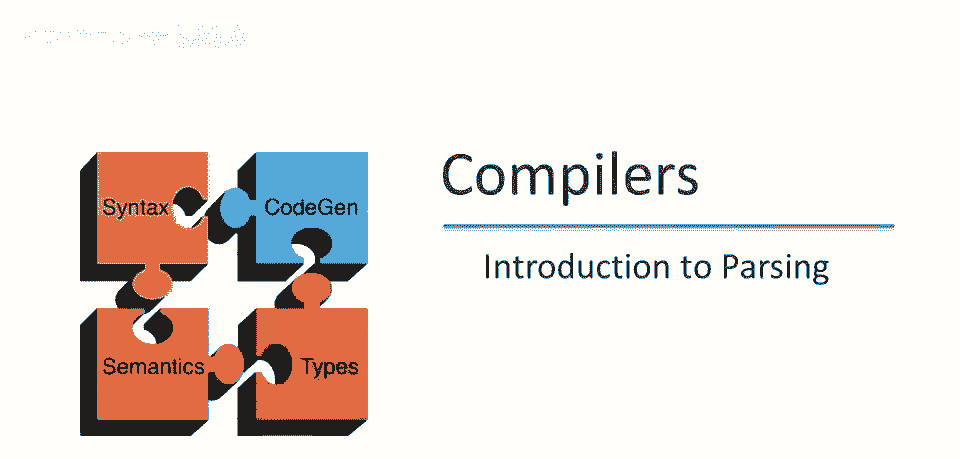
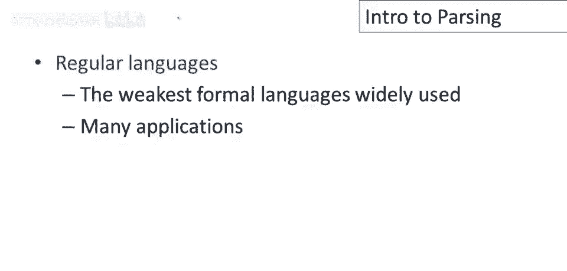
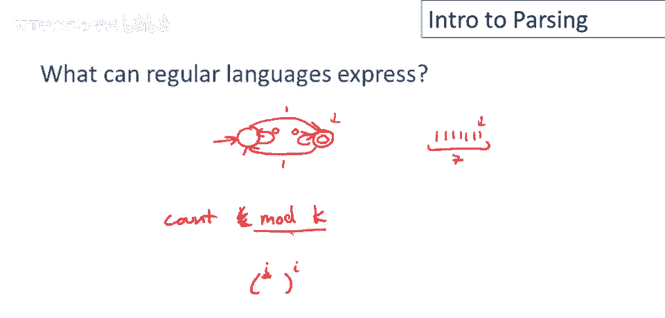
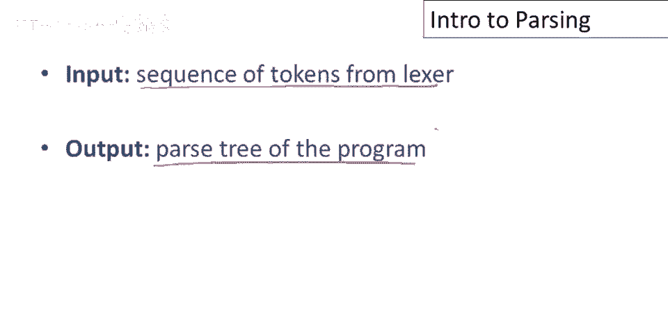
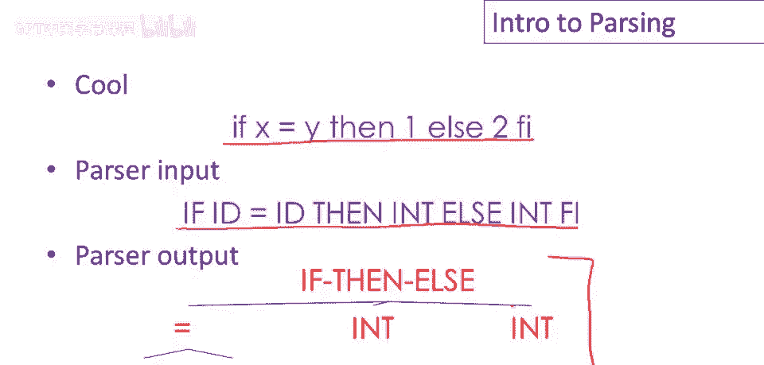
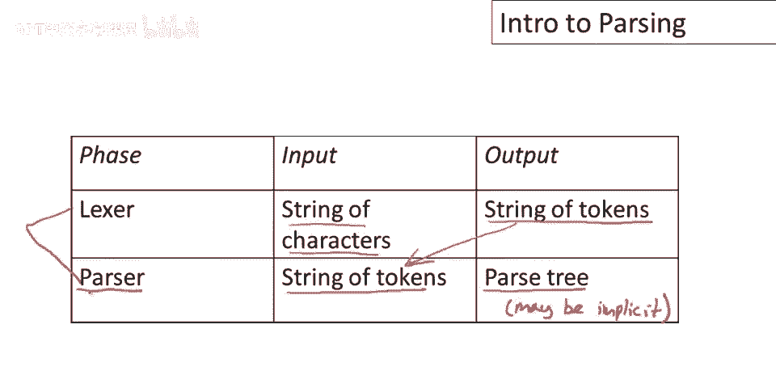

# P17：p17 05-01-_Introduction_to_ - 加加zero - BV1Mb42177J7

本视频将过渡到词法分析到解析，并简单讨论这两个编译阶段的关系，我们已经讨论了正规语言。

值得注意的是这些是最弱的广泛使用的形式语言，但它们有，当然，许多应用，其中一些我们在之前的视频中看到了。

现在正规语言的困难在于许多语言根本不符合规则，并且有一些非常重要的语言无法使用正则表达式表达，或有限自动机，所以让我们考虑这个语言，它是所有平衡括号的集合，所以该语言的一些元素将是字符串。

每个n一个开一个闭，两个开括号，两个闭括号，三个开括号，三个闭括号等等，你可以想象这实际上代表了，许多编程语言结构，例如，嗯，任何类型的嵌套算术表达式都将属于此类，但还有像嵌套的。

如果那么否则也将具有这个特征，在这里嵌套的，如果那么否则，只是if语句像开括号一样起作用，不是所有的语言都像cool，它有明确的关闭费用，但在许多语言中它们是隐式的，因此编程语言中有许多嵌套结构，构造。

并且那些不能由正则表达式处理，所以这提出了一个问题，正规语言可以表达什么，以及为什么它们不足以识别任意嵌套结构，因此我们可以通过查看一个简单的两状态机，来阐明正规语言和有限自动机的局限性。

所以让我们考虑这个机器现在我们有一个开始状态，然后另一个状态是接受状态，我们将让这个机器只是一个我们已经见过的机器，它将识别包含奇数个1的字符串，所以如果我们看到一个1并且我们在开始状态，我们移动。

我们现在看到了奇数个1，我们移动到接受状态，并且我们留在那里直到我们看到另一个1，在这种情况下我们看到偶数个1，然后我们处于开始状态，这就是这个机器，每当看到奇数个1，我们在最终状态，每当看到偶数个1。

我们在起始状态，如果给定一个较长的1串，让我们选择包含7个1的，它会做什么，它将在这两个状态间来回，当到达最后一个1时，它将处于最终状态，所以它将接受，但注意，它不知道访问最终状态多少次。

它不记得字符串的长度，它无法计算字符串中有多少字符，实际上，我只能计算奇偶性，总的来说，我有有限时间，所以我只能表达，你可以计数的东西，模k，他们可以计数，嗯，模k，嗯，对于某个k。

其中k是机器的状态数，所以你知道，如果有三个状态，机器，我可以跟踪字符串长度是否可被3整除或其他类似属性，但我不能做像计数到任意高这样的事情，因此，如果需要识别需要任意计数高的语言。

比如识别所有平衡括号的字符串，你不能用有限的状态集做到。

那么解析器做什么，它从词法分析器接收标记序列作为输入，并产生程序的解析树。

例如，在Cool中，这是一个输入表达式，作为词法分析器的输入，词法分析器产生这个标记序列作为输出，这是解析器的输入，然后解析器产生这个解析树，其中嵌套结构已明确，我们有if，然后else。

然后是三个组件，谓词，然后分支，和else分支的if，总结。

词法分析器以字符串字符作为输入，产生标记字符串作为输出，该标记字符串是解析器的输入，解析器产生解析树作为输出，将字符串标记解析为程序解析树，这里值得提几点，首先，有时解析树是隐式的。

编译器可能永远不会构建完整的解析树，我们稍后会详细讨论，稍后，许多编译器确实构建了显式的解析树，但许多没有，另一件值得提的事，是有些编译器将这两个阶段合并为一个，所有工作都由解析器完成。

因此解析技术足够强大，可以表达词法分析和解析，但大多数编译器仍按这种方式划分工作，因为正则表达式与词法分析非常匹配。

