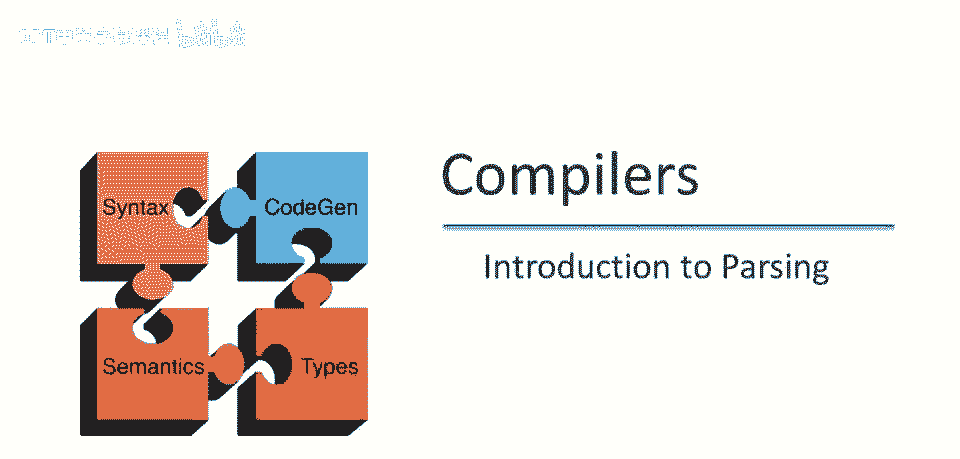
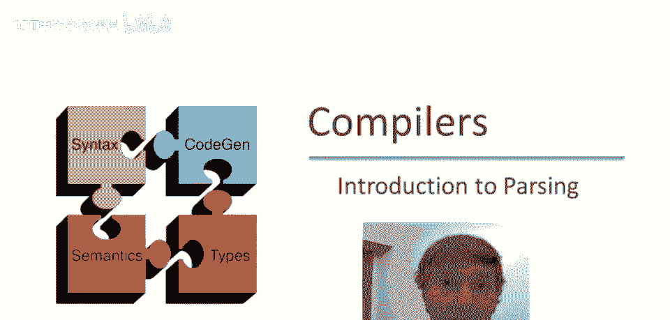
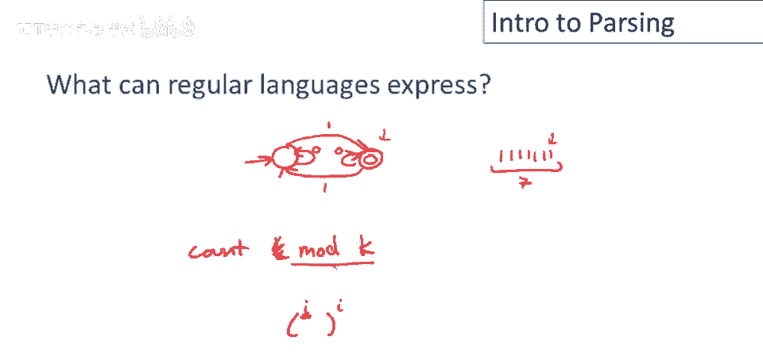
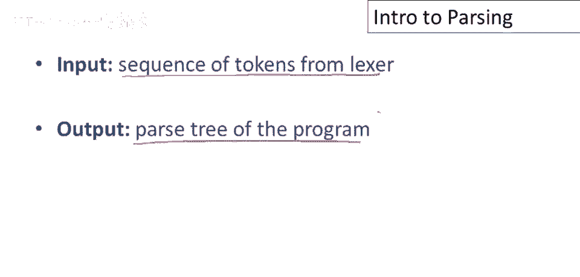
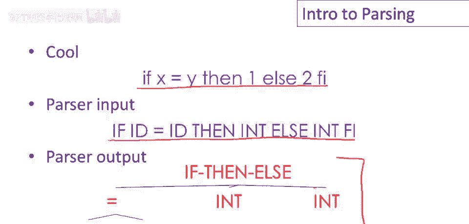

# 编译原理课程 P17：从词法分析到语法分析 🚀

在本节课中，我们将要学习编译过程中的一个重要过渡：从词法分析阶段进入语法分析阶段。我们将探讨这两个阶段的关系，理解为什么需要语法分析，并初步了解语法分析器的工作。




## 正规语言的局限性

上一节我们介绍了正规语言及其在词法分析中的应用。本节中我们来看看正规语言的能力边界。


值得注意的是，正规语言是应用最广泛的形式语言中能力最弱的一类。尽管如此，它们有许多实际应用，我们在之前的视频中已经看到了一些例子。

现在，正规语言的困难在于，许多语言根本不符合其规则。有一些非常重要的语言无法使用正则表达式或有限自动机来表达。

让我们考虑这个语言：它是所有平衡括号的集合。该语言的一些元素将是字符串：

*   `()`
*   `(())`
*   `((()))`

每个字符串包含成对且正确嵌套的开括号和闭括号。你可以想象这实际上代表了编程语言中的许多结构。例如，任何类型的嵌套算术表达式都将属于此类。还有像嵌套的 `if-then-else` 语句也具有这个特征。在许多语言中，`if` 语句像开括号一样起作用，`end` 或 `}` 像闭括号一样起作用。因此，编程语言中有许多嵌套结构，而这些结构无法由正则表达式处理。

这提出了一个问题：正规语言可以表达什么？为什么它们不足以识别任意嵌套结构？

我们可以通过查看一个简单的两状态机，来阐明正规语言和有限自动机的局限性。

让我们考虑这个机器。我们有一个开始状态 `S0`，另一个状态 `S1` 是接受状态。这个机器将识别包含奇数个 `1` 的字符串。

以下是其状态转换规则：
```
S0 --1--> S1
S1 --1--> S0
```
如果我们看到一个 `1` 并且我们在开始状态 `S0`，我们移动到接受状态 `S1`。当我们看到另一个 `1` 时，我们从 `S1` 移回 `S0`。每当看到奇数个 `1`，我们在最终状态 `S1`；每当看到偶数个 `1`，我们在起始状态 `S0`。

如果给定一个较长的 `1` 串，例如包含 7 个 `1`，它会在这两个状态间来回切换。当到达最后一个 `1` 时，它将处于最终状态 `S1`，所以它会接受这个字符串。

但请注意，这个机器不知道它访问最终状态了多少次。它不记得字符串的长度，也无法计算字符串中有多少字符。实际上，它只能计算模 `k` 的奇偶性。总的来说，有限自动机只有有限个状态，所以它只能表达可以“模 `k` 计数”的属性，其中 `k` 是机器的状态数。

例如，如果有三个状态，机器可以跟踪字符串长度是否可被 3 整除。但它不能做像计数到任意高这样的事情。因此，如果需要识别需要任意高计数的语言，比如识别所有平衡括号的字符串，你无法用有限的状态集做到。

## 语法分析器的作用



既然正规语言能力不足，我们就需要更强大的工具来处理程序的结构。这就是语法分析器（解析器）登场的时候。



那么解析器做什么？它从词法分析器接收标记（Token）序列作为输入，并产生程序的**解析树**作为输出。

例如，在 Cool 语言中，假设有一个输入表达式：
```
if x then y else z
```
词法分析器以字符串字符作为输入，产生以下标记序列作为输出：
```
[IF, ID(x), THEN, ID(y), ELSE, ID(z)]
```
这个标记序列是解析器的输入。然后，解析器产生一个解析树，其中嵌套结构已被明确地组织起来。

解析树的结构可能如下（简化表示）：
```
        If-Then-Else
        /     |     \
   Predicate Then-Branch Else-Branch
      |          |          |
     ID(x)      ID(y)      ID(z)
```



总结一下数据流：
1.  **词法分析器**：输入是字符串（字符序列），输出是标记（Token）序列。
2.  **语法分析器**：输入是标记序列，输出是解析树。

这里值得提几点：
*   有时解析树是隐式的。编译器可能永远不会构建一个完整的、独立的数据结构作为解析树，我们稍后会详细讨论。
*   许多编译器确实构建了显式的解析树，但也有很多没有。
*   有些编译器将词法分析和语法分析这两个阶段合并为一个，所有工作都由解析器完成。这是因为语法分析技术（如上下文无关文法）足够强大，可以同时表达词法规则和语法规则。
*   然而，大多数编译器仍按传统方式划分工作，因为正则表达式与词法分析的简单性、高效性非常匹配，分开处理可以使编译器设计更清晰、高效。

## 本节课总结

在本节课中，我们一起学习了：
1.  **正规语言的局限性**：通过“平衡括号语言”的例子，我们了解到有限自动机由于状态有限，只能进行模 `k` 计数，无法处理需要任意深度嵌套或任意高计数的语言结构，而这正是编程语言语法的核心特征。
2.  **语法分析器的角色**：语法分析器接收词法分析器产生的标记流，其核心任务是识别程序的层次化、嵌套式语法结构，并输出**解析树**（或等价的结构）。
3.  **编译阶段的数据流**：我们明确了从源代码字符串到最终解析树的完整过程：`字符流` -> (词法分析器) -> `标记流` -> (语法分析器) -> `解析树`。


理解词法分析和语法分析的分工与协作，是构建编译器的重要基础。下一节，我们将开始深入探讨用于描述语法、驱动语法分析的核心工具——上下文无关文法。