# P18：p18 05-02-_Context_Free_Gra - 加加zero - BV1Mb42177J7

本视频中，我们将从上下文无关文法开始讨论解析技术。

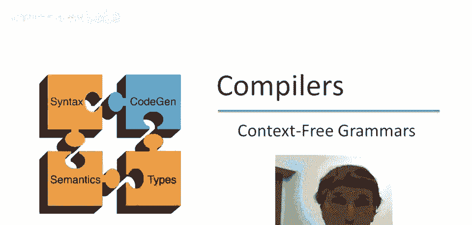

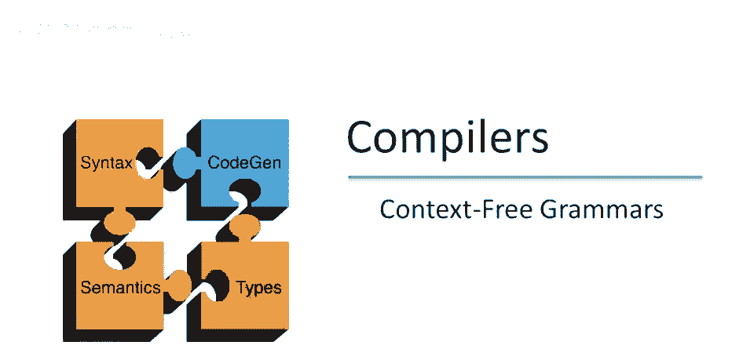

现在，如我们所知，并非所有标记序列都是有效的程序，解析器必须区分它们，它必须知道哪些标记序列是有效的，哪些是无效的。

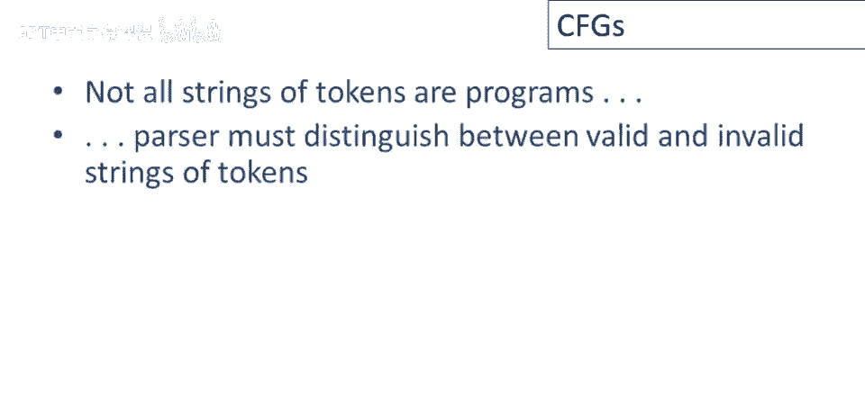

并为无效的序列提供错误消息，因此，我们需要一种描述有效标记序列的方法，然后，某种算法来区分有效和无效的标记序列。

我们还讨论了编程语言具有自然的递归结构，例如，在Cool中，呃，一个表达式可以是许多不同事物之一，所以其中两个可以是if表达式和while表达式，但这些表达式本身是由其他表达式递归组成的，例如。

if的谓词本身是一个表达式，然后分支和else分支也是，在while循环中，终止测试是一个表达式，循环体也是如此，上下文无关文法是描述这种递归结构的自然表示。

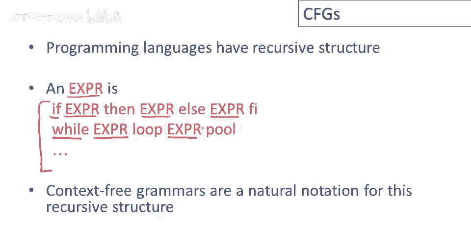

那么上下文无关文法是什么，所以正式来说，它由一组终结符，T，一组非终结符，N，一个开始符号，S，且S是非终结符之一，以及一组产生式组成，那么什么是产生式，一个产生式是一个符号，后跟一个箭头。

后跟一个符号列表，这些符号，呃，有一些规则，所以箭头左侧的x必须是非终结符，这就是在左侧的意思，所以产生式左侧的所有事物都是非终结符，然后右侧，每个yi右侧可以是非终结符，或它可以是终结符。

或它可以是特殊符号，Epsilon。

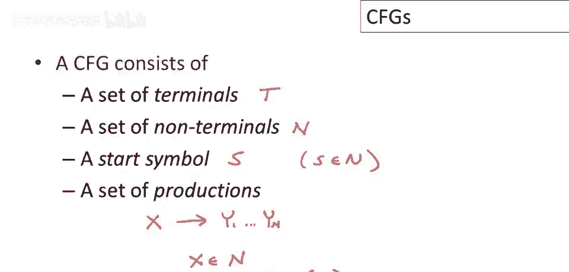

让我们做一个上下文无关文法的简单例子，平衡括号的字符串，我们在之前的视频中讨论过，可以表示如下，我们有开始符号，一个平衡括号字符串的可能情况是它包含一个开，另一组平衡括号和闭括号。

另一组平衡括号的可能为空，因为空字符串也是平衡括号，所以语法有两个产生式，回顾一下，将此示例与前一幻灯片给出的正式定义相关联，我们的非终结符集是什么，仅有一个非终结符s，在这个上下文中。

我们的终结符号是什么，仅是开括号和闭括号，或其他符号，开始符号是什么，它是s，它是唯一的非终结符，所以它必须是开始符号，但通常我们会给出语法，第一个产生式将命名开始简单，所以而不是明确命名。

哪个产生式首先出现，左侧符号将是该上下文自由语法的非终结符，最后，生产式是什么，那里，我们有点，它可以是一组产生式，这里是两个产生式，呃，对于这个特定的上下文，自由语法，现在，生产式可以读作规则。

所以让我们写下示例语法中的一个产生式，这意味着什么，这意味着，无论我们看到一个s，我们可以用右侧的符号串替换它，所以无论我看到一个s，我可以替换，我可以取出s，这是重要的，我从左侧移除s。

并用右侧的符号串替换它，所以，生产式可以读作替换规则，右侧替换左侧，所以这里有一个更正式的过程描述，我们从一个只有开始符号的字符串开始，所以，我们总是从开始符号开始，现在，我们看看我们的字符串。

最初它只是一个开始符号，但它随时间而改变，我们可以用某个非终结符的产生式的右侧，替换字符串中的任何非终结符，例如，我可以用x的某个产生式的右侧替换非终结符x，在这种情况下，x变为y1到y n。

然后重复步骤二，直到无非终结符，直到字符串仅含终结符。

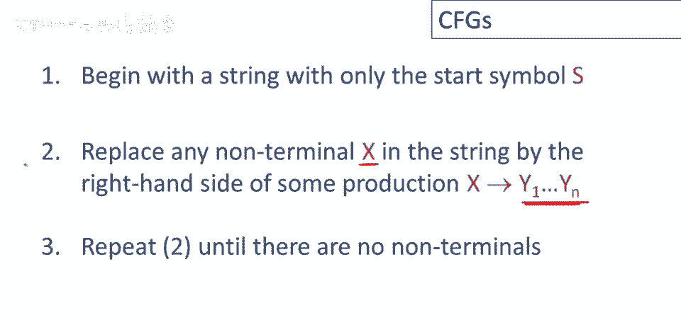

此时完成，稍正式写为，一步包括一个状态，即符号串，含终结符和非终结符，此串中某处有非终结符x，语法中有x的产生式，这是语法的一部分，好的，这是一个产生式，我们可以使用这个产生式，嗯，从，到新状态。

其中我们已替换，X为产生式右端，好的，这是上下文无关推导的一步，现在若要执行多步，我们可以有一堆步骤，Alpha零，进入Alpha一，进入Alpha二，这些都是字符串，现在，Alpha i都是字符串。

随着我们前进，最终得到字符串Alpha n 好吧，然后说alpha零重写为alpha n，零步或多步，这意味着零或更多步，对吧，这只是一个简写，表示，存在一系列个别产生式，个别规则应用于字符串。

使我们从alpha零到alpha，记住，我们通常从开始符号开始，因此，我们有一系列步骤像这样，从开始符号到其他字符串。

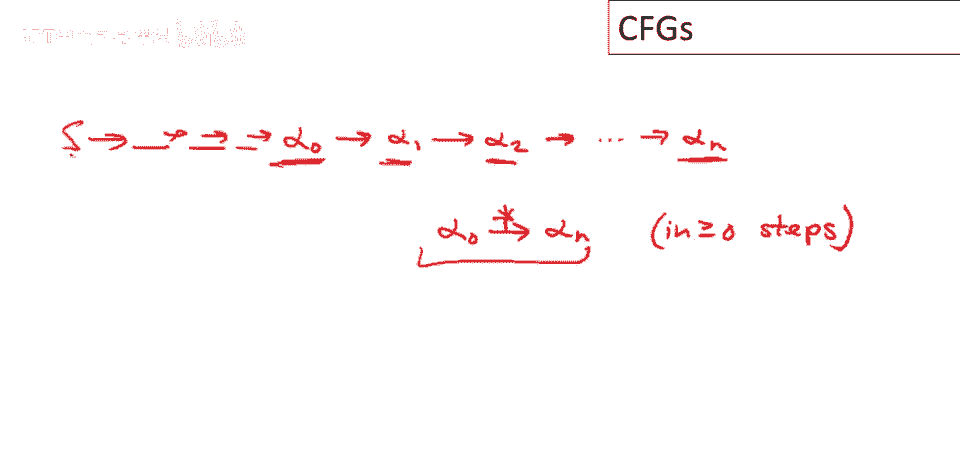

因此，我们可以定义上下文无关文法语言，所以让g是一个上下文无关文法，有一个开始符号s，上下文无关文法语言为符号串，Alpha1至Alpha n，使得对于所有i，Alpha i是g的终结符，好的，所以t。

这里是g的终结符集，S为开始符号，S经过0或更多步到Alpha1，抱歉，Alpha1至Alpha n，好的，那么这说明了什么，这只是说所有终结符串，从开始符号开始，这些是语言中的字符串。

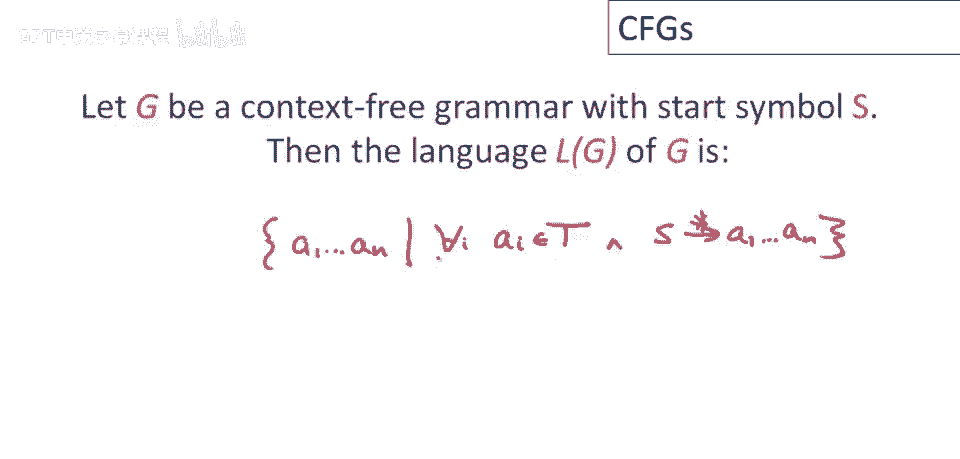

因此，终端来自事实，一旦终端包含在字符串中，没有规则可以替换它们，一旦终端生成，它是字符串的永久特征，在编程语言和上下文无关文法应用中，终端应该是我们建模的语言的标记。

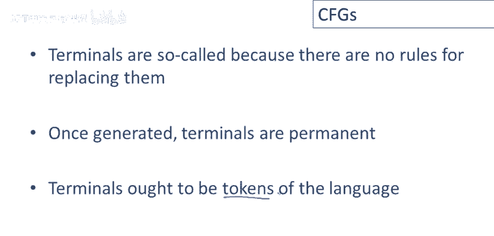

考虑到这一点，让我们为cool片段写一个上下文无关文法，我们之前讨论过cool表达式，但一种可能的cool表达式是if语句或if表达式，回忆一下，cool的if语句有三个部分，并以关键字fee结束。

这有点不寻常，所以，嗯，看着这个，看着这个特定规则，我们可以看到一些惯例，我们使用的大写字母是非终结符，在这种情况下，只有一个非终结符，但我们总是用大写字母写出来，终端符号是小写的，好的。

另一种可能性是，它可能是一个while表达式，最后一种可能性是，它可能是一个标识符id，实际上有很多，更多的可能性，表达式有很多其他情况，让我给你看一点符号，这样东西看起来可能会更好，我们有很多。

我们有很多相同的非终结符的生产，我们通常在语法中把它们分组，然后我们只在右侧写一次非终结符，然后写明确的替代方案，所以这实际上与写出expert箭头两次完全相同，但我们在这里。

这只是一种将这些三个生产组合在一起的方式。

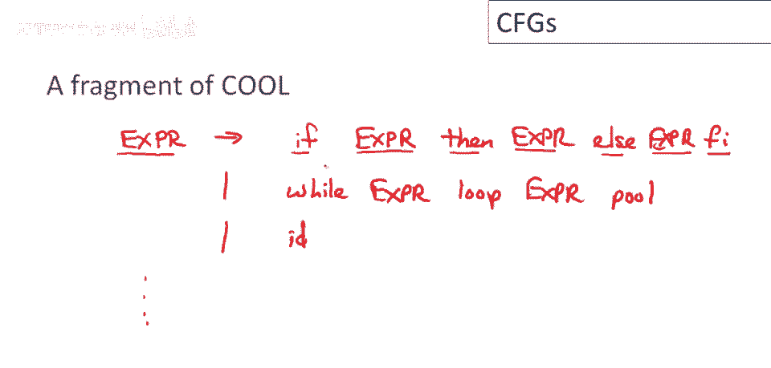

并说pr是所有三个右侧的非终结符，让我们看看这个上下文无关文法语言的字符串，因此，一个有效的cool表达式只是一个标识符，这很容易看到，因为pr是我们的开始符号，我称之为expert，并且有一个生产。

它只说指向id，我可以直接取开始符号到一个终端字符串，单个变量名是一个有效的表达式，另一个例子是一个if表达式，其中每个子表达式只是一个变量名，这是一个完美的cool表达式结构，类似地。

我可以对while表达式做同样的事情，我可以取while的结构，然后替换每个子表达式为一个单一的变量名，那将是一个语法上有效的cool while循环，还有更复杂的表达式，例如。

这里我们有一个while循环作为if表达式的谓词，不是你可能通常想写的，但语法上完全正确，类似地，我也可以有一个if语句，或一个if表达式作为if内部if表达式的谓词，如此嵌套。

这样的if表达式也是语法上有效的。

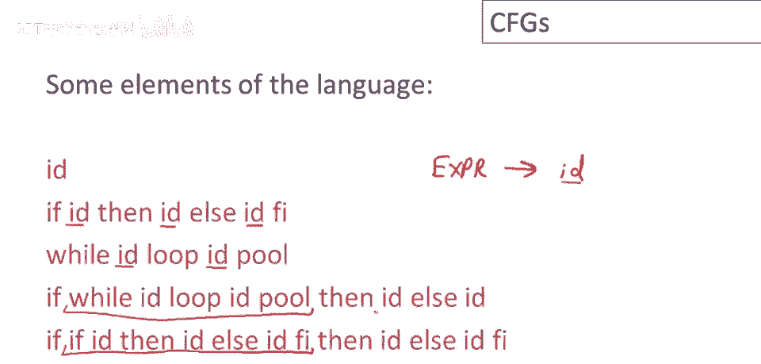

让我们再做另一个语法，这次是简单的算术表达式，所以我们将有我们的开始符号，并且唯一的非终结符，将被称为e，那么可能性是什么，嗯，e可以是表达式的和，或记住这是e箭头的一种替代表示法，它只是说。

我将使用相同的非终结符进行另一个生产，我们有两个表达式的和，或者我们可以有两个表达式的乘积，然后我们可以有出现在括号中的表达式，所以括号表达式，只是为了简单起见，我们可以只作为我们的基础，简单案例。

简单的标识符，所以变量名，这是一个关于加法和乘法的简单语法，它是and在括号和变量名中，所以让我们看看这个语言的一些元素，例如，一个单一的变量名是一个很好的语言元素，Id加id也在这个语言中。

id加id乘id也是如此，如果我们也可以使用括号分组东西，所以我们可以说id加id闭括号乘id，那也是一个你可以使用这些规则生成的，等等，有许多，这种语言中有更多字符串。

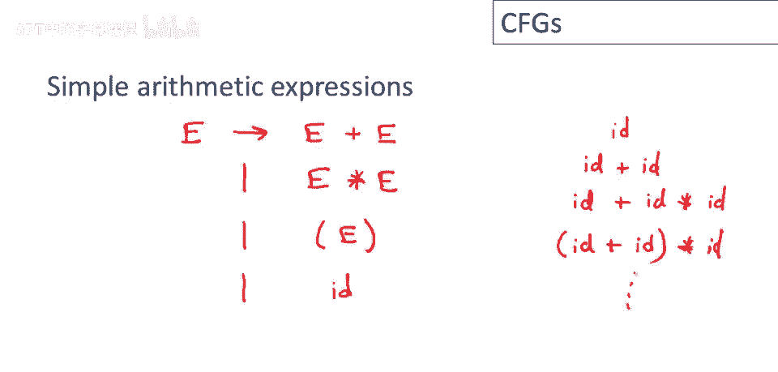

上下文无关文法是向能够用解析器表达我们想要的东西迈出的一大步，但我们仍然需要其他一些东西，首先是一个上下文无关文法，至少就我们目前所定义的那样，它只给我们一个是或否的答案，是，是。

一个字符串是否属于上下文无关文法的语言，它不是，我们还需要一种构建输入解析树的方法，所以在那些属于语言的情况下，我们需要知道它是如何属于语言的，我们需要实际的解析树，不仅仅是是或否。

在字符串不属于语言的情况下，我们必须能够优雅地处理错误，并向程序员提供某种反馈，因此我们需要一种做这件事的方法，最后，如果我们有了这两件事，我们需要它们的实际实现。

以便真正实现上下文无关文法，在我们结束这个视频之前，还有一点要说明，上下文无关文法的形式很重要，工具通常对您编写语法的方式很敏感，虽然有许多方式可以为同一语言编写语法，但只有其中一些可能被工具接受。

正如我们将看到的，在某些情况下，有必要修改语法，以便工具能够接受它，实际上，这也经常发生在正则表达式中，但这种情况要少得多，因此，对于大多数正则表达式，您会希望编写工具能够很好地消化它们，那也不是真的。

那也不适用于任意的上下文无关文法。

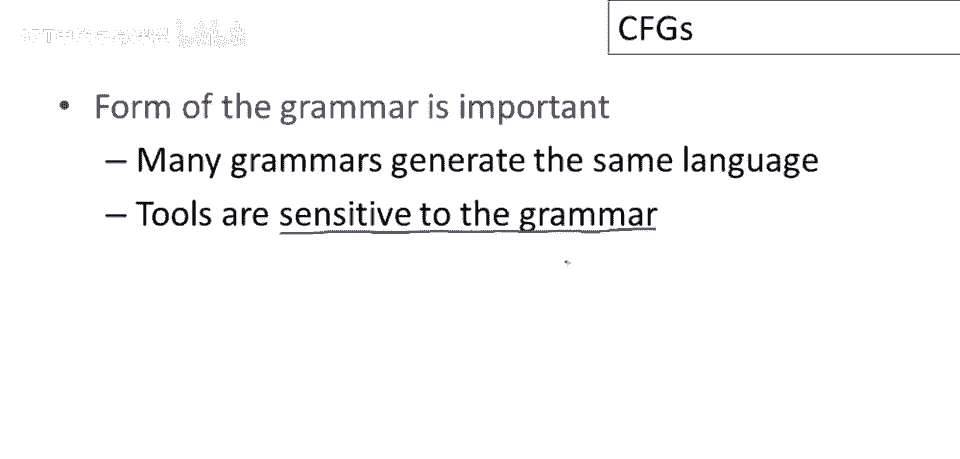