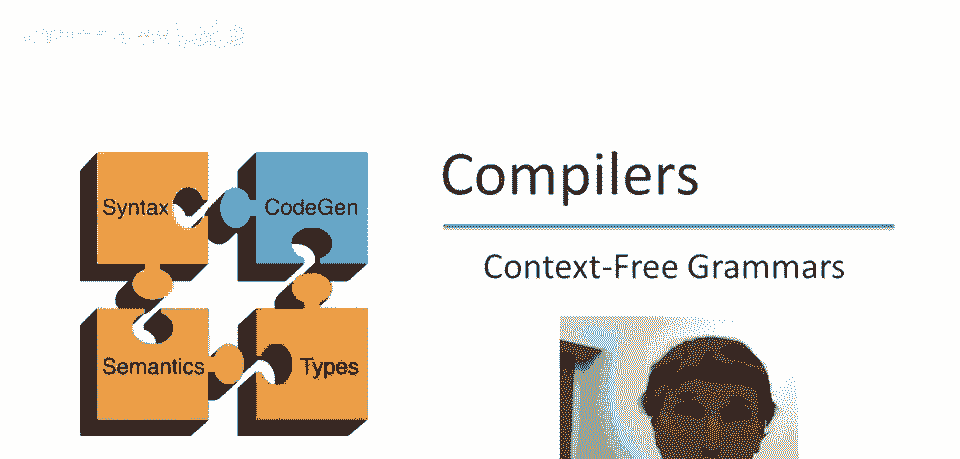
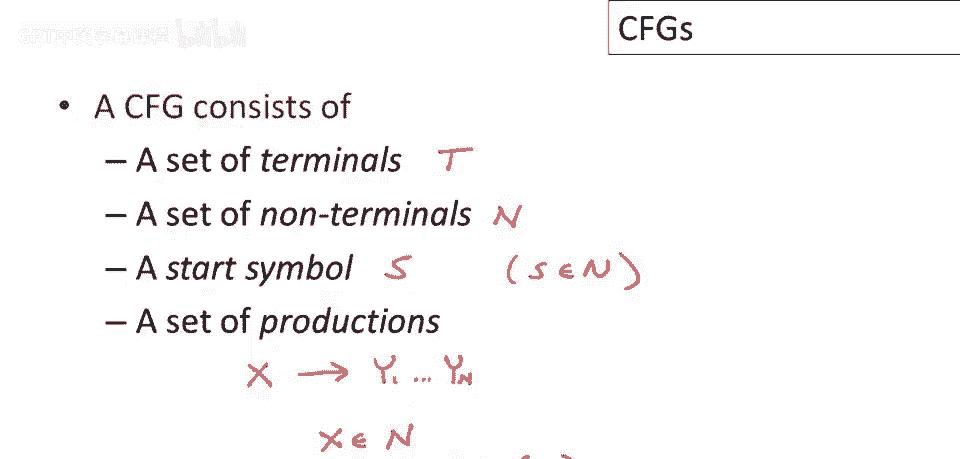
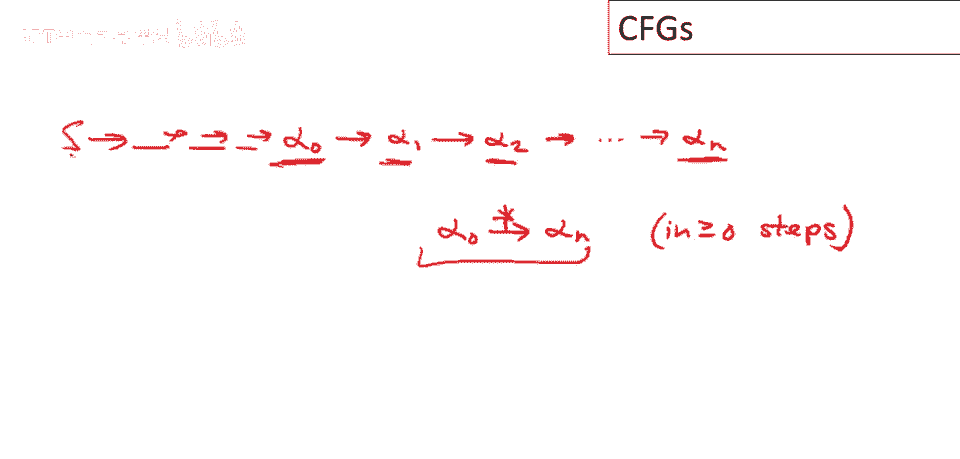
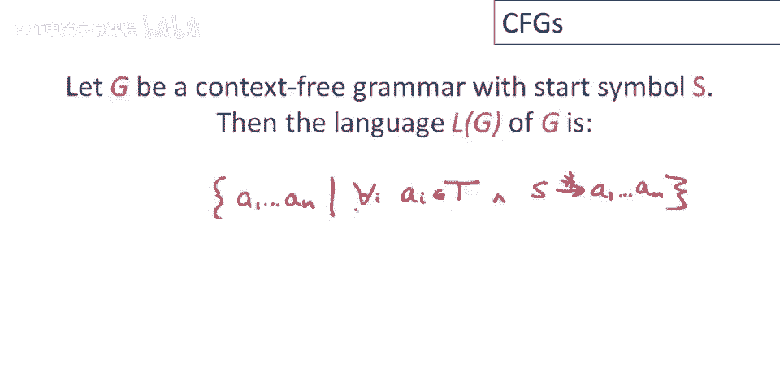
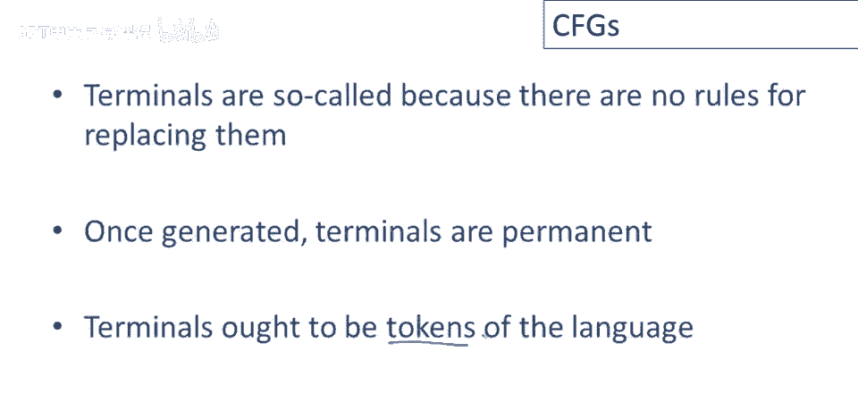
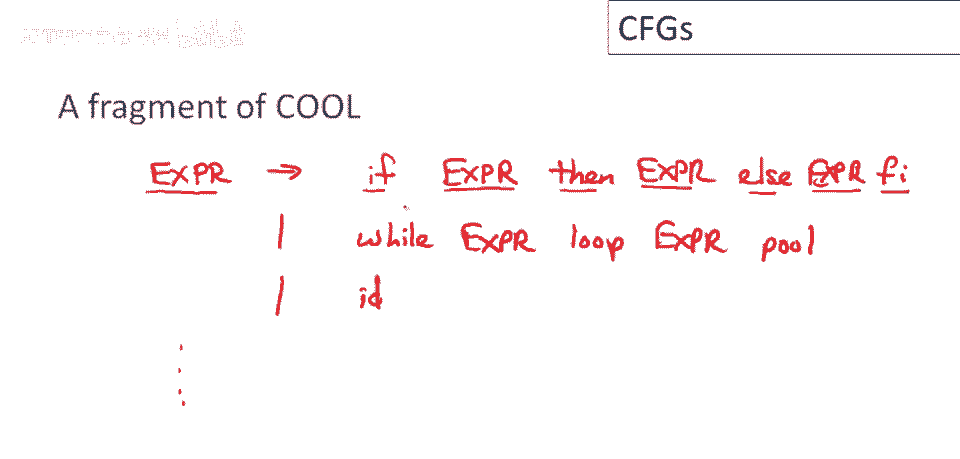
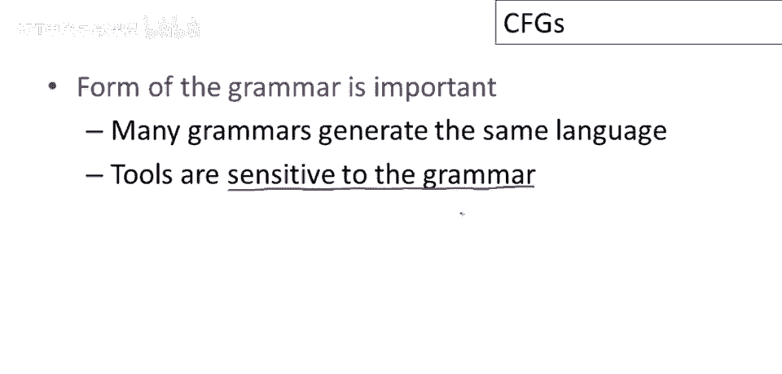

# 课程 P18：上下文无关文法入门 🧩


在本节课中，我们将要学习**上下文无关文法**的基本概念。这是一种用于描述编程语言等具有递归结构的语言的形式化方法。我们将了解它的组成部分、工作原理，并通过几个简单的例子来加深理解。


## 概述

解析器需要区分有效的标记序列和无效的标记序列。为了描述有效的序列，我们需要一种形式化的方法。上下文无关文法正是描述编程语言中这种递归结构的自然工具。


## 什么是上下文无关文法？

正式地说，一个上下文无关文法由以下四个部分组成：
*   **终结符集合 T**：语言中不可再分的基本符号。
*   **非终结符集合 N**：代表语言结构的语法变量。
*   **开始符号 S**：一个特殊的非终结符，是推导的起点。
*   **产生式集合 P**：定义了如何将非终结符重写为符号串的规则。



一个产生式的形式是：
```
X → Y₁ Y₂ ... Yₙ
```
其中，`X` 必须是一个非终结符，而右侧的每个 `Yᵢ` 可以是终结符、非终结符，或者是表示空串的特殊符号 **ε**。

## 推导过程

上一节我们介绍了文法的组成部分，本节中我们来看看如何使用这些规则生成字符串。

推导从一个只包含开始符号 `S` 的字符串开始。然后，我们反复执行以下步骤：
1.  在当前字符串中找到任意一个非终结符 `X`。
2.  在文法中找到一个以 `X` 为左侧的产生式 `X → Y₁ Y₂ ... Yₙ`。
3.  将字符串中的 `X` 替换为右侧的符号串 `Y₁ Y₂ ... Yₙ`。

重复此过程，直到字符串中不再包含任何非终结符。此时得到的终结符串就是该文法语言中的一个句子。


更形式化地，我们可以用 `α ⇒ β` 表示一步推导。如果存在一系列推导步骤 `α₀ ⇒ α₁ ⇒ ... ⇒ αₙ`，则记作 `α₀ ⇒* αₙ`，表示零步或多步推导。

## 文法语言的定义

让 `G` 是一个以 `S` 为开始符号的上下文无关文法。该文法生成的语言 `L(G)` 定义为所有满足以下条件的终结符串 `w` 的集合：
```
S ⇒* w
```
其中 `w` 仅由终结符组成。在编程语言的上下文中，这些终结符通常就是词法分析器生成的**标记**。



## 实例解析

以下是几个上下文无关文法的具体例子。



### 例1：平衡括号字符串



这是一个非常经典的例子。文法可以定义如下：
```
S → ( S )
S → ε
```
*   **非终结符**：`S`
*   **终结符**：`(` 和 `)`
*   **开始符号**：`S`

这个文法描述了所有像 `()`、`(())`、`((()))` 这样成对出现的括号字符串。

### 例2：Cool语言表达式片段



假设我们要为Cool语言的一部分表达式定义文法。以下是一种可能的写法：
```
Expr → if Expr then Expr else Expr fi
Expr → while Expr loop Expr pool
Expr → id
```
这里我们采用了一种简写惯例：将具有相同左侧非终结符的多个产生式写在一起，用 `|` 分隔。因此，上面的写法等价于：
```
Expr → if Expr then Expr else Expr fi
Expr → while Expr loop Expr pool
Expr → id
```
*   **非终结符**：`Expr`
*   **终结符**：`if`, `then`, `else`, `fi`, `while`, `loop`, `pool`, `id`
*   **开始符号**：`Expr`

这个文法可以生成诸如 `id`（一个变量名）、`if id then id else id fi` 或更复杂的嵌套结构（如 `while if id then id else id fi loop id pool`）等有效的Cool表达式。

### 例3：简单算术表达式


让我们定义一个支持加法、乘法和括号的算术表达式文法：
```
E → E + E
E → E * E
E → ( E )
E → id
```
*   **非终结符**：`E`
*   **终结符**：`+`, `*`, `(`, `)`, `id`
*   **开始符号**：`E`

这个文法可以生成像 `id`、`id + id`、`id * id`、`id + id * id` 以及 `(id + id) * id` 这样的表达式。

## 从文法到解析器


上下文无关文法为我们描述语言结构提供了强大的工具，但仅靠它还不够。要构建一个实用的解析器，我们还需要解决以下问题：

*   **构建解析树**：文法只能判断一个字符串是否合法。我们还需要知道它**如何**合法，即构建出反映其语法结构的**解析树**。
*   **错误处理**：当输入不合法时，解析器必须能优雅地报告错误，给出有意义的反馈信息。
*   **高效实现**：我们需要具体的算法（如下节课将介绍的**自顶向下**或**自底向上**解析算法）来实现上述功能。


此外，一个重要的实践要点是：**文法的书写形式会影响解析器的实现**。对于同一个语言，可能存在多种不同的文法描述。然而，特定的解析算法或工具可能只接受其中某些特定形式的文法（例如，消除左递归后的文法）。因此，在实际中，我们经常需要为了适配工具而调整文法的写法。

## 总结



本节课中我们一起学习了上下文无关文法的核心概念。我们了解到，它通过**终结符**、**非终结符**、**开始符号**和**产生式**来形式化地定义一种语言。通过**推导**过程，可以从开始符号生成语言中的所有句子。我们通过平衡括号、Cool表达式片段和算术表达式三个例子实践了文法的设计与理解。最后，我们指出了文法与实际构建解析器之间的桥梁，即我们还需要算法来构建解析树和处理错误，并且文法的具体形式对解析工具至关重要。