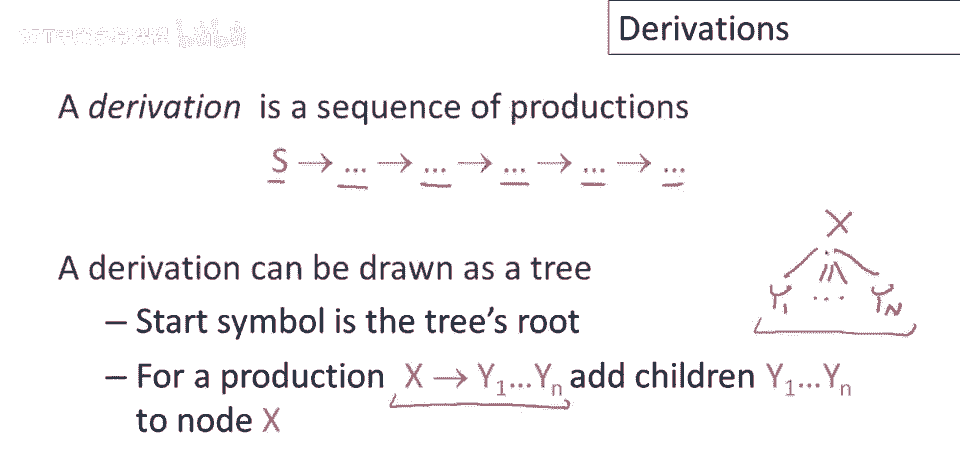
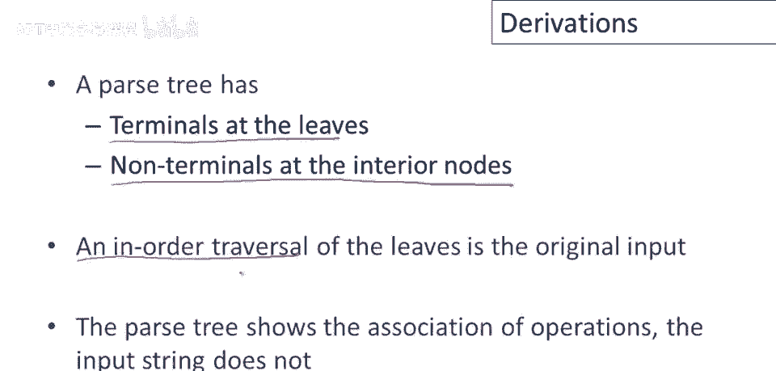
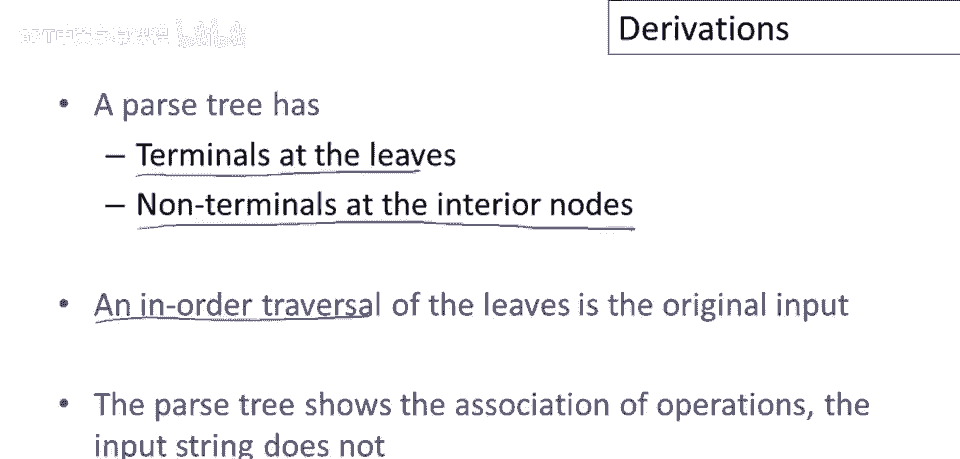
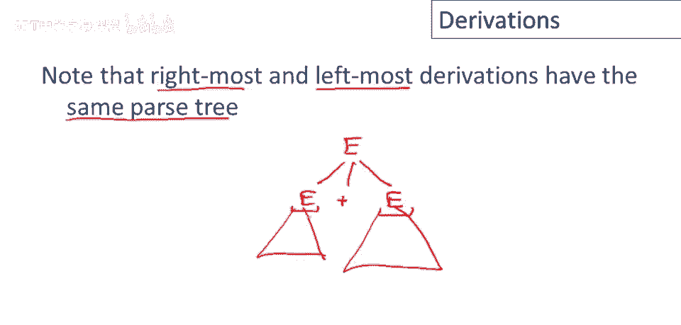
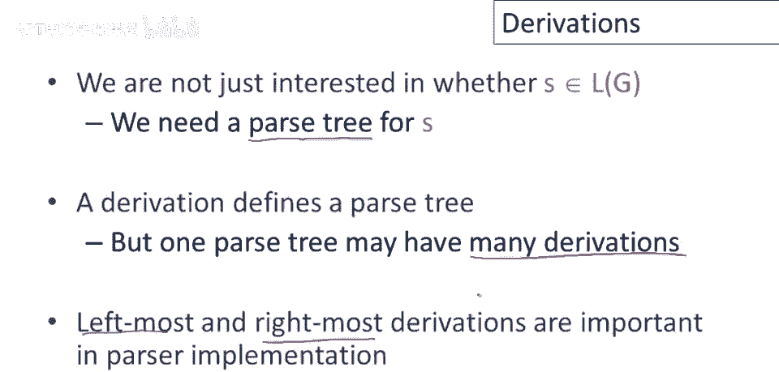

# 编译原理 P19：推导与解析树 🌳


在本节课中，我们将要学习上下文无关文法中的**推导**概念，并了解如何将推导过程可视化为**解析树**。我们将通过一个具体的例子，详细展示从开始符号到目标字符串的推导步骤，以及如何同步构建对应的解析树。


---


## 从推导到解析树

上一节我们介绍了上下文无关文法的基本概念，本节中我们来看看如何通过应用产生式规则来生成字符串，并构建解析树。



推导是指从文法的开始符号出发，反复使用产生式规则，将非终结符替换为终结符或其它符号序列，最终得到目标字符串的过程。这个过程可以线性地记录，也可以绘制成一棵树。

以下是构建解析树的核心规则：
*   当推导中出现非终结符 `X` 时，我们应用一条以 `X` 为左部的产生式规则。
*   假设应用的规则是 `X -> Y1 Y2 ... Yn`，那么在树中，我们将 `Y1, Y2, ..., Yn` 作为节点 `X` 的子节点加入。

---

## 示例：算术表达式的推导与解析

让我们通过一个具体的例子来理解这个过程。考虑一个简单的算术表达式文法，其产生式如下：

```
E -> E + E
E -> E * E
E -> id
```

我们的目标字符串是 `id * id + id`。我们将展示如何为该字符串生成推导，并同步构建解析树。

下图展示了从开始符号 `E` 到目标字符串的推导过程，以及每一步对应的解析树构建状态：


**推导步骤详解：**



1.  **初始状态**：推导式仅包含开始符号 `E`，解析树只有一个根节点 `E`。
2.  **第一步**：应用产生式 `E -> E + E`。在树中，我们为根节点 `E` 添加三个子节点：`E`、`+` 和 `E`。
3.  **第二步**：应用产生式 `E -> E * E` 替换最左边的 `E`。在树中，我们为最左边的 `E` 节点添加三个子节点：`E`、`*` 和 `E`。
4.  **第三步**：应用产生式 `E -> id` 替换当前最左边的 `E`。在树中，我们将 `id` 作为该 `E` 节点的子节点。
5.  **第四步**：应用产生式 `E -> id` 替换中间的 `E`（即 `*` 右边的 `E`）。
6.  **第五步**：应用产生式 `E -> id` 替换最右边的 `E`（即 `+` 右边的 `E`）。

至此，推导完成，我们得到了目标字符串 `id * id + id`，同时也完成了该表达式的解析树构建。


---



## 解析树的特性

解析树以一种清晰的结构化方式展示了推导过程。它具有以下几个重要特性：

以下是解析树的三个关键特性：
*   **叶子节点是终结符**：解析树的所有叶子节点都是文法中的终结符（如 `id`, `+`, `*`）。
*   **内部节点是非终结符**：解析树的所有内部节点都是文法中的非终结符（在本例中全是 `E`）。
*   **叶子节点的遍历结果就是原始输入**：按照从左到右的顺序读取解析树的所有叶子节点，得到的就是我们最初要解析的字符串。

让我们回到之前的例子进行验证。观察最终构建的解析树，可以看到所有叶子节点（`id`, `*`, `id`, `+`, `id`）都是终结符，所有内部节点都是非终结符 `E`。按顺序读取叶子节点，恰好得到 `id * id + id`。


此外，解析树还**隐含了运算的优先级和结合性**。例如，在我们的解析树中，乘法运算 `E * E` 是加法运算 `E + E` 的子树，这意味着乘法比加法具有更高的优先级，计算时会先执行乘法。

---

## 最左推导与最右推导


在之前的示例推导中，我们采用了一种特定的顺序：**每一步都替换当前字符串中最左边的非终结符**。这种推导称为**最左推导**。

自然地，也存在**最右推导**的概念，即每一步都替换当前字符串中最右边的非终结符。对于同一个字符串和同一棵解析树，可以分别写出它的最左推导和最右推导。

下图展示了针对同一字符串 `id * id + id` 和同一棵解析树，其最右推导的构建过程：


**最右推导步骤简述：**
1.  从 `E` 开始，应用 `E -> E + E`（替换最右边的 `E`？此处初始只有一个 `E`，故替换它）。
2.  替换右边新引入的 `E` 为 `id`（`E -> id`）。
3.  替换左边剩下的 `E` 为 `E * E`（`E -> E * E`）。
4.  替换这个新子树中最右边的 `E` 为 `id`。
5.  最后替换剩下的 `E` 为 `id`。

需要指出的是，**同一个解析树既对应一个最左推导，也对应一个最右推导**。它们只是构建树的分支顺序不同。除了最左和最右推导，实际上还存在许多其他可能的推导顺序（例如随机选择非终结符进行替换），但在编译理论中，我们最关注的是最左推导和最右推导。

---



## 总结

本节课中我们一起学习了上下文无关文法中的核心概念——推导与解析树。
*   推导是应用产生式规则生成字符串的过程。
*   解析树是推导过程的图形化表示，它能清晰地展示语法结构、运算优先级和结合性。
*   每个解析树都对应着多个推导，其中**最左推导**和**最右推导**是两种最重要、最规范的推导形式。



理解推导和解析树是后续学习语法分析算法的基础。