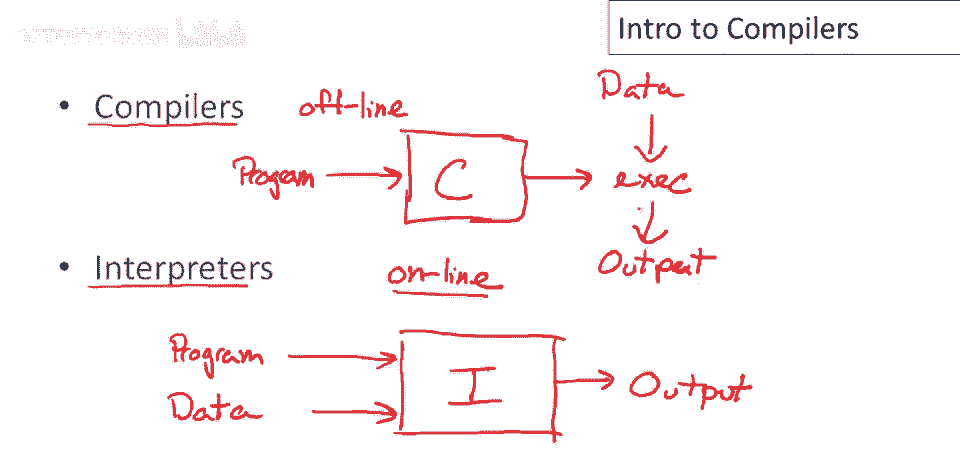
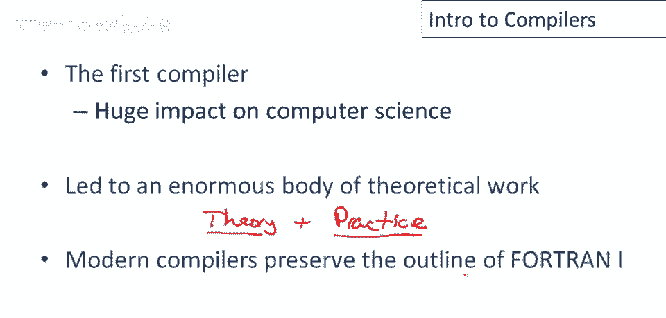

# P1：p01 01-01-_Introduction - 加加zero - BV1Mb42177J7

欢迎这门编译器课程，我叫亚历克斯·艾肯，我是斯坦福大学的教授，我们将讨论编程语言的实现。

实现编程语言有两种主要方法，编译器和解释器，这门课主要讲编译器，但我想在第一节课说几句解释器，解释器擅长做什么，我会画张图，这个盒子是解释器，它接收，让我用大字标上，它以输入接收，你的程序，你编写的。

以及你想运行的程序的数据，并直接产生输出，这意味着它不处理程序，在执行输入之前，所以你只需编写程序，然后运行解释器处理数据，程序立即开始运行，因此可以说解释器是实时的，意味着它的工作是运行程序的一部分。

编译器结构不同，我们可以在这里画个图，用一个大写的C标记编译器，编译器以程序为输入，仅此而已，然后生成可执行文件，此可执行文件可能是汇编语言，可能是字节码，可能是多种实现语言的其中之一。

但现在可单独运行于数据上，这将产生输出，好的，嗯，在这种结构中，嗯，编译器离线，意味着我们先预处理程序，编译器本质上是一个预处理步骤，产生可执行文件，然后我们可以在多个，不同输入上运行相同的可执行文件。

无需重新编译或对程序进行其他处理。

我认为，稍微介绍一下编译器和解释器，最初是如何开发的有帮助，故事始于20世纪50年代，特别是IBM制造的704机器，这是他们的首台商用成功机，尽管之前曾尝试过一些早期机器，但无论如何。

关于704有趣的是，一旦客户开始购买和使用它，他们发现软件成本，超过了硬件成本，而且不仅仅是一点点，而是很多，这很重要，因为这些，当年硬件极其昂贵，即使那时硬件绝对昂贵，再也不会那么贵了，已经。

软件是充分利用计算机的主要成本，这促使许多人，思考如何更好地编写软件，如何提高编程生产力。

提高编程生产力的最早尝试之一称为快速编码，153年由约翰·巴库斯开发，现在速编可视为早期解释器示例，和所有解释器一样，它有优缺点，主要优点是程序开发快，因此程序员效率更高，但缺点也不少。

速编程序代码比手写慢10-20倍，今天解释器程序也如此，若使用解释器实现，通常比编译或手写慢，速度码解释器占300字节，这看起来并不多，实际上，今天300字节像极小程序，但在那时。

要记住这是机器内存的30%，这是74整个内存的30%，解释器占的空间成关注点，速度编码未流行，但约翰·巴库斯认为有前途，他有了另一个项目想法，当时最重要的应用是科学计算，程序员认为。

以机器可执行的形式写下公式，约翰认为，速度编码的问题在于公式实际上被解释，他认为，如果首先将公式翻译成机器可直接执行的形式，代码将更快，同时仍允许程序员以高级别编写程序。

于是公式翻译项目或FORTRAN项目诞生了，Fortran运行于1954至1957，有趣的是，他们以为只需1年建编译器，但最终花了3年，就像今天，他们并不擅长预测软件项目时长。

但到1958年是个成功项目，超过50%的代码是Fortran，50%的程序是Fortran，对新技术的迅速采纳，今天有这种成功我们很满意，当然那时他们欣喜若狂，当时人们认为FORTRAN提高了抽象水平。

提高了程序员生产力，并让每个人更好地利用这些机器。

因此FORTRAN 1是第一个成功的高级语言，它对计算机科学产生了巨大影响，特别是它导致了大量理论工作，实际上关于编程语言有趣的是理论和实践的结合，因为在编程语言中很难做好工作，没有扎实理论和工程技能。

很难构建优秀系统，编程语言中有大量优秀系统构建材料，通常涉及微妙且富有成效的理论交互，我认为这是该领域最吸引人的地方之一，作为计算机科学学科的研究主题，Fortran的影响不仅限于计算机科学研究，当然。

还促进了实用编译器的开发，事实上，其影响深远至今，现代编译器仍保留四阶段。

那么FORTRAN 1的结构是？它由五个阶段组成，嗯，词法分析和语法分析，共同处理语言语法方面，哪个，当然，负责更多语义方面，类型和范围等，规则，优化，程序的转换集合，以加快运行或减少内存使用。

最后是代码生成，实际进行到另一种语言的翻译，根据目标，翻译可能是机器码，可能是虚拟机的字节码，甚至可能是另一种高级编程语言，好的，本次讲座就到这里。

