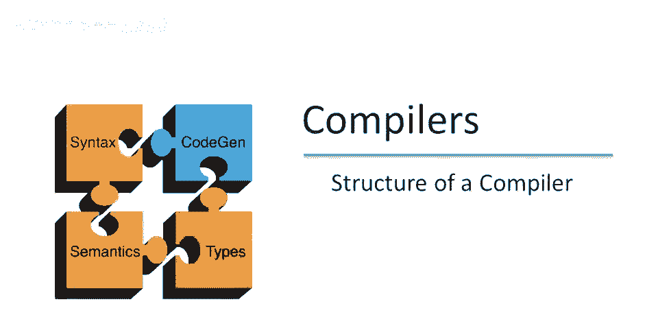
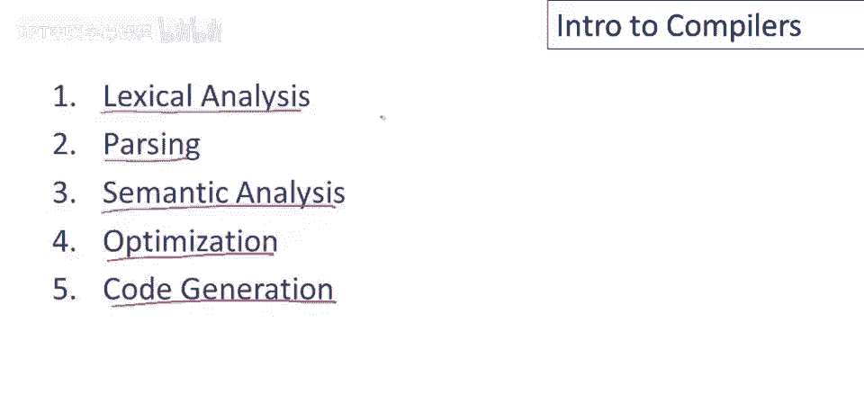
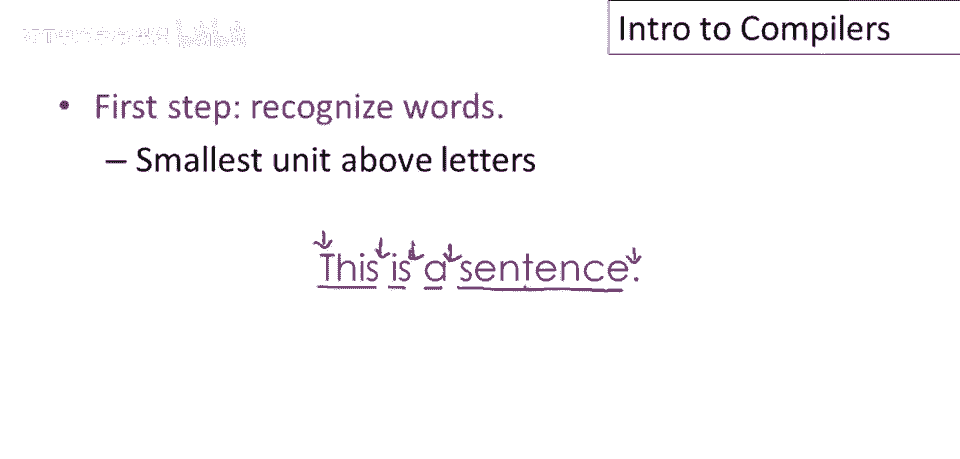
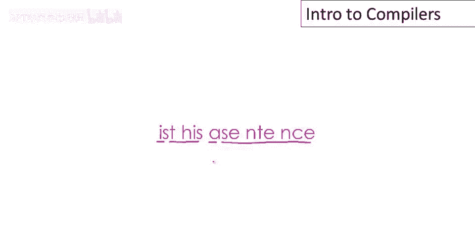
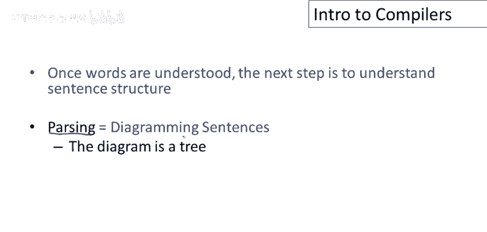
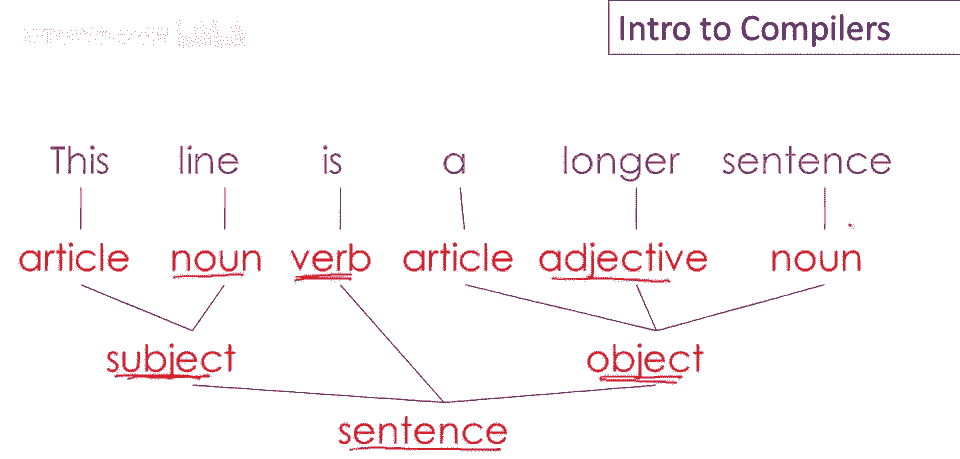
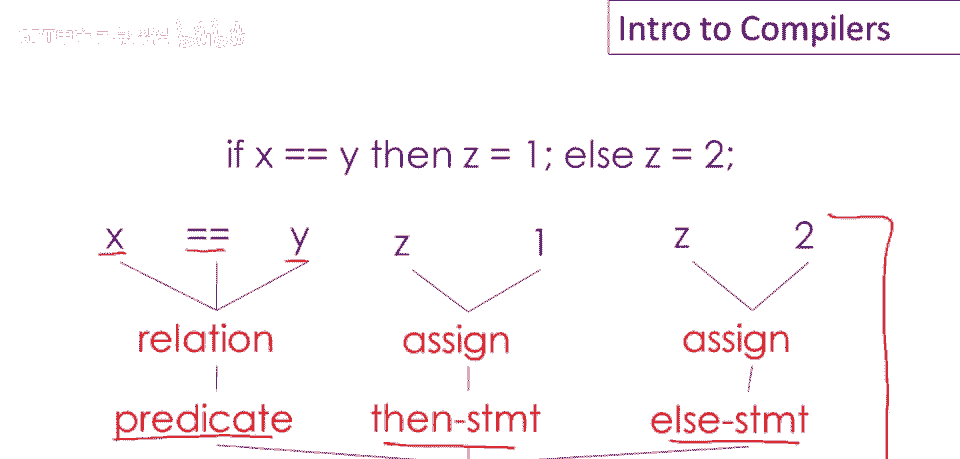
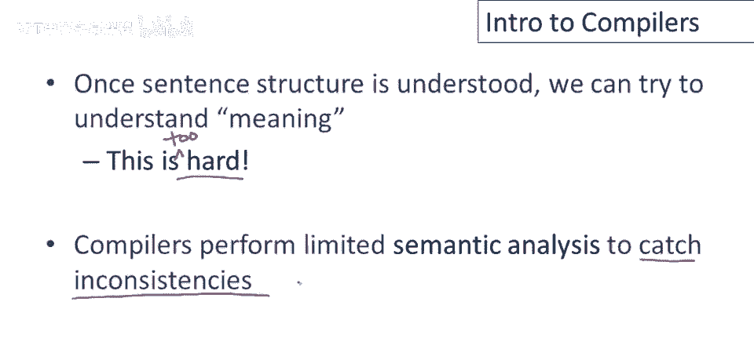
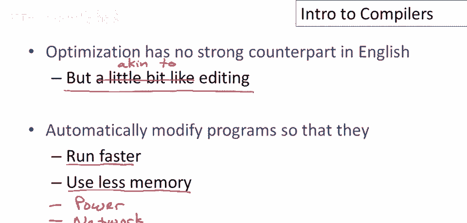

# 编译器结构概述（P2）📚


在本节课中，我们将学习编译器的基本结构。编译器是一个将高级编程语言（如C、Java）转换为计算机能执行的机器代码或低级代码的程序。理解其结构是学习编译原理的第一步。



我们将概述编译器的五个主要阶段，并通过与人类理解英语的类比，帮助初学者直观地理解每个阶段的作用。



---

## 词法分析：识别单词 🔤



上一节我们介绍了编译器的整体框架，本节中我们来看看第一个阶段：词法分析。它的目标是将程序文本分解成有意义的“单词”，在编译器中称为“标记”。

人类阅读英语时，能自动识别单词间的分隔符（如空格和标点）。编译器进行词法分析时，做的也是类似的工作：扫描源代码，识别出关键字、变量名、常数、运算符和分隔符等基本单元。

以下是程序文本示例及其标记识别过程：
```
if (x == y) then z = 1; else z = 2;
```
*   **关键字**：`if`, `then`, `else`
*   **变量名**：`x`, `y`, `z`
*   **常数**：`1`, `2`
*   **运算符**：`==`（双等号）, `=`（赋值符）
*   **标点/分隔符**：`(`, `)`, `;`, 空格


一个有趣的问题是，词法分析器如何知道`==`是一个整体（比较运算符），而不是两个单独的`=`（赋值符）？这将在后续关于词法分析实现的课程中详细讨论。



---

## 语法分析：理解句子结构 🌳

一旦识别出单词，下一步就是理解句子的结构，这个过程称为语法分析或解析。就像在语文课上分析句子成分一样，编译器需要理解程序中各种结构的组合关系。



解析的结果通常表示为一棵树，称为“语法分析树”或“抽象语法树”。这棵树展示了程序如何由更小的部件层层嵌套组成。

以我们的示例代码为例，其解析树的根节点是一个`if-then-else`语句。这个语句可以分解为三部分：
1.  **谓词（条件）**：`(x == y)`，它本身由变量`x`、运算符`==`和变量`y`组成。
2.  **then分支**：`z = 1`，是一个赋值语句。
3.  **else分支**：`z = 2`，也是一个赋值语句。

这棵树清晰地展示了代码的层次化结构。



---

## 语义分析：检查含义一致性 🧐



理解了句子结构后，我们需要尝试理解其含义。对于编译器来说，完全的“理解”过于困难，因此语义分析主要专注于检查程序中的不一致性和错误。

这类似于在英语中处理指代歧义。例如，句子“Jack说Jerry把他的作业忘在家里了”中的“他的”指的是Jack还是Jerry？在没有上下文的情况下，这是模糊的。

在编程语言中，一个核心的语义分析任务是**变量绑定**，即确定一个变量名具体指向哪个声明。现代编程语言通过严格的规则（如词法作用域）来消除这种歧义。


此外，编译器还会进行**类型检查**等语义分析。就像知道“Jack（他）把作业忘在家里了”中的“Jack”和“她”类型不匹配一样，编译器会检查变量和操作的数据类型是否一致。

---


## 优化：提升程序效率 ⚡

优化阶段在人类语言中没有直接的对应，但可以类比为编辑对文章进行精简和润色，使其更简洁、高效，同时不改变原意。


程序优化的目标是修改程序，以减少其对各种资源的使用，例如：
*   **运行时间**：让程序执行更快。
*   **内存空间**：减少程序占用的内存。
*   **功耗**：降低移动设备的能耗。
*   **网络通信**：减少发送的消息数量。

然而，优化必须谨慎进行。例如，一个看似正确的优化规则 `X = Y * 0` 可以优化为 `X = 0`，这对于整数是成立的，但对于浮点数则可能出错（因为根据IEEE标准，`NaN * 0` 的结果是 `NaN`，而非 `0`）。编译器必须精确地知道何时能安全地应用某种优化。



---

## 代码生成：翻译为目标语言 🌐

编译器的最后阶段是代码生成，通常是将高级程序翻译成汇编语言或机器码。这完全类似于人类将一种语言翻译成另一种语言。


这个阶段负责产出最终可被计算机硬件或虚拟机直接执行的低级代码。


---

## 总结 📝

本节课中我们一起学习了编译器的五个核心阶段：
1.  **词法分析**：将源代码拆分为标记（单词）。
2.  **语法分析**：根据语法规则构建解析树，理解程序结构。
3.  **语义分析**：进行一致性检查（如变量绑定、类型检查）。
4.  **优化**：改进程序性能，减少资源消耗。
5.  **代码生成**：翻译成目标低级代码。

值得注意的是，随着编译器技术的发展，各阶段的复杂性和比重已发生变化。早期编译器（如FORTRAN 1）各阶段复杂度分布较均匀；而现代编译器的核心复杂性集中在**语义分析**和**优化**这两个阶段，词法分析和语法分析因有成熟工具而变得简单，代码生成也因技术成熟而相对稳定。


在后续的课程中，我们将对每个阶段进行深入详细的研究。