# 课程 P20：歧义与消歧 📚


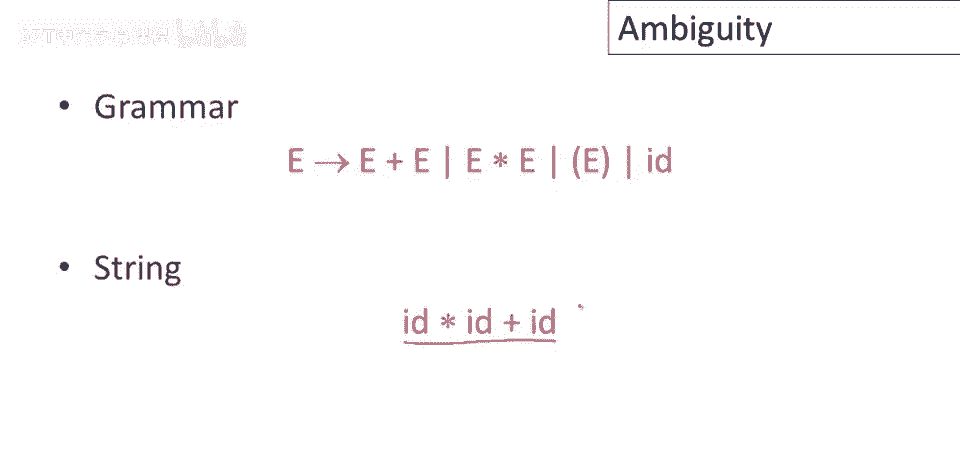

在本节课中，我们将要学习编程语言文法中的**歧义**问题。我们将了解什么是歧义文法，为什么它在编程语言设计中是不受欢迎的，以及如何通过重写文法或使用消歧声明来解决这个问题。

---

## 什么是歧义文法？🤔

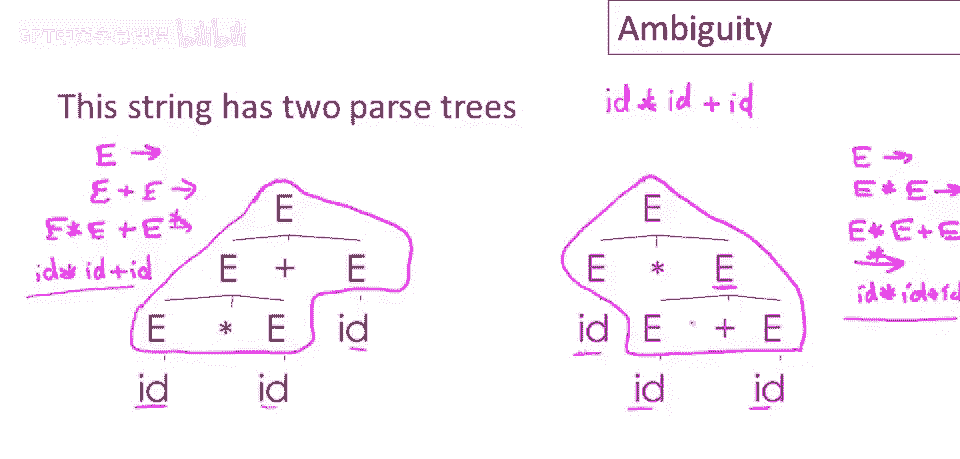

上一节我们介绍了课程主题，本节中我们来看看歧义的具体定义。

如果一个文法对于某些字符串能生成**多个不同的解析树**，那么它就是歧义的。另一种说法是，对于某些字符串，存在多个**最左推导**或**最右推导**。

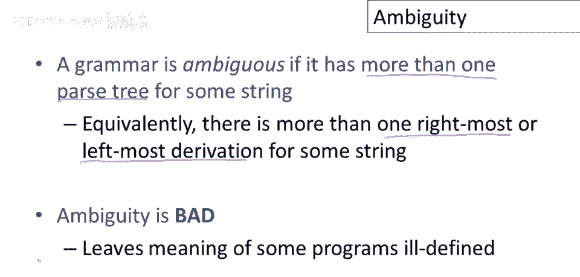

例如，考虑一个简单的表达式文法，它包含加法和乘法操作符以及标识符（id）。对于字符串 `id * id + id`，该文法可以生成两个完全不同的解析树。

以下是两个可能的解析树推导过程：

*   **解析树 A（先做加法）**：
    1.  从开始符号 `E` 开始。
    2.  使用产生式 `E -> E + E`。
    3.  将最左边的 `E` 替换为 `E * E`（使用 `E -> E * E`）。
    4.  最后，将所有的 `E` 推导为 `id`。

*   **解析树 B（先做乘法）**：
    1.  从开始符号 `E` 开始。
    2.  使用产生式 `E -> E * E`。
    3.  将最右边的 `E` 替换为 `E + E`（使用 `E -> E + E`）。
    4.  最后，将所有的 `E` 推导为 `id`。

这两个推导过程产生了结构不同的解析树，这意味着同一个程序 `id * id + id` 有两种可能的解释。这会让编译器困惑，因为它不知道应该按照哪种解释来生成代码。因此，**歧义在编程语言中是需要避免的**。

---

## 方法一：重写文法以消除歧义 ✍️

消除歧义最直接的方法是**重写文法**，使其生成相同的语言，但每个字符串只对应唯一的解析树。

### 表达式文法的重写

我们之前有歧义的表达式文法可以重写如下：

```
E  -> E + T | T
T  -> T * F | F
F  -> id | ( E )
```

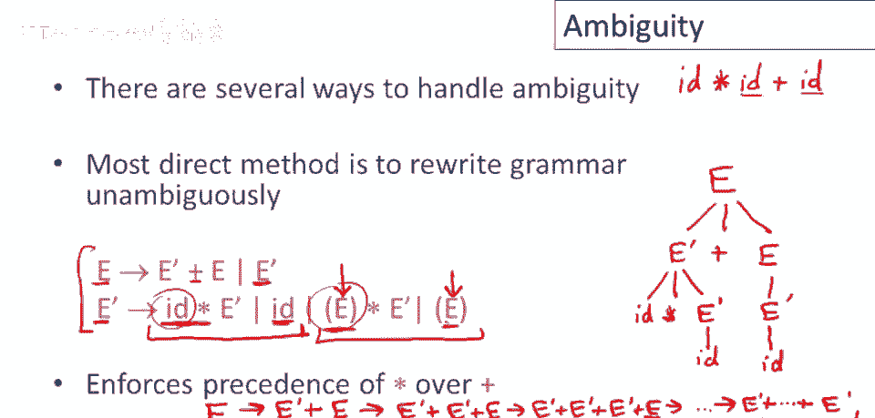

在这个新文法中：
*   **`E` (表达式)** 负责生成加法。
*   **`T` (项)** 负责生成乘法。
*   **`F` (因子)** 负责生成标识符和括号表达式。

让我们看看新文法如何唯一地解析 `id * id + id`：
1.  从 `E` 开始。
2.  为了生成加号 `+`，必须使用产生式 `E -> E + T`。
3.  左边的 `E` 必须最终推导为 `T`，而 `T` 为了生成乘号 `*`，必须使用 `T -> T * F`。
4.  这样，乘法操作 `*` 就被嵌套在加法操作 `+` 的解析树内部。


**核心机制**：通过分层非终结符（`E`, `T`, `F`），文法强制规定了操作符的优先级。乘法（由 `T` 控制）比加法（由 `E` 控制）绑定得更紧密，且都在括号（由 `F` 控制）之内。括号内的 `E` 允许重新开始整个优先级链条。

通过这种重写，原来有歧义的字符串 `id * id + id` 现在只对应一个解析树，其中乘法优先于加法计算。

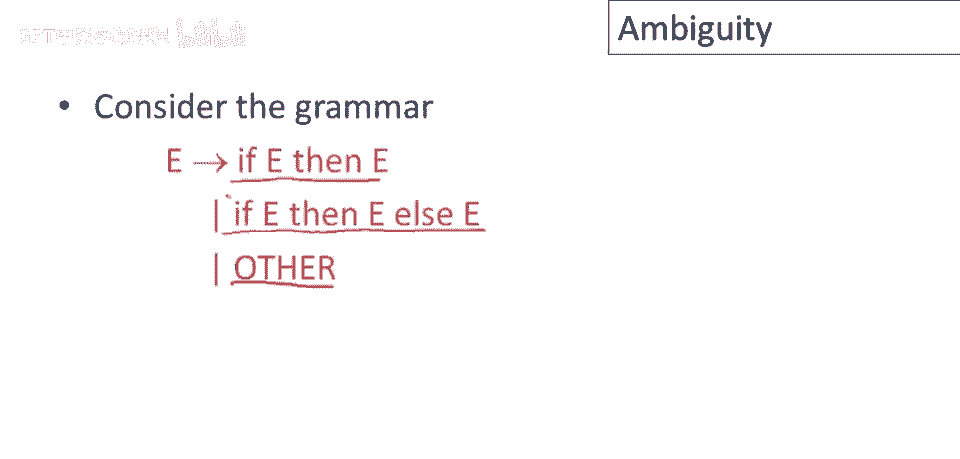

---


## 方法二：使用消歧声明 🛠️

重写文法虽然有效，但有时会使文法变得复杂且不直观（例如 `if-then-else` 语句的无歧义文法就非常复杂）。因此，许多实用的解析器生成工具采用了另一种方法：**允许使用有歧义但更自然的文法，同时提供消歧声明**。

最常见的消歧声明是**优先级**和**结合性**声明。

### 结合性声明

即使只有一个操作符（如加法），也可能存在歧义。例如文法 `E -> E + E | id` 对于 `id + id + id` 是歧义的，因为它没有指明加法是左结合还是右结合。

在工具（如Bison）中，可以这样声明：
```
%left ‘+’
```
这声明了 `+` 是**左结合**的，从而排除了右结合的解析树，确保了表达式 `a + b + c` 被解释为 `(a + b) + c`。

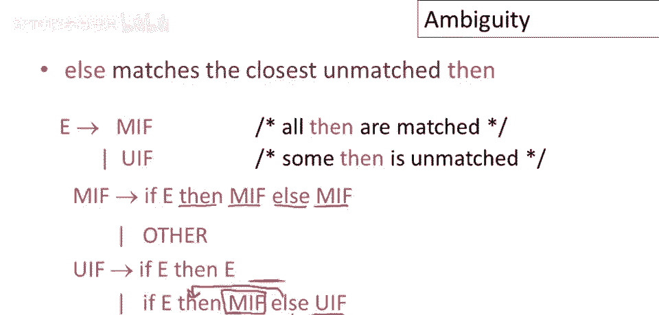

### 优先级声明

对于包含多个操作符的文法（如加法和乘法），可以通过声明顺序来指定优先级。

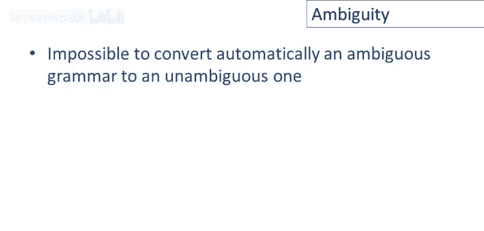

```
%left ‘+’
%left ‘*’
```
在Bison中，后声明的操作符具有更高的优先级。因此，`*` 的优先级高于 `+`，这确保了乘法在加法之前计算。同时，它们都被声明为左结合。


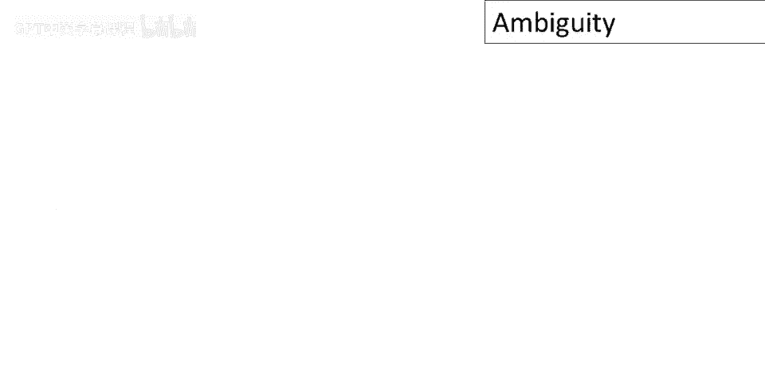

**重要提示**：这些声明在解析器内部的实际工作原理并非直接“理解”优先级，而是指导解析器在遇到冲突时做出特定的移进/归约决策。在大多数情况下，它们的行为符合直觉，但在某些边缘情况下可能需要特别注意。

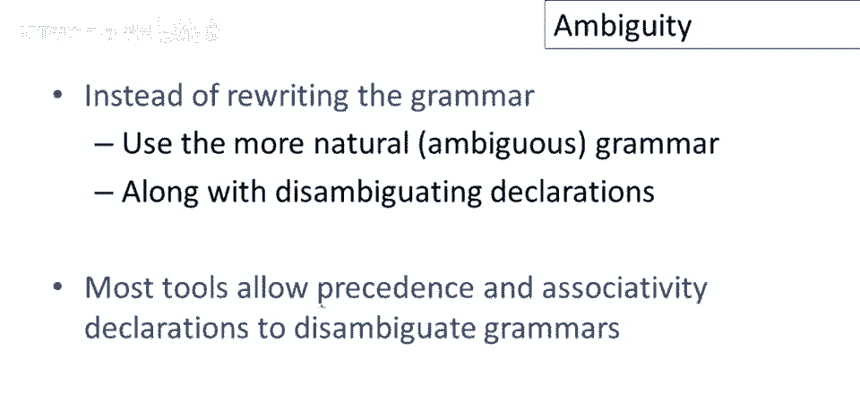

---

## 总结 📝

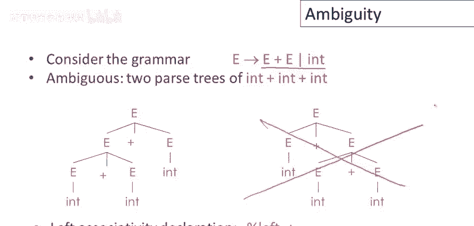

本节课中我们一起学习了编程语言文法中的歧义问题。

1.  **歧义的定义**：如果一个文法能为某些字符串生成多个解析树，则该文法是有歧义的。这会导致程序含义不明确。
2.  **消除歧义的方法一**：**重写文法**，通过引入分层级的非终结符（如 `E`, `T`, `F`）来强制规定操作符的优先级和结合性，从而保证每个字符串只有唯一解析树。
3.  **消除歧义的方法二**：**使用消歧声明**，在解析器生成工具中，允许使用更简洁但有歧义的文法，同时通过 `%left`、`%right` 等声明来指定操作符的结合性和优先级，让工具自动处理歧义。

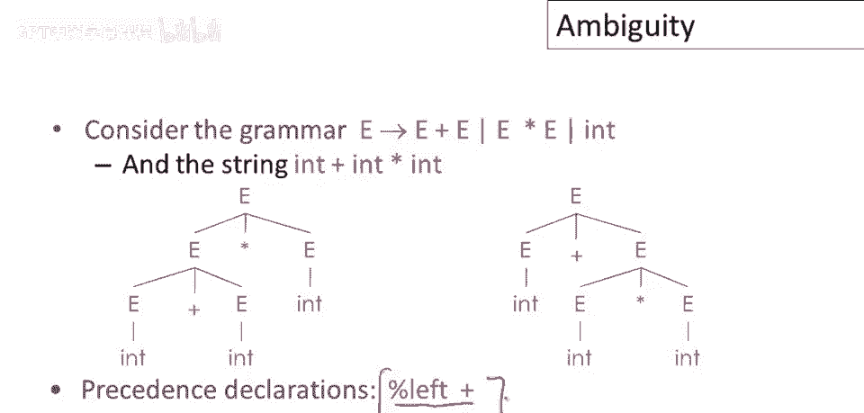

理解并解决文法的歧义，是设计编译器前端和确保编程语言行为一致性的关键一步。