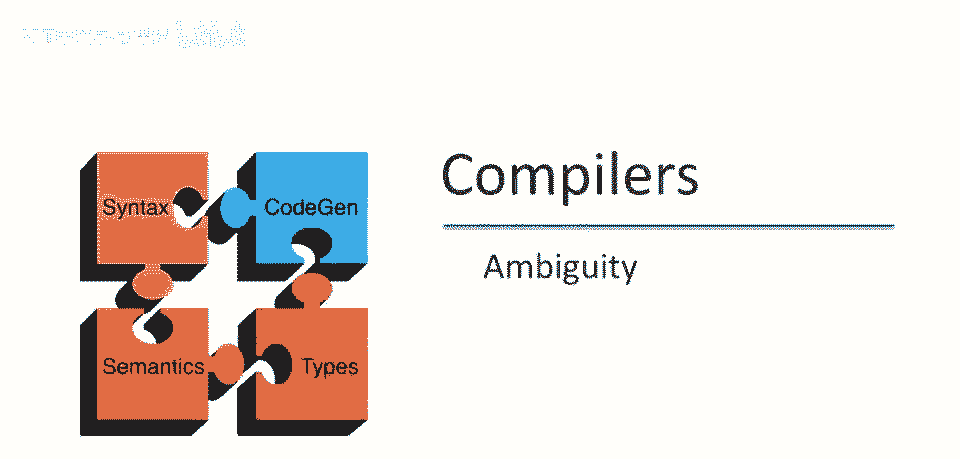
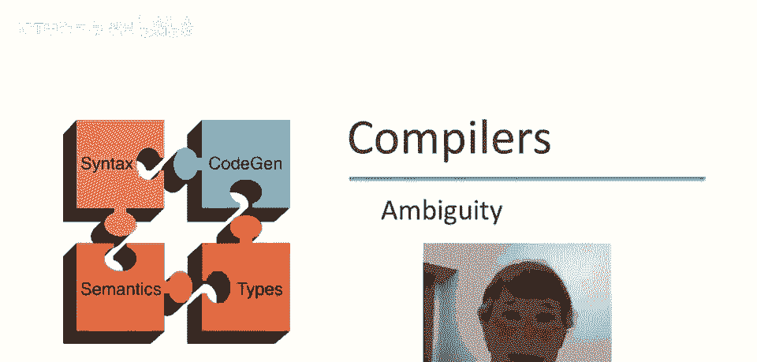
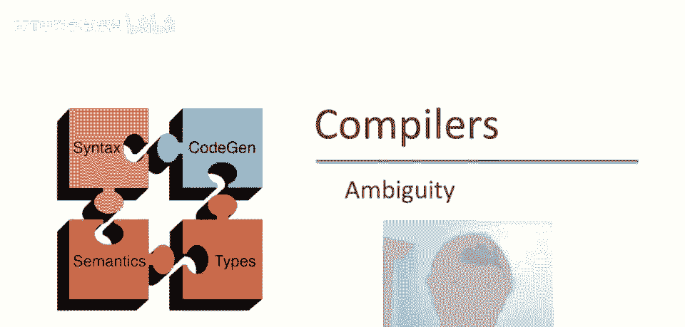
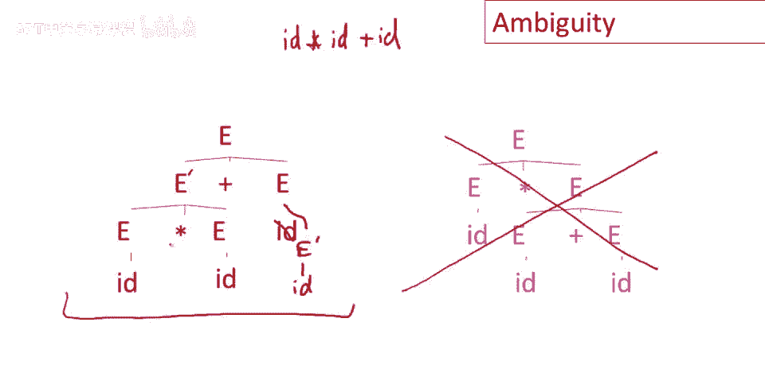
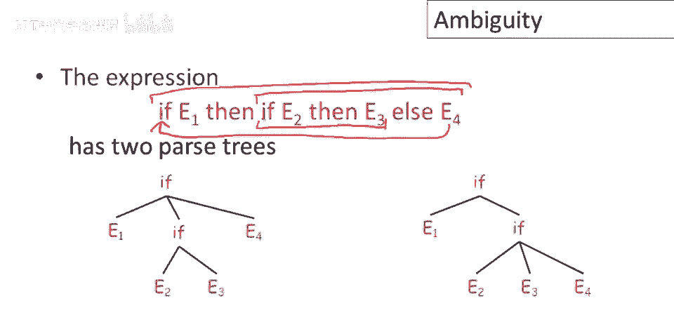
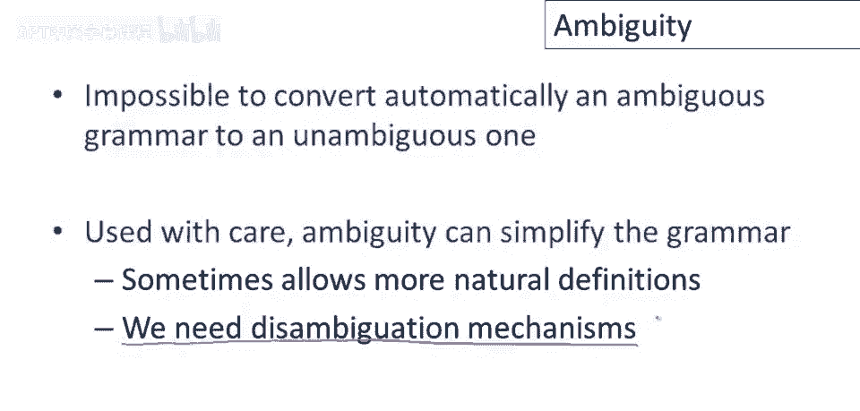

# P20：p20 05-04-_Ambiguity - 加加zero - BV1Mb42177J7

本视频将讨论，歧义语境。

自由文法，编程语言中的，及应对方法。

从表达式语法开始，加法和乘法标识符，仅看字符串id乘id加id。

该字符串有两个解析树，id乘id加id，使用该语法有两个解析树，先做左侧解析树，首先，从开始符号e开始，该推导的第一项必须是，e到e加e，e加e，然后替换最左边的e为e乘e，使用e到e乘e，还剩下加e。

此时可看到该解析树，完成这两项推导，解析树构建完成，其余推导生成这些id，共需3项推导，完成这些，将得到id乘id加id，没问题，现在切换到右侧解析树，或解析树右侧，同样从e开始。

但这次先使用e到e乘e，然后替换最右边的为e加e，得到e乘e加e，完成这两项推导，解析树构建完成，再次使用3项推导，可得到id乘id加id，可以看到，有两个推导产生两个解析树，明确来说。

每个解析树有多个推导，每个解析树有左推导，右推导和其他推导，这里是不同情况，有两个不同的解析树，每个解析树有多个推导，每个解析树有左推导，右推导和其他推导，这种情况不同，这里有两个解析树。

我们有两种推导，产生完全不同的解析树。

这就是歧义文法的标志或定义，如果一个文法对于某些字符串有多个解析树，那么它就是歧义的，另一种说法是，对于某些字符串，存在多个，最右或最左推导，因此，如果某个字符串有两个或更多个最右推导。

或两个或更多个最左推导，那么该字符串将有两个不同的解析树，该文法将是歧义的，歧义是不好的，如果某些程序有多个解析树，那么基本上意味着你让编译器选择，程序的两个可能解释中，你想要它生成代码的那个。

这不是一个好主意，我们不喜欢编程语言中的歧义，并将关于程序含义的决定留给编译器。

现在有几种方法可以从文法中消除歧义，最直接的方法，也是我们首先讨论的，就是重写文法，使其无歧义，即编写一个新的文法，生成与旧文法相同的语言，但每个字符串只有一个解析树，这是我们所看过的文法的重写。

让我们再次写下我们最喜欢的输入字符串，Id times id plus id，让我们看看根据这个新文法，该字符串将如何被解析，我们从开始符号e开始，现在注意，e不再生成加号或乘号，实际上。

我们现在将文法分成了两套产生式，两个非终结符，e控制加号的生成，e prime控制乘号的生成，好的，那么为了生成加号，我们必须使用e prime plus e的生产式，没有其他方法可以做到，现在。

如果我们看看e prime，e prime能做什么呢，e prime可以生成标识符乘以某些东西，如果你看看这个文法，那就是，唯一可以生成标识符乘以其他东西的生产式。

涉及乘号的唯一其他可能性是生成括号表达式，这显然不会匹配我们正在尝试解析的字符串，所以我们必须使用这个生产式，id times e prime，现在为了匹配字符串，我们可以看到，这个e prime。

第二个，剩下的这个e prime必须去id，因为在乘号和加号之间只有一个标识符，只有一种生产式能做到这一点，所以这是完全唯一和确定的，最后，我们这里有最后一个e，我们希望用它来产生一个id。

我们如何做好这件事，e可变为e'，实际上它必须如此，然后e'可单独变为id，这样我们就成功解析了字符串，总的来说，这个语法做得如何，如我们所说，我们分层了语法，我们将产生式分为两类，一类处理加法。

一类处理乘法，每个运算符都有一个非终结符，e产生式控制加法的生成，让我们看看发生了什么，如果i e可变为e' + e，然后仅关注e产生式，这个e会发生什么，我们可以再做一次，e' + e' + e。

如果我们再做一次，我们将有e' + e' + e' + e，总的来说，我想你明白了，我们可以生成任意数量的e'相加，最后那个e，最终总是剩下一个e，当我们想要停止生成加法时，e必须重写为，e'。

最终我们将得到e'序列，由加号分隔，好的，这就是e'能做到的，抱歉，这就是e现在能做到的，现在让我们看看e'能做到什么，e'，让我们只关注前两个产生式，因为我们能看到前两个产生式处理标识符乘以某物。

而后两个产生式处理括号表达式，但希望你看到对称性，对于标识符和括号表达式，这真的是同一个想法，我们只做标识符，以保持幻灯片不过于拥挤，e'可变为id乘以e'，我们可以重复，我们可以变为id乘以。

Id乘以，E'，我们可以再次重复，我希望你开始看到相同的模式，这与加法是相同的想法，最终我们得到的是一堆标识符相乘，好的，因为那个尾随的e'，在这种情况下，最终，可重写为标识符，现在考虑e'的情况。

实际上有两种选择，我们可以生成标识符，或生成带括号的表达式，因此，对于这些标识符，它们本可以是带括号的表达式，所以让我在这里写一些带括号的表达式，只是为了提醒我们有另一种选择，最终我们得到一个由标识符。

或带括号的表达式组成的字符串，由乘号分隔，好吧，就这样，所以希望你能明白这是如何工作的，这是语法结构的方式，因为我们有两个独立的产生式组，所有加号必须在，乘号之前生成，乘号将在解析树中更深地嵌套。

然后加号，加号在最外层生成，然后e'将生成乘号内的加号，因此，语法强制乘号比加号绑定得更紧，这里值得指出的一个细节是注意，在带括号的表达式内部，我们有一个e，而不是e'，为什么是这样呢？

一旦我们在带括号的表达式内部，括号的整个目的是显示明确的关联，这样我们才能通过使用括号在乘号内包含加号，这就是，这就是，这就是在语法中用e而不是e'的意义。

回顾一下，我们从一个语法和一个字符串开始，我们想解析id，乘以id加id，但该语法给出了该字符串的两个不同的解析树，这是两个解析树再次，通过重写语法，我们能够消除右边的解析树，因此，这个解析树不再可能。

左边的解析树被修改了，现在有更多的符号，我的意思是，例如，这个变成了e'，这里有一个非终结符链，这个e变成了e'，然后变成了id，这里还有一些其他的小改动，因此，解析树并不完全与之前相同。

但我们能够得到一个解析树，其中乘号比加号绑定得更紧。

让我们考虑另一个有趣的例子，如果-那么-否则表达式，其中else是可选的，这是编写该语法的其中一种方式，这里有一个if-then-else和通常的方式，但然后我们还有一个产生式，其中没有else。

这就是那种情况，其中else是可选的，然后可能还有其他类型的表达式，所以我们不需要关心那些，我们只关注，if-then-else部分。

问题是这种特定的if-then-else表达式有两种可能的解析树，一方面，else可能属于外层，如果这是特定的内层，if可能没有else，并且else将与外层相关联，另一种可能性是else属于内层。

如果这样的话我们有这种结构，if-then-else嵌套在，没有else语句的if-then中，在编程语言中我们想要的，我知道的是第二种形式，我们希望else与最近的匹配。

if-then相关联，而不是更远的，我们可以编写一个语法来表达所需的关联，我们想要的是每个else都应该匹配最近的未匹配，then所以每当我们看到一个else，我们希望它与最近的，then相关联。

该then没有更近的匹配else，这意味着if语句将被分为两类，将有匹配的if，那些拥有所有的，then语句嵌套在它们内部的，匹配了else和未匹配的if，其中一些，then-then表达式在未匹配的。

if内部没有匹配的else，那么匹配的if看起来像什么？这很简单，if-then-else是一个匹配的，if必须有both一个then和一个else和任何嵌套的，if语句在两个分支上。

都必须也有匹配的else's，如果你有任何其他类型的构造，不是if-then-else，那也是被认为是匹配的，if那么未匹配的if呢？一种可能性是它们它只是一个未匹配的，if那里没有else，所以。

我们有if和then，但没有匹配的else，如果有个if then else，嗯，所以顶层，if then有匹配的else，但未匹配的if在内部，那么我们可以说未匹配的if必须在else分支。

不能在then分支，then分支必须是匹配的if，为什么是这样呢，想想看，如果这个是一个未匹配的，如果这个是一个未匹配的，if，意味着这里有些then没有匹配的else。

然后这里的else会更接近那个then而不是这个end，然后根据我们的定义，它必须匹配那个，好的，这种情况是不可能的，所以未匹配的if的唯一可能性是它本身是一个if then else。

是那个if then else，在then分支上必须匹配，未匹配的if then else必须在else分支。

所以现在重新考虑我们之前的那个表达式，我们可以看到，这个else应该匹配这个then，所以关联应该是这样的，因此，右边的解析树不是我们想要的，我们之前给出的语法将按照，左边的解析树解析表达式。

你可能会认为无歧义的if then else语法复杂难懂，坦白说，我同意你的看法，不幸的是，不可能自动地将一个有歧义的语法转换为无歧义的语法，所以如果我们想要无歧义的语法，我们必须手动写出它们。

这确实会导致更复杂的语法和语法，比使用更直接的歧义语法更难阅读和维护，一个可能性是尝试以某种方式接受歧义，因为这将允许我们更自然的定义。

但是，然后我们需要某种消歧机制，我们需要某种方式来说明当我们有多个解析树时想要哪个，实际上，大多数实用的解析工具采用第二种方法，所以，我们没有重写语法，我们使用更自然的歧义语法。

工具提供了一些类型的消歧声明，最流行的消歧声明形式是优先级。

所以，我们没有重写语法，我们使用更自然的歧义语法，工具提供了一些类型的消歧声明，最流行的消歧声明形式是优先级。

关联性声明，这是加法的自然语法，嗯，在整数上，这是有歧义的，即使只有一个中缀操作，我们也能得到歧义，因为这个语法没有告诉我们加法是左结合还是右结合，这里的简单解决方案是有一个关联性声明。

所以我们声明加法是左结合的，这是bison使用的符号，所以bison是一个特定的工具，一个百分号左加声明加法是左结合操作，这样就会排除这个特定的解析树。

现在这是一个稍微更复杂的语法，基本上是我们开始时使用的语法，在这个视频的开头我们有加法和乘法在整数上，这个语法仍然是歧义的，因为它没有说明乘法相对于加法的优先级，解决这个问题的方法是使用多个关联性声明。

我们声明加法是左结合的，我们声明乘法是左结合的，然后加法和乘法之间的优先级由顺序给出，所以这里乘法出现在加法之后意味着乘法的优先级高于加法，警告一句，这些声明被称为关联性和优先级声明。

但这不是解析器内部真正发生的事情，解析器实际上并不理解关联性和优先级，相反，这些声明告诉它在某些情况下做出某些类型的移动，我们不会真正能够解释这一点，直到我们深入解析技术，但请小心使用这些声明。

通常它们表现得像你所期望的关联性和优先级，但在某些情况下它们会导致令人惊讶的行为。

