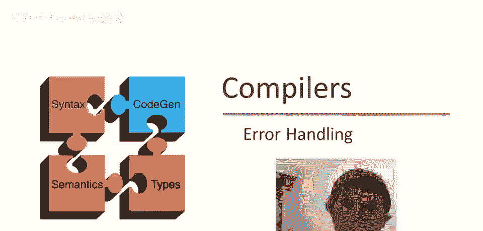
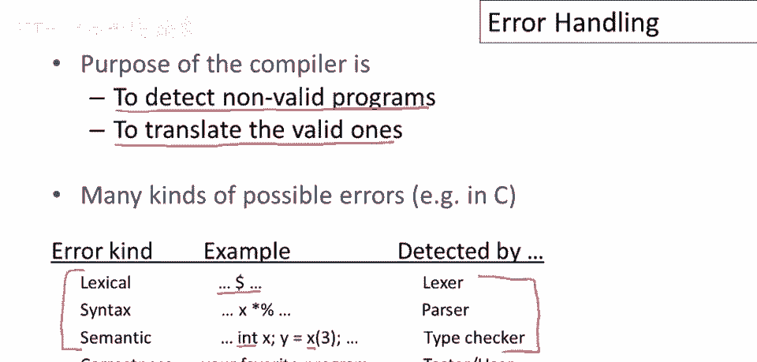
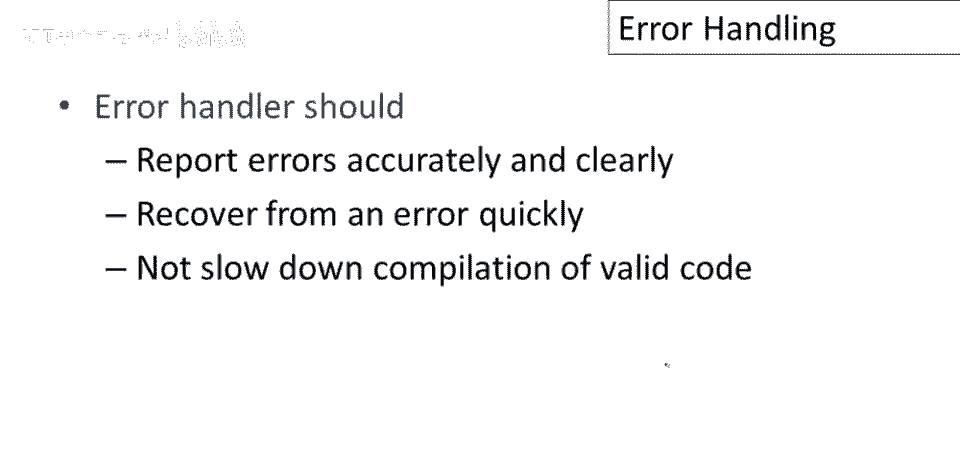
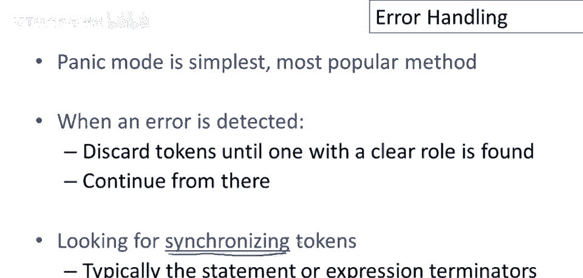
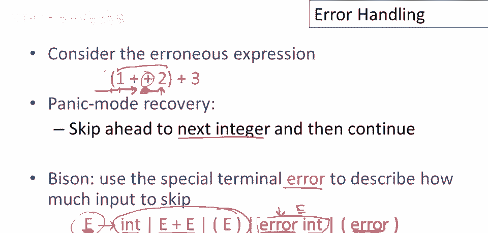
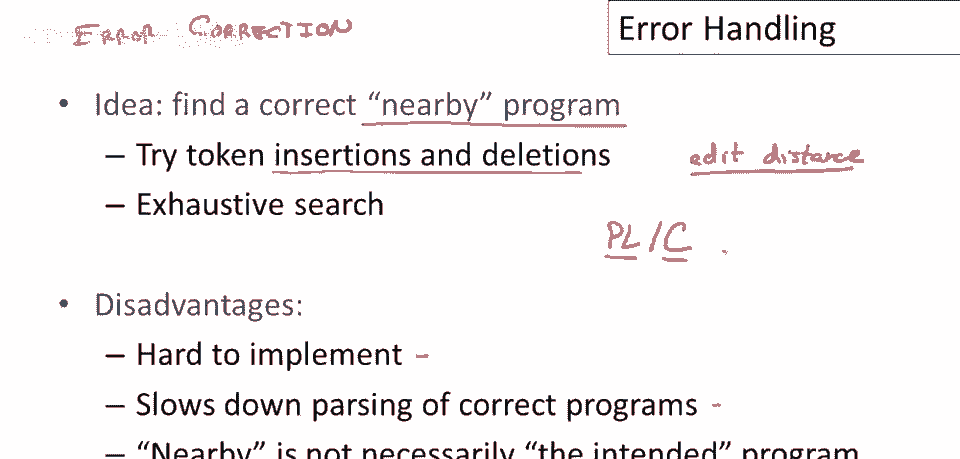
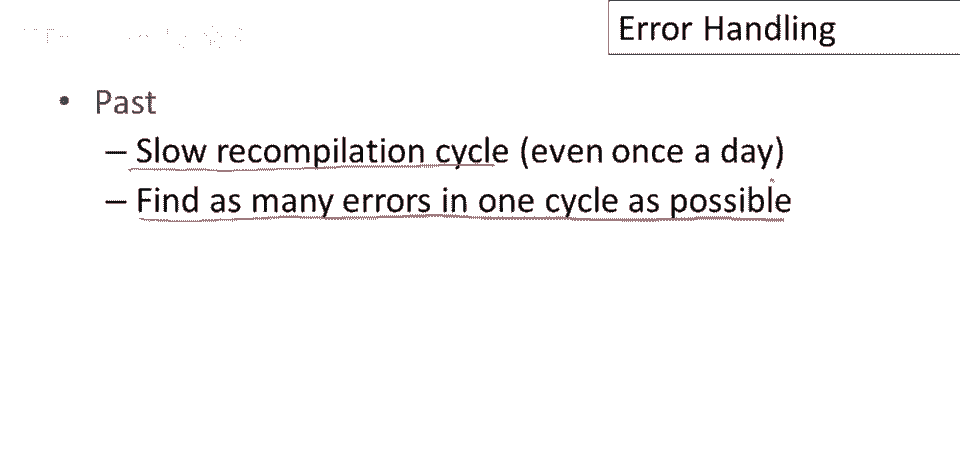
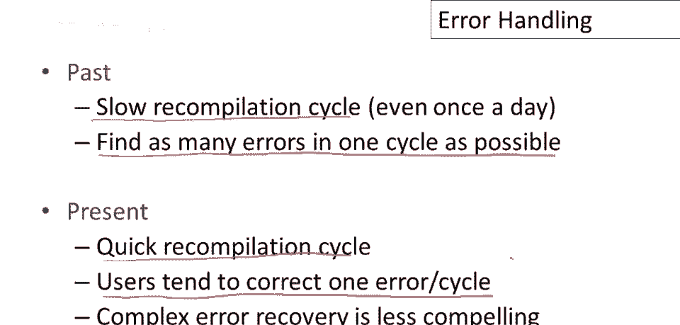

# 课程 P21：编译器错误处理 🛠️



在本节课中，我们将学习编译器如何处理程序中的错误。我们将探讨错误处理的基本要求，并详细介绍三种主要的错误处理策略：恐慌模式、错误产生和错误纠正。通过理解这些机制，你将明白编译器如何尝试从错误中恢复，以及为何现代编译器采用当前的设计。

---

## 概述 📋



编译器有两个相对独立的工作。第一个是将有效程序翻译成目标代码。第二个工作是处理无效程序，即检测错误并向程序员提供良好的反馈。



编程语言中存在多种类型的错误。例如，词法错误由词法分析阶段检测。语法错误（即解析错误）在词法单元正确但组合方式无意义时发生。语义错误（如类型不匹配）则由类型检查器捕获。此外，程序中还存在逻辑错误，这些是有效程序但未按预期执行，编译器通常无法检测这类错误。

良好的错误处理要求编译器准确清晰地报告错误，以便快速识别和修复问题。编译器本身应能迅速从错误中恢复。同时，错误处理不应减慢有效代码的编译速度。

---



## 三种错误处理策略

上一节我们介绍了错误处理的基本要求，本节中我们来看看三种具体的错误处理策略。

### 1. 恐慌模式 (Panic Mode)

恐慌模式是最简单且最流行的错误恢复方法。其基本思想是：当检测到错误时，解析器开始丢弃输入标记，直到找到一个在语言中有明确角色的标记（称为同步标记），然后尝试从该点重新开始解析。

一种典型策略是尝试跳至当前语句或函数的末尾，然后开始解析下一个语句或函数。

以下是恐慌模式的一个简单示例。考虑表达式 `(1 ++ 2)`。解析器从左到右解析，遇到第二个加号时，发现语法错误（两个加号连续出现）。在恐慌模式下，解析器会丢弃输入直到找到下一个整数（例如数字2），然后将表达式视为 `(1 + 2)` 继续解析。



在Bison等解析器生成器中，可以使用特殊的终结符 `error` 来定义错误恢复行为。例如，一个产生式可以定义为：
```bison
e : INT
  | e '+' e
  | '(' e ')'
  | error INT    // 遇到错误后，跳过输入直到遇到一个INT，然后将其视为一个e
  | error ')'    // 遇到错误后，跳过输入直到遇到一个')'，然后重置状态
```

### 2. 错误产生 (Error Productions)

错误产生是指将程序员常犯的已知错误，作为备选产生式直接添加到语法中。


例如，假设数学家习惯将 `5 x`（中间有空格）表示乘法，而不是 `5*x`。编译器可以为此添加一个产生式，使 `5 x` 成为合法的表达式。虽然这会使语法变得复杂且难以维护，但在实践中确有使用。例如，GCC等编译器有时会警告某些写法，但仍会接受它们，其内部机制就类似于错误产生。

### 3. 错误纠正 (Error Correction)

错误纠正不仅检测错误，还尝试自动修复错误。其目标是找到一个与原始程序“接近”且能正确编译的程序。常用方法包括尝试插入或删除标记，以最小化编辑距离，并在一定范围内进行穷举搜索。

这种方法实现复杂，会减慢正确程序的解析速度，且“接近”的定义并不明确。历史上著名的例子是PLC编译器，它愿意尝试编译任何输入（甚至包括《哈姆雷特》独白），通过大量错误纠正最终生成一个可运行的PL/I程序。

在20世纪70年代，编译周期非常漫长（可能长达一天），因此自动纠正小错误以节省时间是有价值的。然而，现代开发环境拥有极快的交互式编译周期，程序员通常倾向于一次只修正一个错误（通常是第一个报告的错误），因此复杂的错误纠正机制在今天已不那么有吸引力。



---

## 总结 🎯

本节课我们一起学习了编译器错误处理的三种主要策略。



*   **恐慌模式**通过丢弃输入直到同步标记来实现快速恢复。
*   **错误产生**通过将常见错误模式合法化来提供更灵活的处理。
*   **错误纠正**尝试自动修复错误，但在现代快速编译环境下实用性降低。



理解这些策略有助于我们认识编译器设计的权衡，以及为何现代工具更侧重于快速、准确的错误报告，而非复杂的自动修复。