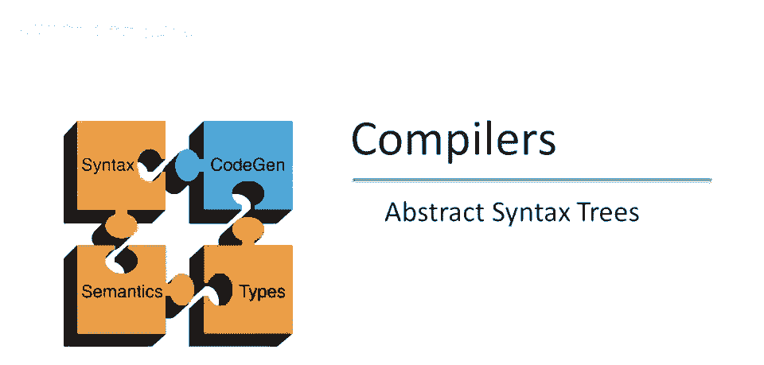
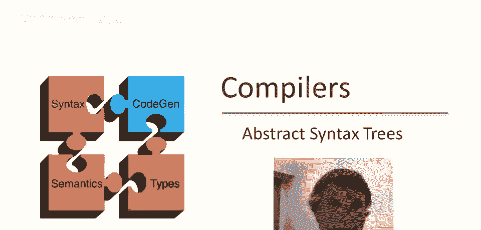
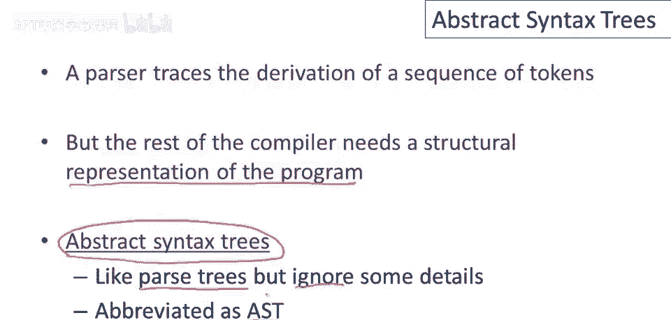
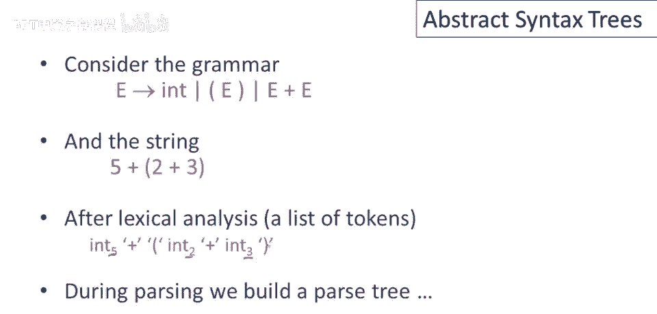
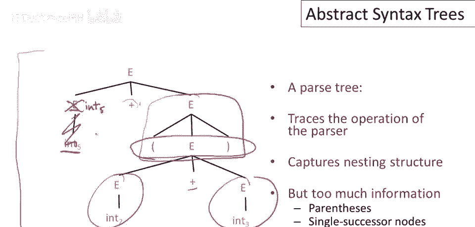
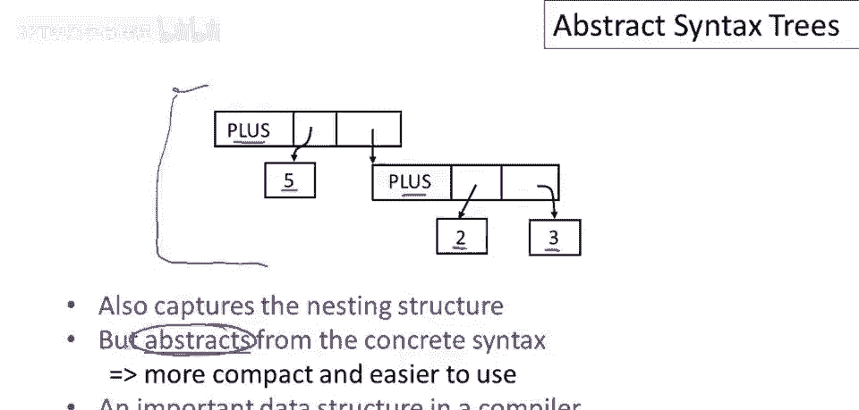

# 编译器原理 P22：抽象语法树 (AST) 🌳

在本节课中，我们将要学习编译器中的一个核心数据结构——抽象语法树。我们将了解它是什么，为什么它比解析树更适合编译器使用，以及它是如何从解析树中“抽象”出来的。



## 从解析到程序表示 🔄

上一节我们介绍了解析器如何跟踪标记序列的推导。但仅凭推导过程本身，对编译器的后续阶段并不十分有用。编译器的其余部分需要程序的某种表示，它需要一个实际的数据结构来告诉它程序中的操作是什么，以及它们是如何组合在一起的。

我们知道有一种这样的数据结构叫做解析树。但结果表明，解析树并非我们想要处理的。相反，我们想处理一种称为抽象语法树的东西。抽象语法树实际上就是解析树，但忽略了一些细节，我们从解析树的细节中抽象出来。

这里有一个你会看到的缩写：**AST** 代表抽象语法树。



## 解析树回顾 📊

让我们通过一个具体的语法例子来看。以下是用于整数加法表达式的语法，它还允许用括号括起表达式：
```
E -> E + E
E -> ( E )
E -> num
```

这是一个字符串 `(5 + (2 + 3))`。词法分析后，我们得到一个标记序列，带有相关的词素，告诉我们实际的字符串是什么。然后这个序列被传递给解析器，解析器会构建一个解析树。



以下是该表达式的解析树：
```
        E
       /|\
      / | \
     (  E  )
       /|\
      / | \
     E  +  E
     |    /|\
     5   ( E )
         /|\
        / | \
       E  +  E
       |     |
       2     3
```

解析树实际上完全适合编译，我们可以使用解析树来做编译器的工作，因为它是程序的真实表示。但问题在于，那样做会很不方便。

为了看到这一点，让我指出解析树的一些特征。

以下是解析树的一些不便之处：
*   解析树很冗长。例如，我们这里有节点 `E`，它只有一个子节点（如数字 `5`）。当节点只有一个继承者时，这对我们有何作用？我们实际上不需要这个 `E` 节点，我们可以直接将 `5` 放在其父节点的位置，使树变得更紧凑。
*   类似地，其他单一继承者节点（如某些括号节点）也是多余的。
*   此外，这些括号在解析中非常重要，因为它们显示了参数与加法操作的关系，表明了运算的嵌套关系。但一旦我们完成了**解析**，树结构本身就已经告诉了我们相同的事情。我们不再需要知道“这两个表达式在括号内”这个事实，因为加法节点的参数关系已经包含了所有必要信息。

因此，所有这些节点在某种意义上都是多余的，我们不再需要这些信息了。

## 抽象语法树 (AST) 的优势 ✨

因此，我们更倾向于使用一种称为**抽象语法树**的工具，它压缩了解析树中所有“多余”的部分。



这是一个抽象语法树，它代表了与上一节中解析树相同的内容 `(5 + (2 + 3))`：
```
       +
      / \
     5   +
        / \
       2   3
```

你可以看到，我们真的只保留了最核心的项目。我们有两个加法节点和三个数字参数。运算的关联性仅由哪个加法节点嵌套在另一个中来显示。我们没有多余的非终结符节点，也没有括号节点，一切都简单多了。

你可以想象，编写算法来遍历这样的结构，比遍历之前那个复杂冗长的解析树要容易得多。

当然，它之所以被称为**抽象语法树**，正是因为它从**具体语法**中抽象了出来。我们抑制了具体语法的细节（如括号、单继承节点），只保留了足够的信息，以便能够忠实地代表程序并编译它。

## 总结 📝



本节课中，我们一起学习了抽象语法树 (AST) 的概念。我们了解到，虽然解析树是语法分析的自然产物，但它包含了过多用于推导过程的细节。抽象语法树通过移除这些冗余信息（如单继承节点、括号标记），提供了一个更简洁、更易于后续编译阶段（如语义分析、代码生成）处理的程序表示。AST 的核心在于从具体语法中“抽象”出程序的逻辑结构。