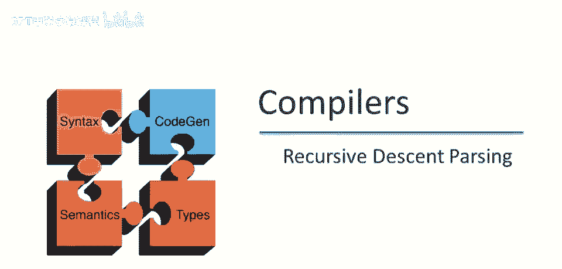
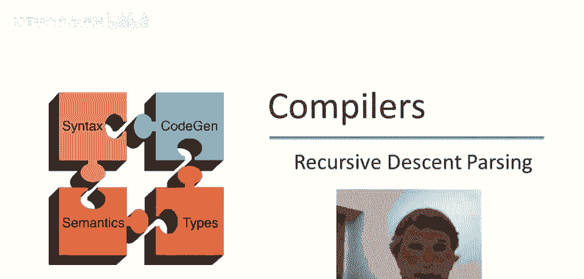
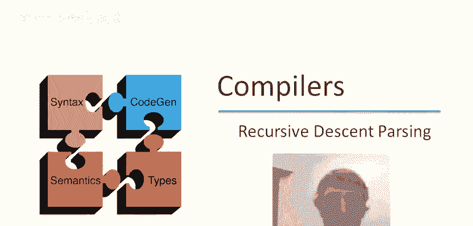
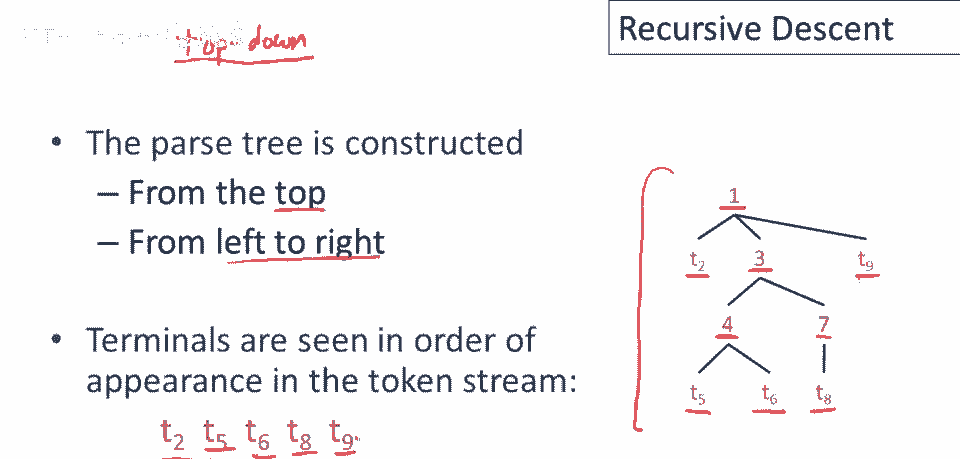
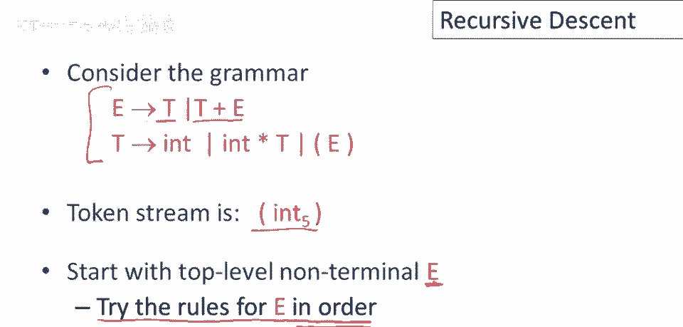
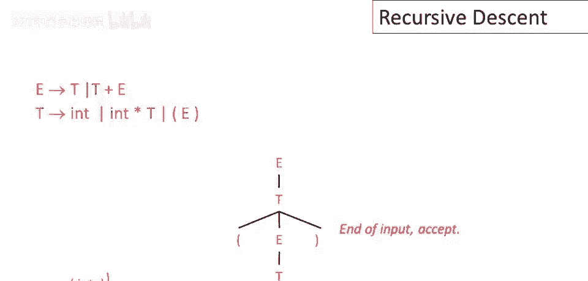

# 课程 P23：递归下降解析算法 🧠

在本节课中，我们将要学习第一个解析算法——递归下降解析。这是一种自顶向下的解析方法，我们将通过一个简单的例子来理解其工作原理。

---

## 什么是递归下降解析？ 📝

递归下降是一种自顶向下的解析算法。你可能怀疑也有自底向上的解析算法，确实存在这样的算法，稍后我们会讨论。

在自顶向下解析算法中，解析树从顶部构建，从根节点开始，从左到右。因此，终端符号将按照它们在标记流中出现的顺序出现。

例如，假设有一个标记流和一个假设的解析树，解析树中节点的数字编号对应于节点构建的顺序。我们必须从根节点开始，这是首先发生的事情。然后，如果下一个位置是非终结符，那将是接下来要处理的部分。如果它有子节点，那么最左边的子节点（因为我们从左到右工作）将是下一个要生成的节点。以此类推，解析过程将按照从左到右的顺序逐步展开。

---

## 解析过程示例 🔍

让我们考虑一个整数表达式的语法，并解析一个简单的输入字符串 `(5)`。

我们将使用递归下降策略来解析这个输入字符串。基本思想是，我们从非终结符开始，从根节点开始，总是按顺序尝试非终结符的规则。我们将首先尝试第一个产生式，如果不起作用，再尝试下一个产生式。这是一个自顶向下的算法，从根开始，从左到右工作。当产生式失败时，我们可能需要回溯以尝试其他产生式。

解析过程涉及三个部分：
1.  我们使用的语法。
2.  我们构建的解析树（最初只是解析树的根）。
3.  我们处理的输入，用一个指针指示我们在输入中的位置。

指针始终指向要读取的下一个终结符号（标记）。我们从输入 `(` 开始。

以下是解析步骤的详细说明：

1.  从语法开始，尝试第一个产生式 `E -> T`。这意味着将 `T` 作为 `E` 的子节点。
2.  `T` 是一个未展开的非终结符，我们必须处理它。尝试 `T` 的第一个产生式 `T -> int`，使 `int` 成为 `T` 的子节点。
3.  现在我们可以检查进展。生成的终结符 `int` 与输入中的 `(` 不匹配，因此这个解析路径失败，需要回溯。
4.  撤销上一步的决定，尝试 `T` 的下一个产生式 `T -> N * T`。扩展 `T` 后，生成的 `int` 标记与输入中的 `(` 仍然不匹配，再次回溯。
5.  撤销决定，尝试 `T` 的最后一个产生式 `T -> (E)`。扩展 `T` 后，生成的 `(` 与输入中的 `(` 匹配。匹配成功，将输入指针前进。
6.  现在需要扩展非终结符 `E`。再次从第一个产生式开始，`E -> T`。
7.  处理 `T`，选择第一个产生式 `T -> int`。生成的 `int` 与输入中的 `5` 匹配，将输入指针前进。
8.  继续处理，生成的 `)` 与输入中的 `)` 匹配。
9.  此时，解析树中的所有内容都已匹配，输入指针到达字符串末尾。这意味着对输入表达式 `(5)` 的解析成功。

---

## 总结 📚

本节课中我们一起学习了递归下降解析算法。这是一种自顶向下的解析方法，通过从根节点开始，从左到右构建解析树，并按照顺序尝试语法规则来解析输入字符串。当产生式失败时，算法会进行回溯以尝试其他可能性。我们通过一个简单的例子 `(5)` 演示了整个解析过程，最终成功接受了该输入字符串。