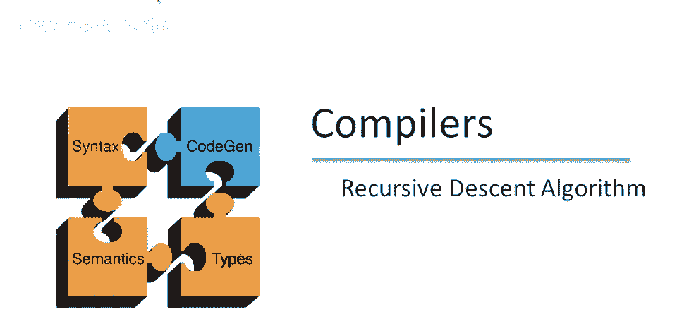
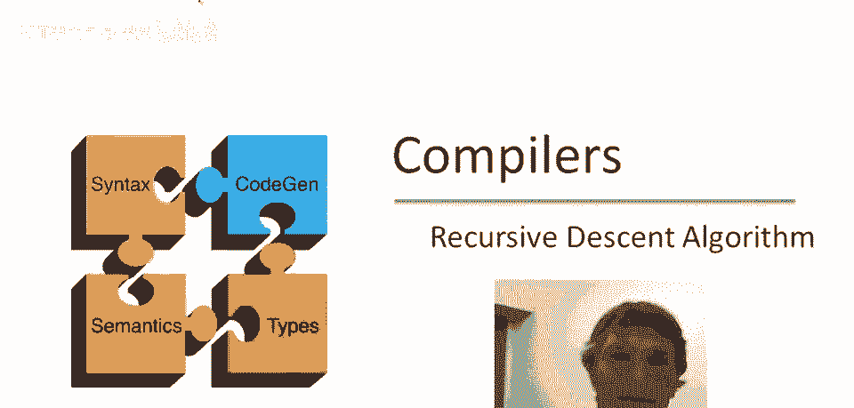
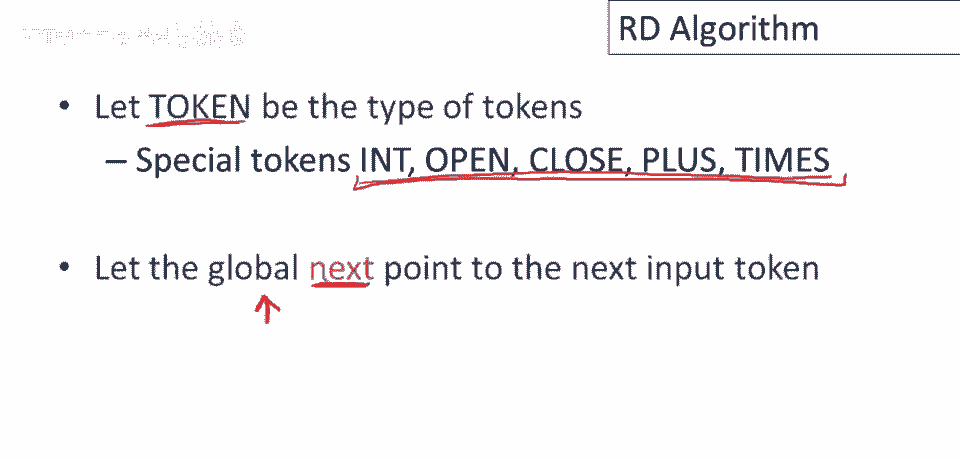
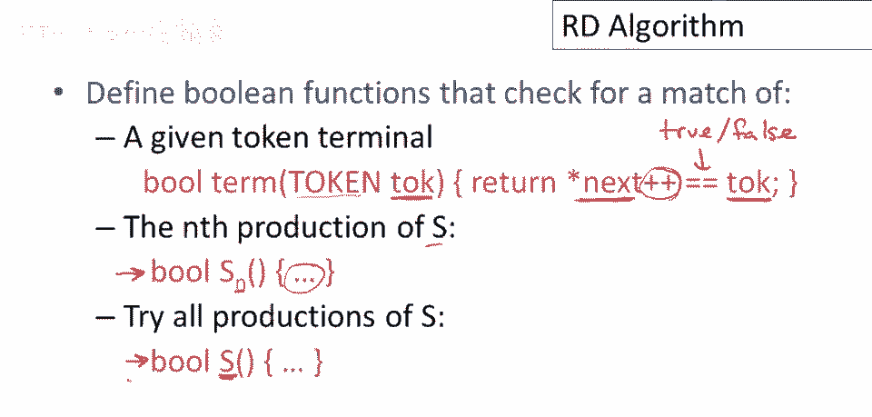
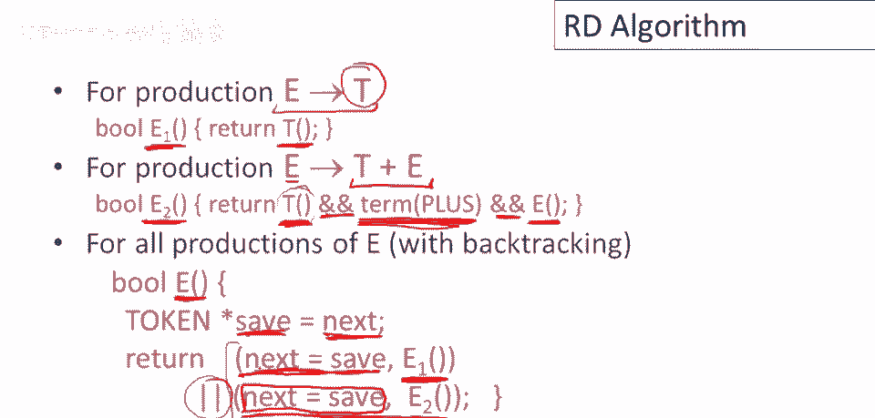
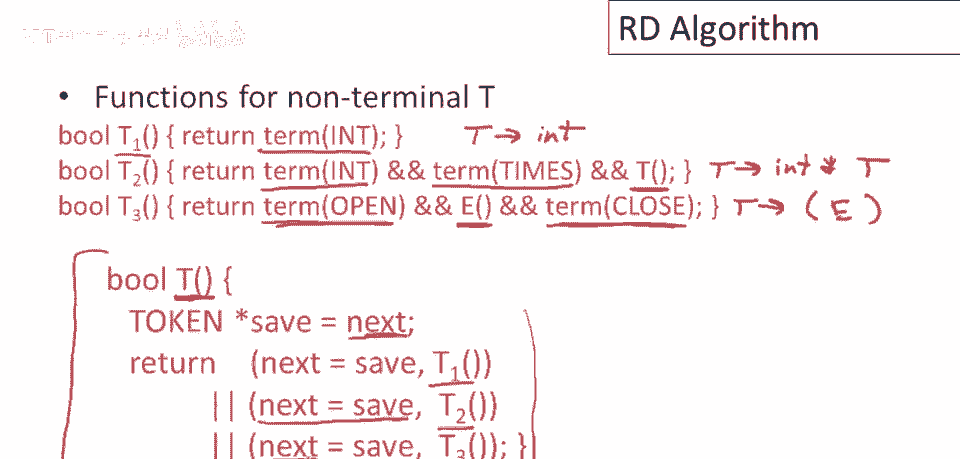
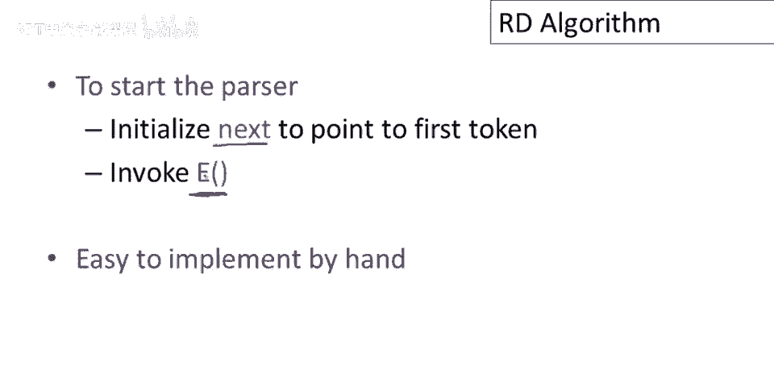
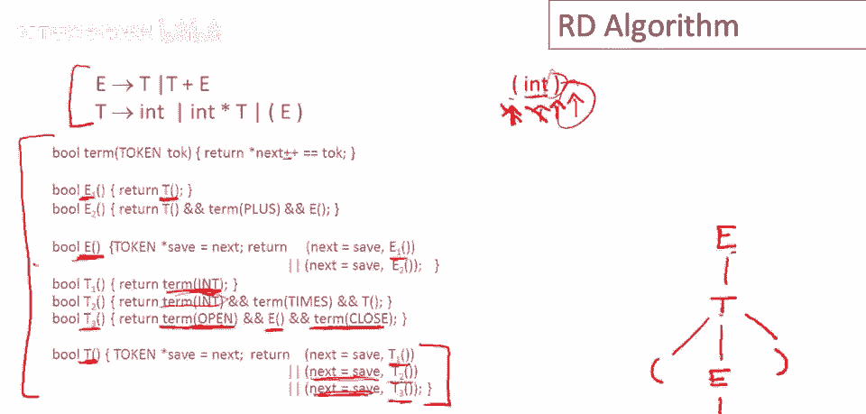

# P24：p24 06-04-_Recursive_Descen - 加加zero - BV1Mb42177J7

欢迎回到本视频，我将概述递归下降解析的通用算法。

在深入递归下降解析算法细节之前，让我先定义一些将在整个视频中使用的几个小东西，标记将是一个类型，我们将编写代码，标记将是所有标记的类型。

我们将在示例中使用的特定标记是诸如into、open和close之类的东西，对于加号和乘号，因此标记是一个类型，而这些是实例，该类型的值，然后我们将需要一个名为next的全局变量。

它指向输入字符串中的下一个标记，如果你记得上一视频，我们使用一个大箭头指向输入，指示我们的当前位置，全局变量next将在我们的代码中扮演相同的角色。

那么让我们开始，首先我们将定义一系列布尔函数，我们必须定义的一个函数是匹配输入中给定标记的函数，它是如何工作的呢？它接受两个参数，一个标记，好的，这又是标记类型。

然后它只是检查它是否与输入流中当前指向的内容匹配，所以t k是否等于next指向的东西，请注意作为副作用，我们递增next指针，然后返回的，然后是一个布尔值，这是真或假，是的。

我们传入的标记与输入匹配或否，它不匹配，再次，只是为了强调这一点，请注意next指针被递增，无论匹配是否成功或失败，现在我们需要检查的是s的第n个产生式的匹配，这是特定非终结符s的特定产生式。

我们将用返回布尔值的函数表示它，它被写作s下标n，所以这是一个只检查s的一个产生式成功的函数，我不会写出那个代码，我们一会儿会看到，然后我们需要另一个函数来尝试s的所有产生式，这个将被简单地称为s。

没有下标，没有下标，所以这一个会成功，若任何s的产生式能匹配输入，好吧，因此对于每个非终结符，我们会有两类函数，一类是每个产生式一个函数，它检查该产生式是否能匹配输入。

然后一类是将特定非终结符的所有产生式组合在一起。

并检查是否有任何一个能匹配输入，好的，这就是现在的总体计划，看看这些特定产品如何运作，我们将使用与上一视频相同的语法，该语法的第一个产生式是e->t，然后我们要做的是。

我们想编写函数来决定这个产生式是否匹配某些输入，这个恰好非常简单，很容易看出原因，首先我们编写e1函数，这是处理第一个e产生式的函数，仅在成功匹配某些输入时返回真，如果这个产生式成功匹配某些输入。

这个生产如何匹配输入，仅能匹配部分输入，若某些t生产匹配输入，我们为该函数命名，这就是函数t，尝试所有t的不同生产，因此，e一成功返回真，仅当t成功返回真，这就是第一部分的全部，对于第二个生产。

我们现在有更多工作要做，E将成功，若t加e能匹配输入，那如何运作良好，首先t要匹配输入，因此t的一些产生要匹配输入的一部分，在那之后，我们得在输入中找到加号，跟在t匹配的之后，若加号匹配。

那么e的一些产生要匹配输入的一部分，注意短路双的使用，在这里，实际上，这很重要，你在利用双&和c的语义，C++，它按从左到右的顺序评估双&的参数，所以首先，T将执行并注意到t的副作用，在输入指针上。

所以它正在增加下一个指针，它精确地增加，然而远t能走多远，所以无论t设法匹配什么，下一个指针将前进那么远，当此函数返回时，它将指向t未匹配的下一个终结符，那需要是一个加号。

对term的调用将再次增加下一个指针，这正是e应该接续的地方，e能匹配的任何内容都将增加下一个指针仅超出那个，以便语法之外的其他部分可以匹配它，注意这个特定函数被调用e两次，因为这是第二个生产的函数。

关于e，我们还要处理关于e的一件事，那就是函数e本身，我们需要编写一个函数来匹配e的任何替代方案，由于只有这两个产生式，它只需要匹配这两个产生式中的一个，这就是回溯处理的地方，现在唯一需要担心的状态。

在回溯中是下一个指针，因此，如果我们需要撤销决定，它需要被恢复，因此我们实现的方式是，我们在这个函数中有一个局部变量，名为Save的变量，记录下一个指针的位置，在我们做任何事情之前。

所以在尝试匹配任何输入之前，我们只记得这个函数被调用时下一个指针开始的位，现在要做的，进行备选匹配，我们首先尝试e一，看它是否成功，如果它失败，实际上让我们做成功的事，先看案例，如果这成功。

如果这返回真，那么双或的含义是，我们不会评估e二，所以这不会被评估，这里的第二个组件不会被评估，如果e一如果e一返回真，它会短路，因为它知道它会是真，无论什么，它将停止并注意，下一个指针将被保留。

我们将记住，当返回真时，下一个指针将指向未消耗的输入，现在考虑e一返回假的情况，如果e一返回假，或为真，仅当第二部分为真，我们首先做什么，好的，在我们尝试e2之前，如果e2返回真，那么整个表达式返回真。

并且e函数成功，如果e函数失败，那么对于e我们没有其他选择，失败将返回给推导中的更高层次的生产，它将不得不回溯并尝试另一个替代方案，最后，关于这个特定语句，下一个等于保存此处，这并不严格需要，注意。

这里我们在同一个变量中保存下一个指针，然后第一件事，然后我们做的第一件事是将其复制回下一个，这只是为了统一，使所有生产看起来相同，但由于这是第一个生产，我们实际上不需要这个赋值语句。

如果我们不想有它，所以让我们把注意力转向非终结符t，有三个生产，第一个是t去int，这是一个简单的编写，我们只需要匹配终端int，所以输入中的下一个必须是整数，如果是，那么t1成功，嗯，t2稍微更复杂。

那是生产int times t t去n times t，所以我们必须在输入中匹配一个int，然后是times，然后是匹配任何t生产的任何东西，第三个生产是t去open paren。

E close parenend，所以必须发生什么，我们首先必须匹配一个open end，然后匹配e生产的任何一个东西，所以我们在那里调用函数e，最后是一个close paren。

然后将这三个放在一起在函数t中尝试所有三个替代方案，我们就有和为e尝试所有三个替代方案时完全相同的结构，所以我们保存当前的输入指针，然后尝试替代方案是t1，t2，和t3按顺序，在每个步骤中。

我们在尝试下一个替代方案之前恢复输入指针。

要启动解析器，我们必须初始化下一个指针，指向输入流中的第一个标记，并且我们必须调用匹配任何从开始简单派生的东西的函数，所以在这种情况下，那就是函数，E，递归下降解析器手工实现很容易。

实际上人们经常手动实现它们，只需遵循我之前幻灯片上展示的纪律。

结束这个视频，让我们通过一个完整示例，这是我们的语法，这是递归下降解析器为该语法的所有代码，这是我们将要查看的输入，我们将仅标记下一个指针，指向输入中的初始is标记，同时我也会画出我们正在构建的解析树。

我们从调用开始符号开始，我们将尝试从e推导一些东西，我们首先会做的是尝试第一个生产，所以我们将尝试e1，e1会做什么，e1将尝试t，它将尝试从t推导一些东西，因此可能的解析树看起来像这样。

然后我们调用t，t会做什么，将按顺序尝试t的所有三个生产，它将调用t1，我们将看到t1将会失败，因为它将尝试一个int，我不会把它放入解析树中，因为它不会起作用，但int不会匹配左括号。

所以那将返回false，这将导致回溯，它将重置，呃，输入指针，好的，并回到字符串的开头，然后它将尝试t2，t2也会问，输入指针是否等于int，我们回忆一下，这里的term函数总是增加输入指针。

实际上这个指针将移动一个标记，但这将返回false，因为int不匹配左括号，所以我们将回到这里，输入指针将恢复到字符串的开头，然后它将尝试替代t3现在当我们最终到达t3时，一些好事将会发生。

首先它将做的是将询问，输入中的第一个东西是否是左括号，实际上它是，因此输入指针将前进，呃，指向int，然后它将尝试匹配可从e推导的东西，现在我们有了第一次递归调用，我们回到e这里。

它将尝试先e一然后e二，所以它调用e一，e一只能匹配，如果能匹配t，好的，现在我们在e内部，然后我们要调用t，t会做什么呢，它将按顺序尝试t的所有三个产生式，第一个恰好是单个标记符int，这将匹配。

它将调用，术语int t一正在调用术语结束，这匹配输入流中的下一个标记，我们对此感到高兴，输入指针再次前进，现在我们将通过所有这些级别的调用返回，嗯，t一成功，这意味着t成功，嗯，这意味着e成功，好的。

现在我们回到t三的产生式，我们要问，我们在输入中看到的下一个东西是否是n的闭合，确实如此，因此将记录闭合的n，现在t三将成功，这意味着t成功，这个t成功，最后我们回到根调用e，它返回真。

这意味着部分成功，加上我们现在处于输入的末尾，没有更多的输入要消耗，我们从开始符号返回真，因此我们成功解析了输入字符串。

