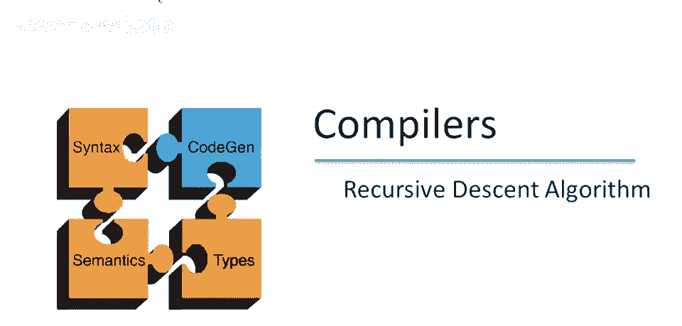
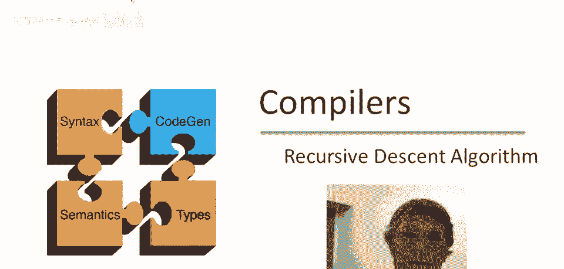
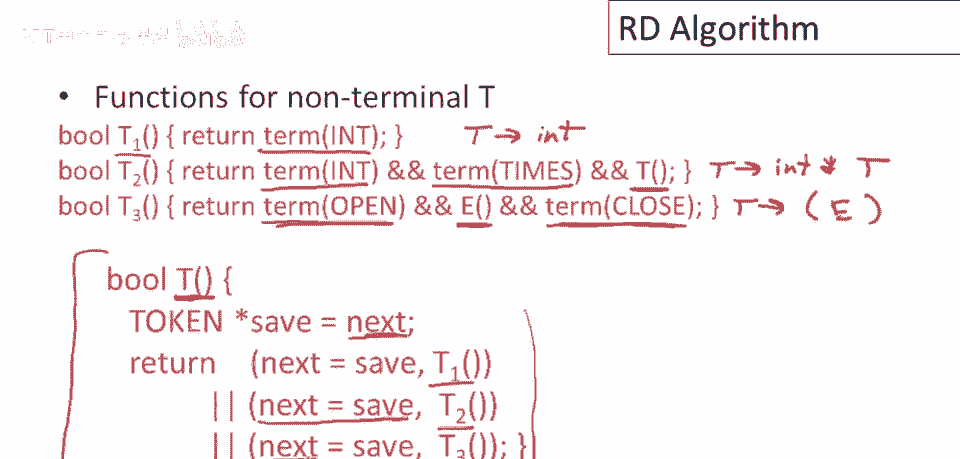

# 课程 P24：递归下降解析算法详解 🧠



在本节课中，我们将学习递归下降解析的通用算法。这是一种用于解析上下文无关文法的常见方法，通过编写一系列相互递归的函数来模拟语法的产生式，从而判断输入字符串是否符合给定的语法规则。

---

## 算法概述与准备工作 📋


在深入递归下降解析算法的细节之前，我们先定义一些将在整个视频中使用的概念和变量。

首先，我们需要一个表示**标记**的类型。标记是输入字符串中被识别出的最小语法单位。

```cpp
// 标记是一个类型，例如 int, plus, open, close 等
typedef enum { INT, PLUS, TIMES, OPEN, CLOSE } Token;
```

其次，我们需要一个全局变量 `next`，它作为一个指针，始终指向输入字符串中**下一个待处理的标记**。这类似于上一视频中使用的“大箭头”，用于指示解析的当前位置。

```cpp
Token* next; // 指向输入标记流中下一个标记的指针
```

---

## 核心函数定义 ⚙️


递归下降解析器的实现依赖于几类核心函数。上一节我们介绍了标记和指针的概念，本节中我们来看看如何定义匹配标记和产生式的函数。

### 匹配单个标记的函数

我们需要一个函数来检查输入流中的当前标记是否与期望的标记匹配。

```cpp
bool term(Token tk) {
    // 检查传入的标记 tk 是否与 next 指向的当前标记匹配
    if (tk == *next) {
        next++; // 匹配成功，指针前进
        return true;
    } else {
        next++; // 即使匹配失败，指针也前进（根据算法描述）
        return false;
    }
}
```
请注意，无论匹配成功与否，`next` 指针都会被递增。

### 匹配特定产生式的函数

对于语法中的每个非终结符 `S` 及其每个产生式，我们需要一个函数 `S_n` 来检查该特定产生式是否能匹配输入。

例如，对于非终结符 `E` 的第一个产生式 `E -> T`，其对应的函数 `E1` 可以这样实现：

```cpp
bool E1() {
    // E -> T 产生式：仅当 T 能匹配输入时成功
    return T(); // 调用尝试所有 T 产生式的函数
}
```

### 尝试所有产生式的函数

对于每个非终结符 `S`，我们还需要一个主函数 `S()`。这个函数会按顺序尝试 `S` 的所有产生式（即调用 `S_1`, `S_2`, ...），直到有一个成功或全部失败。

```cpp
bool E() {
    Token* save = next; // 保存当前指针位置，用于回溯
    // 尝试 E 的第一个产生式
    if (E1()) {
        return true; // 成功则直接返回
    }
    next = save; // 失败则恢复指针，尝试下一个产生式
    // 尝试 E 的第二个产生式
    if (E2()) {
        return true;
    }
    next = save; // 所有产生式都失败，恢复指针并返回失败
    return false;
}
```
这个函数体现了**回溯**机制：在尝试每个备选产生式前保存状态，失败后恢复状态。

---

## 完整语法示例解析 🌳

现在，让我们将上述概念应用到一个具体的语法上。我们使用与上一视频相同的表达式语法：

```
E -> T
E -> T + E
T -> int
T -> int * T
T -> ( E )
```

上一节我们定义了核心函数，本节中我们来看看如何为这个语法编写完整的解析器代码。


以下是每个函数的具体实现：

```cpp
// 匹配 E -> T
bool E1() {
    return T();
}

// 匹配 E -> T + E
bool E2() {
    Token* save = next;
    if (T() && term(PLUS) && E()) {
        return true;
    }
    next = save;
    return false;
}

// 主函数 E
bool E() {
    Token* save = next;
    if (E1()) return true;
    next = save;
    if (E2()) return true;
    next = save;
    return false;
}

// 匹配 T -> int
bool T1() {
    return term(INT);
}



// 匹配 T -> int * T
bool T2() {
    Token* save = next;
    if (term(INT) && term(TIMES) && T()) {
        return true;
    }
    next = save;
    return false;
}

// 匹配 T -> ( E )
bool T3() {
    Token* save = next;
    if (term(OPEN) && E() && term(CLOSE)) {
        return true;
    }
    next = save;
    return false;
}


// 主函数 T
bool T() {
    Token* save = next;
    if (T1()) return true;
    next = save;
    if (T2()) return true;
    next = save;
    if (T3()) return true;
    next = save;
    return false;
}
```

要启动解析器，我们需要初始化 `next` 指针，并调用开始符号对应的函数。

```cpp
bool parse(Token* input) {
    next = input; // 初始化指针，指向输入的第一个标记
    return E();   // 从开始符号 E 开始尝试匹配
}
```

---

## 算法执行流程示例 🔍

让我们通过一个具体例子来理解解析器是如何工作的。假设输入字符串是 `( int )`。

解析步骤如下：

1.  **初始化**：`next` 指向 `(`。
2.  调用 `parse()`，进而调用 `E()`。
3.  `E()` 首先尝试 `E1()`，即调用 `T()`。
4.  `T()` 按顺序尝试其产生式：
    *   `T1()` 尝试匹配 `int`，但当前是 `(`，失败并回溯。
    *   `T2()` 尝试匹配 `int * T`，第一个标记 `int` 就不匹配 `(`，失败并回溯。
    *   `T3()` 尝试匹配 `( E )`：
        *   `term(OPEN)` 成功匹配 `(`，`next` 前进指向 `int`。
        *   然后调用 `E()` 来匹配 `E`。
5.  在新的 `E()` 调用中：
    *   尝试 `E1()`，即调用 `T()`。
    *   `T()` 中 `T1()` 成功匹配 `int`，`next` 前进（此时已到输入末尾）。
    *   `T()` 返回成功，因此 `E1()` 成功，新的 `E()` 调用返回成功。
6.  回到 `T3()` 的检查中，接下来 `term(CLOSE)` 尝试匹配 `)`。但 `next` 已指向输入末尾，没有标记了，因此匹配失败。
7.  `T3()` 失败，`T()` 返回失败，导致最初的 `E1()` 失败。
8.  最初的 `E()` 尝试 `E2()`。
9.  `E2()` 首先调用 `T()`。`T()` 会再次从 `T1()` 开始尝试，但此时 `next` 已被恢复回指向 `(`，过程将重复，最终仍无法成功匹配 `T + E` 的形式。
10. 最初的 `E()` 中所有产生式尝试失败，返回 `false`。

因此，输入 `( int )` 不符合该语法（因为它缺少右边的闭合括号）。如果输入是 `( int )`，则 `T3()` 中的 `term(CLOSE)` 将会成功，整个解析就会成功。

---

## 总结 📝

本节课中我们一起学习了递归下降解析算法。我们首先定义了标记类型和全局指针 `next`。然后，我们介绍了三类核心函数：匹配终结符的 `term` 函数、匹配特定产生式的函数（如 `E1`）以及整合所有产生式并处理回溯的主函数（如 `E`）。


我们通过一个具体的表达式语法，逐步实现了所有解析函数，并分析了算法的执行流程。递归下降解析器结构清晰，易于手工实现，是理解编译器前端工作的良好起点。其核心思想在于用递归函数调用模拟语法推导，并通过保存和恢复 `next` 指针的状态来实现回溯，以探索所有可能的解析路径。