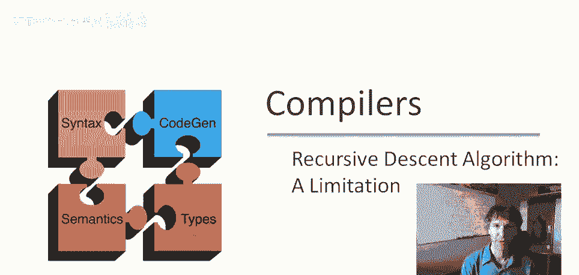
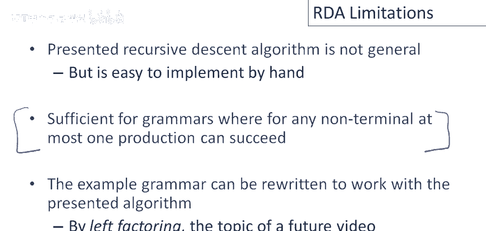

# P25：p25 06-04-1-_Recursive_Desc - 加加zero - BV1Mb42177J7

本视频中，将讨论递归下降算法的局限性。

上次，上次的语法，再次展示实现，一组相互递归的函数，考虑解析输入int时，最简单的输入字符串，嗯，逐步分析，我们首先实现非终结符e的所有产生式，接下来我们要做的是，这里我们调用e，然后它会尝试调用e1。

e1会做什么，e1会调用t，因为，当然，第一个产生式是e->t，让我们看看t做了什么，嗯，t将尝试生产，t1，好吧，t1会做什么，t1识别一个整数，好的，这样很好，会匹配并返回，好的，然后e会返回。

我们将成功解析，我忘了提，还有，在过程中，输入指针将在int上移动，完成后他将返回，我们将成功解析字符串int，因为e返回真，生产e返回真，我们消耗了所有输入，好吧，现在让我们考虑一个稍微复杂点的例子。

好的，那么让我们尝试输入字符串int times int，好吧，所以再次，我们从生产e开始，好吧，我们首先会做的是，我们会尝试生产e一次，和上次一样，第一个将调用函数t，再次是int生产，好的。

输入指针当然在这里，然后尝试匹配int，好的，如果尝试匹配输入流中的第一个标记，终端int，它将成功，好的，输入指针将移动，t1将返回真，因此结果为，函数t的右侧也会成功，因为t1返回真。

所以t将返回真，好的，因此e1将返回真，e e，返回真将导致e返回真，实际上程序将终止，E将返回真，输入指针仅前进到int，因此我们将拒绝解析，这实际上被拒绝了，问题是，当然，发生了什么事？

我们成功解析了这个输入吗？这显然属于该语法的语言，嗯，这里的故事实际上很有趣，当我们发现int匹配了t的第一个生产时，我们说t完成了，好的，t成功并匹配了输入，然后当e最终返回时，整个解析失败。

因为我们没有消耗输入，我们没有方法回溯并尝试t的其他替代方案，如果我们想要成功，我们得说，哦，好吧，即使我们找到了一个匹配部分输入的t的生产，由于整体解析失败，那一定不是为t选择的正确生产。

也许我们应该尝试t的其他生产，事实上，如果我们尝试了t的第二个生产t2，我们将匹配int times t，然后我们可能就会成功，我们成功匹配了in times end，好的，这里的问题是。

即使在一个生产中存在回溯，当我们试图找到一个适用于给定非终结符的生产时，因此，对于非终结符存在回溯，在我们试图找到一个适用于该非终结符的生产时，一旦我们为非终结符找到了一个成功的生产。

所以一旦非终结符承诺并返回，并说我已经找到了一种解析部分输入的方法，使用我的一个生产，没有回溯，这种结构无路可走，该算法无法回溯重选决定，尝试不同的生产，好吧，问题是，如果非终结符x的生产成功。

无法回溯尝试x的不同生产，一旦x的函数返回，我们真的就决定了这个生产，现在，这意味着我上次视频中展示的特定递归下降算法，不是完全通用和递归的，递归下降是一种通用技术。

存在可以解析任何语法的递归下降解析算法，可以实现任何语法的完整语言，它们具有比我上次展示的算法更复杂的回溯，现在，展示这个特定算法的原因是它容易手工实现，这实际上是一种递归下降算法或方法。

虽然它有这种限制，如你所见，它非常机械和直接，为给定的语法设计解析器，它将适用于相当大的正确语法类，特别是，它将适用于任何语法，对于任何非终结符，最多一个生产可以成功，所以如果你知道从你构建语法的方式。

语法可以进入的任何情况，或递归下降算法在解析过程中可以进入的任何情况，最多一个生产可以成功，那么这种语法，这种解析策略将是足够的，因为一旦你找到一个成功的生产，将永远不需要回去重选那个决定。

因为一定是其他所有生产都无法成功，结果是我们正在工作的示例语法，在最近几个视频中实际上可以编写为与这个算法一起工作，好吧，我们将不得不左因子化语法，但实际上有不止一种方法重写语法。

以与这个递归下降算法一起工作，一种方法是左因子化它，我不会在这个视频中再说更多关于左因子化的事情。

