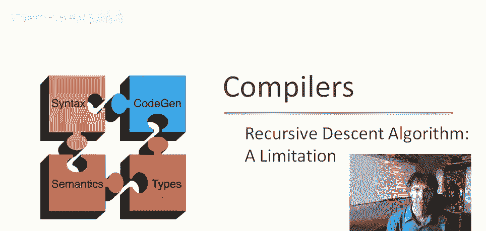
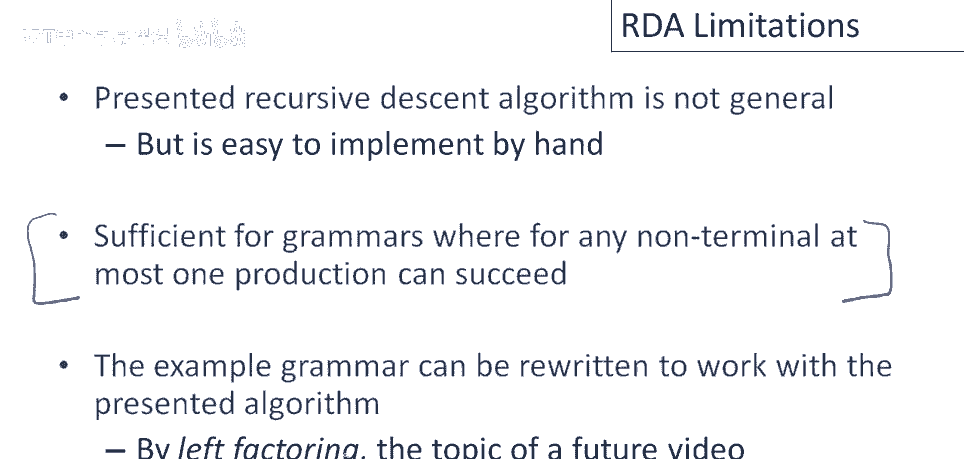

# 课程 P25：递归下降解析器的局限性 🧐


在本节课中，我们将探讨递归下降解析算法的一个关键局限性。我们将通过具体的例子，分析为何一个看似简单的解析器在处理某些输入时会失败，并理解其背后的原因。



---

## 概述

递归下降是一种常见的解析技术，但并非所有实现都能处理所有语法。本节将展示一个特定实现的局限性，即它无法在非终结符的多个可能产生式之间进行回溯。

---

## 回顾上次的解析器实现

上一节我们介绍了如何为一组相互递归的函数实现语法解析。考虑解析输入 `int` 时，我们实现了一个简单的递归下降解析器。

以下是解析非终结符 `e` 的核心逻辑示意：

```python
def parse_e():
    return parse_e1()

def parse_e1():
    return parse_t()

def parse_t():
    return parse_t1()

def parse_t1():
    # 尝试匹配终端符号 ‘int’
    if current_token == ‘int’:
        consume_token()
        return True
    return False
```

对于输入字符串 `int`，解析过程如下：
1.  `parse_e` 调用 `parse_e1`。
2.  `parse_e1` 调用 `parse_t`。
3.  `parse_t` 调用 `parse_t1`。
4.  `parse_t1` 成功匹配 `int`，消耗输入指针并返回 `True`。
5.  调用链逐级返回 `True`，解析成功。

---

## 解析更复杂的输入时遇到的问题

现在，让我们考虑一个稍微复杂点的例子：输入字符串 `int times int`。

解析过程再次从 `parse_e` 开始：
1.  `parse_e` 调用 `parse_e1`。
2.  `parse_e1` 调用 `parse_t`。
3.  `parse_t` 调用 `parse_t1`。
4.  `parse_t1` 成功匹配第一个 `int`，消耗它并返回 `True`。
5.  `parse_t` 因此返回 `True`，`parse_e1` 返回 `True`，最终 `parse_e` 返回 `True`。

此时，输入指针仅位于第一个 `int` 之后，整个字符串 `int times int` 并未被完全消耗。解析器认为解析成功，但实际上它只解析了输入的一部分，导致整体解析失败。

问题在于，当 `parse_t` 通过 `parse_t1` 成功匹配了第一个 `int` 后，它就立即返回了。解析器没有机会“回溯”去尝试 `t` 的其他产生式（例如，一个能匹配 `int times t` 的产生式），即使后续的整体解析因此失败。

---

## 核心局限性：缺乏回溯机制

上述例子揭示了该算法的根本问题。

**核心概念**可以表述为：一旦一个非终结符 `X` 的某个产生式成功匹配并返回，算法就无法回溯去尝试 `X` 的其他不同产生式。

这意味着，我上次展示的这种特定递归下降算法并非完全通用的。一个通用的递归下降解析器需要更复杂的回溯机制来处理任何语法。

---

## 该算法的适用场景

虽然存在局限性，但这种算法因其简单性仍有其价值。它易于手工实现，并且适用于一大类语法。

具体来说，它适用于任何满足以下条件的语法：对于每个非终结符，在解析的任何可能情况下，**最多只有一个产生式能够成功**。

在这种情况下，一旦找到一个成功的产生式，就永远不需要回溯重选，因为其他所有产生式注定会失败。我们示例中的语法可以通过改写（例如，进行**左因子化**）来满足这个条件，从而与此算法兼容。

---

## 总结



本节课中我们一起学习了递归下降解析器的一个关键局限性：它缺乏在非终结符级别进行回溯的能力。这导致它在处理某些歧义或需要尝试多个选项的语法时会失败。我们了解到，虽然这个简化版本算法有其适用范围（即每个非终结符最多只有一个产生式可能成功），但一个完全通用的递归下降解析器需要实现完整的回溯机制。