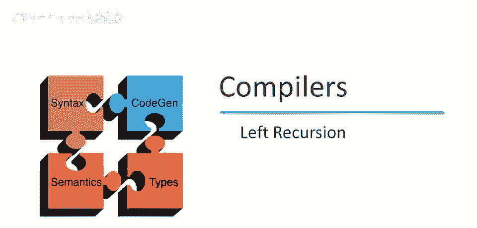
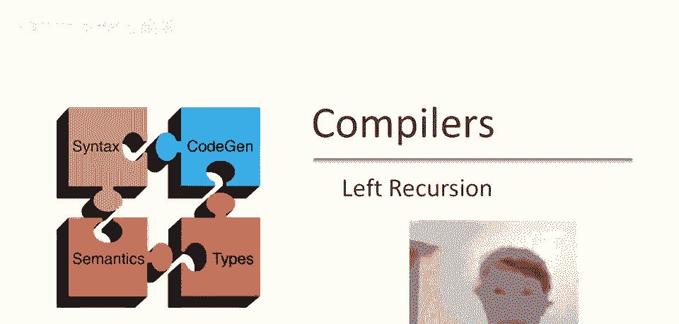
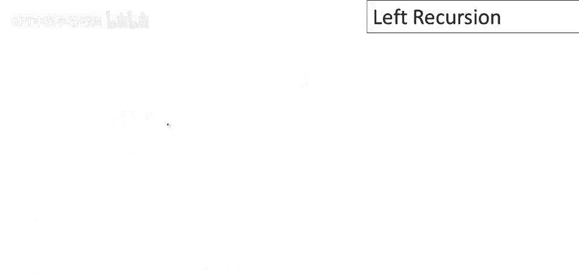

# 课程 P26：左递归问题与消除方法 🧠



在本节课中，我们将要学习递归下降解析中的一个主要困难——左递归。我们将了解什么是左递归，为什么它会导致解析器陷入无限循环，以及如何通过将左递归文法转换为等价的右递归文法来解决这个问题。


---



## 递归下降解析的主要困难

上一节我们介绍了递归下降解析的基本概念，本节中我们来看看它面临的一个主要挑战。

递归下降解析器在解析某些文法时会遇到一个严重问题，这个问题被称为**左递归**。

---

## 什么是左递归？🤔

考虑一个仅含一个产生式的简单文法：
```
S -> S a
```
该文法的递归下降算法实现如下：
```python
def s():
    return s1()

def s1():
    if s() and match('a'):
        return True
    return False
```
为符号 `S` 编写函数时，由于只有一个产生式，无需担心回溯。`S` 仅在 `s1` 成功时成功。

现在你能看到问题所在。解析输入字符串时，将调用 `s` 函数。`s` 函数会调用 `s1` 函数。`s1` 函数首先会调用 `s` 函数。结果，`s` 函数将陷入无限循环，永远无法解析任何输入。

该文法表现不佳的原因，是因为它是**左递归**的。

左递归文法的定义是：任何具有从该非终结符开始，进行非空序列重写，最终又回到相同非终结符的文法。注意 `+` 号，表示必须进行多次重写。


对于上面的文法，推导过程如下：
```
S -> S a
   -> S a a
   -> S a a a
   -> ...
```
总能达到字符串以 `a` 结尾，但左侧始终是 `S`。如果字符串左侧始终是 `S`，将永远无法匹配输入，因为匹配输入的唯一方法是首先生成终端符号。如果首先是非终结符，解析将永远无法取得进展。

这意味着，递归下降解析器**不支持左递归文法**。

---

## 左递归的影响与通用形式

递归下降不支持左递归文法，这似乎是递归下降解析的一个主要问题。确实是个问题，但正如我们稍后所见，其实并不那么严重。

让我们考虑一个稍微更通用的左递归文法。现在我们有两种产生式：
```
S -> S α | β
```
其中 `β` 是其他不提及 `S` 的符号串。

考虑生成这种语言的规则。它将连接所有以 `β` 开头的字符串，然后跟随任意数量的 `α`，但它以一种特殊方式进行。

如果我写出一些推导，其中我多次使用了第一个产生式，你可以看到发生了什么：
```
S -> S α
   -> S α α
   -> S α α α
   -> ...
```
若我重复此操作，得到 `S` 后跟任意数量的 `α`，然后在一步中可以加入 `β`，得到 `β` 后跟任意数量的 `α`。

这就是生成该语言的证明：以 `β` 开始，包含一些 `α` 序列。但可见它是从右向左完成的：首先产生字符串的右半部分。实际上，它产生的最后一件事是输入中出现的第一件事。

这就是为什么它不能与递归下降解析一起工作。因为递归下降解析希望首先看到输入的第一部分，然后从左到右工作，而这个语法是为了从右到左生成字符串而构建的。

---

## 消除左递归：转换为右递归 🔄

解决问题的思路是：生成完全相同的语言，但改为从左到右生成字符串，而不是从右到左。

我们这样做的方法是用**右递归**替换**左递归**。我们需要在此处添加一个符号。

不再让 `S` 指向含 `S` 的左侧，而是让 `S` 指向 `β`（生成第一个元素），然后指向 `S'`。

以下是转换后的文法：
```
S  -> β S'
S' -> α S' | ε
```
`S'` 负责生成预期的 `α` 序列，也可能是空序列。


如果你写出一个推导例子：
```
S -> β S'
   -> β α S'
   -> β α α S'
   -> β α α ε
   -> β α α
```
我们得到 `β` 后跟一些 `α` 的序列。你可以看到它生成与第一个语法完全相同的字符串，但它是以右递归的方式，而不是左递归的方式。

---

## 通用左递归消除方法

一般来说，我们可能有多个产生式，其中一些是左递归的，一些不是。这个特定形式的语法产生的语言，将是所有从 `S` 派生的字符串，从某个 `β` 开始（`β` 中不涉及 `S`），然后跟随零个或多个 `α` 的实例。

我们可以做完全相同的转换。这只是我们之前想法的概括，从只有一个 `β` 和一个 `α`，推广到多个 `β` 和多个 `α`。

使用右递归重写左递归文法的通用形式如下：


原始左递归文法：
```
S -> S α1 | S α2 | ... | S αm | β1 | β2 | ... | βn
```
转换后的右递归文法：
```
S  -> β1 S' | β2 S' | ... | βn S'
S' -> α1 S' | α2 S' | ... | αm S' | ε
```
这里每个 `β` 都作为第一个位置的选择。我们只需要一个额外的符号 `S'`，然后 `S'` 的规则负责生成任何 `α` 序列。

---

## 间接左递归

现在事实证明，那不是最通用的左递归形式。甚至还有一些其他方式在语法中编码左递归，这里是一种重要的方式。

我们可能有一个语法：
```
S -> A α
A -> S β | γ
```
如果你看这里，`S` 甚至没有立即出现在其产生式的右侧。`A` 也没有在任何地方出现在其产生式的右侧。所以这里没有所谓的**立即左递归**在这个语法中。

但另一方面有左递归，因为 `S -> A α`，然后 `A -> S β`。所以我们在两步内，产生另一个以 `S` 开头的字符串。这仍然是一个左递归语法，我们只是通过在左端插入其他非终结符延迟了它，在我们回到 `S` 之前。



间接左递归也可以消除。实际上这可以自动消除，甚至不需要人工干预。如果你看任何教科书（例如《编译原理》龙书），你会发现做这些转换的算法。

---

## 总结与回顾 📝

本节课中我们一起学习了递归下降解析中的左递归问题。

我们关于递归下降解析的讨论表明，它是一种简单而通用的解析策略。你可以使用递归下降解析任何上下文无关文法，因此它在这一点上非常通用。

但它不能与左递归文法一起工作。因此，你必须消除左递归。原则上，这可以自动完成，你可以有算法来消除直接的或间接的左递归。

人们通常手动消除左递归，原因是你需要知道你使用的语法形式，以便你可以编写语义动作（我们将在后续课程中讨论）。因为你需要确切知道语法形式，所以人们通常自己消除左递归，但这并不难做到。


事实上，递归下降在实践中是一种流行的策略。许多更复杂的生产编译器，实际上使用复杂的文法并采用递归下降，因为它非常通用且易于实现。