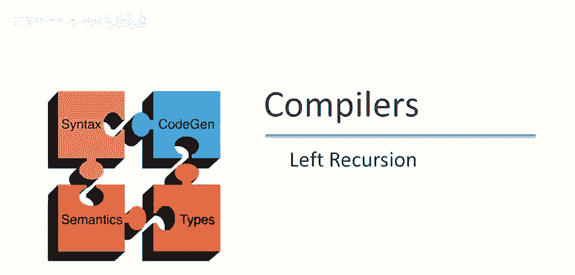
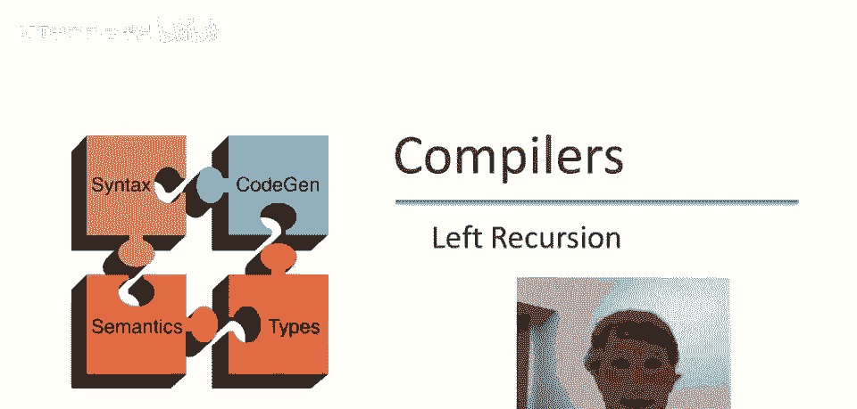
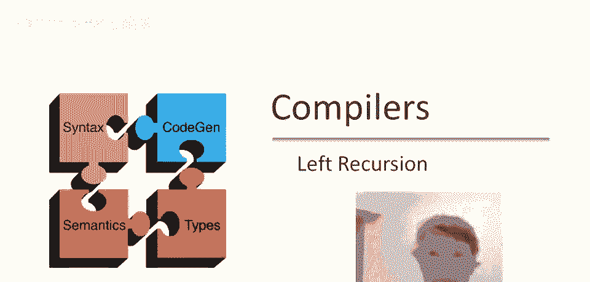
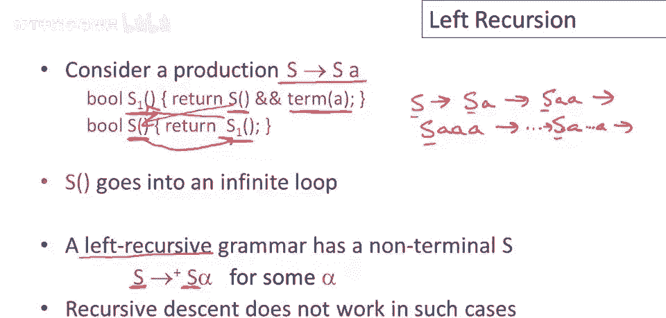
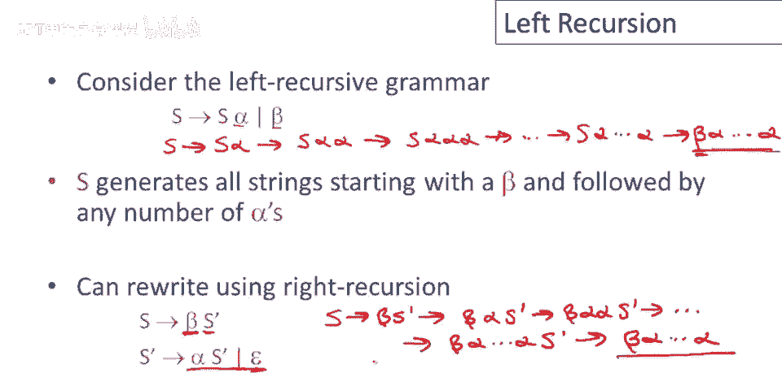
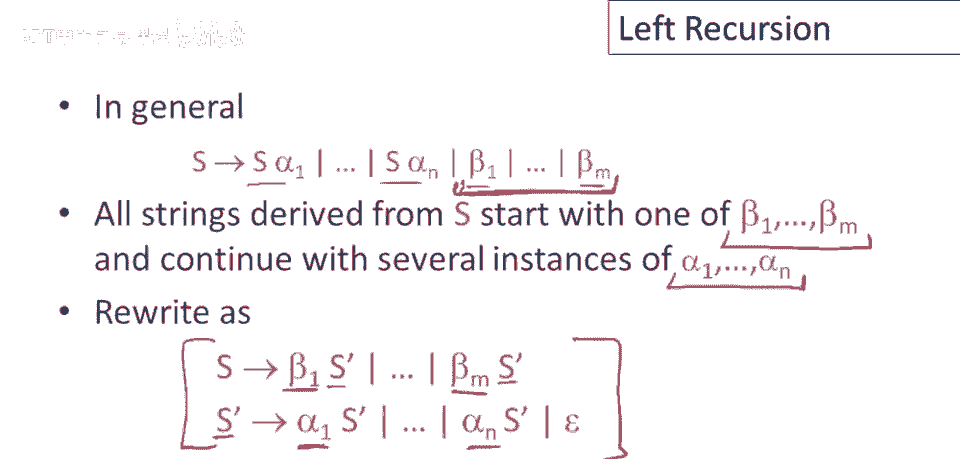
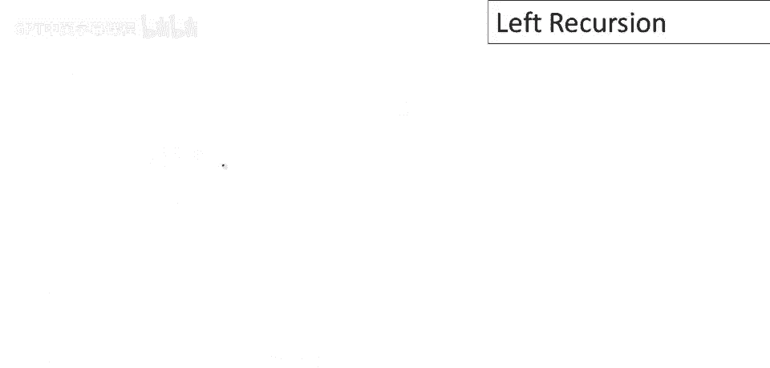
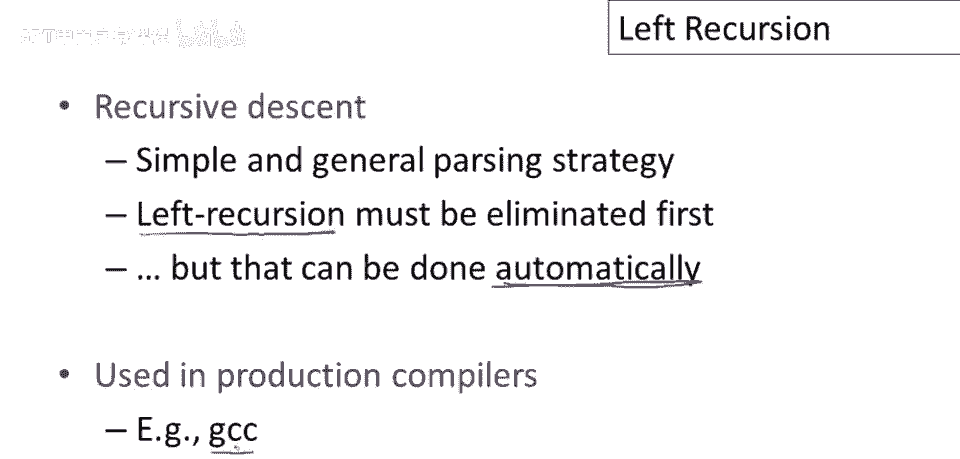

# P26：p26 06-05-_Left_Recursion - 加加zero - BV1Mb42177J7

本视频将讨论，递归下降解析的主要困难。

称为左递归的问题。

考虑一个仅含一个产生式的简单文法，s 后跟 a，该产生式的递归下降算法如下，我们只需一个名为 s1 的函数，用于 s 的第一个产生式，如果 s 函数成功，然后，输入流中看到终端 a。

需要为符号 s 编写函数，由于只有一种选择，s 只有一个产生式，无需担心回溯，s 仅在 s1 成功时成功，仅有一种可能，现在你能看到问题所在，会发生什么，解析输入字符串时，将调用 s 函数。

它将调用 s1 函数，s1 函数将做什么，首先将调用 s 函数，结果，s 函数将陷入无限循环，永远无法解析任何输入，将始终陷入无限循环，该文法表现不佳的原因，是因为它是左递归的，左递归文法是任何具有。

从该非终结符开始，进行非空序列重写，注意 + 号，必须进行多次重写，如果执行一系列替换，回到左侧仍为相同符号的情况，这对解析不利，对于上面的文法，会发生什么，s 到 s a。

到 s a a 到 s a a a 等，总能达到，字符串以 a 结尾，s 在左侧的情况，如果字符串左侧始终是 s，将永远无法匹配输入，因为匹配输入的唯一方法是，首先生成终端符号，如果首先是非终结符。

将永远无法取得进展，这意味着，递归下降不支持左递归。

递归文法，这似乎是递归下降解析的一个主要问题，确实是个问题，但正如我们稍后所见，其实并不那么严重，所以让我们考虑一个稍微更通用的左递归文法，现在我们有两种产生式，对于s，s生成s后跟某个alpha。

或生成其他东西，未提及s，暂称其为β，考虑生成这种语言的规则，它将连接所有以β开头的字符串，然后跟随任意数量的α，但它以一种特殊方式进行，所以如果我写出一些推导，其中我使用了一些。

其中我使用了第一个产生式，几次你可以看到发生了什么，所以得到s变为s后跟α，然后s变为s后跟αα，然后s变为s后跟ααα，若我重复此操作，得到s后跟任意数α，然后在一步中可加入β，得到β后跟任意数α。

这就是生成该语言的证明，以β开始的语言，包含一些α序列，但可见它是从右向左完成的，首先产生字符串的正确部分，实际上它产生的最后一件事是输入中出现的第一件事，这就是为什么它不能与递归下降解析一起工作。

因为递归下降解析希望首先看到输入的第一部分，然后从左到右工作，而这个语法是为了从右到左生成字符串而构建的，这就是解决问题的想法所在，因此我们可以生成完全相同的语言，从左到右生成字符串而不是从右到左。

我们这样做的方法是用右递归替换左递归，需在此处添加一个符号，不再让s指向含s的左侧，而是让s指向β，生成第一个元素，注意，在第一个位置，然后指向s'，s'是什么，做得好，s'产生预期的α序列。

也可能是空序列，如果你写出，嗯一些，嗯，你知道一个例子推导，我们有s到贝塔s撇，现在，使用s撇到贝塔阿尔法的规则，s撇到贝塔阿尔法阿尔法s撇到安，任何数量的改写。

我们得到贝塔后跟一些阿尔法的序列后跟s撇，然后在一步中我们使用epsilon规则，我们最终得到贝塔，后跟一些阿尔法的数量，所以你可以看到它生成与第一个语法完全相同的字符串。

但它是以右递归的方式而不是左递归的方式，一般来说我们可能有多个产生式，嗯其中一些是左递归的，一些不是，这个特定形式的语法产生的语言，嗯，将是所有从asset派生的字符串，从贝塔开始。

所以这里的一件事是不涉及s，然后继续零个或多个阿尔法的实例，我们可以做完全相同的把戏，这只是我们之前想法的概括，我们只有一贝塔和一阿尔法到许多贝塔和许多阿尔法的。

使用右递归重写这个左递归语法的通用形式在这里给出，所以这里每个贝塔都作为，第一个位置的选择，我们只需要一个额外的符号，S撇然后s撇，嗯，规则负责生成任何序列的阿尔法。

I's，现在事实证明那不是最通用的左递归形式，甚至还有一些，其他方式在语法中编码左递归，这里是一种重要的方式，所以我们可能有一个语法，所以如果你看这里，你看s甚至没有出现在右边，如果你看这条产生式。

A没有在任何地方出现在右边，所以这里没有所谓的立即左递归在这个语法中，但另一方面有左递归因为s到a阿尔法，然后a可以到s贝塔，所以我们在两步内，产生另一个以s开头的字符串，所以这仍然是一个左递归语法。

我们只是通过在左端插入其他非终结符延迟了它，在我们回到s之前，因此递归也可以消除，实际上这可以自动消除，甚至不需要人工干预，如果你看任何教科书，特别是在龙书中，嗯，你会发现做这些的算法。

因此，我们关于递归下降解析的讨论，嗯，它是一种简单而通用的解析策略，你可以使用递归下降解析任何上下文无关文法，因此，它在这一点上非常通用，它不能与左递归文法一起工作，因此，你必须消除左递归，现在。

原则上，这可以自动完成，你可以有算法来消除实际的左递归，人们手动消除左递归，原因是你需要知道你使用的语法，以便你可以编写语义动作，我们还没有讨论语义动作，但我们将很快看到它们，嗯。

因为你需要确切知道语法形式，语法具有人们通常自己消除左递归，但这并不难做到，事实上，递归下降在实际中是一种流行的策略，许多更复杂的生产编译器，实际上，使用复杂的文法使用递归下降，因为它非常通用，所以。

例如。

