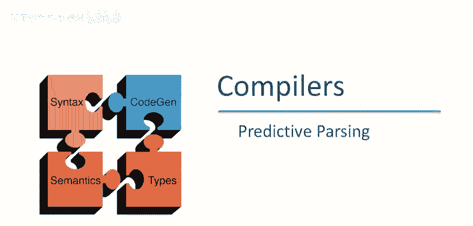
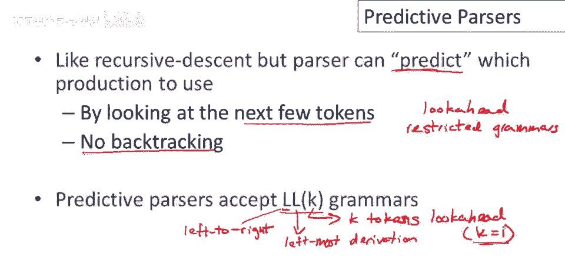
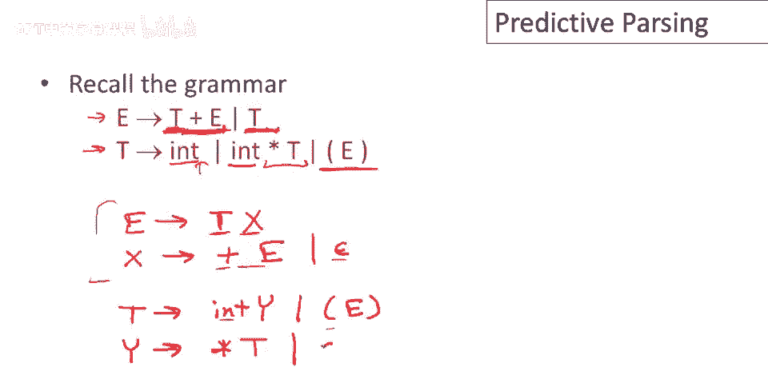
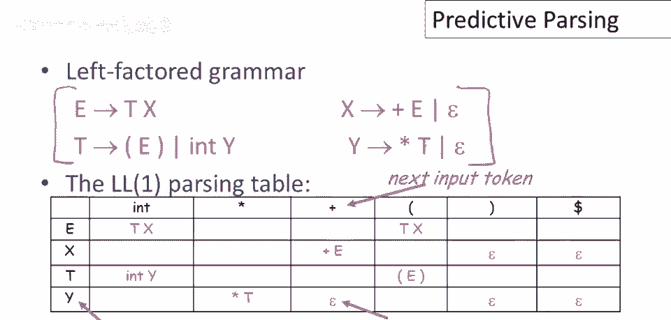
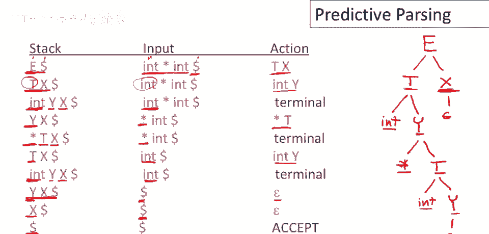

# 课程 P27：预测解析（Predictive Parsing） 🧠


在本节课中，我们将学习一种称为**预测解析**的自顶向下解析算法。我们将了解它与递归下降解析的区别，学习如何通过**左因子化**改造语法以适应预测解析，并掌握如何使用**解析表**来驱动解析过程。

---

## 概述 📋



上一节我们介绍了自顶向下解析的基本概念。本节中，我们来看看一种更高效、无需回溯的自顶向下解析策略——**预测解析**。预测解析器能够根据输入流中即将出现的标记（即“前瞻”），确定性地选择正确的语法产生式。

---

## 什么是预测解析？ 🤔


预测解析类似于递归下降解析，它也是一种自顶向下解析器。但关键区别在于，预测解析器能够“预测”将使用哪个产生式，而从不进行盲目的尝试。解析器总能正确猜测哪个产生式将导致成功的解析（如果存在这样的产生式）。

它通过两种方式实现这一点：
1.  它查看输入流中接下来的几个标记（即使用“前瞻”）。
2.  它要求语法必须满足特定形式（即LL(k)文法）。

优势是**没有回溯**，因此解析器是完全确定的。


---

## LL(k) 文法 📖

预测解析器接受的语法称为 **LL(k) 文法**。这个名称的含义如下：
*   **第一个 L**：代表**从左到右**扫描输入。
*   **第二个 L**：代表构建**最左推导**，即总是扩展解析树中最左边的非终结符。
*   **k**：代表**前瞻符号的数量**，即解析器可以提前查看输入流中接下来的 `k` 个标记。

尽管理论上 `k` 可以是任意值，但在实践中，`k` 通常等于 **1**。因此，我们主要讨论 **LL(1)** 解析。

在LL(1)解析中，解析过程的每一步都只有**至多一个**可用的产生式。这意味着，如果当前最左非终结符是 `A`，下一个输入标记是 `t`，那么恰好只有一个形如 `A -> α` 的产生式可能成功。任何其他选择都保证是错误的。

---



## 语法改造：左因子化 🔧


并非所有语法都天然适合LL(1)解析。回顾我们之前使用的表达式语法：



```
E -> T + E | T
T -> int * T | int | (E)
```


使用这个语法进行预测解析会遇到问题。例如，`E` 的两个产生式都以 `T` 开头。如果仅前瞻一个标记（`int`, `*`, `(` 等），我们无法判断应该选择 `T + E` 还是 `T`。

为了解决这个问题，我们需要对语法进行**左因子化**。左因子化的思想是消除一个非终结符的多个产生式中的公共前缀。


以下是改造过程：


1.  **处理 E 的产生式**：
    *   原式：`E -> T + E | T`
    *   公共前缀是 `T`。我们提取它，引入一个新的非终结符 `X` 来处理不同的后缀。
    *   改造后：`E -> T X`，然后为 `X` 写产生式来处理 `+ E` 或空（ε）。
    *   最终：`E -> T X`， `X -> + E | ε`

2.  **处理 T 的产生式**：
    *   原式：`T -> int * T | int | (E)`
    *   注意到 `int * T` 和 `int` 有公共前缀 `int`，而 `(E)` 则不同。
    *   对前两个产生式进行左因子化，引入新非终结符 `Y`。
    *   最终：`T -> int Y | (E)`， `Y -> * T | ε`

经过左因子化后，我们得到的新语法如下：


```
E -> T X
X -> + E | ε
T -> int Y | (E)
Y -> * T | ε
```

这个语法更适合进行LL(1)预测解析。

---

## 解析表与解析算法 🗂️

对于改造后的LL(1)语法，我们可以构建一张**解析表**。这张表定义了在给定当前最左非终结符和下一个输入标记时，应该使用哪个产生式。

解析表的一维是当前最左**非终结符**（行），另一维是下一个输入**终结符**（列）。表中的条目是对应的产生式右侧，空白条目表示错误状态。


假设我们已经为上面的语法构建了解析表（构建算法将在后续课程介绍），解析算法使用一个**栈**来驱动，流程如下：

**算法步骤：**
1.  初始化栈，内容为 `[$, S]`（`S` 是开始符号，`$` 是输入结束标记）。输入字符串末尾也追加 `$`。
2.  循环执行以下操作，直到栈为空或遇到错误：
    *   **情况A：栈顶是终结符 `a`**
        *   如果 `a` 等于当前输入标记，则匹配成功。弹出栈顶，输入指针前进。
        *   否则，触发错误。
    *   **情况B：栈顶是非终结符 `X`**
        *   查解析表 `Table[X, 当前输入标记]`。
        *   如果条目为产生式 `X -> Y1 Y2 ... Yk`，则弹出 `X`，并将 `Yk, ..., Y2, Y1` 依次压入栈中（注意顺序，保证最左符号在栈顶）。
        *   如果条目为空，触发错误。
3.  当栈变为 `[$]` 且输入也只剩下 `$` 时，解析成功。

---

## 解析示例 🔍

让我们使用上述算法和解析表，解析输入字符串 `int * int`。

以下是解析过程的步骤追踪：

| 步骤 | 栈 (从顶到底) | 剩余输入        | 动作说明                                     |
| :--- | :------------ | :-------------- | :------------------------------------------- |
| 0    | `[$, E]`      | `int * int $`   | 初始状态                                     |
| 1    | `[$, X, T]`   | `int * int $`   | 栈顶 `E`，输入 `int`，查表得 `E -> T X`      |
| 2    | `[$, X, Y, int]` | `int * int $` | 栈顶 `T`，输入 `int`，查表得 `T -> int Y`    |
| 3    | `[$, X, Y]`   | `* int $`       | 栈顶 `int` 匹配输入 `int`，弹出并前进输入    |
| 4    | `[$, X, T, *]`  | `* int $`     | 栈顶 `Y`，输入 `*`，查表得 `Y -> * T`        |
| 5    | `[$, X, T]`   | `int $`         | 栈顶 `*` 匹配输入 `*`，弹出并前进输入        |
| 6    | `[$, X, Y, int]` | `int $`       | 栈顶 `T`，输入 `int`，查表得 `T -> int Y`    |
| 7    | `[$, X, Y]`   | `$`             | 栈顶 `int` 匹配输入 `int`，弹出并前进输入    |
| 8    | `[$, X]`      | `$`             | 栈顶 `Y`，输入 `$`，查表得 `Y -> ε`，弹出 `Y` |
| 9    | `[$]`         | `$`             | 栈顶 `X`，输入 `$`，查表得 `X -> ε`，弹出 `X` |
| 10   | **接受**      |                 | 栈顶 `$` 匹配输入 `$`，栈空，解析成功！      |

通过这个例子，你可以看到预测解析器如何确定性地、一步步地构建出解析树，而无需任何回溯。

---

## 总结 🎯

本节课中我们一起学习了**预测解析**的核心内容：
1.  **预测解析**是一种无回溯、确定性的自顶向下解析方法。
2.  它要求语法是 **LL(1)** 文法，即通过**一个前瞻符号**就能确定产生式选择。
3.  对于不满足LL(1)的语法，可以通过**左因子化**进行改造。
4.  解析过程由一个**解析表**驱动，并使用**栈**来跟踪解析状态。
5.  算法通过匹配终结符和展开非终结符（根据查表结果）来推进，直到成功接受或报错。



预测解析是许多编译器前端使用的高效算法，理解它是掌握语法分析的关键一步。在接下来的课程中，我们将探讨如何自动构建那张至关重要的解析表。