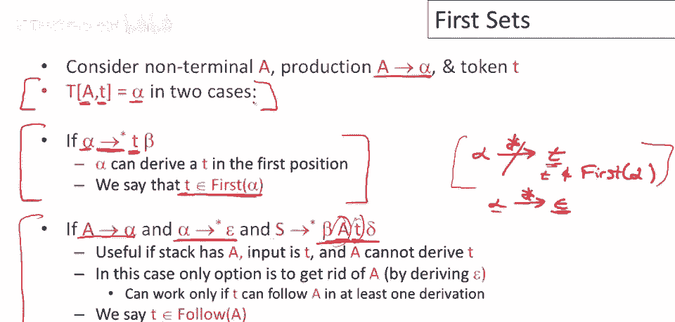
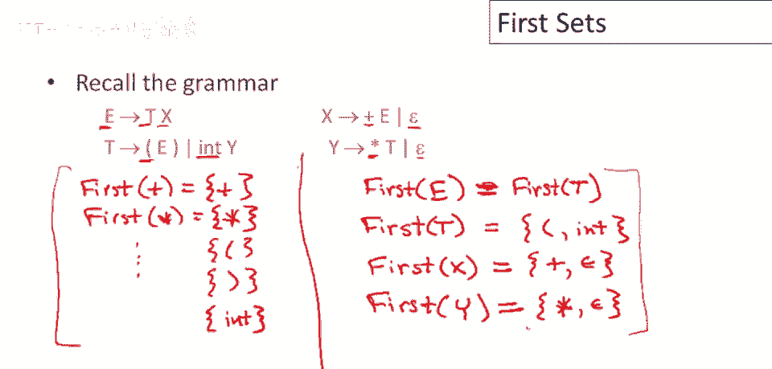

# 课程 P28：构建LL(1)解析表 - 计算First集合 🔍


在本节课中，我们将要学习如何为LL(1)语法分析器构建解析表。具体来说，本节将重点介绍一个核心概念：**First集合**。理解First集合是后续构建解析表的关键第一步。

## 概述：解析表的构建条件

在深入First集合之前，我们需要了解构建解析表的基本逻辑。解析表的核心作用是指导分析器在特定情况下应选择哪个产生式进行推导。

假设当前最左非终结符是 **A**，下一个输入符号是 **t**。分析器决定使用产生式 **A → α** 来替换 **A** 的条件主要有两种：

1.  如果从 **α** 推导出的**第一个终结符**可能是 **t**。这意味着 **t** 属于 **α** 的 **First集合**。
2.  如果 **α** 可能推导出空串 **ε**，并且 **t** 可以出现在 **A** 的**后面**（即属于 **A** 的 **Follow集合**）。

本节课我们将聚焦于第一种情况，即如何计算 **First集合**。

## First集合的定义与计算规则

对于语法中的任意符号串 **X**（可以是终结符、非终结符或它们的组合），其 **First(X)** 集合包含所有可能出现在由 **X** 推导出的**第一个位置**的终结符。此外，出于技术原因，如果 **X** 能够推导出空串 **ε**，那么 **ε** 也属于 **First(X)**。

以下是计算First集合的规则：



### 规则一：终结符的First集合
对于任意终结符 **t**，其First集合只包含它自身。
> **公式**：`First(t) = { t }`

### 规则二：非终结符的First集合
对于非终结符 **A**，考虑其所有产生式 `A → Y1 Y2 ... Yk`。其First集合的计算遵循以下步骤：
1.  如果存在产生式 `A → ε`，则将 **ε** 加入 `First(A)`。
2.  对于每个产生式 `A → Y1 Y2 ... Yk`：
    *   将 `First(Y1)` 中除 **ε** 外的所有元素加入 `First(A)`。
    *   如果 `First(Y1)` 包含 **ε**，则继续检查 `First(Y2)`，并将其所有元素（除 **ε** 外）加入 `First(A)`。
    *   依此类推，直到遇到某个 `Yi`，其 `First(Yi)` 不包含 **ε**。
    *   如果所有 `Y1` 到 `Yk` 的 `First` 集合都包含 **ε**，则将 **ε** 加入 `First(A)`。

### 规则三：符号串的First集合
对于符号串 `X1 X2 ... Xn`，其First集合的计算方式与非终结符类似：
1.  首先将 `First(X1)` 中除 **ε** 外的所有元素加入结果集合。
2.  如果 `First(X1)` 包含 **ε**，则继续将 `First(X2)` 中除 **ε** 外的元素加入。
3.  重复此过程，直到某个 `Xi` 的First集合不包含 **ε**。
4.  如果所有 `X1` 到 `Xn` 的First集合都包含 **ε**，则将 **ε** 加入结果集合。

## 实例演练：计算First集合

让我们通过一个具体的语法来实践上述规则。考虑以下表达式语法：

```
E  -> T X
X  -> + T X | ε
T  -> F Y
Y  -> * F Y | ε
F  -> n | ( E )
```

以下是计算过程：

**第一步：计算终结符的First集合**
根据规则一，每个终结符的First集合就是它自身。
> `First(n) = { n }`
> `First(+) = { + }`
> `First(*) = { * }`
> `First(() = { ( }`
> `First()) = { ) }`

**第二步：计算非终结符的First集合**
我们需要按照依赖关系，从最基本的非终结符开始计算。


1.  **计算 `First(F)`**：
    *   产生式 `F -> n`：将 `First(n) = { n }` 加入。
    *   产生式 `F -> ( E )`：将 `First(() = { ( }` 加入。
    *   `F` 没有 `ε` 产生式。
    > **结果**：`First(F) = { n, ( }`

2.  **计算 `First(Y)`**：
    *   产生式 `Y -> * F Y`：将 `First(*) = { * }` 加入。
    *   产生式 `Y -> ε`：将 **ε** 加入。
    > **结果**：`First(Y) = { *, ε }`

3.  **计算 `First(T)`**：
    *   产生式 `T -> F Y`：我们需要计算 `First(F Y)`。
        *   `First(F) = { n, ( }`，不包含 **ε**。因此，`First(T)` 直接包含 `First(F)` 的所有元素 `{ n, ( }`。
    > **结果**：`First(T) = { n, ( }`

4.  **计算 `First(X)`**：
    *   产生式 `X -> + T X`：将 `First(+) = { + }` 加入。
    *   产生式 `X -> ε`：将 **ε** 加入。
    > **结果**：`First(X) = { +, ε }`

5.  **计算 `First(E)`**：
    *   产生式 `E -> T X`：我们需要计算 `First(T X)`。
        *   `First(T) = { n, ( }`，不包含 **ε**。因此，`First(E)` 直接包含 `First(T)` 的所有元素 `{ n, ( }`。
    > **结果**：`First(E) = { n, ( }`

## 总结

本节课中，我们一起学习了 **First集合** 的概念和计算方法。我们了解到：

*   **First集合** 定义了从一个语法符号串开始推导时，可能出现在首位的所有终结符（包括可能的 **ε**）。
*   计算遵循三条核心规则：终结符的First集合是它自身；非终结符的First集合由其产生式右侧符号串的First集合决定；符号串的First集合由其组成符号的First集合递推得到。
*   掌握First集合的计算是构建LL(1)解析表的第一步，它帮助我们确定在看到一个输入符号时，哪个产生式有可能匹配这个输入。



在下一节课中，我们将学习另一个关键概念——**Follow集合**，它用于处理当前非终结符可能推导为空串（**ε**）时，该如何决定使用哪个产生式。