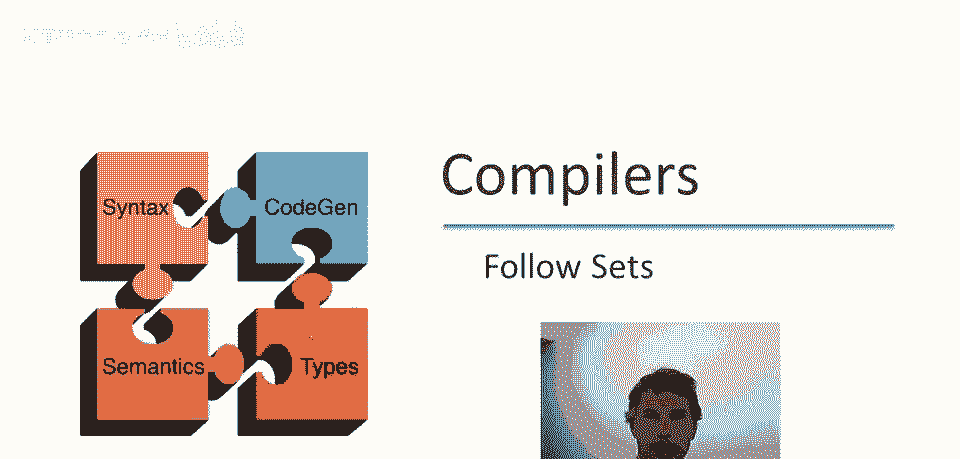
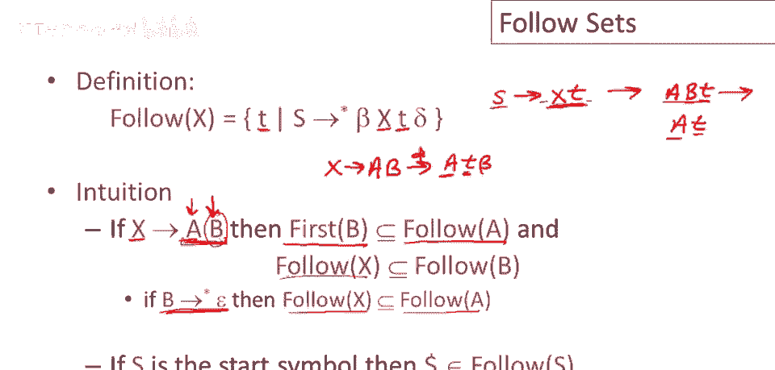
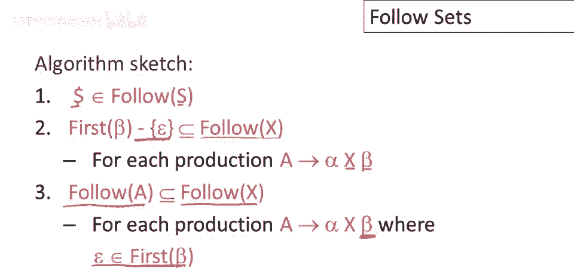
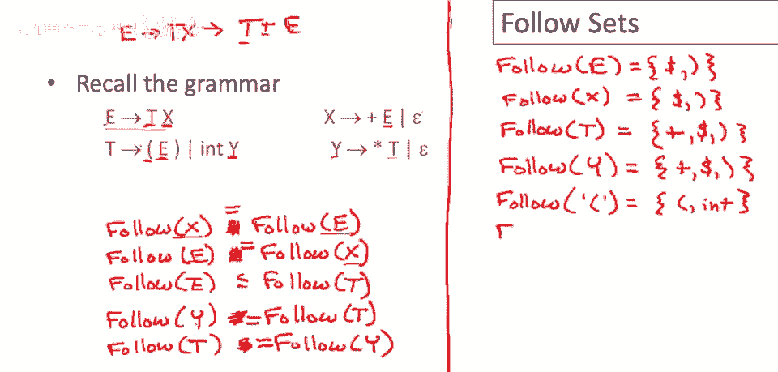

# 编译原理课程 P29：构建解析表之Follow集计算 🧮

在本节课中，我们将学习如何计算语法中非终结符的 **Follow集**。Follow集用于确定在解析过程中，一个非终结符后面可能出现的终结符是什么。这对于构建预测分析表至关重要。

## 概述 📋

上一节我们介绍了First集的计算，它告诉我们一个符号串能推导出的第一个终结符。本节中，我们来看看Follow集。Follow集的定义与First集不同，它不关心符号本身能生成什么，而是关注**该符号在语法推导中可能出现在什么位置**，以及紧跟在它后面的终结符有哪些。

## Follow集的定义与直观理解

给定一个语法符号X，其Follow集是所有满足以下条件的终结符t的集合：存在某个推导，使得终结符t可以**紧跟在**符号X之后出现。



以下是计算Follow集的直观规则：

1.  **相邻符号规则**：如果在某个产生式 `A -> α X β` 中，符号X后面紧跟着符号串β，那么**β的First集（除去ε）** 中的终结符，都在X的Follow集中。
2.  **产生式末尾规则**：如果符号X位于某个产生式 `A -> α X` 的末尾，或者X后面的β可以推导出ε（即 `β =>* ε`），那么**左部符号A的Follow集**中的终结符，也在X的Follow集中。
3.  **开始符号的特殊规则**：特殊的结束标记 `$` 总是在**开始符号**的Follow集中。



## 计算Follow集的算法步骤

以下是计算语法中所有非终结符Follow集的算法概要：

1.  初始化：将 `$` 加入开始符号的Follow集。
2.  遍历语法中的每一个产生式 `A -> α`。
3.  对于产生式右部α中的每一个符号 `Xi`（从左到右）：
    *   如果 `Xi` 后面有符号 `Xi+1...Xj`，则将 `First(Xi+1...Xj)`（除去ε）加入 `Follow(Xi)`。
    *   如果 `Xi` 后面没有符号，或者 `Xi+1...Xj` 可以推导出ε（即 `ε ∈ First(Xi+1...Xj)`），则将 `Follow(A)` 加入 `Follow(Xi)`。
4.  重复步骤2和3，直到所有Follow集不再发生变化。

> **注意**：Follow集中只包含终结符，不包含ε。

## 实例演练：算术表达式语法

让我们通过一个具体的语法例子来实践Follow集的计算。语法如下：
```
E -> T X
X -> + E | ε
T -> F Y
Y -> * T | ε
F -> ( E ) | int
```
其中，`E` 是开始符号。

我们将逐步计算每个非终结符的Follow集。

### 步骤1：初始化与开始符号E

根据规则，`$` 在 `Follow(E)` 中。
```
Follow(E) = { $ }
```
现在，我们需要查看E在语法中的使用位置，以确定其Follow集中是否还有其他终结符。

### 步骤2：分析E的使用位置

E在语法中被使用的位置有两处：
1.  在产生式 `F -> ( E )` 中。这里，E后面紧跟着终结符 `)`。因此，`)` 在 `Follow(E)` 中。
    ```
    Follow(E) = { $, ) }
    ```
2.  在产生式 `E -> T X` 中，E出现在产生式右部。根据“产生式末尾规则”，`Follow(E)` 是 `Follow(X)` 的子集（因为X在产生式末尾）。这个关系我们稍后会用到。

### 步骤3：分析X的使用位置

X在语法中只在一个地方被使用：`E -> T X`。X出现在产生式右部，因此 `Follow(E)` 是 `Follow(X)` 的子集。
同时，从步骤2我们知道，`Follow(X)` 也是 `Follow(E)` 的子集。这意味着 `Follow(E)` 和 `Follow(X)` 最终必须相等。
```
Follow(X) = Follow(E) = { $, ) }
```

### 步骤4：分析T的使用位置

T在语法中被使用的位置有两处：
1.  在产生式 `E -> T X` 中。
    *   T后面是X。因此，`First(X)`（除去ε）中的终结符在 `Follow(T)` 中。`First(X) = { +, ε }`，除去ε后得到 `{ + }`。
    *   因为 `ε ∈ First(X)`（X可以推导出ε），根据“产生式末尾规则”，`Follow(E)` 也在 `Follow(T)` 中。
    ```
    Follow(T) ⊇ { + } ∪ Follow(E) = { +, $, ) }
    ```
2.  在产生式 `Y -> * T` 中，T出现在产生式右部。因此，`Follow(Y)` 是 `Follow(T)` 的子集。



### 步骤5：分析Y的使用位置

Y在语法中只在一个地方被使用：`T -> F Y`。Y出现在产生式右部，因此 `Follow(T)` 是 `Follow(Y)` 的子集。
同时，从步骤4我们知道，`Follow(Y)` 也是 `Follow(T)` 的子集。这意味着 `Follow(T)` 和 `Follow(Y)` 最终必须相等。
```
Follow(Y) = Follow(T) = { +, $, ) }
```

### 步骤6：最终结果

现在，我们已经处理了所有非终结符。最终得到的Follow集如下：
*   `Follow(E) = { $, ) }`
*   `Follow(X) = { $, ) }`
*   `Follow(T) = { +, $, ) }`
*   `Follow(Y) = { +, $, ) }`
*   `Follow(F)`：根据语法，F出现在 `T -> F Y` 和 `F -> ( E )` 中。计算可得 `Follow(F) = { *, +, $, ) }`（具体计算过程作为练习，逻辑与上述类似）。

## 总结 🎯

本节课中我们一起学习了**Follow集**的计算方法。我们了解到：
1.  Follow集用于确定非终结符后面可能出现的终结符。
2.  其计算基于三个核心规则：相邻符号规则、产生式末尾规则和开始符号特殊规则。
3.  计算过程是一个迭代过程，需要关注符号在语法中的所有使用位置，并处理Follow集之间的相互包含关系。

掌握First集和Follow集的计算，是下一步构建**LL(1)预测分析表**的基础。在下一节课中，我们将看到如何利用这两个集合来填充预测分析表，从而实现对输入串的自顶向下语法分析。