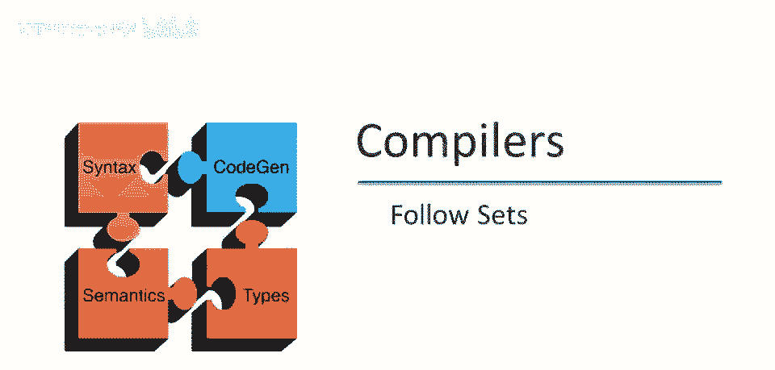

# P29：p29 07-03-_Follow_Sets - 加加zero - BV1Mb42177J7

本视频将讨论，构建解析表的构造，通过查看如何构建跟随集。

这是跟随集x的定义，回忆一下，给定符号的跟随集，实际上并不关于，该符号可以生成什么，而取决于该符号可以在哪里出现，该符号在语法中的使用位置，我们说t在x的跟随集中，如果语法中存在某个位置。

某个推导中终端t可以紧跟在符号x之后，好的，因此对于所有这样的t，它们构成了x的跟随集，这是如何计算跟随集的直观理解，假设x可以生成两个符号a和b，显然b可以生成的第一个位置，也在a的跟随集中。

因此如果x生成ab，然后通过更多步骤可以得到，a生成b生成t贝塔，那么t紧跟在a之后，显然b的first集在a的跟随集中，因此基本规则是，如果在语法中，两个符号相邻。

第二个符号的first集在第一个符号的跟随集中，好的，现在另一个有趣的事实是，如果符号在产生式的末尾，让我们看看这里的b，我声称，左边的跟随集中的任何东西，都会在b的跟随集中，在这种情况下。

x的跟随集是b的跟随集的子集，让我们看看这一点，假设我们从起始符号开始，好的，最终得到x后跟t，好的，x和t周围可能还有其他东西，但让我们暂时忽略这一点，我们只关注xt，然后我们可以使用这个产生式。

x生成ab，一步后可以得到abt，现在我们知道t在x的跟随集中，并且t也在b的跟随集中，好的，x的跟随集中的任何东西也将在b的跟随集中，我们可以将这一观察推广到生产式末尾的情况，因此，生产结束时发生。

是它的后续集，将包含此符号左侧生产的后续集，生产结束是什么，如果b可以到epsilon，如果b可以消失，那么a将出现在生产结束时，好的，因此，如果b可以到epsilon，那么x的后续集也将是a的后续集。

继续这里，在我们的例子中，我们从这里开始，我们从开始符号开始，我们得到了xt，一步我们得到了a b t，因此t在b的后续集中，但现在b可以到epsilon，因此我们也可以得到a t。

因此t也在a的后续集中，最后有一个特殊情况，记住我们有特殊符号标记输入的结束，那可以跟随什么，输入的结束在开始符号的后续集中，这又是另一种方式，跟踪我们将在输入用尽时做什么。

我们将在构建解析表时看到它是如何使用的，但我们总是添加，嗯，作为初始条件，美元符号在开始符号的后续集中。

现在让我们看一下计算后续集的算法的草图，正如我们刚才所说，嗯，美元符号在开始符号的后续集中，现在我们看看每个生产，好的，a去alpha x beta，我们专注于这里x，好的，如果我们看看每个生产。

并且我们看看生产右侧的每个符号，好的，beta的第一个，好的，在这个生产中可以跟随x的，第一个将在x的后续集中，并注意我们只是减去epsilon，如果在beta的第一个中。

我们不再对后续集中的epsilon感兴趣，epsilon从不出现在后续集中，因此后续集总是终端集的集合，现在算法的第二部分是，如果我们有一些生产beta的后缀可以到epsilon。

因此epsilon是beta的第一个，好的，因此，生产的后缀可以完全消失，然后，如上一页所述，左端符号的跟随将在x的跟随中。

这就是计算跟随集的规则，所以现在让我们通过一个例子，这是我们的语法再次，我们将计算语法中每个符号的跟随集，所以让我们从开始符号开始，我们将从跟随开始，E，根据定义我们知道美元符号在e的跟随中。

我们很容易得到这一点，现在的问题是b的跟随中还能有什么，好吧，所以为了弄清楚这一点，我们不得不看看语法中在哪里使用它，好吧，所以记住，跟随集是关于符号的使用，而不是它产生的内容，好吧。

这是e被使用的地方，我们可以看到它仅被一个终端符号跟随，所以当然右括号在e的跟随中，对吧，e还有另一个使用的地方，它在这里，它出现在一个生产的右端，那么然后我们知道任何在x的跟随中的东西。

也将要在e的跟随中出现，这是一个约束，我肯定会把它写在这里，好的，这只是跟随集之间关系的属性，当我们完成计算它们时，这并没有立即告诉我们任何新的东西，在e的跟随中。

但我们知道随着我们前进并了解x的跟随中的东西，我们不得不将它们添加到e的跟随中，让我只是在这里划分一下幻灯片，所以我们将我们知道的，关于跟随集之间关系的属性放在左手上，我们将实际的跟随集放在右手上。

好的，所以现在这就是仅有的两个地方，这就是仅有的两个地方，e在语法中被使用，为了进一步取得进展，我们需要知道一些关于x的跟随的信息，好的，如果我们将在e的跟随上取得进一步进展。

我们需要弄清楚x的跟随中有什么，所以让我们专注于这一点一分钟，语法中x在哪用？仅在一个地方用，就是这里，好的，它出现在生产式右端，因此左边的符号是x的后续集的子集，所以。

我们知道e的后续集是x后续集的子集，好吧，这意味着什么？所以x的后续集是e后续集的子集，b的后续集是x后续集的子集，这意味着这两个集合相等，x的后续集和e的后续集，无论它们最终是什么。

都必须是相同的集合，我们已经看了e在语法中所有使用的地方，我们已经看了x在语法中所有使用的地方，我们无法了解更多关于，e和x后续集中的内容，我们不必向任何集合添加其他内容，所以我们完成了。

所以我们可以关闭这个集合，我们知道e的后续集包括美元符号和闭合n，我们也知道x有相同的。集合，相同的后续集，好吧，现在让我们继续讨论t的后续集，好的，t的后续集中会有什么？

我们再次需要看t在语法中的使用，t用在两个地方，第一个在这里，第一个生产式，那么t的后续集中会有什么？可能是x的first集中的任何东西，好的，因为x紧跟在t之后，如果我们回顾之前的视频。

x的first集中只有两件事，一个是加号，所以这个加号肯定在t的后续集中，让我们回顾一下，抱歉，它是如何发生的？我们可以从e到tx，好的，现在使用第一个生产式，我们看到x在t之后。

然后在一步中我们可以到t加e，现在我们有了一个推导，其中加号跟在t之后，这就是为什么加号在t的后续集中，好吧，x的first集中另一个东西是epsilon，因为这里x有ε产生式，但记住我们并不关心。

我们不包括ε在后续集中，因此x没有贡献其他，嗯，到，呃，到t的后续集中，但由于x可以到ε，记得那意味着什么，这意味着从这里回头看t的第一次使用，这个x可以消失。

这意味着e的后续集中的任何内容也在t的后续集中，现在我们知道e的后续集，所以我们可以添加那些东西，好的，让我在这里写下来，以免我们忘记，所以e的后续集是t的后续集的子集，好的，我们不会再需要这个事实。

但写下它是有用的，也许，现在我们已经完成了对x的使用，我们已经在t的后续集中包含了由这个产生式暗示的，所有我们可以包含的内容，所以现在我们要看看t的另一个使用的地方，那就是这里，好的。

所以在这里我们看到t在产生式的右边，所以y的后续集中的任何内容也可以在t的后续集中，所以y的后续集将是t的后续集的子集，所以现在我们可以去处理y的后续集，为了确定t的后续集将会是什么，我们不得不。

我们需要知道y的后续集，那么y在语法中在哪里使用，嗯，只有一个地方，那就是这里，并且注意y出现在产生式的右边，这意味着左侧符号的后续集将被包含在y的后续集中，所以t的后续集将是y的后续集的子集。

现在再次我们有两个后续集是彼此的子集，y的后续集是t的后续集的子集，t的后续集是y的后续集的子集，我们知道这两个集合必须相等，好的，所以我们可以在这里写下y的后续集包括加号，美元符号和闭括号。

就像t的后续集，现在我们已经完成了，我们，我们呃，关于t的后续集和y的后续集，我们已经遵循了所有关于如何t的后续集，将事物纳入，可包含在t跟随中的内容，我们已经算出，我们查看语法中所有y被使用的位置。

并根据上下文添加所有可能的内容，我们没有被迫添加更多内容，因此我们完成了，好的，我们可以关闭这些集合，它们已经完成，所以现在，我们完成了e的跟随，X t和y，我们已经处理了所有终结符号，但抱歉。

所有非终结符号，但我们仍然需要计算终端符号的跟随集，与first集的情况不同，终端符号的跟随集实际上可能很有趣，所以让我们看看open paren的跟随，在推导中open后面可以跟什么。

Well open friend仅在一个地方使用，在这里，好的，因此open print后面可以跟的是e的first中的内容，并记住e的first与t的first相同，因为t总是在第一个位置产生内容。

而t的first是什么，它是open for an，它，好的，如果你仔细想想，嗯，这完全有意义，在任何有效，任何有效字符串中，在这个语法中，open print后面可以跟什么。

它要么是一个嵌套的括号表达式，要么是一个整数，特别是你不能在open后面立即有8次或a，也不能在open后面立即有输入结束，你不能在open后面有输入，Stop并有一个有效字符串。

所以现在让我们看看close paren的跟随。

好的，那个集合里有什么，再次，我们查看符号被使用的地方，它仅在这里使用，因为它出现在生产式的右端，右括号，接下来是什么，那是加美元和闭合，好的，现在让我们继续，看看操作符，让我们看看加号的后续。

所以加号在哪里使用，那仅用于这里，所以e的第一个元素将出现在加号的后续中，我们已经知道e的第一个元素是什么，那是一个左括号和一个整数，好的，记住e不能变为epsilon，所以e永远不能完全消失。

这是因为t总是产生至少一个终端，因此，只有e的第一个元素在加号的后续中，不是因为他从不因为，因为e不能变为epsilon，我们只需要包括e的第一个元素在加号的后续中，好吧，再次，如果你考虑一下一分钟。

这完全有意义，加号后面能有什么，嗯，它可以是一个整数，好的，这应该是，它可以是加法的第二个参数，或者它可以是另一个嵌套表达式的开始，它不能是乘法，它肯定不能是输入的结束。

因为你总是需要在加号后有另一个参数，呃，呃，我想那就是它，我想这是所有其他可能性，好的，好吧，现在让我们看看乘号的后续，我们可以在乘号后面，乘号在这里使用，所以t的第一个元素将出现在乘号的后续中再次。

好吧，我认为我们已经知道什么，那就是与e的第一个元素相同，那是打开，再次，这完全有意义，乘号后面能有什么，它要么是另一个嵌套表达式的开始，要么是一个整数，它肯定不是一个加号或输入的结束，好的，再次。

t不能变为epsilon，所以那是唯一的东西，这些是乘号的后续中唯一可能的东西，然后我们只剩一个符号，要看整数的跟随，好的，它在语法中的哪里使用，嗯，就在这里，没错，所以接下来会发生什么。

它将包括第一个y中的所有内容，第一个y中有什么，乘法在第一个y中，epsilon也在第一个y中，但记住，我们不包括epsilon在跟随集中，所以y贡献乘法到跟随事件，但现在因为y可以到epsilon。

有一个epsilon产生式为y，这意味着这个int实际上可以，最终成为这个生产的右端，好的，嗯，它可以结束，y可以消失，然后t可以跟随的任何内容也可以跟随结束，对。

所以我们必须包括t的跟随中的内容在it的跟随中，t的跟随中有什么，那是一个加号，那是一个美元，那是一个关闭，好的，那告诉我们什么，那告诉我们几乎任何东西都可以跟随一个int，但作为打开不能跟随结束。

所以你不能在int之后立即有另一个嵌套表达式，没有中间的运算符，对吧，这完成了跟随集的计算，对于这个例子。

