# P2：p02 01-02-_Structure_of_a_Co - 加加zero - BV1Mb42177J7

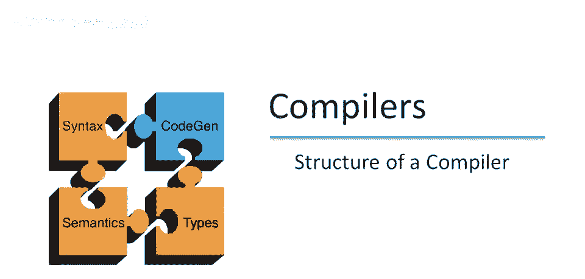

讲座下半场欢迎回来。

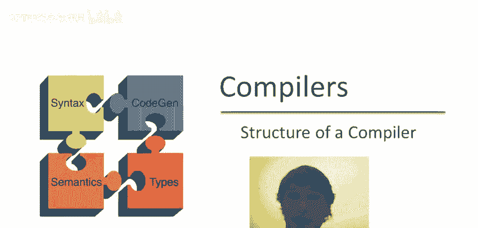

继续编译器结构概述。

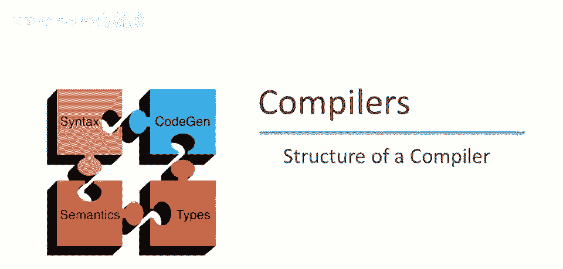

回顾编译器有五大阶段，词法分析，语法分析，语义分析，优化，代码生成，现在简要介绍每个阶段，解释编译器如何理解这些，类比人类理解英语。

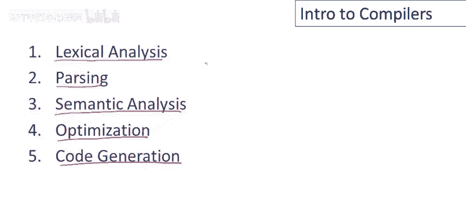

理解程序的第一步，编译器和人类都要理解单词，现在人类可看例句，立即认出有四个单词，这是一个和句子，如此自动，甚至不思考，这里真有计算在进行，需识别分隔符，即空格和标点，像标点符号，还有线索，如大写字母。

这些帮助你分组，这些字母成可理解单词。

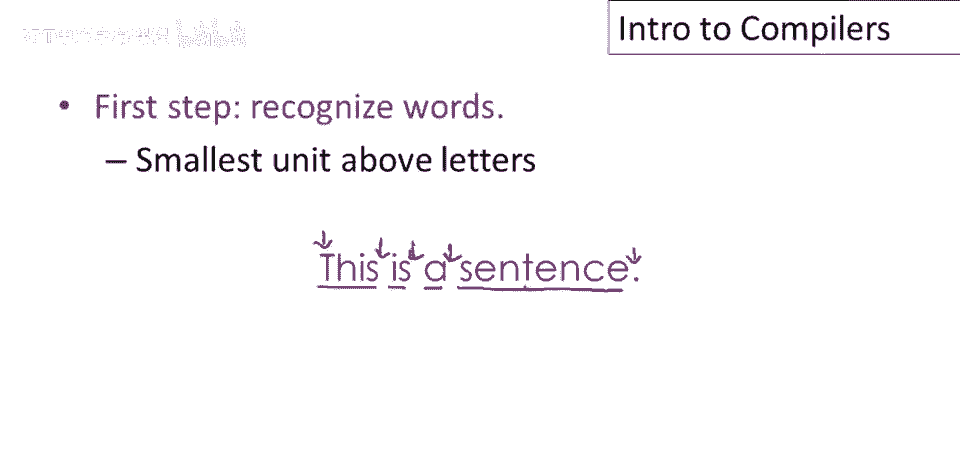

强调这不是简单事，看这句话，你能读，但需一点时间，因分隔符放错位，所以你可以看到单词就是单词，单词a和单词句子，但再次，这不是你立刻就能做到的，立即，实际上你得做些工作才能看到分割点，因为它们没给你。

以你习惯的方式。

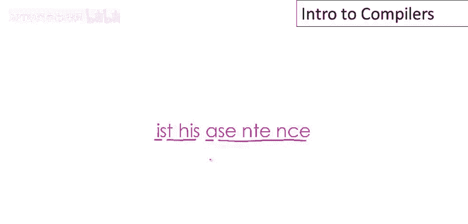

词法分析的目标是将程序文本分成单词，或我们编译器中所说的标记，现在有一段程序文本示例，不是一段英文文本，我们过一遍并识别标记，有一些明显的关键词，像if和then和else要识别，然后是变量名。

像x和y和z，还有常数，像数字一和数字二，然后是一些运算符，双等号是一个，赋值符是另一个，这里已经有一个有趣的问题，我们如何知道双等号不是两个单独的等号，我们如何知道我们想要这是一个双等号，我们想要。

而不是两个单等号，好吧，我们现在不知道，但我们在词法分析实现的讲座中会讨论这一点，但我们还没有完成这个例子中所有标记的处理，要么还有一些，分号，标点符号也是标记，然后分隔符也是标记，所以这是一个空白。

是一个标记，这里又是另一个空白，是另一个标记，然后这里有大量的空白，用于分隔事物，比如关键字和变量名以及其他符号彼此，这些是这个例子的标记。

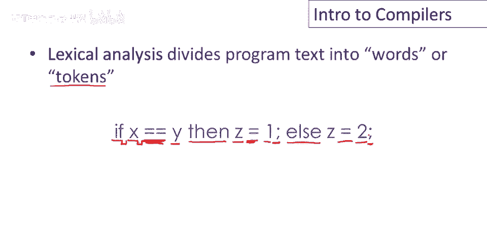

对人类来说，一旦理解了单词，下一步是理解句子的结构，这被称为解析，正如我们在小学都学过的，这意味着绘制句子，这些图表是树，这是一个非常简单的过程。

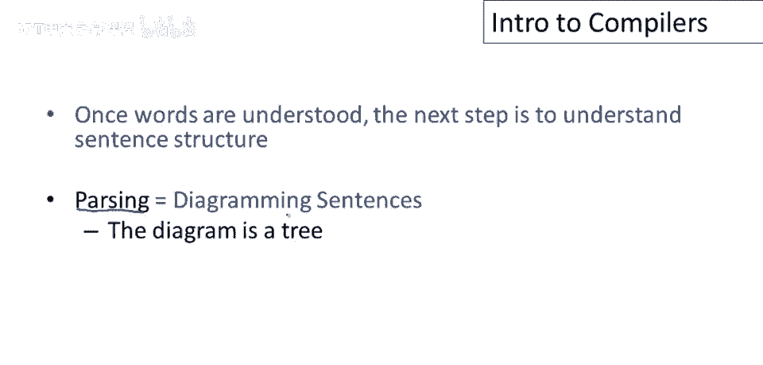

让我们看看这个例子，这行是一个较长的句子，解析的第一步是识别每个，嗯，单词在句子中的作用，所以我们有名词和动词和形容词等，但解析的实际工作是将这些单词组合成更高层次的构造，例如。

这个特定的句子由一个主体，一个动词，和一个宾语组成，好的，实际上这形成了一个完整的句子，所以这里我们有树的根，称为句子，并且被分解成组成部分，高级结构，如我们所说的是主体，动词，宾语，然后主体更复杂。

宾语也是如此，这是解析英语句子的例子。

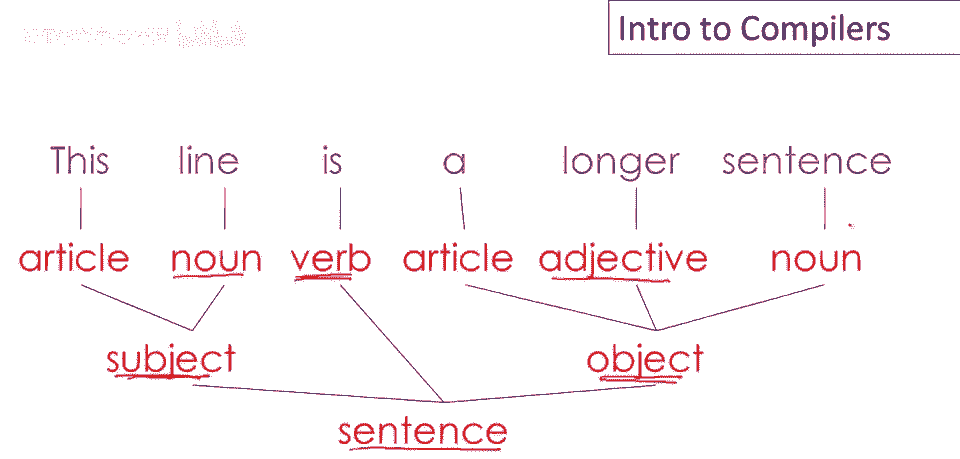

解析英语文本和解析程序文本的类比非常强，实际上它们完全一样，这是我们的小示例代码块，让我们清晰地解析它，这是一个if else语句，因此，我们解析树图根将是，If then else。

这个if else由三部分组成，有一个谓词，一个then语句和一个else语句，现在让我们看看谓词，它由三部分组成，嗯，有一个变量，一个比较运算符和另一个变量，这些共同形成一个关系，比较。

两个东西之间的比较是一个有效的谓词，类似地，then语句由一个赋值组成，其中z得到1，else语句也具有赋值的形式，z得到2，所有一起，嗯，这是if else的解析树，显示其结构，将其分解为其组成部分。

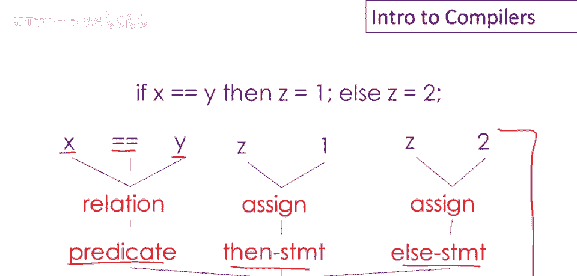

一旦我们理解了句子结构，下一步是尝试理解所写的内容，这很难，实际上我们不知道人类是如何做到的，我们仍然不理解词法分析和解析之后发生了什么，我们知道人们确实进行词法分析和解析。

与编译器词法分析和解析程序的方式大致相同，但坦率地说，理解意义对于编译器来说太难了，关于语义分析，首先要理解的是，嗯，语义分析是编译器只能进行非常有限的语义分析，特别是。

编译器通常做的事情是尝试捕捉不一致性，因此，如果程序以某种方式自相矛盾，编译器通常可以注意到并报告错误。

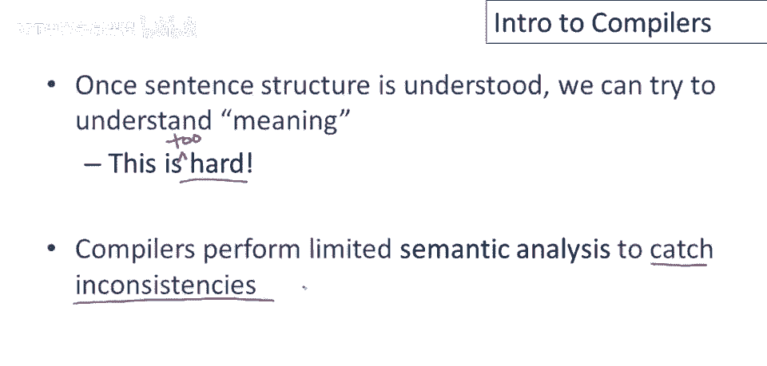

但他们并不真正知道程序应该做什么，作为我们在语义分析中做的事情的一个例子，使用英语中的类比，让我们考虑以下句子，Jack说Jerry把他的作业忘在家里了，问题是，这里的his指的是谁。

它可以指Jerry，在这种情况下，我们会读，Jack说Jerry把Jerry的作业忘在家里了，或者它可以指Jack，在这种情况下，我们可以读句子为Jack说Jerry，把Jack的作业忘在家里了。

没有更多信息，我们其实不知道他指的是哪个，是Jack还是Jerry，更糟的是，看看下面这句话，Jack说Jack把作业忘家了，问题是这句话涉及多少人，嗯，最多可能有三人，可能有两个不同的Jack。

他甚至可以指完全不同的人，我们不知道，没有看到故事其余部分，所有可能为他，但可能只有一个人，可能是杰克和杰克，这种歧义是语义分析问题。

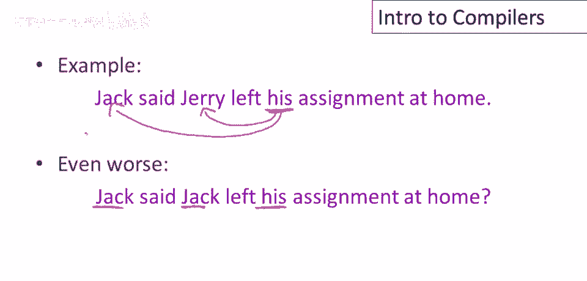

编程语言中的类比是变量绑定，因此我们会有变量，在这种情况下，一个名为杰克的变量，可能还有更多名为杰克的变量，遗嘱语言将非常严格，以防止歧义，如上一页英语句子中的歧义，所以你知道，在这个例子中。

问题是此输出语句打印什么值，答案是它将打印四，因为对jack变量的这种使用绑定于此定义，外部定义被隐藏，所以外部定义在此范围内不活跃，因被内部定义隐藏，这是许多词法作用域编程语言的常规规则。

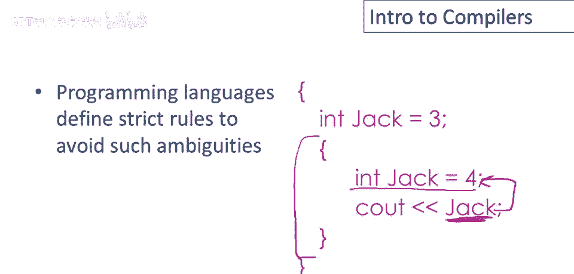

现在编译器除了分析变量绑定外还执行许多语义检查，这里有一个英语示例，所以杰克把作业忘在家里，在通常的命名约定下，假设杰克是男性，我们知道杰克和她在类型上不匹配，所以我们知道无论她是谁，她不是杰克。

类似类型检查。

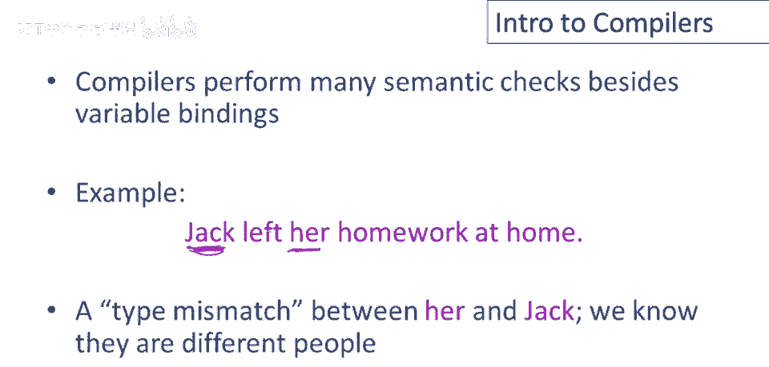

第四编译器，日常英语中，阶段优化没有很强的对应词，但有点像编辑，实际上，这很像专业编辑在必须缩短文章长度时所做的，以符合字数预算，例如，我有这个短语，有点像编辑，如果我不喜欢它，若觉得太长。

可替换'嗯'，中间四词为两词，类似，现为，但类似编辑，与原句意相同，但用词更少，程序优化目标为，修改程序以减少资源使用，或许我们想用更少时间，希望程序运行更快，或许我们想用更少空间。

以便手持设备存更多数据，可能关注减少耗电量，若有外部通信，可能关注减少网络消息，或数据库访问次数，可能想减少多种资源。

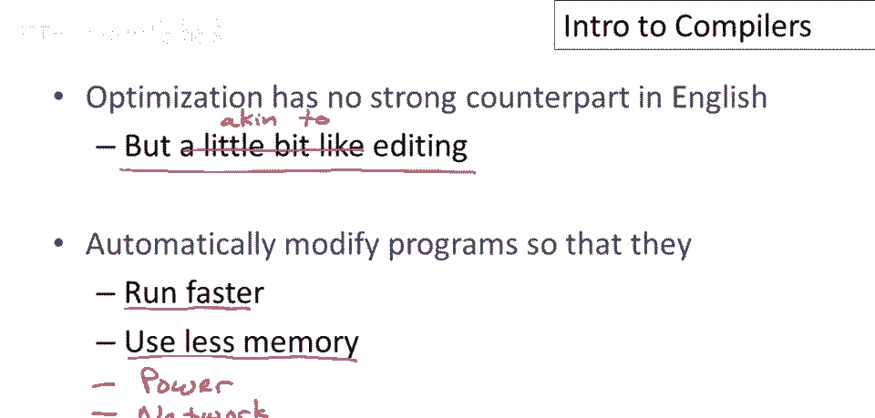

嗯，优化程序使用，示例程序优化类型，编译器规则：X=Y*0=X=0，看似真改进，避免乘法，仅做赋值，节省计算，现在，不幸的是，这不是正确规则，这是编译优化需了解的重要事项之一。

那就是何时进行某些优化并不总是明显，或不，现在发现这条特定规则适用于整数，好的，若x和y为整数，则乘以零始终等同于赋值为零，但对浮点数无效，为何如此？因为需了解IEEE浮点标准细节。

IEEE标准中有个特殊数，称为非数字的NaN乘0仍为NaN，特别地，NaN乘0不等于0，若x和y为浮点数，不能做此优化，实际上，若做了此优化，会破坏某些，依赖NaN正确传播的重要算法。

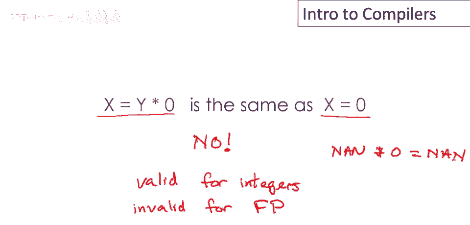

最后编译阶段是代码生成，常称为代码生成，可产生汇编代码，这是编译器最常产生的内容，但总体上是一种翻译成其他语言，这与人类翻译完全类似，就像人类译者可能将英语翻译成法语，编译器将高级程序翻译成汇编代码。

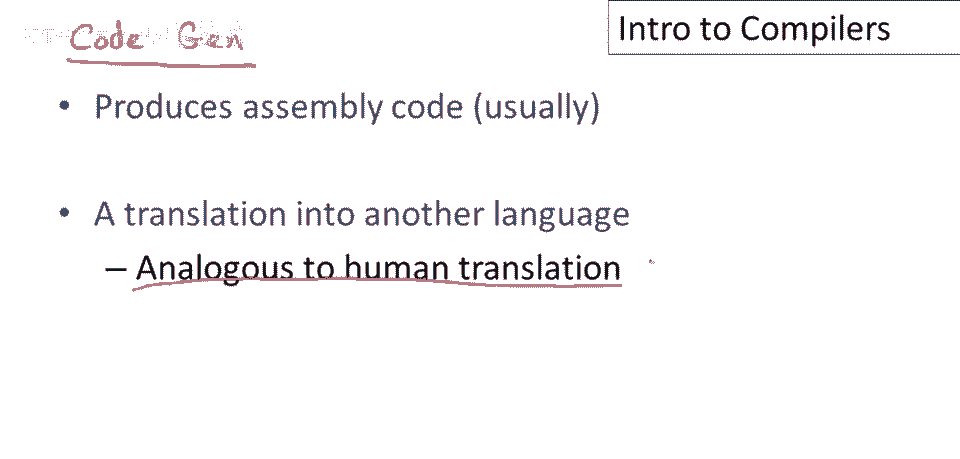

总结来说，几乎每个编译器都有我们概述的五个阶段，然而，这些比例在过去几年中发生了很大变化，如果我们回到FORTRAN 1并查看该编译器内部，我们可能会看到大小和复杂性类似于这样的东西。

我们有一个相当复杂的词法分析阶段，嗯，一个同样复杂的解析阶段，一个非常小的语义分析阶段，嗯，一个相当复杂的优化阶段，另一个相当复杂的代码生成阶段，因此，我们看到一个编译器，复杂性是，嗯。

相当均匀地分布在整个过程中，除了它的语义分析，这在早期是非常弱的，今天，如果我们看一个现代编译器，你会看到词法分析中几乎没有什么，解析中也很少，因为我们有非常好的工具来帮助我们编写这两个阶段。

我们会看到一个相当复杂的语义分析阶段，我们会看到一个非常大的优化阶段，事实上，这是所有现代编译器的核心组件，然后是一个非常小的代码生成阶段，因为再次，我们非常了解这个阶段，这就是本讲座的内容。

未来的讲座将详细研究这些阶段。

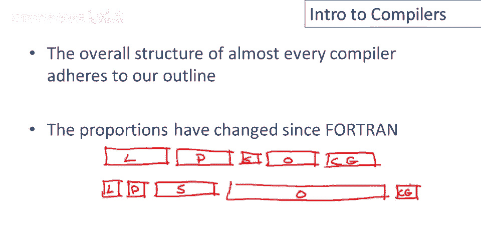