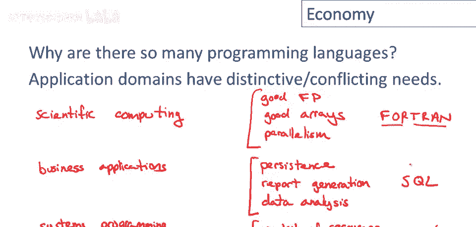

# 编程语言经济学 📈 P3

在本节课中，我们将探讨“编程语言经济学”这一话题。我们将分析为什么存在如此多的编程语言、为何不断有新的语言诞生，以及如何评价一门编程语言的好坏。理解这些宏观因素，有助于我们更好地把握编程语言的发展脉络和现实应用。

---

## 为什么存在如此多的编程语言？ 🤔

任何思考编程语言超过几分钟的人都会想到一个问题：为什么有这么多编程语言？我们有数百种，甚至数千种日常使用的编程语言。为什么所有这些都需要存在？为什么一种编程语言不够用？

这个问题的部分答案并不难找到。编程的应用领域有着非常独特且相互冲突的需求，因此很难设计一种语言，能在所有情况下为所有程序员做好所有事情。

以下是几个不同应用领域及其需求的例子：

*   **科学计算**：这个领域主要进行工程应用、大型科学实验和长期运行的模拟计算。
    *   **需求**：需要良好的浮点支持（`fp`）、强大的数组及数组操作支持，以及并行计算能力。
    *   **代表性语言**：**FORTRAN**。其名称即“公式翻译”，始终保留着科学计算的核心，至今仍是该领域的领先语言之一。

*   **商务应用**：这个领域关注企业数据处理。
    *   **需求**：需要极高的数据可靠性、良好的报告生成功能以及强大的数据分析能力。
    *   **代表性语言**：**SQL**。作为关系数据库的查询语言，它在数据处理领域占据主导地位。

*   **系统编程**：这个领域涉及嵌入式系统、操作系统等底层开发。
    *   **需求**：需要对资源进行极低层的细粒度控制，并且常常需要考虑实时性限制。
    *   **代表性语言**：**C** 和 **C++** 家族。

可以看到，不同领域的要求完全不同。在一个领域最重要的特性，在另一个领域可能无关紧要。因此，很难将所有需求整合到一个单一、连贯的系统中。

---

## 为什么会有新的编程语言诞生？ 🆕

既然已经有这么多语言，为什么我们还需要设计新的？要回答这个问题，需要从一个关键观察开始：**程序员培训是编程语言的主要成本**。

这里的“成本”不仅指购买教材或上课的实际支出，更指程序员投入学习该语言的时间价值。如果要让成千上万的程序员学习一门新语言，这将是一项巨大的经济投资。

从这个观察出发，我们可以得出几个预测：

*   **广泛使用的语言将缓慢变化**：改变一门拥有大量用户的语言，意味着需要重新教育整个社区。因此，即使是很小的语法扩展或功能增加，成本也非常高。随着用户群扩大，语言的进化速度会越来越慢。
*   **新语言更容易启动和快速进化**：从零用户开始的新语言，几乎没有培训成本。即使只有少量用户，教他们变化的成本也不高。因此，新语言能更快地适应变化的情况，进行实验的成本也很低。

在这两者之间存在一种张力。程序员何时会选择从现有语言转向新语言？**当他们认为学习新语言带来的生产力提升，短期内能超过培训成本时，他们就会转换。**

新的编程语言最可能被采用来**填补空白**。随着技术发展，不断有新的应用领域出现（例如移动应用、互联网），产生了新的编程需求。旧语言由于变化缓慢，很难快速适应这些新领域。这就为新语言的诞生创造了机会。

此外，还有一个预测：**新语言往往看起来像旧语言**。它们与某些前辈语言有家族相似性。这不仅有设计传承的原因，更有经济利益：**降低培训成本**。让新语言像旧语言，可以利用程序员已有的知识，让他们更快上手。Java 设计得像 C++，就是一个经典例子。

---

## 什么是好的编程语言？ 🏆

最后，我们来探讨什么是一门好的编程语言。不幸的是，这个问题并没有明确的答案。**没有普遍接受的评价指标**，这意味着人们对于好语言的标准存在分歧。

为了说明制定这种指标的困难，让我们看一个曾被认真提出的指标：**“一门好的语言是人们使用的语言。”**

*   **支持论点**：这是一个非常明确的指标，它测量语言的人气。更广泛使用的语言，可能在某些方面确实更好。
*   **反对论点**：如果遵循这个逻辑，那么 Visual Basic 可能就是世界上最好的编程语言。但除了技术卓越性之外，还有许多其他因素影响一门语言的流行程度，例如是否解决了特定利基市场的需求，以及历史惯性。技术卓越性甚至可能不是最重要的原因。

因此，仅凭使用人数无法客观衡量一门语言的好坏。

---

## 总结 📝

本节课我们一起学习了编程语言经济学中的核心概念。

要记住的两个最重要观点是：
1.  **应用领域有冲突的需求**：很难设计一个单一系统来完美满足所有需求。向现有系统添加新功能通常需要很长时间。
2.  **程序员培训是主要成本**：这个观察解释了为什么新语言会不断诞生。当新的应用机会出现时，设计一门全新的、专门适应新需求的语言，往往比试图推动整个庞大的现有程序员社区和系统进行缓慢的变革，更加直接和高效。

这两点共同构成了编程语言生态不断演进的底层经济逻辑。