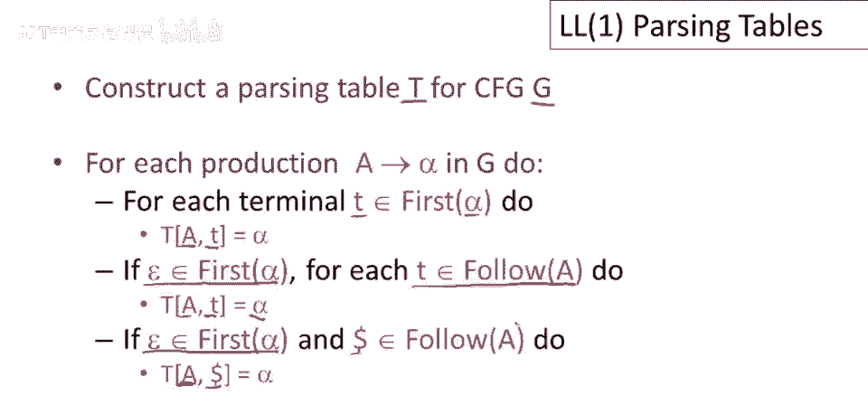
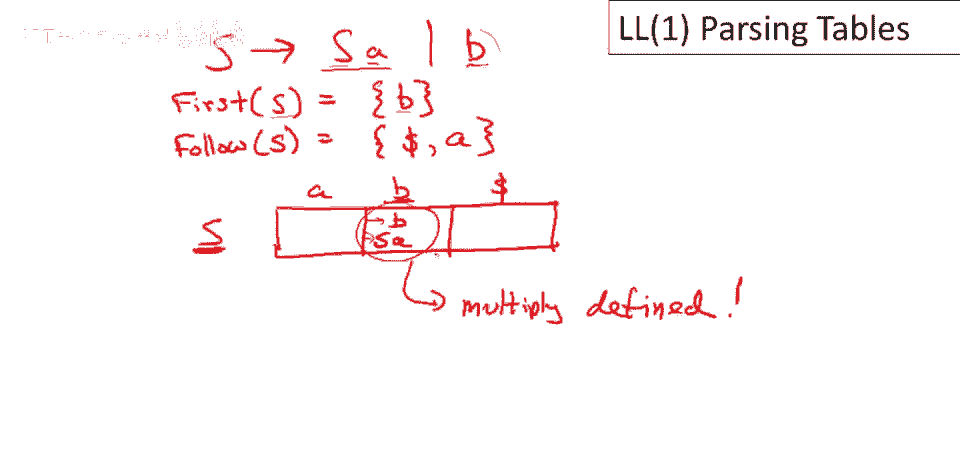
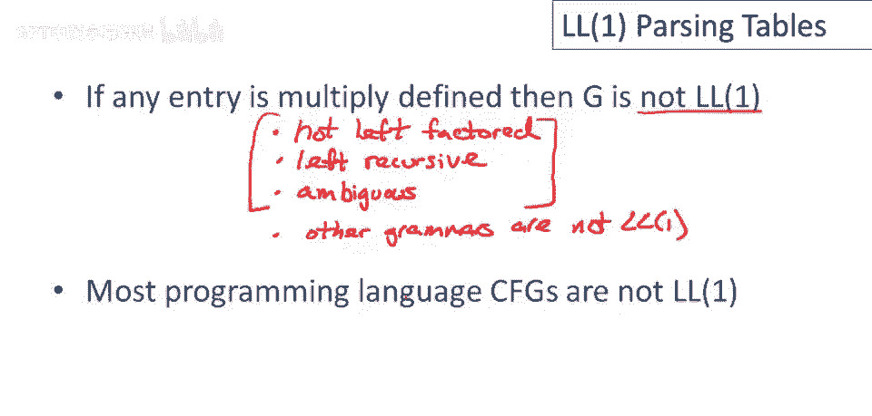

# 课程 P30：LL(1) 解析表构建 🧩


在本节课中，我们将学习如何整合**FIRST集**和**FOLLOW集**的知识，来为给定的文法构造 **LL(1) 解析表**。解析表是LL(1)解析器的核心，它明确地告诉解析器在给定栈顶符号和下一个输入符号时，应该选择哪个产生式进行推导。

---

## 解析表构建规则 📝

上一节我们介绍了FIRST集和FOLLOW集的计算，本节中我们来看看如何利用它们来填充解析表。

构造解析表 `T` 的过程是：遍历文法 `G` 中的每一个产生式 `A -> α`，并根据以下规则向表中添加条目。



以下是具体的规则：

1.  **情况一：终结符在 FIRST(α) 中**
    对于产生式 `A -> α`，如果存在终结符 `t` 属于 **FIRST(α)**，那么就在解析表的 `[A, t]` 单元格中填入这个产生式 `A -> α`。这表示当栈顶是 `A` 且下一个输入是 `t` 时，应该用 `α` 来替换 `A`。

2.  **情况二：ε 在 FIRST(α) 中，且 FOLLOW(A) 中有终结符**
    对于产生式 `A -> α`，如果 **ε** 属于 **FIRST(α)**（即 `α` 可以推导出空串），那么对于 **FOLLOW(A)** 中的每一个终结符 `t`（包括结束符 `$`），在解析表的 `[A, t]` 单元格中填入这个产生式 `A -> α`。这表示当栈顶是 `A`，下一个输入是 `t`，且 `t` 可以合法地跟在 `A` 后面时，我们可以选择将 `A` 替换为空（即“消除”`A`）。

3.  **特殊情况：输入结束符 `$`**
    如果栈顶是 `A`，而输入已经结束（下一个“输入”是 `$`），并且 `$` 属于 **FOLLOW(A)**，那么对于所有能推导出 `ε` 的产生式 `A -> α`，在 `[A, $]` 单元格中填入该产生式。这允许我们在输入结束时，将栈中剩余的 `A` 消除掉。

**核心公式**：表格条目 `T[A, t]` 的填充逻辑可以总结为：
```
如果 t ∈ FIRST(α)，则 T[A, t] = A -> α
否则，如果 ε ∈ FIRST(α) 且 t ∈ FOLLOW(A)，则 T[A, t] = A -> α
```

---

## 构建示例 ✨

现在，让我们通过一个具体的例子来应用上述规则。我们将使用以下熟悉的表达式文法：

```
E  -> T X
T  -> ( E )
T  -> int Y
X  -> + E
X  -> ε
Y  -> * T
Y  -> ε
```

首先，我们需要知道所有非终结符的 **FIRST集** 和 **FOLLOW集**（这些我们在之前的课程中已经计算过）。

以下是构建解析表的步骤：

1.  **初始化表格**
    表格的行是非终结符：`E, T, X, Y`。
    表格的列是终结符：`(, ), int, +, *, $`。

2.  **应用规则填充表格**
    我们将逐个分析每个产生式。

    **对于产生式 `E -> T X`**：
    *   `FIRST(T X)` 包含 `(` 和 `int`。
    *   因此，在 `[E, (]` 和 `[E, int]` 单元格中填入 `E -> T X`。

    **对于产生式 `T -> ( E )`**：
    *   `FIRST(( E ))` 只包含 `(`。
    *   因此，在 `[T, (]` 单元格中填入 `T -> ( E )`。

    **对于产生式 `T -> int Y`**：
    *   `FIRST(int Y)` 只包含 `int`。
    *   因此，在 `[T, int]` 单元格中填入 `T -> int Y`。

    **对于产生式 `X -> + E`**：
    *   `FIRST(+ E)` 只包含 `+`。
    *   因此，在 `[X, +]` 单元格中填入 `X -> + E`。

    **对于产生式 `Y -> * T`**：
    *   `FIRST(* T)` 只包含 `*`。
    *   因此，在 `[Y, *]` 单元格中填入 `Y -> * T`。

    **对于产生式 `X -> ε`**：
    *   `FIRST(ε)` 包含 `ε`。
    *   我们需要查看 `FOLLOW(X)`。根据计算，`FOLLOW(X) = { ), $ }`。
    *   因此，在 `[X, )]` 和 `[X, $]` 单元格中填入 `X -> ε`。

    **对于产生式 `Y -> ε`**：
    *   `FIRST(ε)` 包含 `ε`。
    *   我们需要查看 `FOLLOW(Y)`。根据计算，`FOLLOW(Y) = { +, ), $ }`。
    *   因此，在 `[Y, +]`、`[Y, )]` 和 `[Y, $]` 单元格中填入 `Y -> ε`。

3.  **完成表格**
    最终，我们得到以下解析表（空白单元格表示错误状态）：

| 非终结符 | `(`       | `)`       | `int`     | `+`       | `*`       | `$`       |
| :------- | :-------- | :-------- | :-------- | :-------- | :-------- | :-------- |
| **E**    | `E->T X`  |           | `E->T X`  |           |           |           |
| **T**    | `T->(E)`  |           | `T->int Y`|           |           |           |
| **X**    |           | `X->ε`    |           | `X->+E`   |           | `X->ε`    |
| **Y**    |           | `Y->ε`    |           | `Y->ε`    | `Y->*T`   | `Y->ε`    |

在解析过程中，如果栈顶符号和下一个输入符号所对应的单元格为空，则意味着当前输入串不符合该文法，解析器将报告错误。


---

## 非 LL(1) 文法示例 ⚠️

上一节我们成功构建了一个LL(1)解析表，本节中我们来看看当文法不是LL(1)时会发生什么。

考虑一个简单的**左递归**文法：
```
S -> S a
S -> b
```

让我们尝试为其构建解析表。

*   `FIRST(S) = { b }`
*   `FOLLOW(S) = { a, $ }` （因为 `S` 是开始符号，且 `a` 跟在 `S` 后面）



现在填充表格：
*   对于产生式 `S -> b`：`FIRST(b) = {b}`，所以在 `[S, b]` 填入 `S -> b`。
*   对于产生式 `S -> S a`：`FIRST(S a) = FIRST(S) = {b}`，所以在 `[S, b]` 也需要填入 `S -> S a`。

**问题出现了**：表格的 `[S, b]` 单元格现在有两个产生式（`S -> b` 和 `S -> S a`）。这意味着当栈顶是 `S` 且下一个输入是 `b` 时，解析器无法确定应该选择哪个产生式。这种**多重定义**的条目表明该文法**不是 LL(1) 文法**。

**核心结论**：
*   判断一个文法是否是 LL(1) 的**唯一机械方法**就是尝试构建其 LL(1) 解析表。如果表中任何一个单元格包含多于一个产生式，则该文法不是 LL(1)。
*   一些文法特征**保证**其不是 LL(1)，例如：
    *   存在**左递归**（如 `A -> A α`）。
    *   存在**歧义**（同一个句子有多种最左推导）。
    *   需要**超过一个符号的向前看**。
*   即使一个文法消除了左递归、进行了左公因子提取并且是无歧义的，它仍然可能不是 LL(1)。许多编程语言的语法都不是严格的 LL(1)，因此需要更强大的解析技术（如 LR 解析），这些技术都建立在当前所学的基础概念之上。

---

## 总结 📚



本节课中我们一起学习了 **LL(1) 解析表的构建方法**。我们首先回顾了利用 **FIRST集** 和 **FOLLOW集** 填充表格的两条核心规则。然后，我们通过一个完整的表达式文法示例，一步步演示了如何构造出无冲突的解析表。最后，我们探讨了当文法不是 LL(1) 时（例如存在左递归），解析表中会出现多重定义条目，从而导致解析过程不确定。理解如何构建和检查 LL(1) 解析表，是掌握自顶向下语法分析的关键一步。