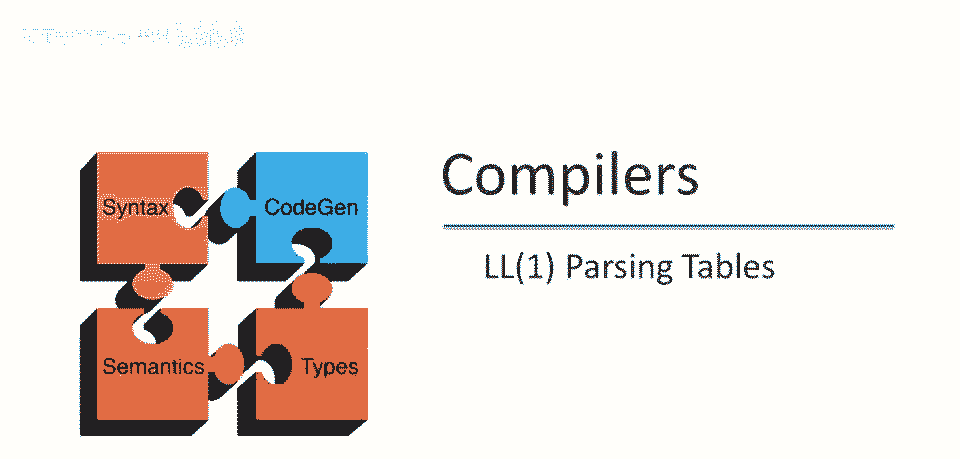
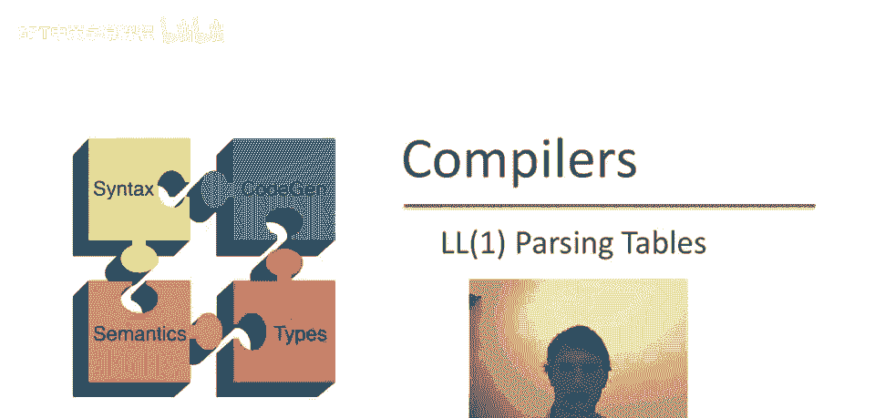
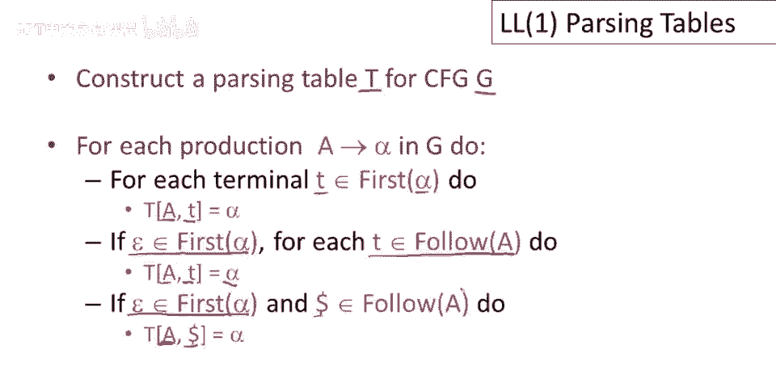
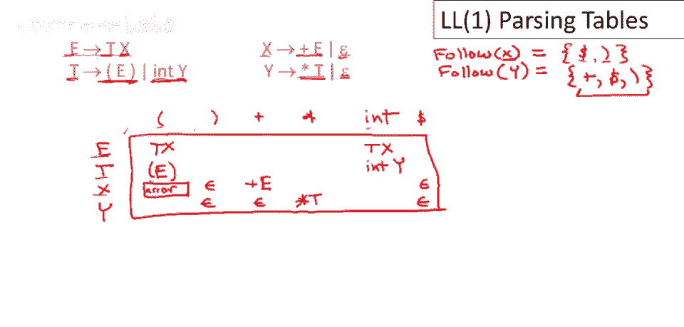
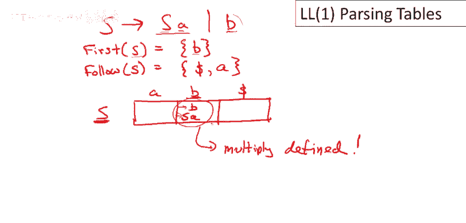
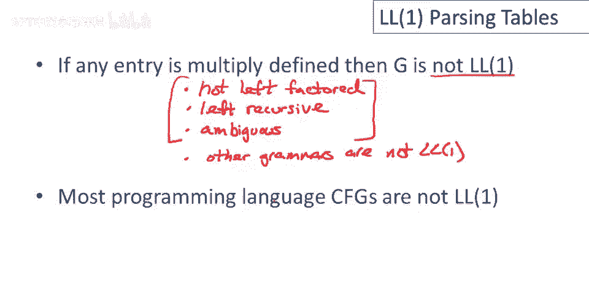

# P30：p30 07-04-_LL1_Parsing_Tabl - 加加zero - BV1Mb42177J7

本视频将整合，我们学过的关于，一阶跟随集构造LL(1)解析表。

目标是构造文法G的解析表T，通过产生式完成，我们将逐个进行，并依次考虑文法G中每个产生式a->α，第一种情况是，我们试图确定是否可以使用a->α，且T恰好是α的第一个。

如果已知某个终结符T是右边的第一个，那么如果a是非终结符的最左边，且T是下一个输入标记，通过a->α扩展将是好棋，因为α可能通过更多产生式匹配T，因此，我们将α添加到解析表的a，T项，右边的α就对了。

我们感兴趣的其他情况是，如果我们需要消除a，好的，所以如果a不可能匹配T，比如说T不是α的第一个，或者我们有其他情况想要消除a，那么使用产生式，a->α，前提是α实际上可以到ε，所以α可以完全消失。

我们可以消除所有a的痕迹，且T遵循a在文法中，所以T能够跟在抱歉，T能够跟在a和一些派生之后，所以如果T在a的跟随集中，且产生式的右边代码到ε，那么添加移动，当a是非终结符的最左边且T是下一个输入时。

我们可以通过a->α扩展a，最后，对于美元的特殊情况，因为美元实际上不是一个终结符号，如果我们到了输入的末尾，好的，所以当我们有a，还有一些东西留在栈上，特别是我们还有非终结符。

a仍然是我们的最左非终结符，但我们用完了输入，那么我们唯一的希望是彻底消除a，所以我们想选择一个a的产生式，它可以到ε，所以我们寻找一个产生式，a->α，其中ε在α的第一个中，美元可以在a的派生中跟随。

这就是过程，构造解析表的规则，现在让我们看个例子，这是我们一直在看的语法，现在看看，解析表会是什么样子，解析表将包含，以语法中的终结符命名的列，所以这里会有，左括号，右括号，左括号n，加乘，和int。

行将由非终结符命名，所以会有e t，X和y，现在我们将逐个应用规则，看看解析表中，我们创建了什么条目，所以什么时候使用e->tx，首先要注意的是，这个产生式右边，不能产生epsilon。

所以tx总是产生至少一个终结符，我们感兴趣的第二个情况是，这个产生式是否能产生零，因为它可能产生epsilon，抱歉不适用，我们只需要考虑它能产生什么，在第一个位置，所以只有t的first，中的东西。

即，左括号n和int，有两种情况会使用e->tx，即如果e是，最左非终结符，下一个输入是左括号n，另一个是下一个输入是int，现在看看这个产生式，什么时候使用t->(e)？如果t是最左非终结符。

这是左边的符号，并且下一个输入是(n)，因为那是右边唯一的东西，那么扩展为(e)将是好主意，只有一种情况使用那个产生式，对于另一个t产生式，我们将在t是最左非终结符时使用，没有其他情况。

所以对于另一个t产生式，输入中有整型，所以在这里，y中会有，这里漏了一列美元，所以最后把美元放在这里，现在已涵盖前3个产生式，看看这个产生式，何时使用x到+e，显然右端第一个是+，左端终结符是x。

x+项我们想扩展为，x到+e，类似地对于y，第一个涉及y的生产式，当y是终结非终结符，我们尝试扩展，输入中有乘，将使用生产式，y到*t，好的，现在只剩两个空产生式，这些是实际上能到空产生式的。

那么何时使用，何时使用x到空或y到空，回忆我们需要知道x的follow，以知道何时使用，呃，x到空，所以我们在上次课计算了，但让我们再写一次，好的，那么x的follow是什么，嗯。

我们需要看x在语法中的使用，x在这里使用，它出现在产生式的右端，所以会是e的follow中的东西，e的follow是什么，因为e是开始符号，所以美元在e的follow中，右括号在b的follow中，对。

那么y的follow是什么，另一个我们需要知道follow集的地方，我们需要看y在哪里使用，所以y在这里使用，这意味着t的follow中的所有都在y的follow中，y的follow将包括，呃。

x的第一个，因为x可以跟在t后，所以加号将在y之后，但x可以变为epsilon，因此e之后的一切都在t之后，因此也在y之后，所以y跟随的其他两个是美元符号和闭括号，好的，所以这表明，如果我们处于，嗯。

当我们有一个x，好的，让我们，让我们，让我们专注于x变为epsilon的生产，假设我们有一个x在栈上，好的，栈顶和美元符号是下一个输入，嗯，我们能做什么，我们已到输入的末尾，我们必须去掉x。

显然我们想使用x变为epsilon的移动，好的，这有道理，另一个情况是，这个跟随集告诉我们使用x变为epsilon，如果有闭括号在栈上，因为x不能自己产生闭括号，但希望栈上的其他符号能产生它。

一旦我们消除了x，好的，所以在这种情况下我们也应该使用x变为epsilon，然后类似地对于y跟随的y变为epsilon的生产，跟随中有三个东西，三个终端在y的跟随中，我们应该使用y变为epsilon。

如果它们是下一个输入，所以如果我们看到一个加号，我们试图扩展一个y，我们将使用y变为epsilon，如果我们看到一个闭括号，我们看到它，并且我们试图扩展到y，我们使用y变为epsilon，最后。

如果我们完全没有了输入，我们仍然有一个y剩余，我们将使用y变为epsilon，这就是完整的解析表，好的，现在你可以看到这将在每种情况下工作，好的，对于我们的最左非终结符，和每一种可能的输入或缺乏输入。

我们有一个我们可以使用的生产，现在这张表中有许多空白条目，那些对应什么，假设我们试图扩展x，下一个输入符号是一个开括号，这里没有条目，好的，那是一个错误，这是一个解析错误，每当遇到表格中的空白项时。

当你尝试使用空白项时，当你解析时，这将产生一个解析错误，因为这告诉我们，存在空白项的事实，它告诉我们没有有效移动，没有方法解析该字符串，我们发现了这一点，在我们尝试访问表格中的错误或空白项时。

现在让我们考虑尝试构建一个L1解析表时会发生什么，对于不是L1的语法，让我们看一下之前看过的简单，左递归语法，所以S去S a是一个生产，S去b是另一个生产，为了构建这个表格的部分。

我们需要知道第一和跟随集，所以让我们看一下S的第一个好吧，所以S可以在第一个位置产生什么，显然它可以产生一个b，没有epsilon，没有，没有可能从S生成epsilon，所以，实际上。

那将是S的第一个中唯一的东西，那么S的跟随是什么，我们可以跟随一个S，它是开始符号，所以显然，美元符号在S的跟随中，然后终端，终端a在第一个生产后的S右侧出现，所以a也在S的跟随中。

现在我们可以构建我们的表格了，它将会是一个非常小的表格，我们只有一个非终结符，然后有两个终结符，a和b以及输入结束符号，所以这张表格中只有三个条目，潜在地好吧。

所以现在让我们逐个生产看看我们应该放在哪里，所以让我们先看一下第二个生产，因为那没什么特别的原因，所以如果S去b，我们什么时候应该使用它呢 显然，如果我们看到一个b在输入中，这将是一个很好的选择。

因为因为因为右边的第一个包括b好吧，s到b用于输入b，现在s到sa呢，不能生成epsilon，仅关注首位置能产生什么，s首为b，sb项也有移动，s到sa移动，现在看到问题，这里有个多移动项，多重定义项。

好的，这意味着什么，如果输入s，要扩展s，好的，尝试做，如果栈顶非终结符是s，下一个输入符号是b，好的，嗯，表没明确移动，不是确定的，可能移动有两个，这样知道，语法不是1型因为，如果建1型表。

表中有多个移动，某个位置，某个项抱歉，他们误用项，如果你，让我再说，如果你想要，如果你建表，表中有项多于一个移动，没有唯一移动给解析器，语法不是1型。

刚说，如果表任何项多重定义，语法不是1型，这是1型语法的定义，确保语法是1型唯一方法，机械检查语法是1型方法，建1型表看所有项是否唯一，我们知道，然而，某些类语法保证不是1型，不是1型，哪些不是1型。

好的，任何左递归的语法都不是L1，好的，任何有歧义的语法也保证不是L1，但这并不是一个详尽的列表，其他语法也不是L1，因此特别地，如果一个语法需要超过一个标记的向前看，它就不是L1。

但即使那不是完整的列表，甚至那些超出这个范围的语法也不会是L1，所以这些加起来就是你可以做的快速检查，来测试一个语法是否保证不是L1，但如果一个语法是左因子的并且不是左递归的，并且是无歧义的。

那并不保证它是L1，唯一确定方法就是构建解析表，并查看它所有条目是否唯一，不幸的是，大多数编程语言，它们的上下文无关文法，或描述它们的语法，大多数编程语言不是L1，L1语法。

太弱无法捕获常用编程语言中所有有趣和重要的结构，有更强大的形式化描述语法或实用语法的形式，我们将在未来的视频中查看这些，事实证明它们建立在我们在过去几周中学到的一切之上，对于L1语法。

所以那些都不会浪费，但它们以更复杂的方式组装这些想法来构建更强大的解析器。

