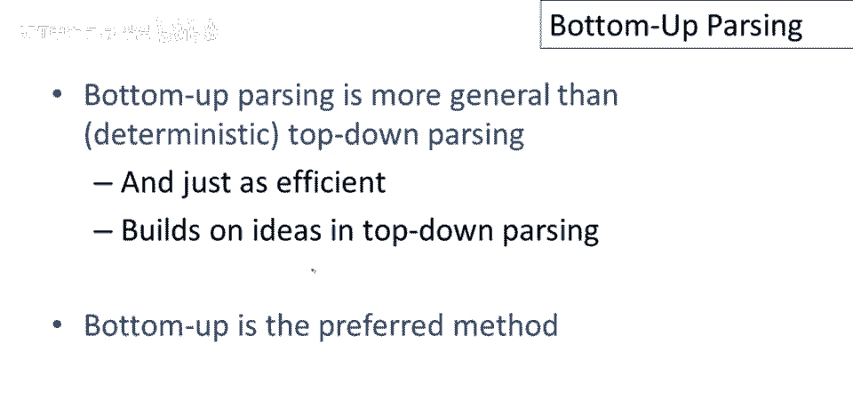
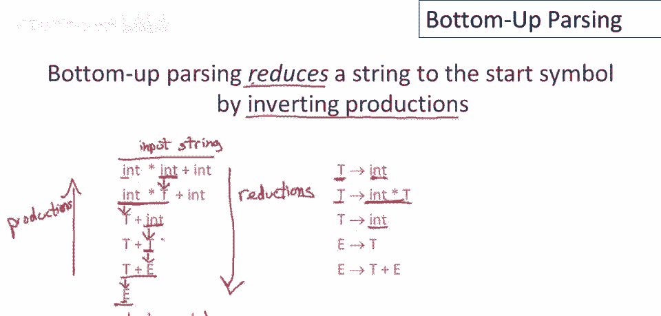
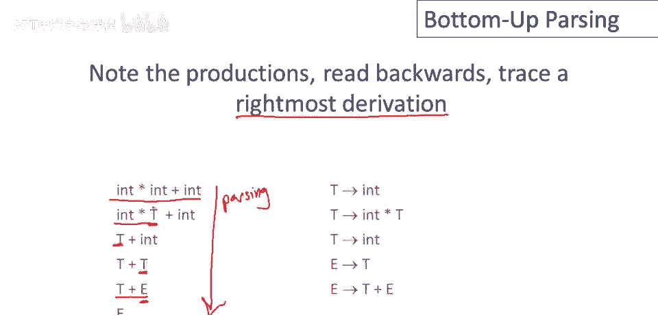
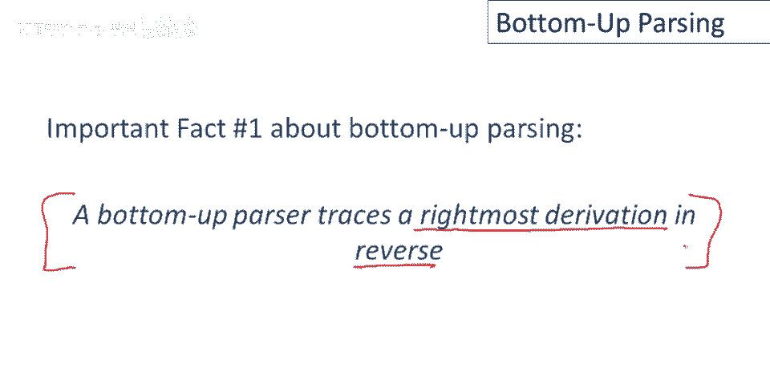
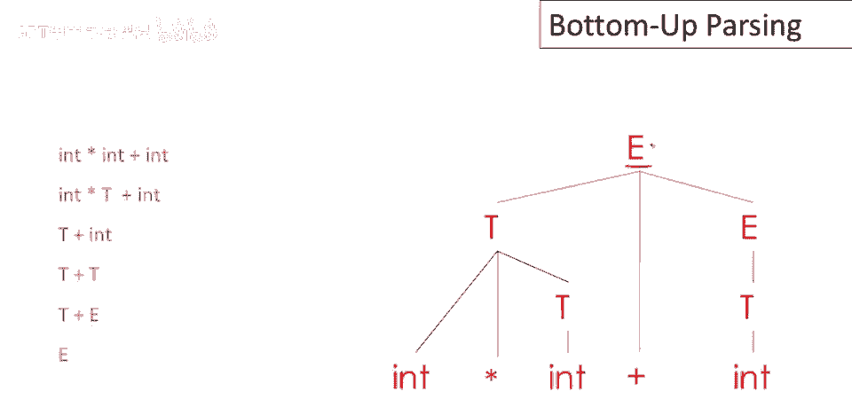

# 课程 P31：自底向上解析入门 🧩

在本节课中，我们将要学习**自底向上解析**的基本概念。这是一种与之前学过的自顶向下解析不同的方法，它从输入字符串的标记开始，逐步规约，最终构建出完整的解析树。我们将了解其工作原理、优势以及它与最右推导的关系。

---

## 什么是自底向上解析？ 🔄

上一节我们介绍了自顶向下解析，本节中我们来看看自底向上解析。首先要知道的是，自底向上解析比确定型自顶向下解析更通用。回忆一下我们讨论过的递归下降，这是一个完全通用的解析算法，但需要回溯。现在我们专注于确定型技术，上次我们讨论了LL(1)或预测性解析。

现在我们要换挡，讨论自底向上解析。结果是，即使自底向上解析更通用，它同样高效。它使用了我们在自顶向下解析中学到的所有想法。实际上，自底向上解析是大多数解析器生成工具首选的解析方法。

自底向上解析器的一个优点是它们不需要对文法进行左因子化。我们可以回到示例中的“自然”文法（“自然”在这里是带引号的，因为我们仍然需要编码加号和乘号的优先级）。自底向上解析器不会处理歧义文法。

---

## 自底向上解析如何工作？ ⚙️

让我们通过一个例子来理解自底向上解析器如何处理一个典型的输入字符串。

首先要知道的是，自底向上解析通过**逆向运行产生式**，将字符串还原为开始符号。以下是解析步骤的示例：

*   左侧是字符串的状态序列。
*   右侧是使用的产生式。

我们开始时是整个字符串，即终端符号的字符串。我们挑选了一些终端符号（在这个例子中，是单个的 `int`），然后运行了一个逆向产生式。我们用产生式的左侧替换了匹配到的右侧部分。

例如：
1.  我们从 `int` 开始，匹配产生式 `t -> int` 的右侧，并用左侧 `t` 替换它。
2.  然后，我们取子串 `int * t`，匹配产生式 `t -> int * t` 的右侧，并用左侧 `t` 替换它。
3.  以此类推。

在每一步中，我们都在匹配字符串的一部分，并用某个产生式的左侧替换那个子串。最后，整个字符串被替换成开始符号 `e`。

所以，我们从输入字符串（标记流）开始，最终到达了起始符号。如果你从底部（输入字符串）开始向上（起始符号）阅读这些步骤，这实际上是一个**推导**。但当我们倒着运行时（从字符串到起始符号），我们称这些步骤为**规约**。

---

## 与最右推导的关系 🔗

你可能会想，我是如何知道要执行这个特定序列的规约的？这是自底向上解析的另一个有趣属性。

如果你按这些产生式的反向阅读，它们追踪一个**最右推导**。解析器实际上在从输入到起始符号的方向上运行（规约），但如果我们反向看这些步骤，它恰好对应一个最右推导。

例如，推导步骤可能是：
`e` -> `t + e` -> `t + t` -> `t + int` -> `int * t + int` -> `int * int + int`

这引出了关于自底向上解析的第一个重要事实：**自底向上解析器反向追踪一个最右推导**。所以如果你在自底向上解析上遇到麻烦，回到这个基本事实总是有帮助的。自底向上解析器追踪一个最右推导，但它以相反的方式通过使用规约而不是产生式来做。

---

## 构建解析树 🌳

让我们通过动画来可视化规约序列和解析树的构建过程，这非常有帮助。

我们开始时是整个输入字符串。自底向上解析器采取一系列规约步骤来构建完整的解析树。基本思想是：每一步执行归约时，我们用某个产生式的左部（父节点）替换右部子节点（在输入中匹配到的子串），就像在自顶向下解析中，我们会使右部成为左部的子节点。

以下是构建过程：
1.  **自顶向下解析器**从开始符号（根节点）开始，通过扩展前缘的非终结符逐步构建树。
2.  **自底向上解析器**则从最终解析树的所有叶节点（整个输入）开始，并在其上构建小树，然后将它们粘贴在一起。

随着解析的进行，原始输入中越来越多的部分将被组合成越来越大的子树。在最后一步，所有子树被粘贴成一个以开始符号为根的完整解析树。因此，它是通过自下而上组合小解析树来构建完整树的。

---

## 总结 📝

本节课中我们一起学习了自底向上解析的基础。我们了解到：
1.  自底向上解析是一种从输入标记开始，通过**规约**逆向产生式，最终到达文法开始符号的解析方法。
2.  它比确定型自顶向下解析更通用，且是许多解析器生成器的首选。
3.  自底向上解析器反向追踪一个**最右推导**。
4.  解析过程通过将输入字符串的小片段逐步规约并组合成更大的子树，最终**自底向上**地构建出完整的解析树。

理解自底向上解析的关键在于掌握“规约”操作和它与“最右推导”的逆向关系。在接下来的课程中，我们将深入探讨如何决定在何时进行何种规约，即**移进-归约**解析算法的核心。