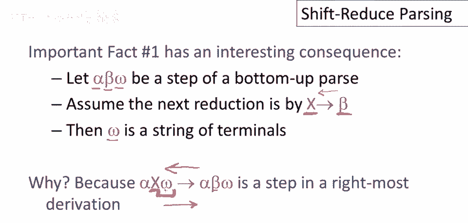
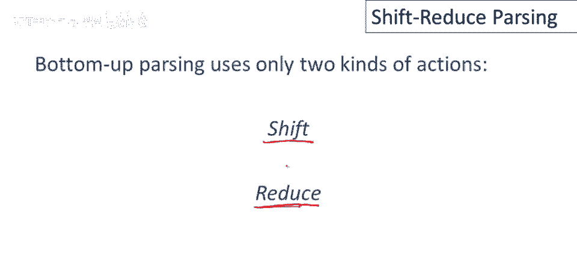
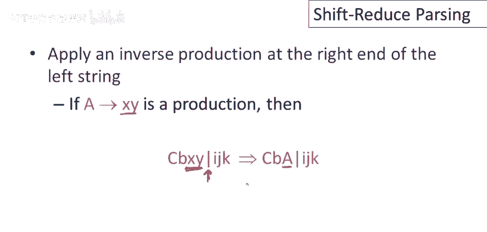
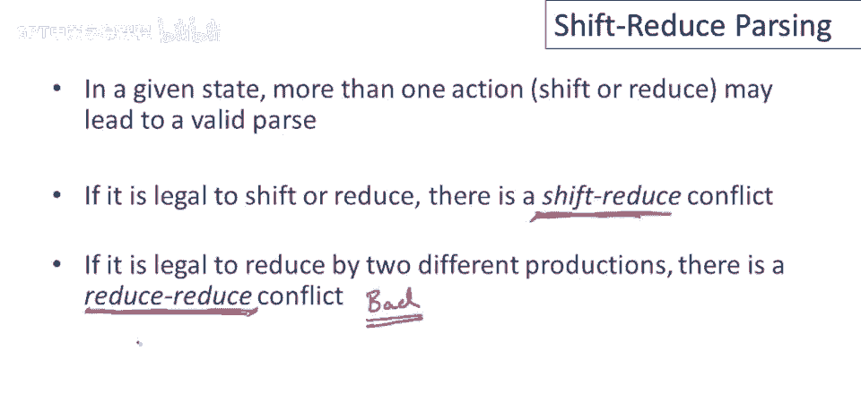

# 编译原理 P32：自底向上解析与移入-归约策略 🧩

在本节课中，我们将要学习自底向上解析的核心策略——移入-归约解析。我们将了解解析器如何通过两种基本操作（移入和归约）来处理输入字符串，并最终推导出语法的开始符号。我们还会探讨解析过程中可能遇到的冲突及其含义。


---

## 自底向上解析回顾 📚


上一节我们介绍了自底向上解析的基本概念。本节中我们来看看其核心策略。

自底向上解析的主要策略是所谓的“移入-归约解析”。回顾上次课程最重要的内容：解析过程逆向运行产生式。这一特定事实有一个重要后果。

让我们思考一下移入-归约解析的状态。假设我们有一个字符串 `alpha beta omega`，并且下一次归约操作将把 `beta` 替换为 `X`。记住，我们正在逆向运行产生式。那么，我声称 `omega` 必须是终结符串。为什么是这样呢？

如果你考虑一下，当 `X` 被替换时，我们取这个步骤。如果我们看前向步骤是逆向步骤，那么 `X` 必须是最右非终结符。这意味着 `X` 的右边没有非终结符。因此，`X` 右边的所有字符或标记都是终结符。

结果是，最右非终结符右边的终结符，正是自底向上解析器实现中“未检查的输入”。如果有 `alpha X omega`，并且 `X` 是最后一个非终结符，那么 `omega` 就是未读的输入。



---

## 解析焦点与分隔线 📍

标记我们在解析中的位置将是有用的。我们的输入焦点是：我们将使用一条垂直线来做这件事。

我们将在已读内容的左侧和待处理内容的右侧画一条垂直线。左侧包含解析器已看到的所有终结符和非终结符。右侧包含解析器尚未看到的内容（尽管我们知道都是终结符）。竖线仅标记两个子字符串的分界线。

---


## 移入与归约操作 ⚙️

实现自底向上解析，实际上我们只需要两种操作：移入操作和归约操作。



### 移入操作

移入操作读取一个输入标记。我们可以通过将垂直条向右移动一个标记来表示这一点。

如果我们的输入焦点在这里，并且我们想读取更多的输入标记，那么我们只需将垂直条向右移动。这表示现在解析器知道了下一个终结符号。现在我们可以开始处理它，并与它匹配以执行再次归约的目的。垂直条右侧的内容解析器还没有看到。

### 归约操作

归约操作是在左字符串的右侧应用逆产生式。


如果我们有一个产生式 `A -> X Y`，并且我们在这里立即有 `X` 和 `Y` 位于垂直条的左侧（即，这是我们的焦点点），那么我们可以做一次归约。我们可以用产生式的左侧 `A` 替换右侧 `X Y`。这是一个归约移动。

---

## 操作序列示例 🔄



这是上次视频中的示例，它恰好是仅显示归约操作的示例。现在也显示了垂直条，这显示了在每个归约执行时输入焦点的位置。

我们现在知道缺少的是移入操作的序列。以下是移入操作和归约操作的序列，它将初始输入字符串带到开始符号。

让我们更详细地走过这个过程。我们将逐步进行，显示每个移入和每个归约移动。

除了我们下面的输入字符串，我们还有一个指针显示我们在输入中的位置。我们还没有看到任何输入，我们的输入指针在整串的左侧。

因此，第一步是做一个移入。然后我们再做另一个移入。然后我们再做另一个移入。现在，如果你回头看之前的例子，你知道接下来我们需要做的是归约。

记住，我们只能在垂直条的左侧进行归约。因此，我们总是必须在执行归约移动之前读取足够的输入。然后我们执行另一个归约移动。

接下来要做的是移入操作。我们还没解释如何知道是移入还是归约，我们将会讲到。我只是展示存在一系列移位和归约操作成功解析这个例子。

现在我们把整个输入移到了这里。抱歉，我们已移过整个输入，没有更多输入可读。现在只能做归约操作。幸运的是从这一点开始有一系列归约操作我们可以执行。

这里我们归约 `int`，然后我们归约 `T + T`。哦，忘了，我们首先归约 `T` 到 `E`，然后我们归约 `T + E` 回到开始符号。

---

## 栈的实现 📦

结果，这个左串（垂直线左边的部分）可以用栈实现。因为我们只在垂直线左边立即做归约操作，所以它总是垂直线左边字符串的一个后缀（归约发生的地方）。


所以：
*   **移入操作**是将一个终结符推入栈中（读取一个输入标记并推入栈中）。
*   **归约操作**是弹出栈中的一些符号（那是产生式右部），然后它推入一个非终结符到栈中（那是产生式左部）。

用伪代码表示：
```python
# 移入操作
stack.push(next_token())
input_pointer += 1

# 归约操作 (假设产生式为 A -> XYZ)
right_hand_side = [stack.pop() for _ in range(3)] # 弹出右部符号
stack.push(A) # 压入左部非终结符
```

---


## 解析冲突 ⚠️

现在，可能在一个给定状态中，移入或归约都可能导致有效解析。特别是如果移入或归约都是合法的（如果你能做其中一件事），那么我们说有一个**移入-归约冲突**。解析器可以读取一个输入标记并推入栈中，或者它可以执行一个归约。

如果可以通过两个不同的产生式进行归约，那么有一种称为**归约-归约冲突**。

归约-归约冲突通常指示语法中存在某种严重问题，它们几乎总是坏的。如果你在为语言（如COOL）构建语法时遇到归约-归约冲突，那么你可能犯了非常严重的错误。

移入-归约冲突是不好的，但它们通常更容易消除。如果你有移入-归约冲突，那么这几乎是可以预见的。你可能需要使用优先级声明来消除它们。我们将在另一个视频中讨论更多。

但一般来说，如果你有这些冲突之一，这意味着在某些状态下，解析器不知道该做什么。你需要重写语法或使用其他机制（如优先级和结合性）来解决歧义。

---

## 总结 ✨



本节课中我们一起学习了自底向上解析的核心——移入-归约策略。我们了解了如何用一条垂直线分隔已读和未读输入，并定义了两种基本操作：**移入**（读取标记）和**归约**（应用逆向产生式）。我们看到解析过程可以通过栈来实现，并且探讨了在解析过程中可能遇到的**移入-归约冲突**与**归约-归约冲突**。理解这些冲突是设计和调试语法的关键。在接下来的课程中，我们将学习如何利用优先级和结合性来解决这些冲突。