# P32：p32 07-06-_Shift - 加加zero - BV1Mb42177J7

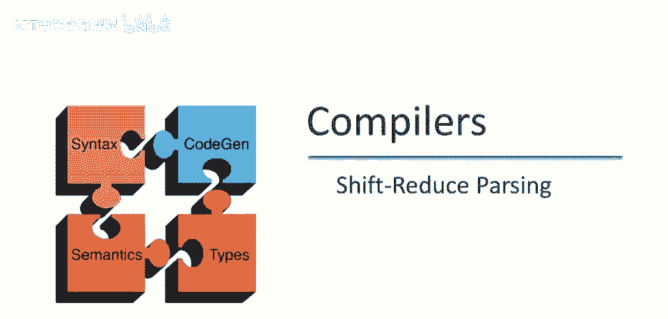

本视频中，我们将继续讨论自底向上解析，使用所有自底向上解析器的主要策略。

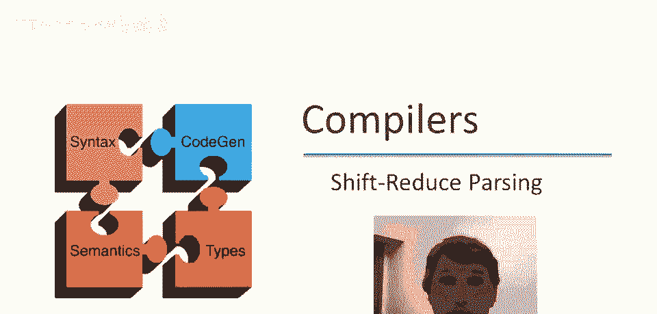

所谓的移入-归约解析，这是上次我们学到的最重要内容的快速回顾，这一特定事实有一个重要后果。

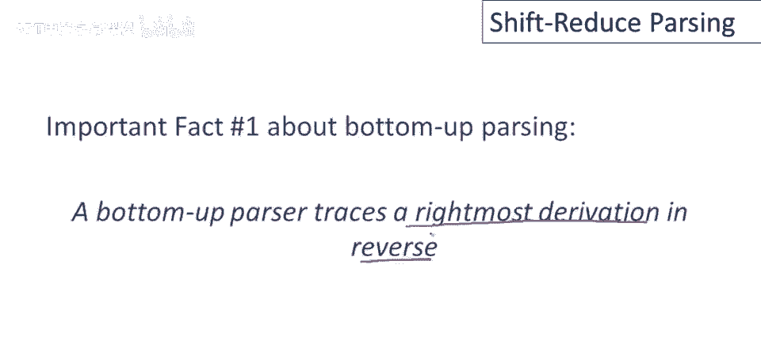

所以让我们思考一下移入-归约解析的状态，其中我们有一些字符串alpha，等，贝塔和欧米伽，假设下次归约将贝塔替换为x，好的，记住我们正在逆向运行产生式，那么我声称欧米伽必须是终结符串，为什么是这样呢。

如果你考虑一下，那么当x被替换时，我们取这个，如果我们看前向步骤是逆向步骤，所以记住解析器这样运行，用x替换beta，则x必须是右最非终结符，意味着x右边没有非终结符，因此所有字符，所有标记。

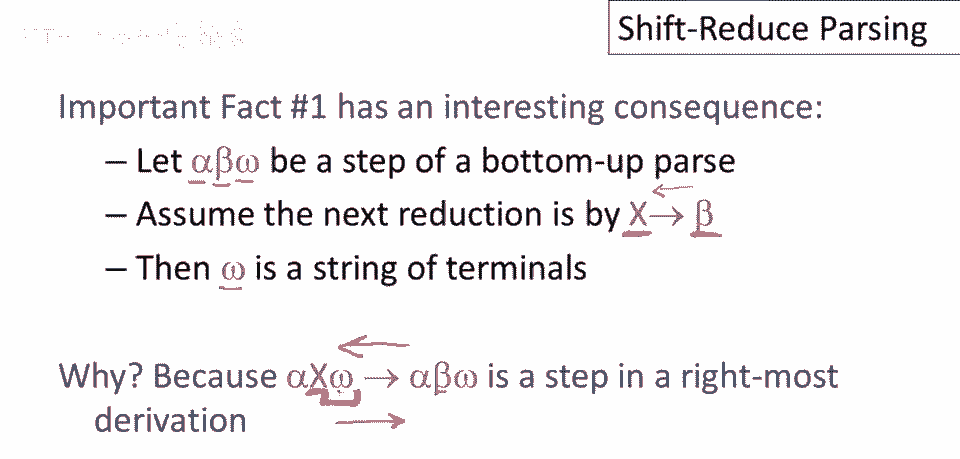

或字符串中的任何东西都是终结符，结果是，右最非终结符右边的终结符，正是自底向上解析器实现中未检查的输入，如果有alpha，X，Omega和我是，X是最后一个非终结符，这是未读的输入，这是未检查的输入。

标记我们在解析中的位置将是有用的，我们的输入焦点是，我们将使用垂直线来做这件事，所以我们将只是玩，在已读的左侧和实际工作的右侧画一条垂直线，我们正在处理这个，左侧为终结符和非终结符。

解析器已看到所有内容，右侧为解析器未看到的内容，我们不知道外面有什么，尽管我们知道都是终结符，竖线仅标记两个子字符串的分界线。

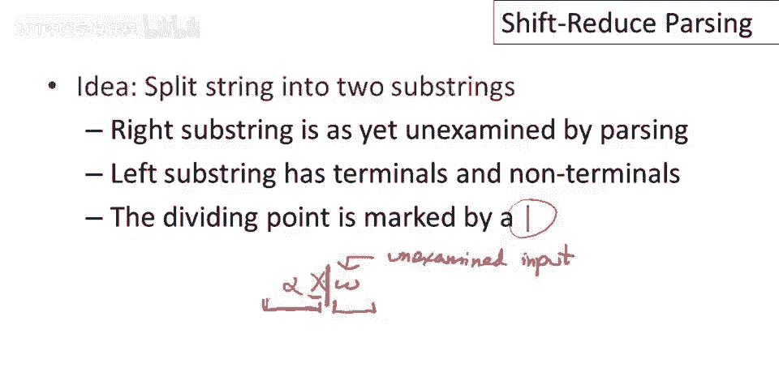

实现自底向上解析，实际上我们只需要两种操作，嗯，移位和归约操作，我们已经讨论过一些减少移动，因此我们引入了移位移动。

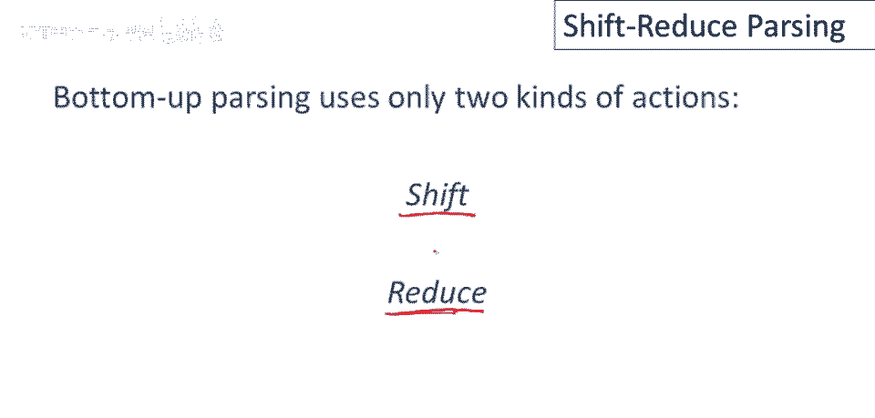

现在让我们这样做，因此，移位移动读取一个输入标记，我们可以解释这一点，或通过将垂直条向右移动一个标记来表示，因此，如果我们的输入焦点在这里，如果我们想读取更多的输入标记，那么我们只需将垂直条向右移动。

这表示现在解析器知道下一个终结符号，现在我们可以开始处理它，它可以对它做些什么，并与它匹配以执行再次减少的目的，垂直条右侧的内容。

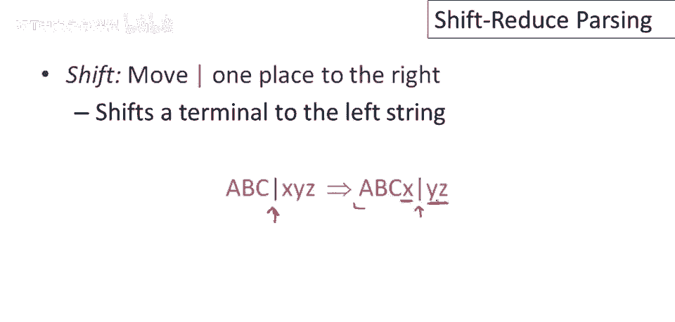

解析器还没有看到，减少移动是在左字符串的右侧应用逆生产，因此，如果我们有一个生产，A 去 x y，我们在这里立即有 x 和 y 位于垂直条的左侧，因此，这是我们的焦点点，好的，x 和 y。

生产右侧的内容就在这里，那么我们可以做一次减少，我们可以用左侧替换右侧，这是一个减少移动。

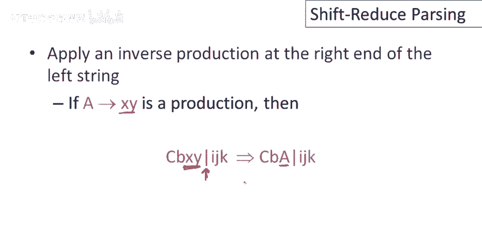

这是上次视频中的示例，这恰好是仅显示减少移动的示例，现在也显示了垂直条，这显示了在每个减少执行时输入焦点的位置，当然，我们现在知道缺少的是，移位移动的序列，这里是移位移动和减少移动的序列。

将初始输入字符串带到开始符号，因此，让我们更详细地走过这个过程，因此，我们将逐步进行，我们将显示每个移位和每个减少移动，现在，除了我们下面的输入字符串，我们还有一个指针显示我们在，输入中的位置，因此。

我们还没有看到任何输入，我们的输入指针在整串的左侧，因此，第一步是做一个移位，然后我们再做另一个移位，然后我们再做另一个移位，现在，我只是看着之前的例子，如果你回头看那个例子。

你知道接下来我们需要做的是减少，并记住我们只能减少到箭头的左侧，因此，我们只能在箭头的这一侧减少，因此，我们总是必须在执行减少移动之前读取足够的输入，然后我们执行另一个减少移动，好的。

接下来要做的是移位操作，我们还没解释如何知道是移位还是归约，我们将会讲到，我只是展示存在一系列移位和归约操作成功解析，这个例子，现在我们把整个输入移到了这，抱歉我们已移过整个输入，没有更多输入可读。

现在只能做归约操作，幸运的是从这一点开始有一系列归约操作我们可以执行，这里我们归约int，然后我们归约t加t，哦忘了，我们首先归约t到e，然后我们归约t加e回到开始符号。

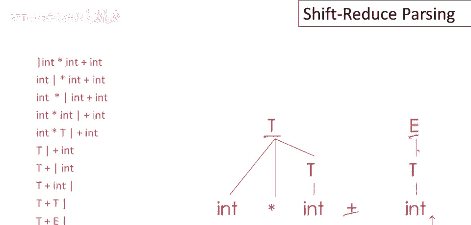

结果这个左串，垂直线左边的部分，可以用栈实现，因为我们只在垂直线左边立即做归约操作，所以它总是垂直线左边字符串的一个后缀，归约发生的地方，所以移位操作是将一个终结符推入栈中，读取一个输入标记并推入栈中。

然后归约弹出栈中的一些符号，那是产生式右部，然后它推入一个非终结符到栈中，那是产生式左部。

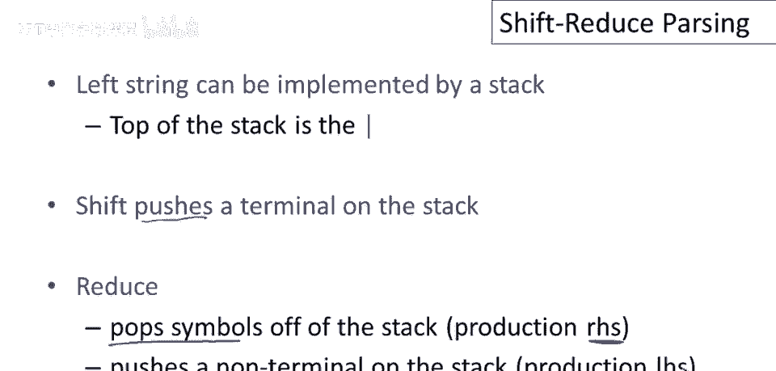

现在可能在一个给定状态中，移位或归约可能导致有效解析，特别是如果移位或归约是合法的，如果你能做其中一件事，那么我们说有一个移位，归约冲突，解析器可以读取一个输入标记并推入栈中，或者它可以执行一个归约。

嗯，如果可以通过两个不同的产生式归约，那么有一种称为归约，归约冲突，好的，所以归约，归约冲突总是坏的或几乎总是坏的，它们通常指示，语法中通常某种严重问题 Schiffre的冲突是不好的。

但它们通常更容易消除，所以如果你有归约归约冲突，特别是当你为cool构建语法时，那么你正在做非常严重的事情，如果你有移位，归约冲突，那么这几乎是可以预见的，嗯，你，你可能需要使用优先级声明，嗯。

以消除它们，我们将在另一个视频中讨论更多，但一般来说，如果你有这些冲突之一，这意味着在某些状态下，解析器不知道该做什么，你需要重写语法。

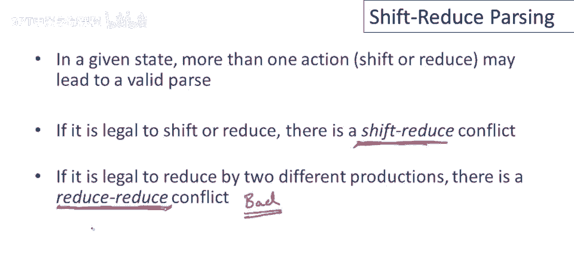