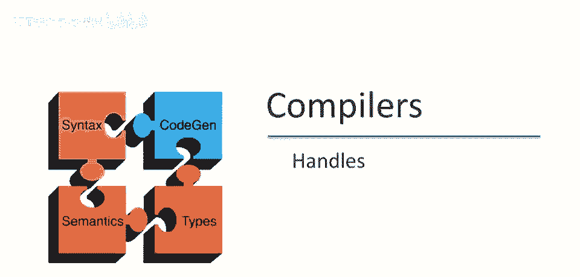
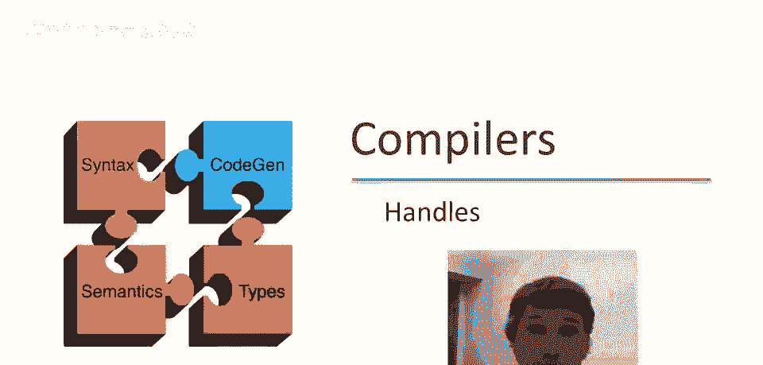
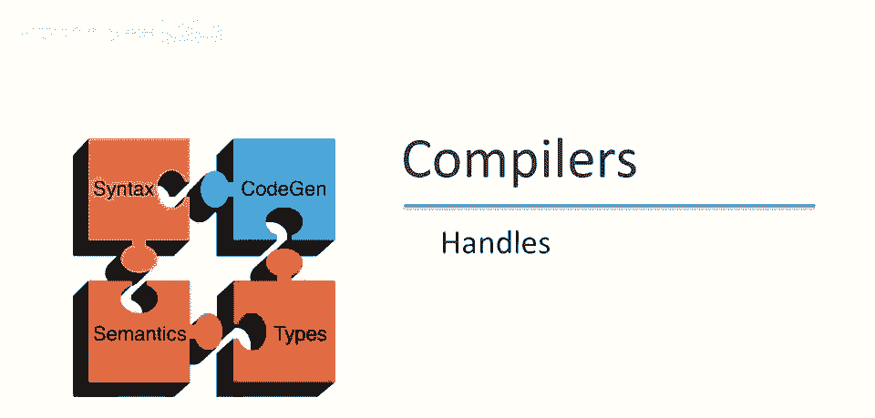
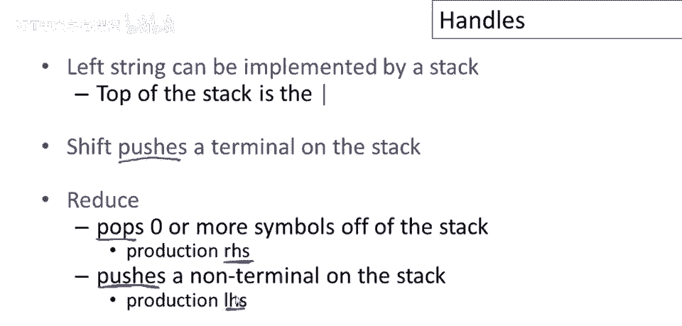
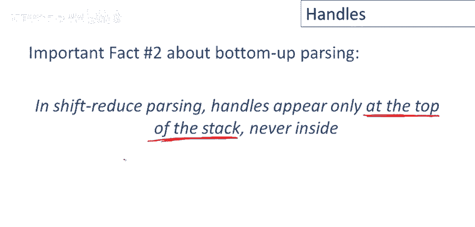
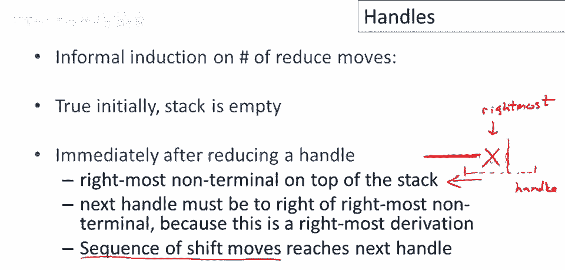

# P33：p33 08-01-_Handles - 加加zero - BV1Mb42177J7

本视频中，将介绍自底向上解析中的另一个重要概念。

句柄的概念。

回顾自底向上解析使用两种动作，我们有移位动作，只读取一个输入标记，并将竖线向右移动一格，还有归约动作，将竖线左侧的生产右侧立即替换为左侧，即生产左侧，因此在这种情况下，生产必须是。

A 到 x，Y，并回顾上一视频的内容，左侧字符串可以通过栈实现，栈顶由竖线标记，移位将终端符号推入栈中，归约弹出栈中零个或多个符号，这将是某些生产的右侧，然后它将把一个非终结符推入栈中，即该生产的左侧。

自底向上解析中的关键问题，也是我们尚未解决的问题，是如何决定何时移位何时归约，让我们看看这个示例语法。

并思考解析的一步，我们已经将一个标记移入栈中，栈中有 int，然后 times 隐含在后面，我们还没有看到，此时我们可以决定通过 t 到 int 归约，因为我们有生产，T 到 int 在这里。

因此我们可能会进入这个潜在状态或这个特定状态，栈中有 t，然后输入看起来像这样，但你可以看到，这将是一个错误，语法中没有以 t times 开始的产生式，上面没有这样的产生式，看起来像 t times。

因此如果我们做出这个动作，我们会陷入困境，我们可以继续进行归约来在字符串中翻找，但我们永远无法回到开始符号，因为没有方法处理包含 t times 子串的子串。

因此这告诉我们，我们并不总是想要归约，即使栈顶有某个生产的右侧也要重复这一点，即使栈顶有某个生产的右侧，进行归约可能是一个错误，我们可能想等待并在其他地方进行归约，我们决定的方式是，我们只想在。

若结果仍可还原为起始符，让我们看看最右推导，所以从起始符开始，经过若干步到达某个状态，记住，这意味着经过任意步到达某个状态，X是最右非终结符，下一步是用某个产生式的右侧替换X，记住，自底向上解析。

解析器实际上朝这个方向走，好的，这是归约方向，我们讨论推导方向，产生式方向，因为那是谈论字符串如何推导的最简单方式，我们想从起始符开始，但但，但解析器实际上逆着这些箭头的方向走，无论如何。

如果这是最右推导，这意味着，是的，在这种情况下将β还原为X是可以的，我们可以用X替换β，因为这不是错误，我们仍然可以通过一系列动作回到起始符，你知道，通过做更多的归约。

柄形式化了对在哪里可以执行归约的直觉，柄就是一个归约，也允许进一步归约回到起始符，我们显然只想在柄处执行归约，如果在不是柄的地方执行归约，即使看起来像是右侧，或实际上可能是某个产生式的右侧。

那并不意味着它实际上是一个柄，我们可能，如果我们在那里归约，我们可能会卡住，所以到目前为止我们只说了什么是柄，我们定义了柄，我们还没有说如何找到柄，实际上我们如何找到柄。

将占用我们关于解析讨论的大部分剩余时间。

在这个点上，我们知道足够多的关于自底向上解析的事实，所以在移位归约中，解析柄只出现在栈的顶部，从不在里面，事实上，这就是使用栈的正当理由，因为焦点点左边的字符串，我们知道所有动作将立即在焦点点左边发生。

无需深入查看栈内，因此栈足够。

这是一个非正式证明，嗯，仅栈顶出现操作符，基于减少步数的归纳，栈初始为空，因此成立，你知道，唯一可能减少在栈顶。

若有epsilon移动，减少后最右非终结符在栈顶，减少后，我们有栈，然后是非终结符，然后是竖线，这是最右非终结符，因为是右推导，下一个操作符必须在右，下一个操作符，它必须包含可能包含这些。

但要么在当前焦点，要么在右边，因为不能对最右非终结符左侧减少，需要一系列移位到达下一个操作符，栈顶有非终结符，按定义是最右非终结符，下一个操作符必须在右边。

因此移位，移位减少解析操作符总在栈顶，操作符不在最右非终结符左侧，这是移位减少足够的原因，移位操作仅移动竖线右，我们不需要移动它，自顶向下解析基于识别操作符，如视频开头示例，栈顶有右部并不意味着。

它是操作符，我们需要更聪明地执行减少。

