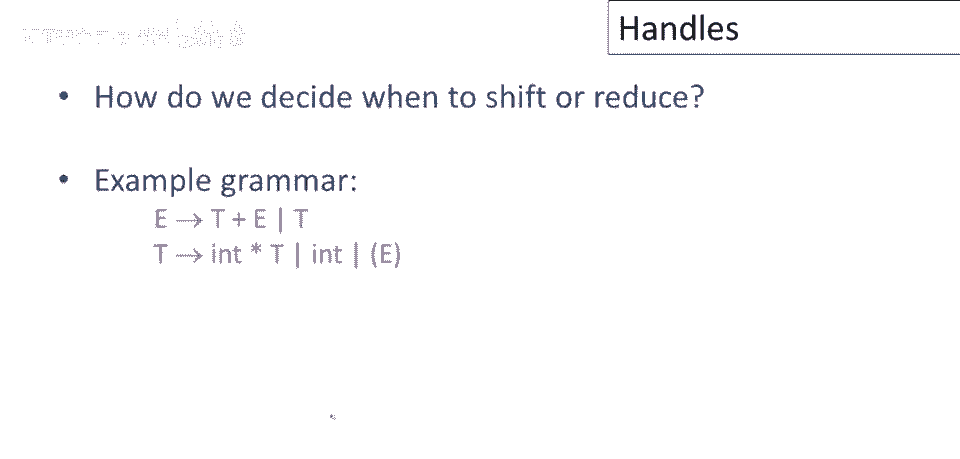
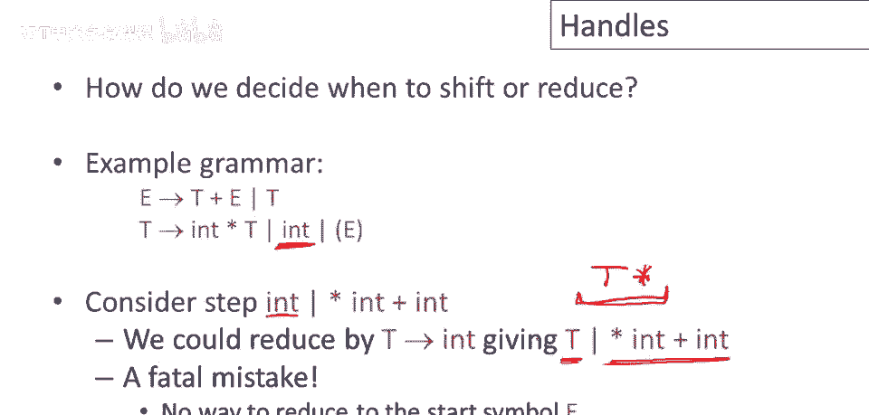
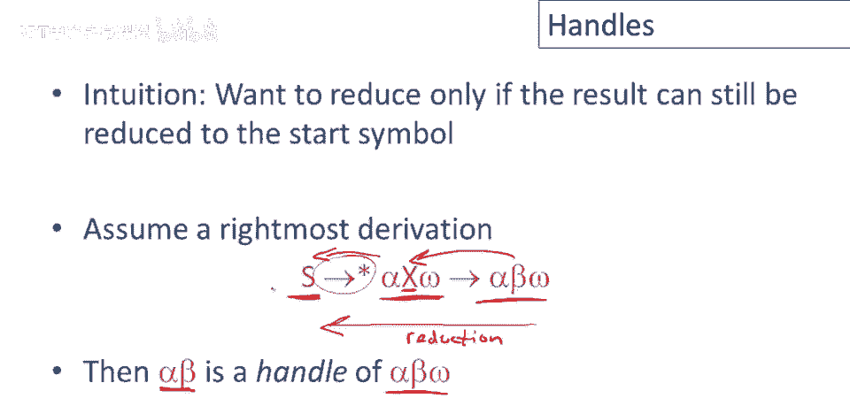
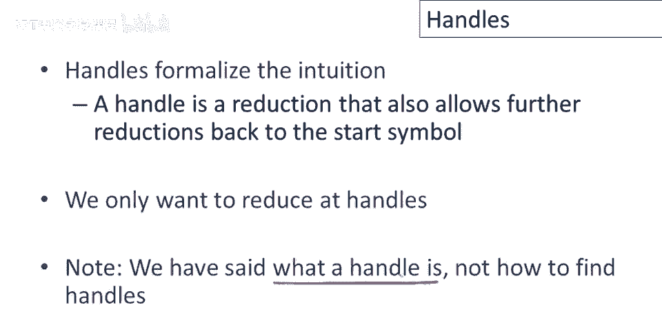
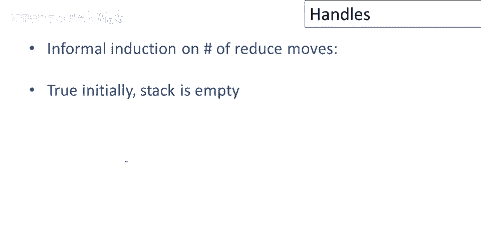
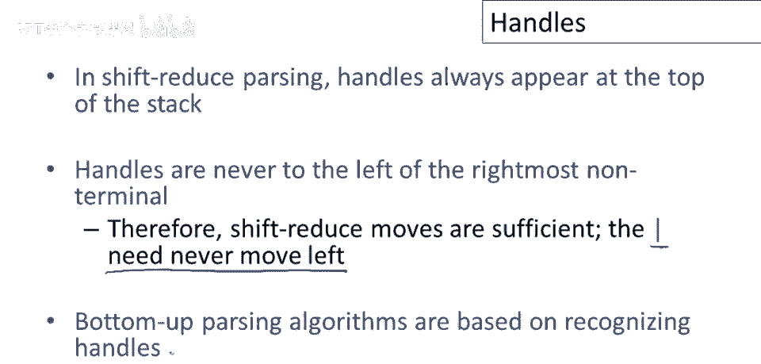

# 课程 P33：自底向上解析中的句柄概念 🧩


在本节课中，我们将要学习自底向上解析中的一个核心概念——**句柄**。我们将了解句柄的定义、它在解析过程中的重要性，以及为什么正确识别句柄是决定何时进行“移位”或“归约”动作的关键。


---

## 回顾自底向上解析


上一节我们介绍了自底向上解析的基本框架。本节中我们来看看其核心动作。

自底向上解析主要使用两种动作：
*   **移位**：读取一个输入标记，并将解析焦点（竖线）向右移动一格。
*   **归约**：将焦点左侧的、与某个产生式右侧匹配的符号串，替换为该产生式的左侧非终结符。


在实现上，焦点左侧的字符串通常用**栈**来管理。栈顶由竖线标记。移位动作将终结符推入栈中；归约动作则从栈顶弹出零个或多个符号（即某个产生式的右侧），然后将对应的非终结符（产生式左侧）压入栈中。



---

## 解析中的关键问题：何时归约？

自底向上解析中尚未解决的关键问题是：**如何决定何时进行移位，何时进行归约？**

让我们通过一个示例语法来思考这个问题。假设我们有如下产生式（为简化，用代码表示核心关系）：
```
E -> T
T -> int
T -> T * int
```
现在，考虑解析的一步：我们已经将标记 `int` 移入栈中，输入中下一个标记是 `*`。此时，栈顶是 `int`，而我们有产生式 `T -> int`。我们似乎可以进行归约，将 `int` 替换为 `T`。

如果此时归约，栈将变为 `T`，而输入仍是 `* ...`。然而，查看语法可知，没有以 `T *` 开头的产生式。这意味着，如果我们在此处归约，后续将无法通过任何归约步骤回到起始符号，解析将陷入错误。



这个例子告诉我们：**即使栈顶恰好是某个产生式的右侧，立即进行归约也可能是一个错误**。我们可能需要等待，在更合适的时机进行归约。

---

## 句柄的定义

那么，何时归约才是正确的呢？答案就是：**仅在栈顶的符号串构成一个“句柄”时才进行归约**。

句柄形式化了对“正确归约位置”的直觉。它的定义与**最右推导**密切相关。

考虑一个最右推导过程：
```
S =>* α X ω => α β ω
```
（其中 `=>*` 表示经过任意多步推导，`S` 是起始符号，`X` 是一个非终结符，`ω` 是终结符串，`α` 和 `β` 是符号串）。



在这个推导的最后一步，我们用产生式 `X -> β` 的右侧 `β` 替换了最右非终结符 `X`。那么，在自底向上解析中，当我们看到串 `α β ω` 且焦点在 `β` 之后时，`β` 就是当前步骤的**句柄**。对它进行归约（用 `X` 替换 `β`）是安全的，因为这样我们可以逆向地、一步步地回到起始符号 `S`。

**核心定义**：句柄是某个产生式 `A -> β` 的右侧 `β`，以及它在当前句型（从起始符号推导出的一个中间串）中的位置，对这个 `β` 进行归约（替换为 `A`）后，得到的串仍然可以经过一系列归约最终回到起始符号。

---

## 句柄的重要性质



了解句柄的定义后，我们来看它的一个重要性质，这解释了为什么自底向上解析可以用栈高效实现。

**句柄总是出现在栈顶，而不会隐藏在栈的内部。**


这是一个基于归约步数的归纳论证：
1.  **初始状态**：栈为空，性质成立。
2.  **归约之后**：进行一次归约后，栈顶是一个新压入的非终结符。根据最右推导的定义，这个非终结符就是当前句型中的**最右非终结符**。
3.  **下一个动作**：下一个句柄要么包含这个最右非终结符（在其右侧扩展），要么完全在它的右边。它绝不可能出现在这个最右非终结符的左边。
4.  **移位的角色**：为了接触到下一个可能成为句柄的符号，解析器只需要不断地进行**移位**操作，将焦点右边的终结符移入栈顶。因此，任何待归约的句柄最终都必然被暴露在**栈顶**。



这个性质至关重要。它意味着解析器在决定动作时，只需要关注**栈顶的内容**和**当前的输入标记**，无需查看栈内更深层的历史。这正是一个栈数据结构足以胜任自底向上解析的原因。

---

## 总结与前瞻


本节课中我们一起学习了自底向上解析的核心概念——**句柄**。

我们明确了：
*   句柄是允许我们安全进行归约的、产生式右侧的一个具体出现。
*   错误地在非句柄位置归约会导致解析失败。
*   句柄总是出现在解析栈的顶部，这证明了使用栈的合理性。

到目前为止，我们定义了什么是句柄以及它的重要性。然而，我们还没有解决最关键的问题：**在实际解析过程中，如何自动地、高效地找到句柄？** 如何让解析器“聪明”地判断栈顶的符号串是否构成一个句柄，而不是仅仅匹配某个产生式的右侧。



**如何找到句柄**，将是接下来关于解析的讨论中所要解决的主要问题，也是构建实用自底向上解析器（如LR解析器）的核心。