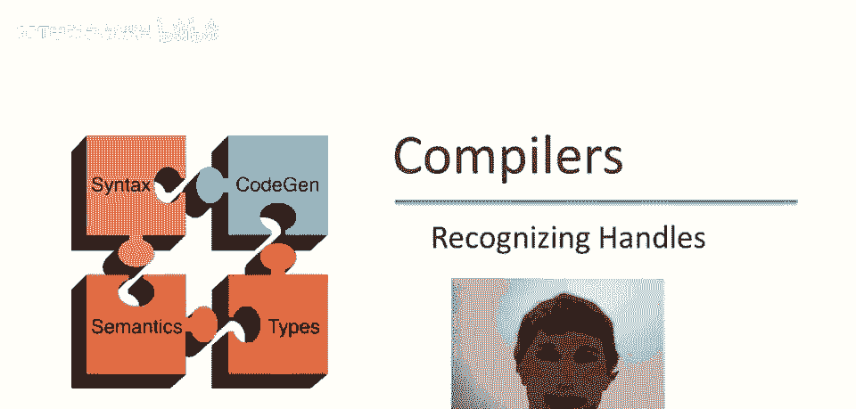
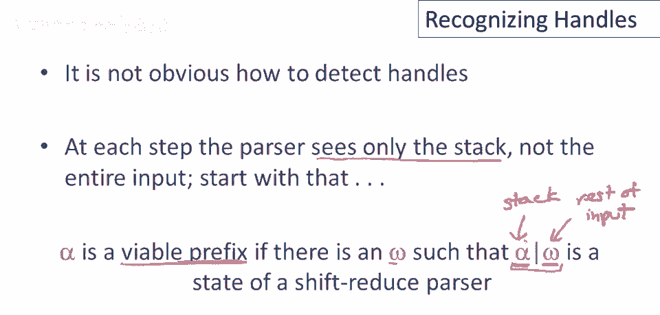
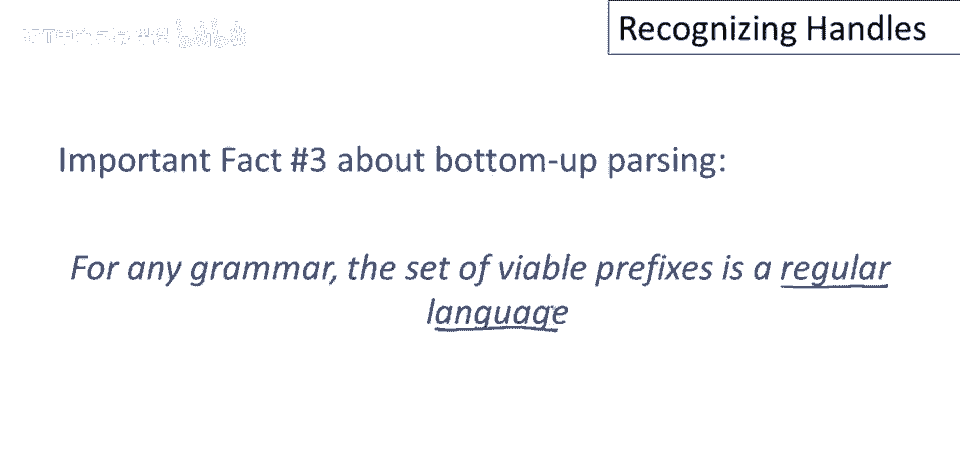
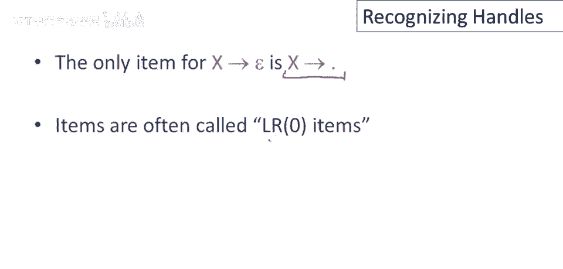
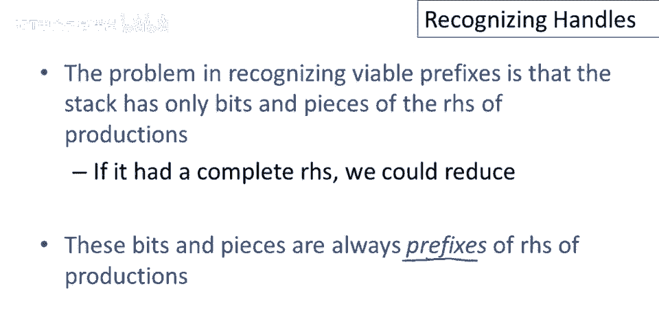
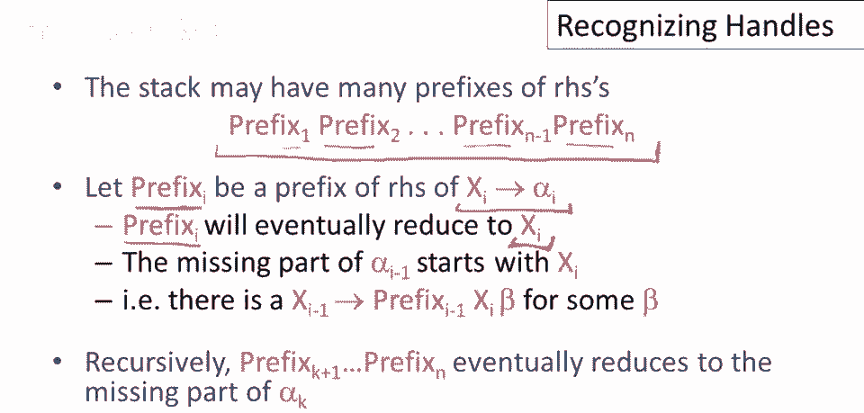
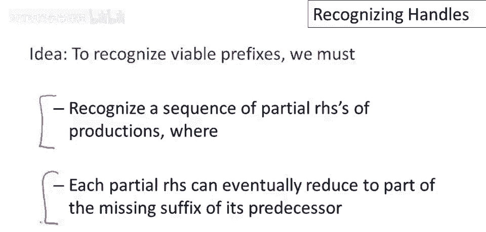

# 课程 P34：识别句柄的核心思想 🧠

在本节课中，我们将学习自底向上语法分析中一个核心但具有挑战性的任务：如何识别“句柄”。我们将探讨其理论上的困难，并介绍一类在实践中广泛使用的、能够有效识别句柄的语法。

## 识别句柄的挑战与机遇

上一节我们介绍了自底向上分析的基本概念，本节中我们来看看识别句柄的具体挑战。

识别句柄有一个坏消息和一个好消息。
坏消息是，对于**任意**的上下文无关文法，目前没有已知的**高效算法**能直接识别句柄。这意味着，在通用情况下，我们无法快速找到归约的时机。
好消息是，存在一些**启发式方法**，能够为**一大类**上下文无关文法正确地猜测出句柄。

我们可以用文法的包含关系来理解这个“大类”：

*   **所有上下文无关文法 (CFG)**：这是最大的集合。
*   **无二义性上下文无关文法**：这是前者的一个子集，排除了会产生多种解析结果的文法。
*   **LR(k) 文法**：这是一个更小的集合。`L`代表从左到右扫描输入，`R`代表最右推导，`k`代表向前查看的符号数量。这是最一般的、能被确定性（即无回溯）解析的文法类。
*   **LALR(k) 文法**：这是 LR(k) 文法的一个子集。虽然表达能力稍弱，但生成的解析表更小，是大多数**实用解析器生成工具**（如 Yacc, Bison）实际使用的文法类。
*   **SLR(k) 文法**：这是 LALR(k) 文法的进一步简化，称为简单 LR 文法。

这些包含关系是严格的，即对于每个 k，都存在是 LR(k) 但不是 SLR(k) 的文法，也存在是 LR(k) 但不是 LALR(k) 的文法。

## 解析器的已知信息：可行前缀

既然检测句柄不简单，那么解析器在每一步都知道些什么呢？
解析器知道当前的**栈**的内容。因此，我们需要研究能从栈中获得多少信息。

我们定义：一个符号串 **α** 是一个**可行前缀**，如果存在某个剩余输入串 **ω**，使得 **α | ω** 是某个**最右推导**过程中的一个有效格局（即解析过程中的一个合法状态）。
*   **α** 代表当前栈的内容。
*   **ω** 代表剩余的输入。
*   **|** 是栈顶与剩余输入的分隔符。

这个定义的意义在于：**可行前缀是一个不会超过句柄右端边界的符号串**。只要解析器栈上的内容是一个可行前缀，就意味着解析过程尚未出错，处于一个有效的移位-归约解析状态。

这个定义引出了自底向上解析的第三个关键事实：**对于任何文法，其所有可行前缀构成的集合是一个正则语言**。
这是一个非常重要的结论，意味着我们可以构造一个**有限自动机**来识别这些可行前缀。所有现代的自底向上解析器工具都基于这一事实。

## 记录解析状态：LR(0) 项

为了构造识别可行前缀的自动机，我们首先需要一个新的概念：**LR(0) 项**（简称**项**）。
一个项是在一个产生式的**右部**某处加了一个点（`.`）的产物。

例如，对于产生式 `T -> ( E )`，我们可以得到以下项：
*   `T -> . ( E )`
*   `T -> ( . E )`
*   `T -> ( E . )`
*   `T -> ( E ) .`

对于空产生式 `X -> ε`，它只有一个项：`X -> .`。

项的含义是：
*   点 **`.` 左边**的部分表示**已经识别（在栈上看到）** 的符号。
*   点 **`.` 右边**的部分表示**期望在未来看到**才能完成归约的符号。

因此，项 `T -> ( E . )` 表示：“我们正在试图识别一个 `T`，目前已经在栈上看到了 `(` 和 `E`，期望接下来能看到 `)` 来完成这个产生式”。

## 栈的结构与项集

解析器的栈并非符号的随机堆积。在成功的解析过程中，栈上的内容总具有一种特殊的结构：它是由**若干个产生式右部的前缀**层层嵌套组成的。

考虑输入 `( int )` 和文法 `T -> ( E )`, `E -> int`。当栈内容为 `( int`，剩余输入为 `)` 时：
*   栈顶的 `int` 是产生式 `E -> int` 的（完整）右部前缀。
*   栈中的 `(` 是产生式 `T -> ( E )` 的右部前缀。
*   此时，对应的项集可以记录为 `{ T -> ( . E ), E -> int . }`。这精确描述了当前状态：我们正在识别 `T`，已看到 `(`，期望看到 `E`；同时，我们刚刚完成了 `E -> int` 的识别。

更一般的情况是，栈可以被视为一个“前缀栈”：
1.  栈顶的前缀（例如 `int`）最终将归约为某个非终结符（例如 `E`）。
2.  归约得到的非终结符（`E`）会成为**栈中下一个（更深的）前缀**（例如 `( . E )`）所缺失的后缀的一部分，使其向完整的右部更近一步。
3.  这个过程递归进行，直到栈底。

## 总结与预告

本节课中我们一起学习了识别句柄的核心思想。我们了解到：
1.  通用地识别句柄是困难的，但存在一大类文法（LR(k) 及其子集）可以使用确定性方法处理。
2.  解析器通过**栈**来跟踪状态，栈上的内容被称为**可行前缀**，其集合是正则语言。
3.  我们使用 **LR(0) 项** 来精确描述解析器在识别某个产生式右部时所处的进度。
4.  栈的结构本质上是**嵌套的产生式右部前缀**，项集可以有效地记录这种结构。

在下一个视频中，我们将基于“可行前缀可由有限自动机识别”这一关键事实，给出具体的算法来构造这个识别自动机，从而最终实现句柄的识别。