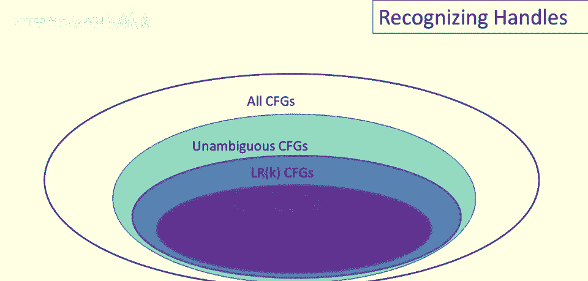

# P34：p34 08-02-_Recognizing_Hand - 加加zero - BV1Mb42177J7

欢迎回到本视频，我们将讨论识别句柄的关键思想。

识别句柄有好消息和坏消息，坏消息是没有已知的有效算法能识别一般的句柄，因此对于任意语法，解析时我们没有快速找到句柄的方法，好消息是有猜测句柄的启发式方法，和，呃，对于一些上下文无关文法。

对于一些相当大的上下文无关文法类。

这些启发式方法总能正确识别句柄，我们可以用韦恩图来说明情况，如果我们从一个包含所有上下文无关文法的集合开始。

那么无二义上下文无关文法是这些文法的一个子集。

然后是一个更小的集合，称为lrk文法，这里只是提醒一下，L代表从左到右，扫描，K代表向前看的标记数，现在lrk文法是，呃，一类最一般的确定性。

呃，确定性的，呃，文法，我们知道，但这些并不是实践中真正使用的，大多数实用的自顶向下工具使用，称为lark文法，它们是lrk文法的一个子集，然后我们主要讨论的是这些的一个简化。

称为简单lr文法或slrk上下文无关文法，这些包含关系是严格的，即对于每个k，都有ar k文法但不是slr k文法，同样，对于每个k，都有lrk文法但不是lalr k文法。

正如我们已经说过的，检测句柄并不明显，那么解析器知道什么，好吧，它看到了每一步的栈，它知道它已经构建的栈，因此让我们看看我们能从栈中得到多少进展，只是考虑我们能从栈中得到的信息，所以这里是我们的定义。

我们将说alpha是一个可行前缀，如果有一些omega，使得alpha bar omega是一个配置，一个有效的移位配置，一个有效的移位配置，一个有效的移位配置，简化解析，注意这里的alpha，这是栈。

omega是剩余输入，这意味着解析器知道这部分，解析器知道alpha，它对omega了解不多，它可以向前看，它可以查看omega的小前缀，通常仅一个标记，但它肯定不全知道。

那么，可行的前缀意味着什么，可行的前缀是一个字符串，不会超过句柄的右端，我们称它为可行前缀的原因，是因为它是句柄的前缀，只要解析器栈上有可行的前缀，就没有检测到解析错误，实际上。

这个定义只是在给某件事命名，它并不是什么很深奥的东西，那个alpha bar omega是可行的，只是说我们还没遇到错误，这是移位归约解析的一种状态，还没说如何识别它，或其他类似情况，嗯。

只是说这些是移位归约解析的有效状态，移位归约解析。

定义在某种程度上有用，因为它引出了最后一个重要事实，自顶向下解析的第三个重要事实，那就是对于任何语法，可行前缀集是正则语言，这真是个惊人的事实，这需要一点时间证明，但这是自底向上解析的关键。

至少所有自底向上解析工具都基于这一事实，可行前缀集可由有限自动机识别。

所以，我们将展示如何计算这个自动机，接受可行前缀，嗯，首先需要一些新定义，第一个定义是项的概念，现在，项是一个仅在右侧有点的产生式，看个例子，以t -> (e)为例，我们要做的是。

在右侧所有可能的位置上放置一个点，将有一个项，点在最左侧，将有一个项，点在最右侧，然后，将有一些项，点在连续符号之间，这种情况下有4项生产，特殊情况是如何处理空产生式，对于空产生式，没有，右边没有符号。

我们只说有一个项x->。这些项你会看到，如果你，如果你查看帮助页面和文献，它们是lr零项。

现在我们可以讨论如何识别可行前缀，问题是栈中只有生产右侧的碎片，总的来说，大部分时间栈顶没有完整的右部，大部分时间栈顶只有右部的一部分，结果发现栈上的内容并非随机，它，它，呃，实际上具有非常特殊的结构。

在这些片段中总是右部产生式的前缀，即在任何成功的解析中，栈上的总是右部前缀，某些产生式或产生式的。

让我们看个例子，考虑输入open closed for，这是我们最爱的文法之一，现在这种配置，栈上有左括号，记住这是我们的栈，我们还有，呃，输入中的右括号，这实际上是一个状态或有效状态，归约解析。

你可以看到，open for n e是生产的前缀，T 去 open e 闭 for，在我们将剩余的闭 for 移至栈上后，然后，我们将有完整的右半部分准备归约，所以这是项出现的地方。

项 t 去 open 括 e 点 闭括 n，这描述了这种状况，它说，到目前为止，我们已经看到了 open for e 的这个生产，希望未来能看到完成，另一种思考方式是，此项记录，我们正在制作的事实。

目前我们已看到这么多，点左为已看内容，也是栈上的内容，点右为待看内容，在可能减少前需等待，可能看不到，记住解析器不知输入，在这种情况下，当然，这是下一个符号，所以我们可以在预览中看到，但你知道在此时。

解析器并不确定接下来会发生什么，你知道，如果这个点再往左一些，可能会有很多，更多符号需要处理才能进行归约，所以无论如何，记录左侧的，我们已经看到的，记录右侧的，表示我们在栈上等待看到的，才能进行归约。

现在我们可以讨论栈的结构，它不仅仅是符号的任意集合，实际上它具有这种非常特定的结构，所以栈实际上是一个右端前缀的栈，栈总是具有这种组织，其中有一堆前缀堆叠，字面上堆叠在栈上，将要发生的是，i前缀。

如果我们从这个前缀栈中选择一个前缀，那必须是某个生产式的前缀，某个生产式的右端，这意味着栈上的i前缀，最终将归约到该生产式的左端，所以最终归约到xi在这种情况下，然后xi必须是缺失后缀的一部分。

在栈下部的那个前缀，所以如果我查看上一个前缀，紧挨着下面的，栈上的前缀sui。

当我进行这个归约时，xi需要扩展该前缀，更接近于该特定生产式的完整右端，好的，特别是将会有某个生产式，其右端的一部分已经在栈上，所以i减1的前缀，xi将扩展该前缀，然后还会有一些东西。

可能我们正在等待看到，甚至在xi放置后递归地，栈上所有高于前缀k的前缀，最终都必须归约到前缀k缺失的右端部分，右端上的alpha k，我有这个图像，如果你有一个前缀栈，我们总是在处理栈顶的前缀。

所以他们将始终在这里工作在右端，移位和规约，但每次执行规约，必须立即扩展栈下部的前缀，当这些，当一堆前缀通过规约从栈中移除时，然后当我们开始处理栈中较低的前缀时，所以让我们用一个例子来说明这个想法。

所以这是另一个输入字符串，我们将使用相同的语法，你可以，如果你想看语法，可以倒带，但让我们考虑这个状态，我们有，Uh 在栈中为 n int 星，并且我们有 int 关闭和剩余在输入中，好的。

那么哪些项会记录，栈结构是什么，项如何记录它，好吧，让我们从这里开始底部，实际上我们从底部向上工作，所以我们在栈顶有 in 星，所以这是我们正在工作的右半部分，这将是该生产的前缀。

T 去 int 星 T，好的，所以这说我们正在看，你知道，我们已经看到了 in 星，我们现在权衡，我没有显示项，但我只是显示了这个最终将使用的生产，下面的一个在这里，栈上的前缀在，在开和闭之间。

在这个结束，这是一个有趣的情况，实际上是 epsilon，所以现在栈上没有任何东西，但一旦星规约到 T 好，然后那个 T 将规约到 e，当然目前那里根本没有 T，我们只看到了 epsilon。

我们在栈上没有看到该生产的前缀，然后对于最后一个生产，栈中最深的一个，我们目前看到了 in 开括号，我们并且我们正在处理这个生产，He 去 open her in e 关闭，所以当这个 e 产生时。

这将扩展这个右半部分，现在我们可以用 uh 栈的项来记录所有这一切，Uh t 指向开点，E e 指向点 t 和 t 指向星点 t 好，它只是记录了我们之前幻灯片上看到的内容，到目前为止。

我们看到了这个生产的开放端，我们还没有看到生产右侧的任何内容，到目前为止，我们看到了这个生产的 in star，注意一下，这些生产的左侧最终将，成为右侧的一部分，右侧的右侧，作为生产右侧的一部分。

我们正在堆栈中下面工作，因此，当我们将 in star t 减少到 t 时，这将扩展这个生产。

当它减少到 e 时，这将扩展这个生产，总结这个视频，我们可以更精确地说，我们如何识别可行的前缀，问题的关键将是识别一系列的部分，生产右侧，其中每个这些部分，右侧最终可以减少到其前驱缺失的后缀的一部分。

下次在下一个视频中，我们将实际给出实现这个想法的算法。

