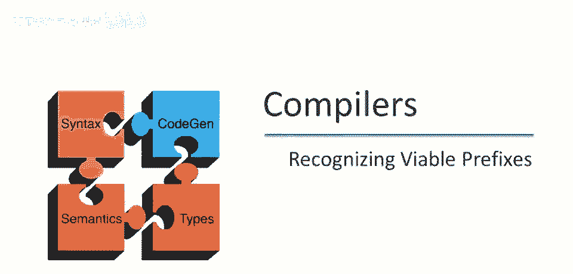
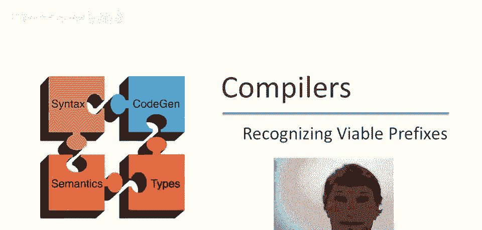
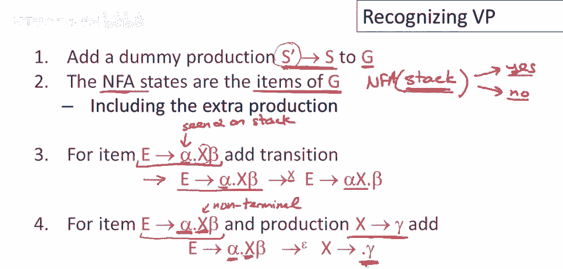

# P35：p35 08-03-_Recognizing_Viab - 加加zero - BV1Mb42177J7

在这视频中，我们终于要讲到自底向上解析的技术亮点，所以在前几个视频的所有定义之后，我们现在实际上将能够给出识别，可行前缀的算法。

所以让我们直接深入算法，第一步，嗯，实际上只是一个技术点，并不，嗯，并不那么重要，但我们无论如何都要做，因为这使事情更简单，那就是添加一个虚拟生产，S' 到 S 到我们的兴趣语法。

G 所以这里只是设置舞台，我们正在尝试计算 g 的可行前缀，我们正在尝试设计一个算法，以识别 g 的可行前缀，如果 s 是开始符号，我们只需创建一个新开始符号，S'为起始符，S'为新起始符。

S'仅有一条产生式，S'指向S，没错，这使我们确切知道起始符的使用位置，特别是，新起始符，S'仅在一个地方使用，在这条产生式的左侧，这使事情稍微简单些，回忆我们尝试做的事。

我们声称给定文法的可行前缀集是正则的，因此我们要做的是，我们将构造一个非，确定性有限自动机以识别可行前缀，好的，该nfa的状态将是文法的项，nfa的输入是栈，因此nfa读取栈，好的，然后它。

那么我们就标示这个，NFA将栈作为参数，它将说'是'，那是可行的前缀或'否'，它将从栈底到栈顶读取栈，它将从栈底开始，并读取到栈顶，我们的目标是编写一个，非确定有限自动机，识别解析器的有效栈。

所以这就是如何，我们知道解析器未报错，因为我们构造的自动机会始终输出，是，栈没问题，意味着它可以解析输入，或知道当前栈的内容，不像是任何有效栈，好的，让我们思考，嗯，我们，我们需要这台机器的动作是什么。

假设我们在状态，E箭头alpha点x beta，那是什么意思，所以到目前为止我们在栈上看到了alpha，好的，记住机器从栈底到栈顶读取，这记录了机器已经看到alpha在栈上的事实。

接下来在栈上看到什么是可以的，如果这个是一个有效的栈，如果在这一点上有alpha在栈上是有效的，那么当然如果下一个在栈上是x，那就好，所以我们有一个这样的转换，如果我们处于这个状态，正在处理这个生产。

并且在栈上看到了alpha，如果下一个输入是x的x，那么我们可以进入这个状态，现在记录我们看到alpha x在栈上，我们正在等待看到该生产的剩余部分beta，好的，这是非确定性有限自动机可以做的。

我们添加这种类型的移动，对于语法中的每个项目，如果点不在最右边，那么将有一个这样的移动，点移动到，对于点右侧出现的任何符号，另一类转换是，嗯，是这些，这些是更有趣的，所以让我们说我们处于这个配置。

我们再次看到了alpha，然后下一个在栈上是x，这里x是非终结符，我应该在之前的情况下说，嗯，x是终端或非终结符，所以这个x是任何语法符号，不仅仅是非终结符，但这里的数字4，这些动作专门针对非终结符。

好的，那么无论如何，如果x不在栈上，好的，假设我们已经看到了alpha，然后栈上的下一个不是x，那么有可能存在一个解析器的有效配置，我们看到了alpha，但随后x没有出现，答案是肯定的。

因为如我们之前所说，栈是部分右边的序列，所以栈上现在可能只有所有这些，此为alpha版本，栈顶下一个可能减税的未必是x本身，可能是最终可简化为x的某物，那意味着什么，意味着栈上的任何内容都必须源自x。

必须是可由x产生序列生成的东西，因为它最终将简化为x，所以对于每个像这样和每个x的生产，现在我们将添加以下移动，我们将说如果栈上没有x，然后可做ε移位，可直接移至尝试识别，从x派生出的右部。

仅这两种移动，要么，项目抱歉，要么，栈上的语法符号是我们寻找的，扩展右部前缀，此规则扩展前缀，说是，栈上看到更多，或尝试猜测前缀结束，如果α包含栈上的生产，这必须是x，必须这一点，这里标记另一个开始。

期待看到x派生。

两条新规则，每个状态都是接受状态，这意味着，如果自动机成功消耗整个栈，栈中的栈是可行的，注意不是每个状态都有每个可能符号的转换，因此会有很多可能的栈被拒绝，仅仅因为自动机卡住了，最后。

这个自动机的开始状态是项，S' 到 S，记住机器的状态是语法的项，我们添加了，这个虚拟产生式只是为了方便命名开始状态，现在让我们考虑我们的一种语法，我们一直在使用很多，所以这是语法。

现在我们将用额外生产来增强它，当p趋于e时，让我们看看这个自动机，识别该语法可行前缀的，这就是它，如你所见，它相当大，它有大量的状态和转换，我只想在这里展示给你，在我们描述如何计算它之前，就。

所以你有概念，这些识别语法可行前缀的自动机，实际上相当复杂，但现在让我们分解并看看它是如何产生的，所以让我们从这个机器的起始状态开始，所以我们有s' 到 。e，记住这说的是，我们希望能够还原到开始符号。

到我们的新开始符号，我们正在读取栈，我们希望看到栈上的e，但如果我们没有，那么看到从e派生的东西也会很高兴，从这个状态我们可以做出哪些转换，嗯，一种可能性是，我们确实，实际上在栈上看到了e。

在这种情况下，点简单地移动，说，是的，我们已经阅读了栈上的第一项，或者我们已经在栈上阅读了e，我们已经看到了这个生产的完整右侧，那将表明我们可能已经完成了解析，这是你会达到的状态。

如果你已经阅读了整个输入并成功解析了它，你已经还原了旧的开始符号，并准备还原到增强的新的开始符号，但如果你没有像看到e在栈上那样幸运，那么你需要希望你会看到从e派生的东西，有几个可能性，有一种可能性是。

我们可以看到一些最终会使用这个生产e到t的东西，因为我们还没有看到任何它，我们把点放在最左边，表示我们希望看到一个t，它可能然后还原e，它可能然后还原到s' 现在，如果我们没有在栈上看到单独的t。

另一种可能性是，我们可能正在处理这个生产e到t加e，同样我们还没有看到任何它，点在左手边，注意现在，我们关键使用非确定自动机的力量，所以这里我们不知道哪个产生式，将出现在哪个产生式的右侧栈上。

事实上我注意到这些产生式甚至不是 um，甚至不是左因子化的，所以我们不知道它将是仅仅一个 t 那里，或一个 t 加 e，但我们只是使用非确定自动机的猜测能力，让它选择哪一个来使用，记住确定性自动机接受。

如果任何可能的选择接受，所以它总能猜正确，直观上它将能够选择正确的现在，当然我们可以编译这个到确定性机器，Um，那将不必做任何猜测，但在这个级别我们编写非确定性机器。

非常有用不必弄清楚使用哪个这两个产生式，我们可以尝试两个并看看会发生什么，现在让我们关注这个状态 e 去点 t，有哪些可能性，一种可能性是我们看到一个 t 在栈上，然后我们已经看到了一个完整的右侧。

并注意当点完全在右侧时，那将指示我们准备做或减少，我们稍后会谈论这一点，但基本上这就是我们将如何识别句柄，当我们最终达到一个状态时点完全在右侧，那将说 ah，这可能是你想要减少的一个句柄。

现在如果我们不在栈上看到一个 t，那么我们需要看到从 t 派生的一些东西并且有几个可能性，一些可能性，一种可能性是它将是这个产生式 t 去 int 所以，因为我们只是再次开始这个产生式。

我们只是把点完全放在左边，另一种可能性是正在处理 t 去开 e 闭括号，和第三种可能性是我们在处理 t，去 int 乘 t，并且在每种情况下这里注意它都完全到左边，指示我们只是刚开始。

我们实际上还没有看到任何的右侧，还，现在让我们将焦点转移到该产生式 e 去点 t 加 e，这个项抱歉，Uh，一种可能性是我们看到一个 e 在栈上，我看到一个 t 在栈上，好的，那么点就移到。

另一种可能是我们看到来自t的，那么我们将转到以t开头的状态之一，注意这里我们已经有了自动机中的所有三个项目，我们只是去我们从项目中到达的状态，Egoes到dot t。

所以这项egoes到dot t加上e也可以移动到那三个状态，现在让我们关注这个，呃，这里t去dot open e close in well，这里只有一个可能移动，所以这只是一个终结符，它不是。

非终结符，所以不会有任何来自open的可能性，我们只需要看到open朋友和输入，所以这里只有一个可能转换，即我们看到open，抱歉，在栈上，现在，从这种状态再次，点在a旁边或就在非终结符左边。

所以这里我们可能看到栈上的非终结符，或者我们可能看到来自该非终结符的，如果我们看到栈上的非turtle，那么点就移过，我们得到t open e dot close for。

表示我们在栈上看到了open打印和e，我们仍在等待看到close括号，但我们也可能看到来自me的，好的，所以我们有这些两个转换到两个开始，呃，生产为你所有现在，让我们关注这个状态。

T去open pare dot close again，因为它是一个终端，点旁边的只有一种可能移动，我们必须看到那个open，如果我们看到任何东西，我们最终会得到项目。

T去open print e close parendot，现在我们识别了该生产右侧栈上的整个，让我们看看这个项，所以我们在这里，因为终端符号，唯一的可能性是读取栈上的终端符号。

所以这将是下一个项目e goes to t plus dot e，再次关注那个项目，你知道我们可能看到栈上的e，在这种情况下，我们将识别该生产的整个右侧，我们将有egos到t plus e dot。

或者我们可以看到来自me的，好的，那么我们将回到那两个状态之一，现在还有哪些产生式或项目需要处理，t 去 dot int，因此我们得在栈上看到下一个，那将是该产生式的完整右部。

下面 t 去 dot int 仍然存在。

乘以 t 再次，这里有一个终结符 int，因此这是我们需要在栈上看到的下一个东西，以保持该产生式的可行性，一旦我们看到int，嗯，我们想看到时间，最终处于这种状态，现在我们有了t旁边的点，再次。

一种可能是我们在栈上看到t，然后我们看到了这个产生式的完整右侧，但可能只看到从t派生的东西，t可能不在那里，但它可能处于我们仍在等待t出现的状态，通过一些归约序列，但我们需要看到t的派生，这种情况下。

我们转向3种状态之一，嗯，开始生成tea，这就是完整自动机，这就是所有状态，所有自动机的转换，识别该语法可行前缀的自动机。

