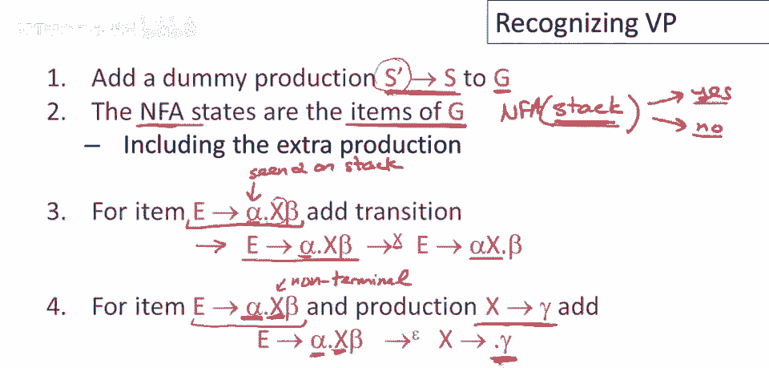
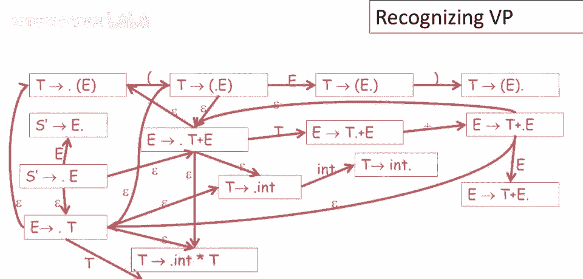

# 课程 P35：识别可行前缀算法 🧠


在本节课中，我们将学习自底向上解析中的核心技术：如何构造一个算法来识别给定文法的**可行前缀**。我们将从一个简单的文法示例出发，逐步构建一个非确定性有限自动机（NFA），该自动机能够判断解析器栈的内容是否构成一个可行前缀。

---

## 概述与准备

上一节我们介绍了可行前缀的概念及其重要性。本节中，我们来看看如何构造一个自动机来识别它们。

首先，为了简化算法，我们通常会对原始文法进行一个小的修改：添加一个虚拟的开始符号和产生式。

*   **具体做法**：给定文法 G，其开始符号为 S。我们创建一个新的开始符号 **S'**，并添加一条新的产生式：**S' → S**。
*   **目的**：这使我们能明确解析的起点（即栈底的目标），让后续的状态和转换定义更加清晰。

---

## 构建识别可行前缀的 NFA

我们的目标是构建一个 NFA，它从栈底到栈顶读取解析器的栈内容，并判断该内容是否是一个可行前缀。该 NFA 的状态由文法的**项目**（Item）构成。

### NFA 的核心规则

以下是构建该 NFA 的两条核心转换规则。

#### 规则一：移进（Shift）或匹配符号

假设当前状态对应的项目是 **A → α · x β**。这表示自动机已经在栈上“看到”了符号串 α，并期望接下来能看到符号 x（x 可以是终结符或非终结符）。

*   **转换条件**：如果栈上的下一个符号确实是 **x**。
*   **动作**：自动机可以转移到新状态 **A → α x · β**。这表示它已成功“消耗”了栈上的符号 x，并继续等待 β 的出现。

**公式表示**：
对于文法中的每个项目 `[A → α · x β]`（其中点不在最右端），存在一个转换：
`[A → α · x β] --x--> [A → α x · β]`



#### 规则二：展开（Expand）或猜测推导

假设当前状态对应的项目是 **A → α · B β**，且点后面紧跟的是一个**非终结符 B**。这表示自动机期望在栈顶看到能最终归约为 B 的符号串。

*   **转换条件**：栈顶可能不是 B 本身，而是由 B 推导出来的某个符号串的开头。
*   **动作**：自动机可以进行一个 **ε-转移**（不消耗栈符号），直接“跳转”到以 B 为左部、且点在最左侧的所有产生式项目。这相当于猜测：“接下来栈上的内容将由 B 推导产生，让我开始尝试识别 B 的右部”。

**公式表示**：
对于每个形如 `[A → α · B β]` 的项目（B 为非终结符），以及文法中每个以 B 为左部的产生式 `B → γ`，存在一个 ε-转换：
`[A → α · B β] --ε--> [B → · γ]`

---

### NFA 的起始与接受

*   **起始状态**：由于我们添加了虚拟产生式 `S' → S`，因此 NFA 的起始状态是项目 `[S' → · S]`。这表示自动机初始时期望看到能从 S 推导出的内容。
*   **接受状态**：**该 NFA 的所有状态都是接受状态**。这意味着，只要自动机能成功消耗完整个栈的内容（即读完栈顶）而不在中途“卡住”（没有可用的转换），那么它读取的栈内容就被识别为一个可行前缀。

---

## 实例解析

让我们通过一个熟悉的表达式文法来具体看看这个 NFA 是如何构建的。

**原始文法 G**：
```
E → T
E → T + E
T → int
T → ( E )
T → int * T
```
**增强后的文法 G'**（添加虚拟开始符号）：
```
S' → E
E → T
E → T + E
T → int
T → ( E )
T → int * T
```

现在，我们根据上述规则，从起始状态 `[S' → · E]` 开始，逐步推导出整个 NFA 的状态和转换。下图展示了为文法 G‘ 构建的、用于识别可行前缀的完整 NFA（为清晰起见，部分 ε-转换用虚线表示）：


（注：此图展示了自动机的复杂性，它包含大量状态和转换。）

### 状态与转换分析

让我们追踪其中几条路径，理解自动机的工作逻辑：

1.  **从起始状态开始**：状态 `[S' → · E]` 表示我们期望看到能从 E 推导出的内容。由于 E 是非终结符，我们应用**规则二**，通过 ε-转换跳转到所有 E 产生式的起始项目：`[E → · T]` 和 `[E → · T + E]`。这体现了非确定性“猜测”的能力：自动机同时尝试两种可能。

2.  **移进终结符**：考虑状态 `[T → ( · E )]`。这里点后面是终结符 `(`（实际上应为 `open`，这里用 `(` 代指）。根据**规则一**，如果栈上的下一个符号是 `(`，自动机可以转移到 `[T → ( E · )]`。

3.  **期待非终结符的展开**：在状态 `[T → ( · E )]` 中，点后面是非终结符 E。除了可能直接移进 E（如果它恰好在栈上），根据**规则二**，自动机还可以通过 ε-转换跳转到 `[E → · T]` 和 `[E → · T + E]`，开始尝试识别 E 的右部。

4.  **识别句柄**：当自动机进入一个点在最右端的项目时，例如 `[T → int ·]` 或 `[E → T + E ·]`，这表示它已经在栈上识别出了一个完整的产生式右部。这个完整的右部就是一个**句柄**，提示解析器可以进行归约操作。

通过这种方式，NFA 并行地探索所有可能的语法分析路径。只要栈内容对应至少一条有效的语法推导前缀，就至少有一条路径能让 NFA 顺利读完整个栈。

---

## 总结



本节课中，我们一起学习了如何为给定文法构造一个识别可行前缀的非确定性有限自动机（NFA）。

*   **核心思想**：将文法的**项目**作为自动机的状态，并定义两类转换规则：
    1.  **移进规则**：匹配栈上预期的下一个语法符号。
    2.  **展开规则**：当预期一个非终结符时，通过 ε-转换开始尝试识别该非终结符的各个产生式。
*   **工作方式**：该 NFA 从栈底向栈顶读取，利用非确定性并行探索所有可能的语法分析状态。若能无阻塞地消耗完整个栈，则栈内容是一个可行前缀。
*   **重要意义**：这个识别可行前缀的 NFA，是后续构建更高效、实用的**LR 解析表**（如 LR(0)、SLR、LR(1) 等）的理论基础和构造起点。它建立了栈内容（语法分析状态）与文法项目之间的精确对应关系。

通过这个自动机，我们为自底向上解析器提供了判断当前分析动作是否“安全”的依据，这是实现高效、准确语法分析的关键一步。